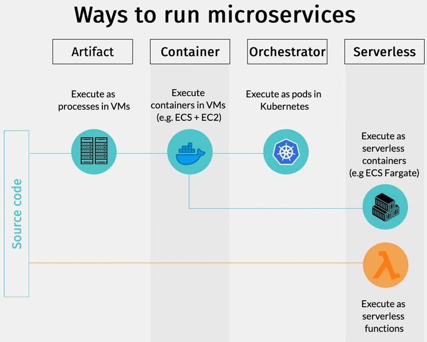
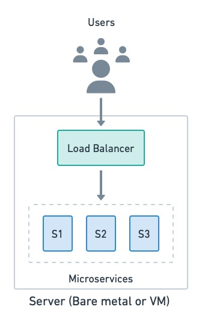
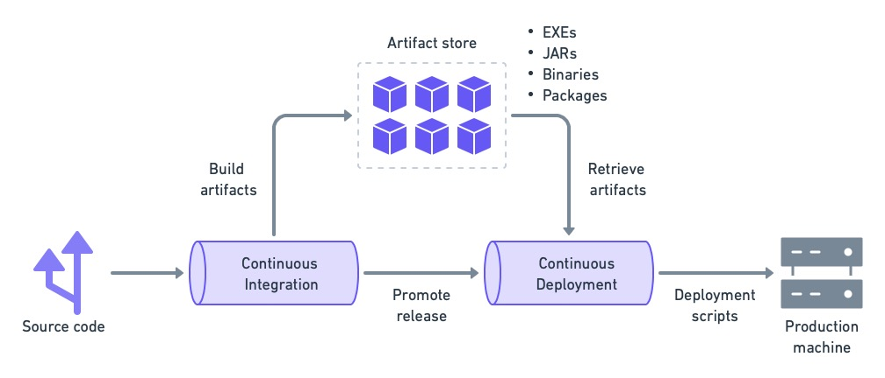
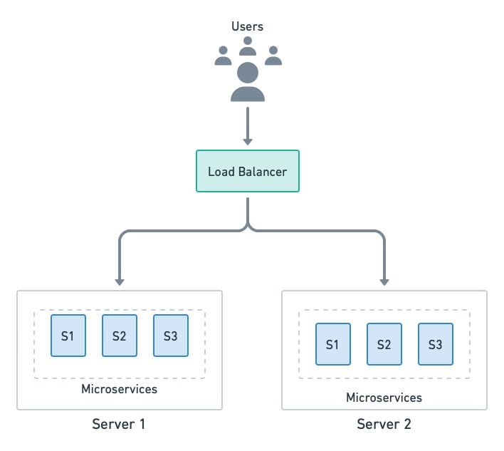
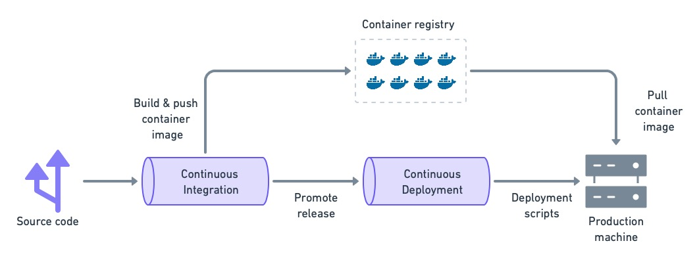
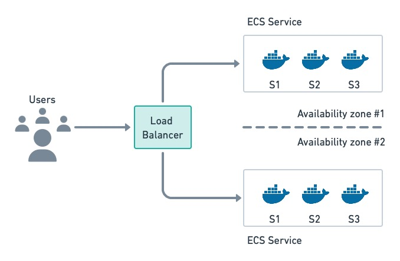
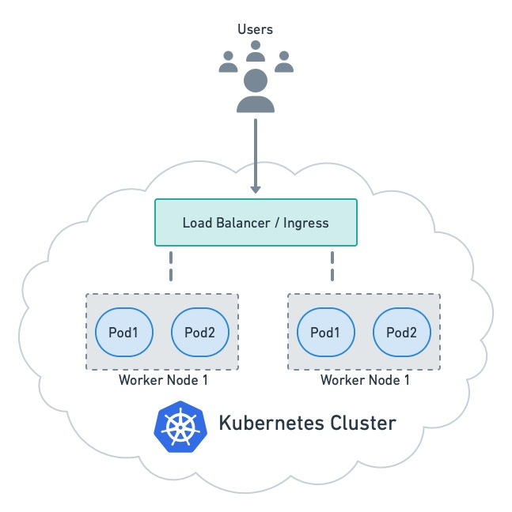
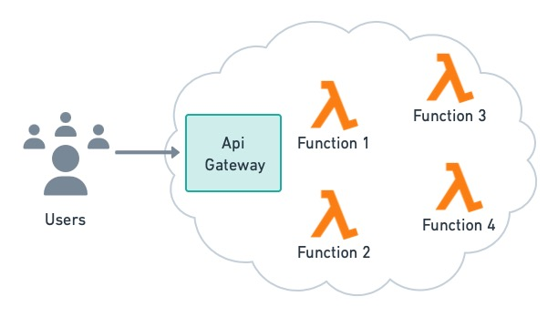

---
title: 5 Options for Deploying Microservices
author-meta: Tomas Fernandez
subtitle: semaphoreci.com
rights:  Creative Commmons Attribution-NonCommercialNoDerivatives 4.0 International
language: en-US
...

Microservices are the most scalable way of developing software. But that means nothing unless we choose the right way to deploy microservices: processes or containers? Run on my servers or use the cloud? Do I need Kubernetes? When it comes to the microservice architecture, there is such an abundance of options and it is hard to know which is best.

As we’ll see, the perfect place to host a microservice application is largely determined by its size and scaling requirements. So, let’s go over the 5 main ways we can deploy microservices.

## The 5 ways to deploy microservices

Microservice applications can run in many ways, each with different tradeoffs and cost structures. What works for small applications spanning a few services will likely not suffice for large-scale systems.

From simple to complex, here are the **five ways of running microservices**:

1.  **Single machine, multiple processes**: buy or rent a server and run the microservices as processes.
2.  **Multiple machines, multiple processes**: the obvious next step is adding more servers and distributing the load, offering more scalability and availability.
3.  **Containers**: packaging the microservices inside a container makes it easier to deploy and run along with other services. It’s also the first step towards Kubernetes.
4.  **Orchestrator**: orchestrators such as Kubernetes or Nomad are complete platforms designed to run thousands of containers simultaneously.
5.  **Serverless**: serverless allows us to forget about processes, containers, and servers, and run code directly in the cloud.

{ width=90% }

Let’s see each one in more detail.

## Option 1: Single machine, multiple processes

At the most basic level, we can run a microservice application as multiple processes on a single machine. Each service listens to a different port and communicates over a loopback interface.

{ width=50% }

This simple approach has some clear benefits:

-   **Lightweight**: there is no overhead as it’s just processes running on a server.
-   **Convenience**: it’s a great way to experience microservices without the learning curve that other tools have.
-   **Easy troubleshooting**: everything is in the same place, so finding a problem or reverting to a working configuration in case of trouble is very straightforward, if you have [continuous delivery](https://semaphoreci.com/cicd) in place.
-   **Fixed billing**: we know how much we’ll have to pay each month.

The DIY approach works best for small applications with only a few microservices. Past that, it falls short because:

-   **No scalability**: once you max out the resources of the server, that’s it.
-   **Single point of failure**: if the server goes down, the application goes down with it.
-   **Fragile deployment**: we need custom deployment and monitoring scripts to ensure that services are installed and running correctly.
-   **No resource limits**: any microservice process can consume any amount of CPU or memory, potentially starving other services and leaving the application in a degraded state.

[Continuous integration](https://semaphoreci.com/continuous-integration) (CI) for this option will follow the same pattern: [build](https://semaphoreci.com/blog/build-stage) and [test](https://semaphoreci.com/blog/test-automation)the artifact in the CI [pipeline](https://semaphoreci.com/blog/cicd-pipeline), then deploy with continuous deployment.

This is the best option to learn the basics of microservices. You can run a small-scale microservice application to get familiarized. A single server will take you far until you need to expand, at which time you can upgrade to the next option.

## Option 2: Multiple machines and processes

This option is essentially an upgrade of option 1. When the application exceeds the capacity of a server, we can scale up (upgrade the server) or scale sideways (add more servers). In the case of microservices, horizontally scaling into two or more machines makes more sense since we get improved availability as a bonus. And, once we have a distributed setup, we can always scale up by upgrading servers.

{ width=50% }

Horizontal scaling is not without its problems, however. Going past one machine poses a few critical points that make troubleshooting much more complex and typical problems that come with using the microservice architecture emerge.

-   How do we correlate log files distributed among many servers?
-   How do we collect sensible metrics?
-   How do we handle upgrades and downtime?
-   How do we handle spikes and drops in traffic?

These are all problems inherent to distributed computing, and are something that you will experience (and have to deal with) as soon as more than one machine is involved.

This option is excellent if you have a few spare machines and want to improve your application’s availability. As long as you keep things simple, with services that are more or less uniform (same language, similar frameworks), you will be fine. Once you pass a certain complexity threshold, you’ll need containers to provide more flexibility.

## Option 3: Deploy microservices with containers

While running microservices directly as processes is very efficient, it comes at a cost.

-   The server must be meticulously maintained with the necessary dependencies and tools.
-   A runaway process can consume all the memory or CPU.
-   Deploying and monitoring the microservices is a brittle process.

All these shortcomings can be mitigated with containers. Containers are packages that contain everything a program needs to run. A container image is a self-contained unit that can run on any server without having to install any dependencies or tools first (other than the container runtime itself).

Containers provide just enough virtualization to run software in isolation. With them, we get the following benefits:

-   **Isolation**: contained processes are isolated from one another and the OS. Each container has a private filesystem, so dependency conflicts are impossible (as long as you are not abusing volumes).
-   **Concurrency**: we can run multiple instances of the same container image without conflicts.
-   **Less overhead**: since there is no need to boot an entire OS, containers are much more lightweight than VMs.
-   **No-install deployments**: installing a container is just a matter of downloading and running the image. There is no installation step required.
-   **Resource control**: we can put CPU and memory limits on containers so they don’t destabilize the server.

To learn more about containers, check these posts:

-   [Dockerizing a Node.js Web Application](https://semaphoreci.com/community/tutorials/dockerizing-a-node-js-web-application)
-   [Dockerizing a Python Django Web Application](https://semaphoreci.com/community/tutorials/dockerizing-a-python-django-web-application)
-   [How To Deploy a Go Web Application with Docker](https://semaphoreci.com/community/tutorials/how-to-deploy-a-go-web-application-with-docker)
-   [Dockerizing a Ruby on Rails Application](https://semaphoreci.com/community/tutorials/dockerizing-a-ruby-on-rails-application)

------

We can run containers in two ways: directly on servers or via a managed service.

### Containers on servers

This approach replaces processes with containers since they give us greater flexibility and control. As with option 2, we can distribute the load across any number of machines.

{ width=70% }

### Serverless containers

All the options described up to this point were based on servers. But software companies are not in the business of managing servers — servers that must be configured, patched, and upgraded — they are in the business of solving problems with code. So, it shouldn’t be surprising that many companies prefer to avoid servers whenever possible.

Containers-as-a-Service offerings such as [AWS Fargate](https://aws.amazon.com/fargate/) and [Heroku](https://www.heroku.com/) make it possible to run containerized applications without having to deal with servers. We only need to build the container image and point it to the cloud provider, which will take care of the rest: provision up virtual machines, and download , start and monitor images. These managed services typically include a built-in load balancer, which is one less thing to worry about.

{ width=70% }

Here are some of the benefits a managed container service has:

-   **No servers**: there is no need to maintain or patch servers.
-   **Easy deployment**: just build a container image and tell the service to use it.
-   **Autoscaling**: the cloud provider can provide more capacity when demand spikes or stop all containers when there is no traffic.

Before jumping in, however, you have to be aware of a few significant downsides:

-   **Vendor lock-in**: this is the big one. Moving away from a managed service is always challenging, as the cloud vendor provides and controls most of the infrastructure.
-   **Limited resources**: managed services impose CPU and memory limits that cannot be avoided.
-   **Less control**: we don’t have the same level of control we get with other options. You’re out of luck if you need functionality that is not provided by the managed service.

------

Either container option will suit small to medium-sized microservice applications. If you’re comfortable with your vendor, a managed container service is easier, as it takes care of a lot of the details for you.

For large-scale deployments, needless to say, both options will fall short. Once you get to a certain size, you’re more likely to have team members that have experience with (or willingness to learn about) tools such as Kubernetes, which completely change the way containers are managed.

## Option 4: Orchestrators

Orchestrators are platforms specialized in distributing container workloads over a group of servers. The most well-known orchestrator is [Kubernetes](https://kubernetes.io/), a Google-created open-source project maintained by the [Cloud Native Computing Foundation](https://www.cncf.io/).

Orchestrators provide, in addition to container management, extensive network features like routing, security, load balancing, and centralized logs — everything you may need to run a microservice application.

{ width=50% }

With Kubernetes, we step away from custom deployment scripts. Instead, we codify the desired state with a manifest and let the cluster take care of the rest.

Kubernetes is supported by all cloud providers and is the *de facto* platform for microservice deployment. As such, you might think this is the absolute best way to run microservices. For many companies, this is true, but they’re also a few things to keep in mind:

-   **Complexity**: orchestrators are known for their steep learning curve. It’s not uncommon to [shoot oneself in the foot](https://k8s.af/) if not cautious. For simple applications, an orchestrator is overkill.
-   **Administrative burden**: maintaining a Kubernetes installation requires significant expertise. Fortunately, every decent cloud vendor offers managed clusters that take away all the administration work.
-   **Skillset**: Kubernetes development requires a specialized skillset. It can take weeks to understand all the moving parts and [learn how to troubleshoot a failed deployment](https://learnk8s.io/troubleshooting-deployments). Transitioning into Kubernetes can be slow and decrease productivity until the team is familiar with the tools.

Check out deploying applications with Kubernetes in these tutorials:

-   [A Step-by-Step Guide to Continuous Deployment on Kubernetes](https://semaphoreci.com/blog/guide-continuous-deployment-kubernetes)
-   [CI/CD for Microservices on DigitalOcean Kubernetes](https://semaphoreci.com/blog/cicd-microservices-digitalocean-kubernetes)
-   [Kubernetes vs. Docker: Understanding Containers in 2022](https://semaphoreci.com/blog/kubernetes-vs-docker)
-   [Continuous Blue-Green Deployments With Kubernetes](https://semaphoreci.com/blog/continuous-blue-green-deployments-with-kubernetes)

[Kubernetes is the most popular option](https://www.containiq.com/post/companies-using-kubernetes) for companies making heavy use of containers. If that’s you, choosing an orchestrator might be the only way forward. Before making the jump, however, be aware that a recent survey revealed that the greatest challenge for most companies when migrating to Kubernetes [is finding skilled engineers](https://juju.is/cloud-native-kubernetes-usage-report-2022#what-are-the-top-challenges-kubernetes-brings-to-businesses). So if you’re worried about finding skilled developers, the next option might be your best bet.

## Option 5: Deploy microservices as serverless functions

Serverless functions deviate from everything else we’ve discussed so far. Instead of servers, processes, or containers, we use the cloud to simply run code on demand. Serverless offerings like [AWS Lambda](https://aws.amazon.com/lambda/) and [Google Cloud Functions](https://developers.google.com/learn/topics/functions) handle all the infrastructure details required for scalable and highly-available services, leaving us free to focus on coding.

{ width=50% }

It’s an entirely different paradigm with different pros and cons. On the plus side, we get:

-   **Ease of use**: we can deploy functions on the fly without compiling or building container images, which is great for trying things out and prototyping.
-   **Easy to scale**: you get (basically) infinite scalability. The cloud will provide enough resources to match demand.
-   **Pay per use**: you pay based on usage. If there is no demand, there’s no charge.

The downsides, nevertheless, can be considerable, making serverless unsuitable for some types of microservices:

-   **Vendor lock-in**: as with managed containers, you’re buying into the provider’s ecosystem. Migrating away from a vendor can be demanding.
-   **Cold starts**: infrequently-used functions might take a long time to start. This happens because the cloud provider spins down the resources attached to unused functions.
-   **Limited resources**: each function has a memory and time limit–they cannot be long-running processes.
-   **Limited runtimes**: only a few languages and frameworks are supported. You might be forced to use a language that you’re not comfortable with.

**Imprevisible bills**: since the cost is usage-based, it’s hard to predict the size of the invoice at the end of the month. A usage spike can result in a nasty surprise.

Learn more about serverless below:

-   [AWS Serverless With Monorepos](https://semaphoreci.com/blog/aws-serverless-monorepos)
-   [A CI/CD Pipeline for Serverless Cloudflare Workers](https://semaphoreci.com/blog/cicd-serverless-cloudflare-workers)

Serverless provides a hands-off solution for scalability. Compared with Kubernetes, it doesn’t give you as much control, but it’s easier to work with as you don’t need specialized skills for serverless. Serverless is an excellent option for small companies that are rapidly growing, provided they can live with its downsides and limitations.

## Conclusion

The best way to run a microservice application is determined by many factors. A single server using containers (or processes) is a fantastic starting point for experimenting or testing prototypes.

If the application is mature and spans many services, you will require something more robust such as managed containers or serverless, and perhaps Kubernetes later on as your application grows.

Nothing prevents you from mixing and matching different options. In fact, most companies [use a mix of bare-metal servers, VMs, and Kubernetes](https://juju.is/cloud-native-kubernetes-usage-report-2022#container-and-kubernetes-usage). A combination of solutions like running the core services on Kubernetes, a few legacy services in a VM, and reserving serverless for a few strategic functions could be the best way of taking advantage of the cloud at every turn.

Thanks for reading!

\newpage

© __BUILD_YEAR__ Rendered Text. All rights reserved.

This work is licensed under Creative Commmons
Attribution-NonCommercial-NoDerivatives 4.0 International.
To view a copy of this license, visit
<https://creativecommons.org/licenses/by-nc-nd/4.0>

The source text is open source:
<https://github.com/semaphoreci/papers>

Originally published at:
<Yhttps://semaphoreci.com/blog/deploy-microservices>

Original publication date: 14 Jul 2022

Authors: Tomas Fernandez

Editor: Marko Anastasov

Reviewed by: Dan Ackerson

Build date: __BUILD_MONTH__ __BUILD_YEAR__

Revision: __BUILD_REVISION__

\newpage
