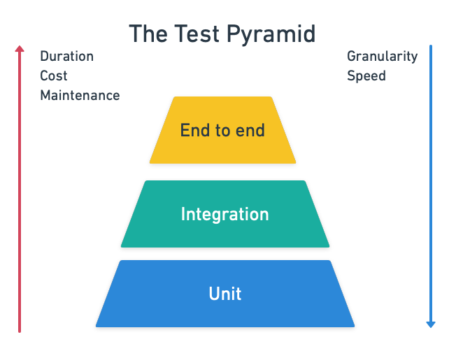
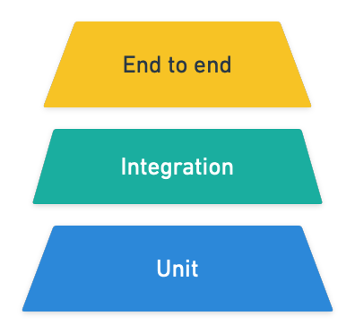

---
title: 5-Step Strategy for Optimizing Slow Tests
author-meta: Tomas Fernandez
subtitle: semaphoreci.com
rights:  Creative Commmons Attribution-NonCommercialNoDerivatives 4.0 International
language: en-US
...

Professional software development is a feedback-based process — each new iteration is informed by past results. Feedback is powered to a considerable degree by tests.

When tests slow development down, engineering teams lose momentum and become frustrated, because they can’t meet their goals. A slow test suite puts the brakes on CI/CD, making release and deployment more difficult. This often means that organizations can't ship out products on time, and risk losing their competitive edge.

Choosing a scalable cloud platform like Semaphore is a great start. Semaphore offers some features that are helpful in dealing with slow tests, which we will discuss later in the article.

## What’s wrong with waiting for tests?

Tolerating a slow test suite is like making the minimum credit card payment when you could pay off your balance: by not dealing with it now you have a bit more cash in the short term, but will have to pay much more down the road. It doesn’t make any sense, but people do it because the costs are not immediately obvious. When faced with slow tests, developers typically respond in one of three ways:

-   Do something else and pay the cognitive cost for the context switch.
-   Wait for results and lose focus on the problem at hand.
-   Trudge on blindly without feedback.

Whatever happens, development speed falters due to the lack of timely feedback.

{ width=90% }

Fortunately, we have a battle-tested plan that makes identifying and fixing slow tests much easier.

## A framework for making slow tests fast

Dealing with slow tests requires both a concerted effort and a sound plan:
1. [Identify](#step1): which tests are bad performers.
2. [Prioritize](#step2): pick a batch of the slowest tests. See if there are some outliers that could be easy to fix.
3. [Profile](#step3): zoom in and capture metrics to find out what your tests are doing behind the scenes.
4. [Optimize](#step4): make the tests snappy.
5. [Repeat](#step5): go back to Step 1 and repeat the process until you test suite is in top shape and your team is 🥇

Let’s be clear. This is not a one-off endeavor. It is part of the lifecycle of the project. Over time, tests slow down as the codebase grows and more tests are added. Therefore, you’ll need to repeat the whole process **at least once per quarter** to be in good shape.

### Step 1 — Identify high-value candidates

<span id="step1"></span>

It can be hard to find the slowest tests when you have an extended CI/CD pipeline. Luckily, Semaphore supports [Test Reports](https://semaphoreci.com/product/test-reports), which provide an effective and consistent view of your test suite in a CI/CD workflow.

There’s a little bit of setup required: you need to configure the test’s output to the [JUnit format](https://junit.org/junit5/), as well as add a few commands. The result is, however, well worth the effort. In the detailed dashboard, you can spot problems, filter skipped tests, or order them by duration.

{ width=95% }

Once you have a list of slow candidates to work on, you’re ready for the next step.

### Step 2 — Maximize optimization effort vs benefit
<span id="step2"></span>

Two factors come into play for deciding where to start: how much faster you can make a test and how long you need to optimize it. We’re going to grab the low-hanging fruit first.

In other words, we want to start working on tests that maximize:

```
  test runtime before - test runtime after
  ----------------------------------------
                   effort
```

The trouble is that the only certainty we have at this point is how long the test takes. Everything else that we have is an estimation. Consider starting with a few easy-to-fix tests or deleting ones that do not add value, even if there are slower candidates in your suite. Once you have a good grasp of the process, you can go after slower tests that require more substantial effort to optimize.

The testing pyramid can guide us here. The width of each level reflects the suggested ratio of tests for each type relative to the whole suite.

{ width=70% }

The pyramid tells us that a good test suite should have many unit tests, some integration tests, and a few end-to-end or acceptance tests. In contrast, slow suites tend to be more top-level heavy, i.e. the opposite of what they should look like.

{ width=60% }

The way forward lies in cutting the fat at the top, either by deleting some tests or moving them downwards.

Maybe an example can help at this point. Imagine that we want to write an [acceptance test](https://semaphoreci.com/blog/the-benefits-of-acceptance-testing) for an online music service:

``` gherkin
Feature: Control playback

    Scenario: play a song
        Given there is no song playing
        When user presses the play button
        Then the song should start playing

    Scenario: pause a song
        Given a song is playing
        When user presses the play button
        Then the song should be paused
```

It’s a valuable test that checks a business-critical feature. You may be able to squeeze some extra seconds of runtime but you can’t ever delete it.

At the other extreme, we have this:

``` gherkin
Feature: Search for music

    Scenario: search song cannot have an emoji symbol
        Given the search box is selected
        When user types an emoji
        Then the user should be notified emojis are not supported
```
Here we have to ask ourselves why we are spinning up the entire application just to test a search box. This is a perfect example of “low-hanging fruit”. We can quickly improve our entire suite by rewriting this test as a unit test and moving it down the pyramid, as shown below:

``` java
@Test
public void testSearchBoxShouldNotAcceptEmojis() {
    SongSearch search = New SongSearch();

    Exception exception = assertThrows(RuntimeException.class, () -> {
         SongSearch("😉");
    });

    String actualMessage = exception.getMessage();
    String expectedMessage = "Sorry. Emojis are not supported in song names";
    assertTrue(actualMessage.contains(expectedMessage));
};
```

### Step 3 — Debug and profile

<span id="step3"></span>

Semaphore’s Test Reports will point you in the right direction for this stage. As you zoom in on what’s going on, you’ll need more information about what the tests are doing. A few well-placed `puts`, `inspect`, or `console.log` can be enough to discover the cause of the slowness.

Some problems, however, resist optimization and need heavier tools. For such cases, you’ll need to use profilers to access metrics deep down in your code.

Profilers and debuggers come in many flavors and colors. You can be sure that your language has more than one. A profiler records how much time each instruction takes, letting you locate “hot spots” in your tests. Sometimes the results can be visually striking.

{ width=90% }

Even the most general profiler tool will show you each statement's accumulated time. These are called *statistical profilers* and give you a panoramic view of what the test is doing. An example of such a profiler is [rbspy](https://rbspy.github.io/):

Other profilers, such as [stackprof](https://github.com/tmm1/stackprof), trace everything that’s happening by line. These types of profilers usually need some instrumentation to be configured, as shown below:

``` ruby
StackProf.run(mode: :cpu, out: 'tmp/stackprof-cpu-myapp.dump', raw: true) do
    # code you want to profile here
end
```

### Steps 4 — Optimize

<span id="step4"></span>

Now we’ve gotten down to it–how to actually optimize your tests. The method of optimization depends on what’s causing the slow performance. Experience shows that slow tests fit into one or more of these nine antipatterns:

1. **Obsolete tests**: tests not earning their keep in your test suite.
2. **Mammoth-sized tests**: tests that are too long, too heavy, and don’t take advantage of parallelization.
3. **Tightly-coupled tests**: tests that are interconnected and cannot be executed independently. They pull chains of dependencies that are difficult to refactor and debug.
4. **Sleepy tests**: tests that are peppered with `sleep` statements instead of proper synchronization mechanisms.
5. **I/O-bound tests**: tests that heavily depend on slow I/O such as disk, database, or network.
6. **Slow query tests**: tests that make inefficient use of the database.
7. **UI zealous tests**: tests that always test through the UI even if there're better ways of achieving the same result, such as hitting an API instead.
8. **UI completionist tests**: these test the last corner of the UI and attempt to cover every edge case.
9. **UI prepper tests**: tests that set up every test via the UI instead of using faster out-of-band methods, making them slower and more brittle.

How to fix these problems it’s a tale for a future post. [Subscribe](https://semaphoreci.com/newsletter) so you don't miss it!

### Step 5 - Rinse and repeat
<span id="step5"></span>

Like a diet, the first few iterations of your optimization effort will bring the most visible results. Keep repeating the process until the total test time is shorter than the time it takes to stretch your legs. Fasts tests will keep developers happy and onboard.

For reference, proper continuous integration can happen only when [it takes 10 minutes or less](https://semaphoreci.com/blog/2017/03/02/what-is-proper-continuous-integration.html). So plan your tests to fit in that window.

## Conclusion

Upon seeing a slow test suite for the first time, you may feel overwhelmed and dispirited. It may seem like there is no way that you can fix so many things and still be productive! But by focusing first on a small number of outlier tests and letting Semaphore’s debugging features aid you, you can speed up your suite a great deal with a few hours’ work.

Tests should help development, not block it. Timely feedback and a fast CI pipeline are the safety net that lets the team experiment, enhance, and release frequently. Every second shaved from a test is a compounded win. Make fast tests a priority today!

\newpage

© __BUILD_YEAR__ Rendered Text. All rights reserved.

This work is licensed under Creative Commmons
Attribution-NonCommercial-NoDerivatives 4.0 International.
To view a copy of this license, visit
<https://creativecommons.org/licenses/by-nc-nd/4.0>

The source text is open source:
<https://github.com/semaphoreci/papers>

Originally published at:
<https://semaphoreci.com/cicd>

Authors: Tomas Fernandez

Build date: __BUILD_MONTH__ __BUILD_YEAR__

Revision: __BUILD_REVISION__

\newpage
