---
title: A complete guide to making your slow tests fast
author-meta: Tomas Fernandez
subtitle: semaphoreci.com
rights:  Creative Commmons Attribution-NonCommercialNoDerivatives 4.0 International
language: en-US
...

Professional software development is a feedback-based process — each new iteration is informed by past results. Feedback is powered to a considerable degree by tests.

When tests slow development down, engineering teams lose momentum and become frustrated, because they can’t meet their goals. A slow test suite puts the brakes on CI/CD, making release and deployment more difficult. This often means that organizations can't ship out products on time, and risk losing their competitive edge.

Choosing a scalable cloud platform like Semaphore is a great start. Semaphore offers some features that are helpful in dealing with slow tests, which we will discuss later in the article.

**What’s wrong with waiting for tests?**

Tolerating a slow test suite is like making the minimum credit card payment when you could pay off your balance: by not dealing with it now you have a bit more cash in the short term, but will have to pay much more down the road. It doesn’t make any sense, but people do it because the costs are not immediately obvious. When faced with slow tests, developers typically respond in one of three ways:

-   Do something else and pay the cognitive cost for the context switch.
-   Wait for results and lose focus on the problem at hand.
-   Trudge on blindly without feedback.

Whatever happens, development speed falters due to the lack of timely feedback.

{ width=90% }

Fortunately, we have a battle-tested plan that makes identifying and fixing slow tests much easier.

## The complete guide for making your slow tests fast

This guide consists of two parts:

-   [Part 1](#part1) lays down a framework to identify, prioritize and optimze the slow tests in your suite.
-   [Part 2](#part2) deals with the most common sources of slow test performance and their solutions.

\newpage

## A framework for making slow tests fast
<span id="part1"></span>

Dealing with slow tests requires both a concerted effort and a sound plan:
1. [Identify](#step1): which tests are bad performers.
2. [Prioritize](#step2): pick a batch of the slowest tests. See if there are some outliers that could be easy to fix.
3. [Profile](#step3): zoom in and capture metrics to find out what your tests are doing behind the scenes.
4. [Optimize](#step4): make the tests snappy.
5. [Repeat](#step5): go back to Step 1 and repeat the process until you test suite is in top shape and your team is 🥇

Let’s be clear. This is not a one-off endeavor. It is part of the lifecycle of the project. Over time, tests slow down as the codebase grows and more tests are added. Therefore, you’ll need to repeat the whole process **at least once per quarter** to be in good shape.

### Step 1 — Identify high-value candidates

<span id="step1"></span>

It can be hard to find the slowest tests when you have an extended CI/CD pipeline. Luckily, Semaphore supports [Test Reports](https://semaphoreci.com/product/test-reports), which provide an effective and consistent view of your test suite in a CI/CD workflow.

There’s a little bit of setup required: you need to configure the test’s output to the [JUnit format](https://junit.org/junit5/), as well as add a few commands. The result is, however, well worth the effort. In the detailed dashboard, you can spot problems, filter skipped tests, or order them by duration.

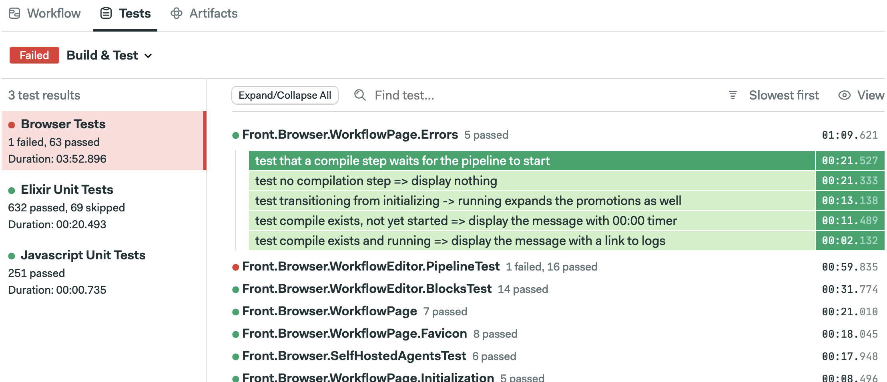{ width=95% }

Once you have a list of slow candidates to work on, you’re ready for the next step.

### Step 2 — Maximize optimization effort vs benefit
<span id="step2"></span>

Two factors come into play for deciding where to start: how much faster you can make a test and how long you need to optimize it. We’re going to grab the low-hanging fruit first.

In other words, we want to start working on tests that maximize:

```
  test runtime before - test runtime after
  ----------------------------------------
                   effort
```

The trouble is that the only certainty we have at this point is how long the test takes. Everything else that we have is an estimation. Consider starting with a few easy-to-fix tests or deleting ones that do not add value, even if there are slower candidates in your suite. Once you have a good grasp of the process, you can go after slower tests that require more substantial effort to optimize.

The testing pyramid can guide us here. The width of each level reflects the suggested ratio of tests for each type relative to the whole suite.

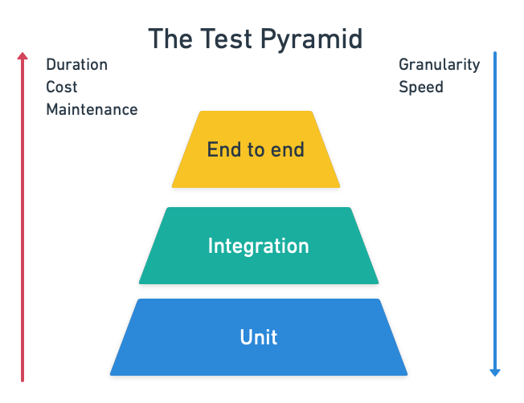{ width=70% }

The pyramid tells us that a good test suite should have many unit tests, some integration tests, and a few end-to-end or acceptance tests. In contrast, slow suites tend to be more top-level heavy, i.e. the opposite of what they should look like.

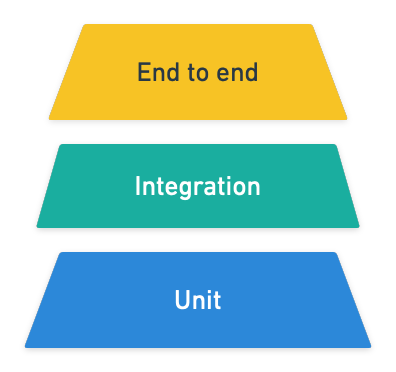{ width=60% }

The way forward lies in cutting the fat at the top, either by deleting some tests or moving them downwards.

Maybe an example can help at this point. Imagine that we want to write an [acceptance test](https://semaphoreci.com/blog/the-benefits-of-acceptance-testing) for an online music service:

``` feature
Feature: Control playback

    Scenario: play a song
        Given there is no song playing
        When user presses the play button
        Then the song should start playing

    Scenario: pause a song
        Given a song is playing
        When user presses the play button
        Then the song should be paused
```

It’s a valuable test that checks a business-critical feature. You may be able to squeeze some extra seconds of runtime but you can’t ever delete it.

At the other extreme, we have this:

``` feature
Feature: Search for music

    Scenario: search song cannot have an emoji symbol
        Given the search box is selected
        When user types an emoji
        Then the user should be notified emojis are not supported
```
Here we have to ask ourselves why we are spinning up the entire application just to test a search box. This is a perfect example of “low-hanging fruit”. We can quickly improve our entire suite by rewriting this test as a unit test and moving it down the pyramid, as shown below:

``` java
@Test
public void testSearchBoxShouldNotAcceptEmojis() {
    SongSearch search = New SongSearch();

    Exception exception = assertThrows(RuntimeException.class, () -> {
         SongSearch("😉");
    });

    String actualMessage = exception.getMessage();
    String expectedMessage = "Sorry. Emojis are not supported";
    assertTrue(actualMessage.contains(expectedMessage));
};
```

### Step 3 — Debug and profile

<span id="step3"></span>

Semaphore’s Test Reports will point you in the right direction for this stage. As you zoom in on what’s going on, you’ll need more information about what the tests are doing. A few well-placed `puts`, `inspect`, or `console.log` can be enough to discover the cause of the slowness.

Some problems, however, resist optimization and need heavier tools. For such cases, you’ll need to use profilers to access metrics deep down in your code.

Profilers and debuggers come in many flavors and colors. You can be sure that your language has more than one. A profiler records how much time each instruction takes, letting you locate “hot spots” in your tests. Sometimes the results can be visually striking.

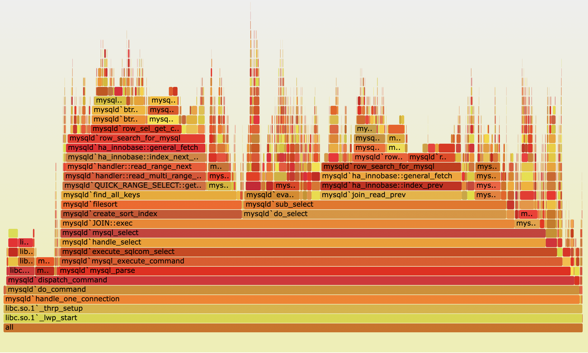{ width=90% }

Even the most general profiler tool will show you each statement's accumulated time. These are called *statistical profilers* and give you a panoramic view of what the test is doing. An example of such a profiler is [rbspy](https://rbspy.github.io/):

Other profilers, such as [stackprof](https://github.com/tmm1/stackprof), trace everything that’s happening by line. These types of profilers usually need some instrumentation to be configured, as shown below:

``` ruby
StackProf.run(mode: :cpu, out: 'tmp/stackprof.dump', raw: true) do
    # code you want to profile here
end
```

### Steps 4 — Optimize

<span id="step4"></span>

Now we’ve gotten down to it–how to actually optimize your tests. The method of optimization depends on what’s causing the slow performance. Experience shows that slow tests fit into one or more of these nine antipatterns:

1. **Obsolete tests**: tests not earning their keep in your test suite.
2. **Mammoth-sized tests**: tests that are too long, too heavy, and don’t take advantage of parallelization.
3. **Tightly-coupled tests**: tests that are interconnected and cannot be executed independently. They pull chains of dependencies that are difficult to refactor and debug.
4. **Sleepy tests**: tests that are peppered with `sleep` statements instead of proper synchronization mechanisms.
5. **I/O-bound tests**: tests that heavily depend on slow I/O such as disk, database, or network.
6. **Slow query tests**: tests that make inefficient use of the database.
7. **UI zealous tests**: tests that always test through the UI even if there're better ways of achieving the same result, such as hitting an API instead.
8. **UI completionist tests**: these test the last corner of the UI and attempt to cover every edge case.
9. **UI prepper tests**: tests that set up every test via the UI instead of using faster out-of-band methods, making them slower and more brittle.

How to fix these problems it’s a tale for a future post. [Subscribe](https://semaphoreci.com/newsletter) so you don't miss it!

### Step 5 - Rinse and repeat
<span id="step5"></span>

Like a diet, the first few iterations of your optimization effort will bring the most visible results. Keep repeating the process until the total test time is shorter than the time it takes to stretch your legs. Fasts tests will keep developers happy and onboard.

For reference, proper continuous integration can happen only when [it takes 10 minutes or less](https://semaphoreci.com/blog/2017/03/02/what-is-proper-continuous-integration.html). So plan your tests to fit in that window.

\newpage

## 9 Ways To Make Slow Tests Faster
<span id="part2"></span>

From developers to testers, from business analysts to management, everyone in your organization must be committed to keeping tests in top condition. If you have an extensive test suite, you'll need a plan to focus the effort. Check out our [5-step framework for identifying and optimizing tests](https://semaphoreci.com/blog/slow-tests-strategy) if you’re not sure where to start.

Software development is modulated by the tools supporting it. Of these, testing is the most widespread and has the largest impact. Keeping tests fast and responsive leads to improved productivity, better code quality, and higher deployment frequency.

When tests slow down, development follows suit. Teams get frustrated when they can’t meet their goals and organizations deploy as fast as they want. At Semaphore, we’ve seen our fair share of tests and have identified the nine factors that slow tests down.

**How fast should tests be?**

Tests are consumed first and foremost by developers, who run them first on their machines before committing changes. Fast tests keep developers productive, enabling them to maintain the creative focus that's so important for problem-solving.

By that measure, a test suite taking longer than the time it takes to stretch your legs and grab a cup of coffee is **too slow**.

Developers should be able to run tests locally — at least the part of the suite directly related to the code they’re working on. A speedy and easy-to-use test suite will encourage developers to run tests before, during, and after their changes.

Tests also affect the speed of [CI/CD](https://semaphoreci.com/cicd). The longer they take, the slower your pipeline is. This is important because the pipeline dictates how often you can release. A slow [pipeline](https://semaphoreci.com/blog/cicd-pipeline) disrupts the development cycle.

To be more accurate, you're not really doing continuous integration unless your pipeline takes **less than 10 minutes**. And because tests run in the pipeline, they should fit comfortably in that 10-minute window.

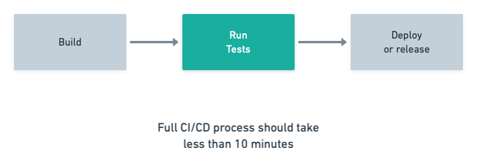

**Making slow tests fast again**

How do we fix slow tests? And how do we accelerate a CI/CD pipeline? Here are the nine most common performance problems and their solutions:

1. [My tests are too large](#large-tests): break them up.
2. [My tests have multiple dependencies](#mock-services): isolate tests with stubbing or mocking.
3. [My tests are tightly-coupled](#decouple-components): refactor them to make them independent.
4. [I have obsolete tests](#remove-obsolete): remove dead code and outdated tests.
5. [My tests use `sleep` and `wait`](#remove-wait): replace sleep statements with synchronization mechanisms.
6. [My tests use a database](#optimize-queries): make sure queries are optimized.
7. [My tests always go through the UI](#avoid-ui): reduce UI interactions. For example, if an API is available, test that instead.
8. [I set up my tests through the UI](#reduce-ui): use out-of-band channels for setting up and tearing down tests.
9. [My tests cover every edge case in the UI](#ui-tests): focus only on the most critical paths for your users.


### Breaking up large tests

<span id="large-tests"></span>

-   **Problem**: large tests take a long time to complete, are hard to maintain, and cannot take advantage of concurrency.
-   **Solution**: *divide et impera*. Split the test suite into small units and configure parallel jobs in your pipeline.

Long, single-threaded tests do not benefit from the many cores modern machines come with. Let’s take a look at the following pseudocode, which tests one function in three different ways:

``` text
// tests 1 to 3
setup()
value1 = function(input1)
assert value1 == output1
cleanup()

setup()
value2 = function(input2)
assert value2 == output2
cleanup()

setup()
value3 = function(input3)
assert value3 == output3
cleanup()
```
Breaking this test up could make it **up to 3 times faster**. Depending on your testing solution, it might be as simple as distributing the code between three files and setting up your framework to use all the available CPUs.

| Test1                       | Test2                       | Test3                       |
|-----------------------------|-----------------------------|-----------------------------|
| `setup()`                   | `setup()`                   | `setup()`                   |
| `value1 = function(input1)` | `value2 = function(input2)` | `value3 = function(input3)` |
| `assert value1 == output1`  | `assert value2 == output2`  | `assert value3 == output3`  |
| `cleanup()`                 | `cleanup()`                 | `cleanup()`                 |

Parallelization, however, isn’t without dangers. Tests running in sequence do take longer but are easier to wrap one’s head around. Concurrency, on the other hand, is complex. It may produce unexpected results if tests have side effects and are not [isolated](#mock-services). A small mistake can lead to hard-to-debug problems, race conditions, and [flaky tests](https://semaphoreci.com/community/tutorials/how-to-deal-with-and-eliminate-flaky-tests).


**Parallel jobs in CI/CD**

If you take away only one thing in this whole article, let it be this: **[parallelization](https://semaphoreci.com/blog/revving-up-continuous-integration-with-parallel-testing)**  has the most immediate benefits with the least effort — mainly when applied to the CI/CD pipeline — despite the aforementioned hurdles in its implementation. Once parallelizing ceases to be cost-effective, continue with the rest of the recommendations in the article.

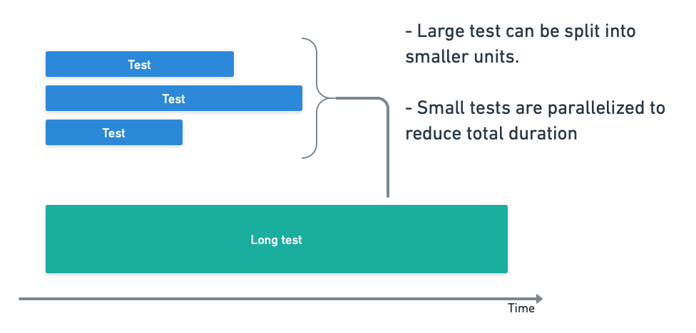

Dividing tests opens up a whole new level of optimization. Cloud services like Semaphore allow one to scale up continuous integration and delivery beyond one machine.

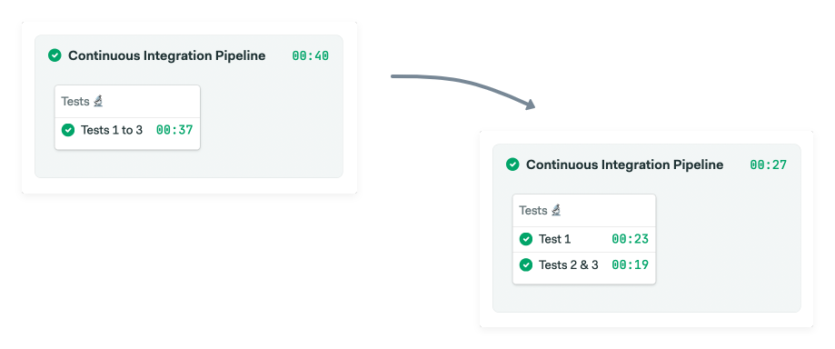


### Make tests independently-runnable

<span id="decouple-components"></span>

-   **Problem**: tightly-coupled tests sabotage speed and make refactoring difficult.
-   **Solution**: decouple components so they are independently testable. Don't break test encapsulation.

Designing testable code means building small, isolated, and decoupled components. We’ve seen that parallelization can help us reduce testing runtime. Separating components is a necessary part of this process.

Tests add value to the extent that they maintain their distance from the implementation. When they are too tightly-coupled , they break more easily and for the wrong reasons. A test should validate an external behavior, not how it works internally. Tests that are too coupled to the code hinder refactoring.

Imagine that we have a class representing a shopping cart, like the one shown below:

``` java
class ShoppingCart {

	Item _lastItemAdded;
	Item[] _cartContents;
	float _totalSum;

	function AddItem(Item) {
		_lastItemAdded = Item;
		_cartContents.Add(Item);
		_totalSum =+ Item.cost;
	}

	function getTotal() {
		return _totalSum;
	}

	function getItem(index) {
		return _cartContents[index];
	}
}
```

And we write the following test:

``` java
// test item added
item = new Item("bottle", 10.50);
cart = new ShoppingCart();
cart.AddItem(item);

assert _totalSum == 10.50;
assert _lastItemAdded.name == "bottle";
assert _cartContents.toString() == "bottle-10.50";
```

The test knows too much about the internal details of the tested class. It’s breaking encapsulation, making it impossible to refactor the class without breaking the test:

-   The test checks on <u>lastItemAdded</u> instead of using the getter.
-   The test accesses private attributes like `_cartContents`.
-   The test depends on the manner in which objects are serialized.

Think about this: you want the test to fail only if the behavior of the public interface changes. So, let’s make tests all about the behavior.

``` java
// test item added
item = new Item("bottle", 10.50);
cart = new ShoppingCart();
cart.AddItem(item);

assert cart.getTotal() == 10.50;
assert cart.getItem[0].name == "bottle";
assert cart.getItem[0].price == 10.50;
```

**Branch by abstraction**

Large-scale refactoring doesn’t take place overnight — it’s going to take a few weeks or even months. Gradual change can be achieved using branching by abstraction. This technique allows you to continue shipping releases while change takes place.

Branch by abstraction starts by picking a component to decouple from the rest of the codebase:

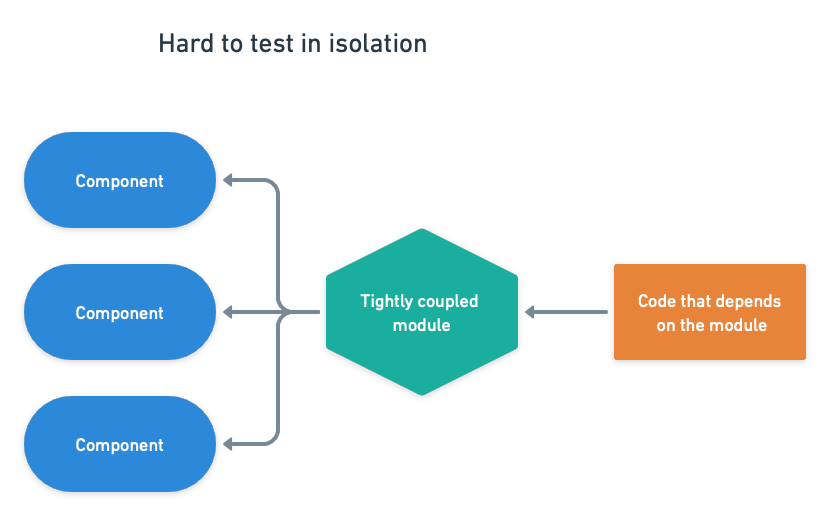{ width=90% }

Next, wrap the component in an abstraction layer and redirect all calls to the new layer.

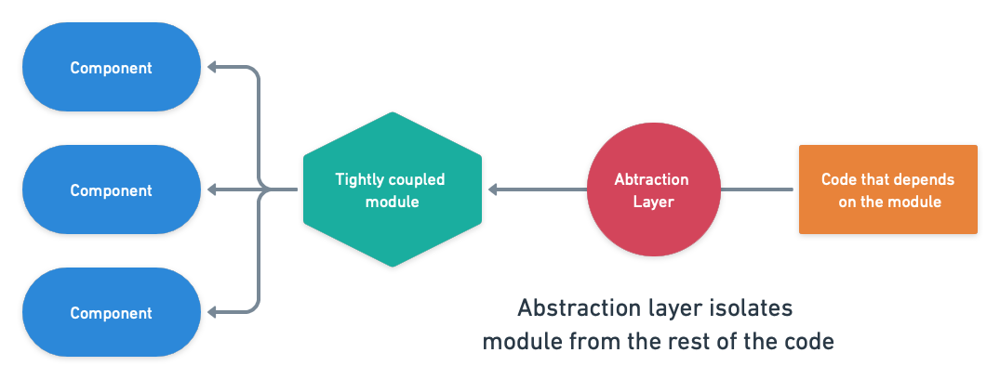{ width=90% }

The abstraction layer hides the implementation details. If the component is big and cumbersome, create a copy and work on it until it’s ready. Then, refactor the component until it’s independently testable.

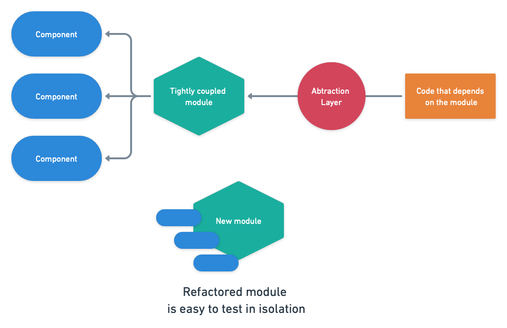{ width=90% }

Once refactoring is done, switch the abstraction layer to the new implementation.

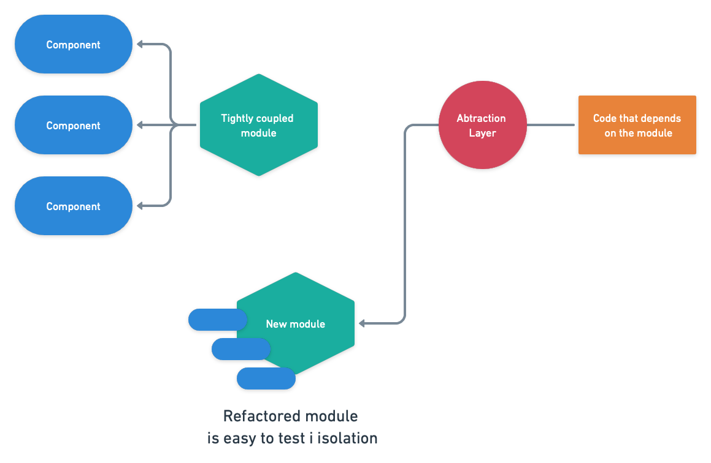{ width=90% }

### Making tests self-contained

<span id="mock-services"></span>

-   **Problem**: external dependencies slow down tests and add uncertainty to results.
-   **Solution**: replace external components with test doubles, stubs, and mocks. Remove services, databases, and APIs from the equation to make unit tests self-contained.

A mock is a simplified instance of a component that responds like the real thing, at least for the scope of the test in question. It doesn’t need to implement the full range of responses, only those deemed relevant. For example, instead of requesting actual data from an API endpoint like this:

``` text
function precipitation
      weather = fetch 'https://api.openweathermap.org/data'
      return weather.precipitation
end function

function leave_the_house
      if precipitation() > 0 then
            return "Don't forget your umbrella. It's raining!"
      else
            return "Enjoy the sun."
      end if
end function
```

We could replace the real `precipitation` function with a canned response. This would make the test self-contained and, thus, more reliable. This also avoid unintended abuse on the API. As long as the interface is maintained, the test code is still valid.

``` text
// Override the precipitation function
function precipitation()
	return 10
end function

message = leave_the_house()
assert message == "Don't forget your umbrella. It's raining!"
```

Of course, now that we’re decoupled from the actual API, any breaking changes will not be spotted by the test. We could implement a separate test that periodically polls the API and validates the result to mitigate risks. This type of test is called [contract testing](https://martinfowler.com/bliki/contracttest.html).

Mocking, stubbing, and test doubles allow you to run a piece of code in isolation. In the process, you make tests much faster because you are not constrained by the limitations of the environment. Without them, you get inconsistent results as your tests depend on external components that are likely out of your control.

To help you isolate tests, Semaphore enforces a clean environment for each job.

### Remove obsolete tests and dead code

<span id="remove-obsolete"></span>

-   **Problem**: dead code and obsolete tests waste time and contribute to the project’s technical debt.
-   **Solution**: do some house cleaning. Remove all obsolete code from your project.

Don’t feel anxious about deleting code and tests. Tests get outdated when the tested code goes out of circulation. Obsolete tests are part of the technical debt a development team has to deal with sooner or later.

Obsolete tests are not necessarily the only ones that deserve deletion. Sometimes a test covers working code, like in the example below. However, if the test is trivial and doesn’t give much value, it shouldn’t be in your suite. In such cases, it is often better to remove it.

``` text
person = new Person()
person.setName("John")
name = person.getName()
assert name == "John"
```

**How to delete a test**

It’s safer to remove obsolete tests in two stages:

0.   Run test suite locally and verify ALL PASS
1.   Remove the tested code.
2.   If nothing breaks, delete the test.

Tests should be falsifiable. In other words, removing the code should make the test fail — if it doesn’t, what were you testing?

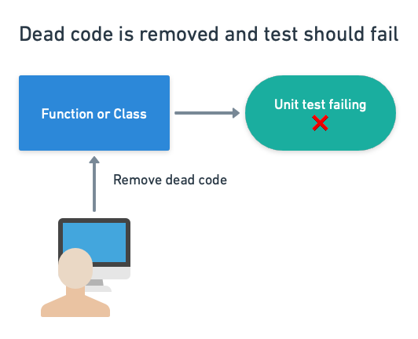{ width=90% }

Once we’re sure there wasn’t any collateral damage from deleting the code, let’s remove the test.

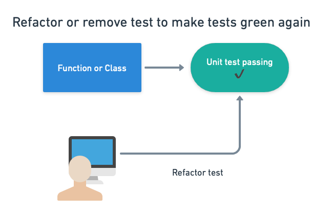{ width=90% }

### Eliminate wait/sleep statements from tests

<span id="remove-wait"></span>

-   **Problem**: wait statements slow down the test suite and hide a swath of design problems.
-   **Solution**: use proper synchronization mechanisms.

The presence of sleep statements in a test shows that the developer needed to wait for something and didn’t know how long. So, they set a fixed timer that made the test work.

Sleep statements are usually found between a function call and it’s verifying assertion:

``` javascript
output1 = my_async_function(parameters)
// wait 2000 milliseconds
wait(2000)
assert(output1 == value1)
```

While this may work. It’s brittle and unpolished. Why wait two seconds? Because it worked on the developer’s machine? Instead of sleeping, you should use some kind of polling or synchronization mechanism to keep the wait to the minimum. In JavaScript, for instance, `await/async` solves the problem:

``` javascript
async function my_async_function() {
    // function definition
}

output1 = await my_async_function()
assert(output1 == value1)
```

Many languages also have callbacks to chain actions:

``` javascript
function callback(output) {
      assert(output == value)
}

function my_function(callback) {
    // function definition

    callback(output)
}

my_async_function(callback)
```

In both cases, the most correct implementation would also include some form of timeout to handle unresponsive endpoints.

Frequently, waits are added as a workaround for a [flaky test](https://semaphoreci.com/community/tutorials/how-to-deal-with-and-eliminate-flaky-tests) — a test that succeeds and fails at times for no apparent reason. Waiting, however, is not a correct solution; it just hides the problem.

**Waiting for services**

Sleep statements should be replaced with proper polling or messaging to determine when the needed resource is ready. This works, and in some cases it may be the only alternative you have:

``` text
while port not open
      sleep(100)
end while

// test that needs port available...
```

But when you can, it’s much better to open the port and pass the test function as a callback instead. This will chain the actions without needing any explicit waits.

``` text
function run_test()
      // the port is open, run your test here
end function

connect(port, run_test)
```

### Optimize database queries in tests

<span id="optimize-queries"></span>

-   **Problem**: suboptimal database queries waste resources and slow down tests.
-   **Solution**: profile your queries and optimize them.

When the test calls for a database query, first check if you can replace it with a prefilled dataset instead. **The bulk of your unit tests should not depend on a database**. It is inefficient and usually unnecessary.

How do you mock database calls? Imagine we want to count all users in a table. We have a function that connects to the database and issues a query.

``` text
import mysql

function countUsers(host, port, user, password)
	connection = new mysql(host, port, user, password)
	users = connection.exec("SELECT USERNAME FROM USERTABLE")
	return users.count()
end function

print countUsers('localhost', 3306, 'dbuser', 'dbpassword')
```

While straightforward, it’s hard to mock. You would need to write a MySQL replacement that accepts the same parameters and behaves similarly enough to be useful. A better alternative is to use *inversion of control*. This pattern involves injecting code into the tested function to allow more control.

``` text
function countUsers(dbobject)
	if dbobject.connected is false
		throw "database not connected"
	end if

	users = dbobject.exec("SELECT USERNAME FROM USERTABLE")
	return users.count()
end function
```

Here we are sending a database object as a parameter, making the function call a bit more complex:

``` text
import mysql

connection = new mysql(host, port, user, password)
print countUsers(connection)
```

Testing is more straightforward, however:

``` text
Class MockedDB
      // always connected
	connected = true

      // returns a canned answer, no db connection required
	function exec
		return ["Mary", "Jane", "Smith"]
	end function

end class

usercount = countUsers(MockedDB)
assert usercount == 3
```

**Querying a real database**

Mocks don't always work. You’ll find that an actual database is sometimes needed, especially during integration and end-to-end testing. Semaphore provides [popular database services out-of-the-box](https://docs.semaphoreci.com/ci-cd-environment/sem-service-managing-databases-and-services-on-linux/) that you can quickly spin up in your test environment.

When it comes to using a database, there are a number of classic slip-ups. Perhaps the most common is the **N+1 problem**, which stems from combining loops and SQL queries.

``` text
users = db.exec("SELECT id, name FROM Users")
foreach user in users
	email = db.exec("SELECT email FROM Emails
                    WHERE userid = $user['id']")
	body = "Hello $user['name']"
	sendEmail(body, email)
end foreach
```

What’s the problem with this? At first glance, there’s nothing wrong: get all users from the `Users` table, then their email address from a different table. But, think of how many queries are hitting the database: one to get all users and one more for every user found. If you have 10,000 users, that’s 10,001 queries.

Databases, SQL databases in particular, are designed to work in sets. They hate iterations because every query has a large upfront processing cost. We can reduce the 10,001 queries to just 1 by requesting all the records in one go and taking advantage of the `JOIN` clause:

``` text
users = db.exec("SELECT id, name, email FROM Users
                JOIN Emails ON Users.id = Emails.userid")
foreach user in users
	body = "Hello $user['name']"
	sendEmail(body, $user['email'])
end foreach
```

**Selecting all columns**

{ width=80% }

Selecting all columns is another easy-to-make mistake. The query `SELECT *` presents several problems:

-   Retrieves unneeded columns, causing more I/O and memory usage.
-   Negates some of the benefits provided by existing indexes.
-   Breaks more easily if column order or column name changes when used in JOINs.

So, instead of selecting all columns:

``` sql
SELECT *
FROM Users U
JOIN Orders O on O.userid = O.id
```

You should be more explicit and ask only for the data you **need**:

``` sql
SELECT U.id, U.name, O.shipping_address
FROM Users U
JOIN Orders O on O.userid = O.id
```

**Batching operations**

Batching is the ability to change multiple records in a single transaction. Reaching data speeds much higher than regular transactions, batching is an excellent way of initializing a test. Thus, instead of inserting one row at a time like this:

``` sql
INSERT INTO founders (name, surname) values ('John', 'Romero');
INSERT INTO founders (name, surname) values ('John', 'Carmack');
INSERT INTO founders (name, surname) values ('Tom', 'Hall');
```

Consider bundling the values into a single statement:

``` sql
INSERT INTO founders (name, surname) values
  ('John', 'Romero'), ('John', 'Carmack'), ('Tom', 'Hall');
```

Similarly useful devices exist when setting up a test through an ORM. Take this RSpec example:

``` ruby
before(:each) do
	@user = User.create(name: "Adrian", surname: "Carmack")
end

after(:each) do
	@user.destroy
end

context 'model test' do
	subject { @user }
    it { should validate_presence_of(:name) }
    it { should validate_presence_of(:surname) }
	it { should have_many(:projects) }
end
```

It takes a bit of knowledge of Ruby to understand that `before(:each)` and `after(:each)` are not the optimal choices here. The test creates and deletes a user for every `it` statement. Since none of the tests mutate data, you can initialize the dataset once with `before(:all)` and `after(all)`, which run only once at the beginning and end of the test. Consider loading up the sample data once and reusing it in your tests whenever possible.

### Test the API instead of the UI

<span id="avoid-ui"></span>

-   **Problem**: too many UI tests reduce the performance of the suite.
-   **Solution**: avoid the UI when there are better testable targets such as an API endpoint.

An API is designed for programmatic access and it will always be a better fit for running tests than the UI. This doesn't mean that the UI should not be tested, only that if you have the choice of testing via API or via UI, the former is easier and less resource-intensive.

The following example shows a basic UI test. It visits a URL, does a search, and verifies the resulting value:

``` java
driver = new ChromeDriver();
driver.get("http://myapp/users");

// search for a user
driver.findElement(By.linkText("User")).sendKeys("John");
driver.findElement(By.linkText("Search")).click();

// validate result
firstTableCell = driver.findElement(
                By.Xpath("//table/tbody/tr[0]/td[0]"));
assertEquals(firstTableCell.getText(), "John")
```

Even such a simple test requires a lot: we need to open a browser, wait for the page to render, and simulate all the interactions. Not to mention that the entire application must be up and running before we even begin.

Compare that with a more [subcutaneous test](https://martinfowler.com/bliki/SubcutaneousTest.html) pinging the same API endpoint that the application consumes.

``` java
request = fetch("http://myapi/v1/users$?name=John");

assertEquals(request.status(), 200);
assertEquals(request.header.contentType, "application/json");
assertEquals(request.body.users.name, "John");
```

Here we're testing that the API behaves according to the spec, and achieving the same thing as the test that went through the UI. This kind of test scales up much better because it uses fewer resources and can be more easily parallelized.

### Reduce UI interactions during setup

<span id="reduce-ui"></span>

-   **Problem**: setting up tests using the UI is suboptimal.
-   **Solution**: prepare the test out-of-band and only go through the UI for elements under test.

Since UI tests take more time to run and more effort to maintain, we need to keep them lightweight. If you want to test the checkout button, test the checkout button and **nothing else**. You don't need the UI to fill the shopping cart with products. You can do it behind the scenes by populating the database or directly calling an API.

Of course, you still need to do end-to-end testing, and it is more approachable with a [BDD framework](https://semaphoreci.com/blog/the-benefits-of-acceptance-testing) such as Cucumber or JBehave. Test cases can be written down using Gherkin's structured `Given-When-Then` pattern, which helps to make them more streamlined:

``` feature
Feature: Checkout cart
  User must be able to buy their products

  Scenario: Successful purchase
    Given cart has products
    When I press the checkout button
    Then my order should be accepted
```

**Cheating in the test**

The scenario above calls for a shopping cart with products. This is a given precondition, but the test doesn’t care *how* the cart was filled. We can "cheat" and prefill the cart directly with a database query, which means that we don’t have to go through the UI. The point here is that **not everything needs to go through the UI**.

``` java
@Given("cart has products")
public void cart_has_products() {
    stmt.executeUpdate("INSERT INTO Cart (user_id,product_id)
                        VALUES (1,1000), (1,2000), (1, 3000)");
}
```

In comparison, both the When and Then clauses need to deal with the UI since they are testing it in order to validate the checkout experience. Under the hood, each clause in the test is implemented using a framework such as Selenium:

``` java
public class StepDefinitions {

    private WebDriver driver = new ChromeDriver();

    @When("I press the checkout button")
    public void i_click_checkout() {
        driver.findElement(By.linkText("Checkout")).click();
    }

    @Then("my order should be accepted")
    public void i_should_get_order_number() {
        assertNotNull(driver.findElement(
            By.xpath("//*[matches(@id, 'Your order number is \d+')]")));
    }

}
```

Testing frameworks have ways of reusing scenarios and conditions. Cucumber, for instance, has [backgrounds](https://cucumber.io/docs/gherkin/reference/#background). Time spent optimizing UI interactions is usually time well-spent.

### Keep UI tests focused on the happy paths

<span id="ui-tests"></span>

-   **Problem**: trying to test every corner of the UI.
-   **Solution**: be clever about which cases to test. You don't need to try every possible combination.

By now, you may have realized that the motto for UI and end-to-end testing is "keep it short, keep it valuable". Each test should earn its keep.

Being too strict about the UI is not a good idea, as it makes it easy to break a test by moving a button or changing a string. You should be able to make cosmetic changes and improvements without breaking your end-to-end test layer.

That doesn't mean that UI tests aren't valuable. We just need to be picky about which paths to test. As an example, you most definitely want to ensure that new users can create an account or that existing users can log in. Conversely, testing what happens when a user enters a non-Unicode character into a search box is better served by a unit test.

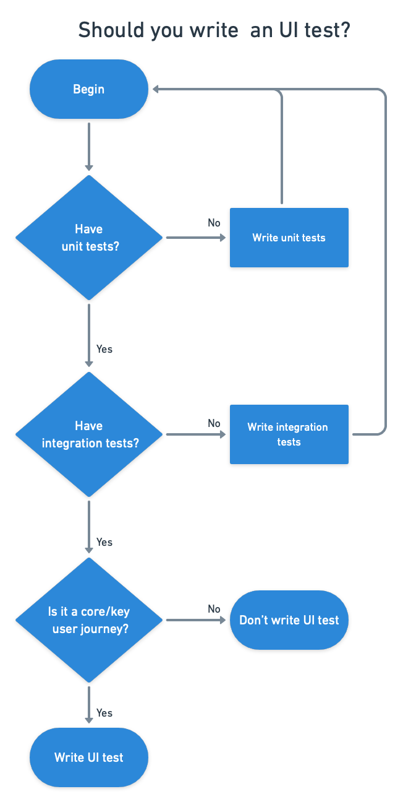{ width=90% }

There are no hard and fast rules. Finding what works depends entirely on the nature of your application. Think about the primary user experience (the happy paths) and forget about edge cases — at least where UI testing is concerned.

## Don’t neglect your tests

The importance of responsive tests cannot be overstated. Tests are code and should be treated with the same care. Time must be allocated to upkeep them because the speed of the test suite directly correlates to how often you can release software. A test suite will gradually slow down unless it is dutifully maintained, dragging the team's morale down and making your organization miss deadlines. Don’t let that happen!

\newpage

© __BUILD_YEAR__ Rendered Text. All rights reserved.

This work is licensed under Creative Commmons
Attribution-NonCommercial-NoDerivatives 4.0 International.
To view a copy of this license, visit
<https://creativecommons.org/licenses/by-nc-nd/4.0>

The source text is open source:
<https://github.com/semaphoreci/papers>

Originally published at:
<https://semaphoreci.com/cicd>

Authors: Tomas Fernandez (https://twitter.com/TomFernBlog)

Editor: Marko Anastasov (https://twitter.com/markoa)

Reviewed by: Dan Ackerson (https://www.linkedin.com/in/danackerson/)

Build date: __BUILD_MONTH__ __BUILD_YEAR__

Revision: __BUILD_REVISION__

\newpage
