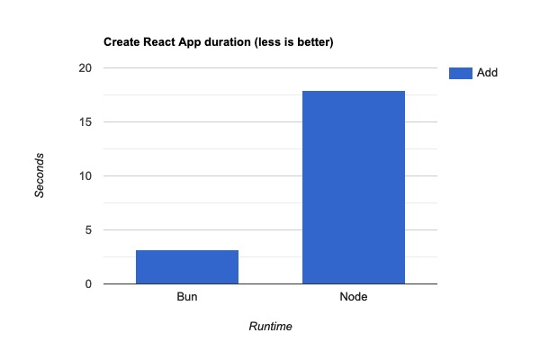
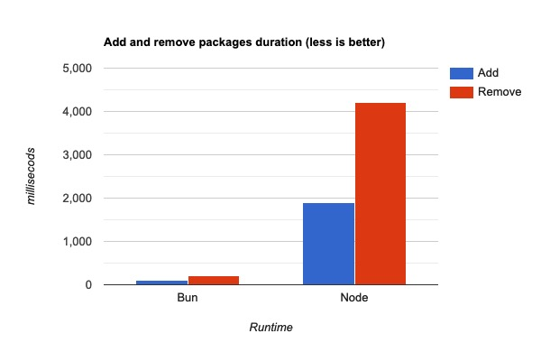
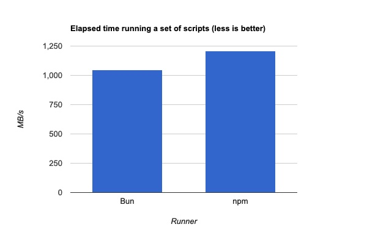
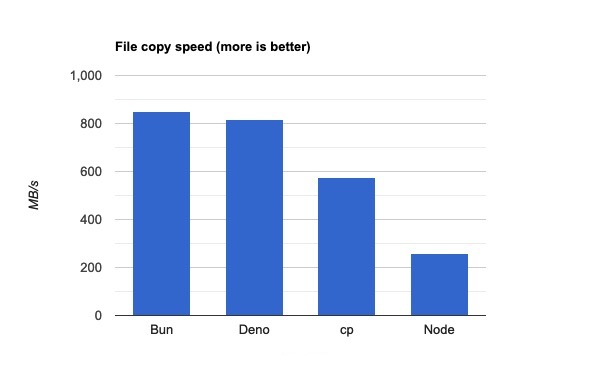
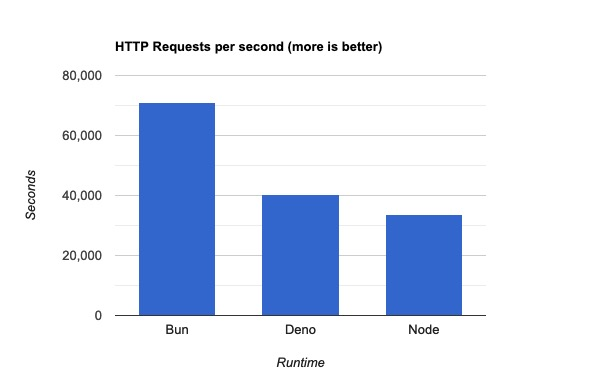
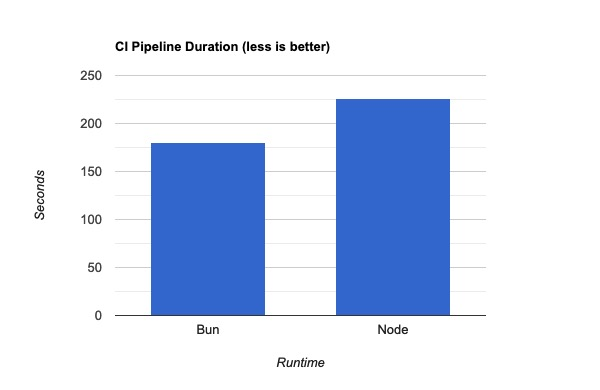

---
title: A First Look at Bun
author-meta: Tomas Fernandez
subtitle: semaphoreci.com
rights:  Creative Commmons Attribution-NonCommercialNoDerivatives 4.0 International
language: en-US
...


Bun is a new and ambitious JavaScript toolset and runtime. Early adopters have been reporting that Bun is incredibly fast. So fast that it has been touted by some as a Node.js killer. Curious, I decided to check out Bun for myself and benchmark it against the competition.

Is it as fast as people are saying? How stable is it? Is it really better than Node? And can I use it with [continuous integration](https://semaphoreci.com/continuous-integration)?

## What is Bun?

Bun is the newest addition to the JavaScript runtime family. It has been making waves that rival those made by [Deno](https://deno.land/) when it came out in 2018. Bun sits in the space between Node and Deno. Bun, like Deno, supports TypeScript out of the box and offers developer-friendly features such as top-level awaits and built-in Web APIs. But, unlike Deno, Bun is intended to be a drop-in replacement for Node, Webpack, Babel, Yarn, and PostCSS — all in one neat package.


Bun is released with an MIT and LGPL2 License (due to JavaScriptCore) and, at the time of writing, is on version v0.1.4.

## How does bun compare to Deno and Node?

While Bun is inspired by Node and Deno, it is also clearly attempting to improve development experience and productivity by providing a batteries-included toolset.

Bun takes features from Deno, like shipping as a single binary and having native TypeScript support.

| Feature                                    | Bun                  | Deno        |
| ------------------------------------------ | -------------------- | ----------- |
| TypeScript/TSX/JSX support                 | Yes                  | Yes         |
| Single executable                          | Yes                  | Yes         |
| Built-in test runner                       | Yes (in development) | Yes         |
| Built-in Web APIs (fetch, WebSocket, etc.) | Yes                  | Yes         |
| Top-level awaits                           | Yes                  | Yes         |
| npm compatibility                          | Yes                  | No          |
| No compatibility                          | Yes                  | Partial          |
| tsconfig.json support                      | Yes                  | No          |
| WebAssembly support                        | No                   | Yes         |
| Built-in linter & formatter                | No                   | Yes         |
| Permission system                          | No                   | Yes         |
| Package manifest format                    | package.json         | N/A         |
| Module support                             | ES Modules, CommonJS | ES Modules  |
| License                                    | MIT, LGPL2           | MIT         |
| JS Engine                                  | JavaScriptCore       | V8          |
| Language                                   | Zig, C++             | Rust, Tokio |

Compared to Node, Bun offers more features while striving to still be compatible:

| Feature                          | Bun            | Node               |
| -------------------------------- | -------------- | ------------------ |
| npm compatibility                | Yes            | Yes                |
| Node compatibility               | Yes (beta)     | Yes                |
| Single binary                    | Yes            | No                 |
| Built-in bundler & transpiler    | Yes            | No                 |
| Native TypeScript support        | Yes            | No                 |
| Package manifest format          | package.json   | package.json       |
| Lockfile format                  | Binary         | JSON               |
| Native live-reload               | Yes            | No                 |
| Built-in `.env`, `.toml` support | Yes            | No                 |
| Top-level Awaits                 | Yes            | Only on ES Modules |
| JS Engine                        | JavaScriptCore | V8                 |
| Languages                        | Zig, C++       | C, C++             |
| License                          | MIT, LGPL2     | MIT, BSD           |

Being in the beta stage, however, means that Bun [still has some quirks](https://github.com/oven-sh/bun/issues/798):

-   Documentation is limited, but [Bun’s Discord](https://discord.com/invite/CXdq2DP29u) is very active and a great source of knowledge.
-   No native Windows support (works with WSL, though).
-   Bun can get stuck while installing packages, fetch is not reliable, and, although it never happened to me, Bun can occasionally segfault.
-   Bun is not 100% compatible with Node yet. Not every npm package works. Express, for instance, is not yet functional.
-   Publishing to the npm registry does not work.
-   Various breaking changes will occur before the APIs and the CLI are stable.

Bun has a few distinct quality-of-life characteristics of its own:

-  Fast built-in sqlite3 module (MySQL and PostgreSQL are also planned).
-  Out-of-the-box `.env`, `.toml`, and CSS support (no extra loaders required).
-  Built-in framework support and optimizations for React and Next.js
-  Built-in Foreign Functions Interface (FFI) for low-level calls to ABI-supporting languages such as C, Rust, or Kotlin.
-  Option to copy errors as Markdown (for rapid sharing).

## Is it really that fast?

Bun was born out of [Jarred Sumner’s frustration with the speed](https://thenewstack.io/meet-bun-a-javascript-runtime-for-the-whole-dev-lifecycle/), or lack thereof, of a language: *“I’ve been so frustrated by how slow everything in JavaScript is. I know JavaScript can be a lot faster”*. As a former frontend developer at Stripe, Jarred knows how a fast iteration cycle is essential for productivity.

Developer experience matters. As a result, Bun's speed is not limited to serving requests faster than other runtimes, but also means that it is faster at installing packages, running tests, bundling, and transpiling.

Let's run a few tests to see how Bun actually performs.

## Benchmarking Bun

Bun’s homepage reports 3 and 4 times improved performance when compared against Deno and Node. Those are impressive numbers that I want to check for myself, so let’s run a few benchmarks across different categories:
-  Bun vs. npm as a package manager.
-  Bun vs. npm as a script runner.
-  Bun vs. npm for CI/CD workflows.
-  Bun vs. Node vs. Deno for copying large files.
-  Bun vs. Node vs. Deno for serving HTTP requests.

In this instance, we’re going to benchmark:

-  [Node.js](https://nodejs.org/en/) v16.16.0
-  [npm](https://www.npmjs.com/) v8.11.0
-  [Deno](https://deno.land/) v1.23.4
-  [Bun](https://bun.sh/) v0.1.4

These are the tools I used for benchmarking:
-  [oha](https://github.com/hatoo/oha): v0.5.3
-  [hyperfine](https://github.com/sharkdp/hyperfine): v1.14.0
-  [Semaphore CI/CD](https://semaphoreci.com/): running tests on [e1-standard-2](https://docs.semaphoreci.com/ci-cd-environment/machine-types/) and Ubuntu 20.04.
-  MacBook Pro M1 2020, MacOS 12.4

You can see the scripts used for each case here: https://github.com/TomFern/benchmarks-javascript

I’ll try to compare Bun, Deno, and Node directly when possible. However, Deno was never intended as a drop-in replacement for Node, so it won’t be able to participate in all tests.

## Managing packages with Bun

In this first test, we'll compare how Bun fares against npm for creating new projects. As you can see below, npm takes 49 seconds to create an empty React App.

```bash
$ time npx create-react-app myapp

Creating a new React app in /code/myapp.

Installing packages. This might take a couple of minutes.
Installing react, react-dom, and react-scripts with cra-template...

added 1392 packages in 38s

16.50s user 6.33s system 46% cpu 49.016 total
```


Bun ships with the `bun create` command capable of doing the same:

```bash
$ time bun create react myapp2
[package.json] Detected React - added "react-refresh"

bun install v0.1.4
  🔍 Resolving [1/4]
[29.00ms] git
 + react-refresh@0.10.0
 + typescript@4.7.4
 + react@18.2.0
 + react-dom@18.2.0
 + web-vitals@2.1.4

 8 packages installed [2.39s]

2.48s user 0.30s system 66% cpu 4.160 total
```


It takes Bun less than a second to complete the setup. That’s quite an improvement. But is this a valid comparison? Upon further inspection, we find that:
- npm installed 1,392 packages and the `node_modules` size is 250 MB.
- Bun only installed 8 packages, with a total size of 72 MB.

We’re comparing apples to oranges here because Bun’s starter React template is slimmer. Surprisingly, it’s still quite usable for development. I can run `bun dev` to start hacking away immediately. Bun will also auto-reload on every change.

Yet, Bun’s starter React cannot create a production build. For that, we’ll need to add [react-scripts](https://www.npmjs.com/package/react-scripts) with:

```bash
$ bun add react-scripts -d
```


The new dependency installs 1,133 more packages, taking `node_modules` to a total of 298 MB. Now we’re in a better position for the comparison.

After creating the new app 10 times with each tool, we have some numbers to compare.


| Package Manager | Create React App (10 runs) |
| :-------------- | -------------------------: |
| npm             |            17.937 ± 28.813 |
| Bun             |              3.210 ± 5.430 |

All tests were done with npm and bun caches warm, which explains why npm did much better the second time.



In this test Bun looks pretty good: **it is at least 6 times faster than npm**. From time to time, however, Bun would lock up (a known issue). Also, npm would slow down considerably from time to time. I could not determine the cause for this.

### Adding and removing packages with Bun and npm

Next, let’s test how long it takes npm and Bun to add and remove packages. I’ll use an npm-created React App as the testing ground.

After removing and re-adding webpack](https://webpack.js.org/) 10 times with each tool, I got the following results:

| Tool | Add Webpack (10 runs) | Remove We pack (10 runs) |
| :--: | --------------------: | ----------------------: |
| npm  |               1900 ms |                 4200 ms |
| Bun  |                100 ms |                  200 ms |



The only catch is that Bun's package management is not 100% compatible with npm:
- Bun uses a binary lockfile instead of `package-lock.json`. But it can print out a Yarn-compatible JSON lockfile with `bun install -y`.
- Bun does not install peer dependencies by default like npm. So you might end up with a different set of packages than expected in your `node_modules` folder.

### Bun as a task runner

Unfortunately, Bun's runtime component has not implemented enough Node APIs to do complex things such as building React projects or running end-to-end tests. Still, there is one area in which Bun can help us right now: as a replacement for npm run.

The problem with npm is that it takes around 150 to 200ms to even start. It may not sound like a big deal, but when you’re running scripts frequently, you can *feel* that quarter of a second eating away at your productivity little by little.

Bun does not have this start-up problem, so bun run test should be at least a few milliseconds faster than npm run test. We can confirm by running the same set of scripts 50 times and averaging the results:

| Command        | Mean elapsed time (50 runs) |
| :------------- | --------------------------: |
| `npm run test` |               1.208 ± 0.011 |
| `bun run test` |               1.046 ± 0.030 |




### Copying large files

In this test, I want to compare how each runtime handles copying large files, which is one area in which a lot of optimization effort was spent.

[EMBED TWEET] https://twitter.com/jarredsumner/status/1458044627513085959?s=20&t=ZNC5u_OR28pA1LfPQVOlqw

I copied the same randomly-generated 1GB file with Bun, Deno, Node, and cp for the test. After 20 runs with each tool, the results were:

| Tool | Mean [s] (20 runs) | Min [s] | Max [s] |    Relative |
| :--- | -----------------: | ------: | ------: | ----------: |
| Bun  |      1.222 ± 0.158 |   1.027 |   1.556 |        1.00 |
| Deno |      1.276 ± 0.132 |   1.102 |   1.614 | 1.04 ± 0.17 |
| cp   |      1.802 ± 0.714 |   0.451 |   3.304 | 1.47 ± 0.61 |
| Node |      4.003 ± 0.145 |   3.860 |   4.590 | 3.27 ± 0.44 |



It seems Bun and Deno perform equally well, and both win over `cp` by almost 50%. Node is left far behind as it takes more than 3 times longer to complete the same task.

### HTTP Showdown: Bun vs Deno vs Node

Bun’s runtime does include a working HTTP server, which presents a benchmarking opportunity to compare with Node and Deno. For the test, I’ll use [Bun’s example scripts](https://github.com/oven-sh/bun/tree/e55d6eed2bf9a5db30250fdd8b9be063dc949054/bench/react-hello-world) to drive the tests. I'll generate and measure traffic with [oha](https://github.com/hatoo/oha).

The benchmark runs 2 million requests with a concurrency of 50. For all cases, the HTTP keepalive was enabled.

| Runtime |   RPS | Total time (2M requests) |
| :------ | ----: | -----------------------: |
| Bun     | 70966 |            28.18 seconds |
| Deno    | 40404 |            49.50 seconds |
| Node    | 33814 |            59.14 seconds |



Deno performed 19% better than Node, but Bun blew away the competition by performing twice as fast.

## Speeding up CI/CD with Bun

We've confirmed that Bun can give you an edge on your development machine, but does it make sense to use it to accelerate CI/CD? This is a crucial aspect because the speed of your [continuous integration pipeline](https://semaphoreci.com/blog/2017/03/02/what-is-proper-continuous-integration.html) is a deciding factor for a fast development cycle.

I’ve configured two branches on [Semaphore's JavaScript demo project](https://github.com/semaphoreci-demos/semaphore-demo-javascript):

-   master runs all scripts with npm as originally designed.
-   The bun branch replaces npm with Bun. To be clear, we’re only using Bun as a task runner, not as a runtime. **The test and build steps are still being executed by Node in both cases**.

Does Bun speed up CI/CD pipelines? After running both branches every ten minutes for five hours and picking 33 samples, the results are:

| Runtime | Average pipeline run (33 runs) |
| ------- | ------------------------------ |
| npm     | 3 minutes 46 seconds           |
| Bun     | 3 minutes                      |



While experimenting with driving CI/CD with Bun, I learned a few things:
- Instead of [caching](https://docs.semaphoreci.com/essentials/caching-dependencies-and-directories/) the `node_modules` folder, it’s faster to save and restore Bun’s global cache located at `$HOME/.bun/install/cache`.
- Bun ships with an experimental test runner, which is supposed to be much faster than Jest. Unfortunately, I wasn’t able to make it work. We’ll have to wait until the bun is out of the oven to try it (pun intended).
- There’s a lot of potential for improvement. Once Bun runtime can replace Node, CI/CD speed might increase dramatically.

## Conclusion

Not only is Bun fast, it *feels* fast. It feels like you can do anything in under a second.

Will Bun replace Node? It’s too early to say. When Deno came out, it certainly didn’t kill Node — but I don't think that was the intention, as it was never meant as a Node replacement. But Bun aims for compatibility, so it has a better chance. And, as we've seen, even at this early stage it can be a very powerful tool.

\newpage

© __BUILD_YEAR__ Rendered Text. All rights reserved.

This work is licensed under Creative Commmons
Attribution-NonCommercial-NoDerivatives 4.0 International.
To view a copy of this license, visit
<https://creativecommons.org/licenses/by-nc-nd/4.0>

The source text is open source:
<https://github.com/semaphoreci/papers>

Originally published at:
<https://semaphoreci.com/blog/javascript-bun>

Original publication date: 11 Aug 2022

Authors: Tomas Fernandez

Editor: Marko Anastasov

Reviewed by: Jarred Sumner

Build date: __BUILD_MONTH__ __BUILD_YEAR__

Revision: __BUILD_REVISION__

\newpage
