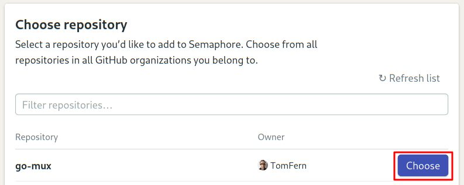
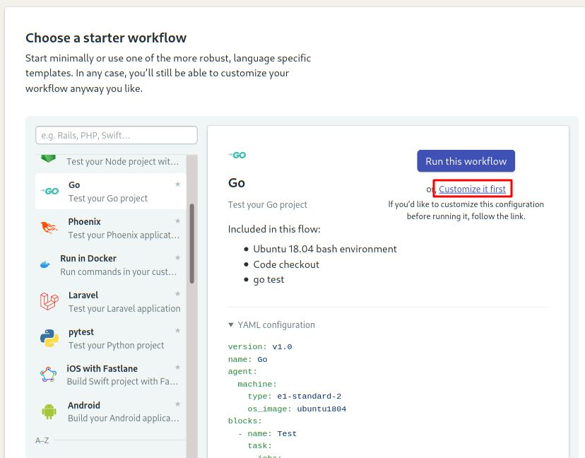
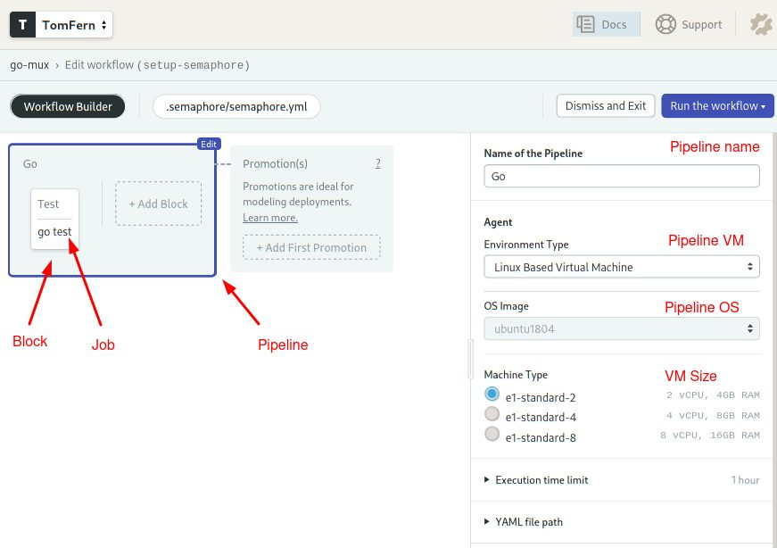
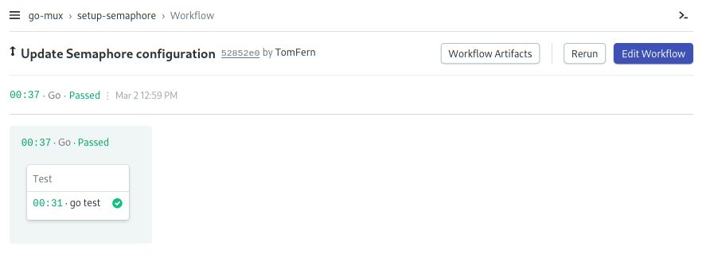
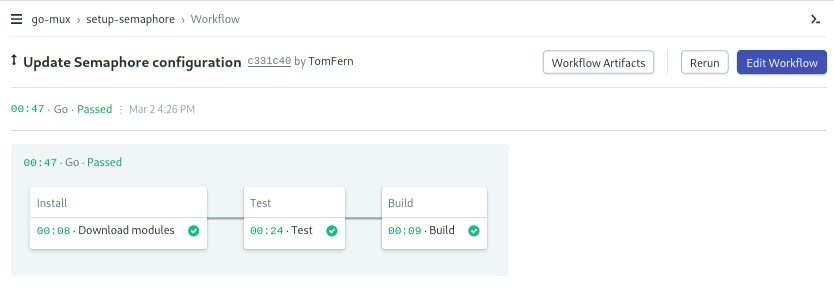
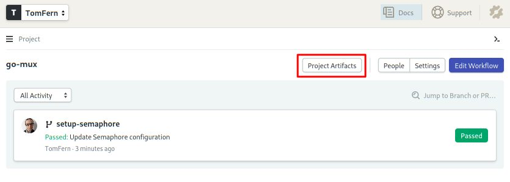

---
title: Building and Testing a REST API in Go with Gorilla Mux and PostgreSQL
author-meta: Kulshekhar Kabra
subtitle: semaphoreci.com
rights:  Creative Commmons Attribution-NonCommercialNoDerivatives 4.0 International
language: en-US
...


This tutorial will illustrate how you can build a REST API backed by  PostgreSQL in Go, using Gorilla Mux for routing. The tutorial will  employ [test-driven development](https://semaphoreci.com/blog/test-driven-development) and will conclude by explaining how you can [continuously test](https://semaphoreci.com/blog/automated-testing-cicd) against a database during development.

## Goals

By the end of this tutorial, you will:

-   Become familiar with Gorilla Mux, and
-   Learn how to test your application against a database with [Continuous Integration](https://semaphoreci.com/continuous-integration) (CI).

## Prerequisites

This tutorial assumes:

-   Basic familiarity with Go and PostgreSQL, and
-   That you have working Go and PostgreSQL installations. You can use Docker to run a test database easily.

You’ll find the complete code for the demo at [this repository](https://github.com/TomFern/go-mux-api). 


[TomFern](https://github.com/TomFern) / [go-mux-api](https://github.com/TomFern/go-mux-api)

## Introduction to the Application

Before we dive into the details, let’s take a brief look at the sample application we will be building as part of this tutorial.

## What Will the Application Do?

The application will be a simple REST API server that will expose  endpoints to allow accessing and manipulating ‘products’. The operations that our endpoint will allow include:

-   **Creating** a new product,
-   **Updating** an existing product,
-   **Deleting** an existing product,
-   **Fetching** an existing product, and
-   Fetching a **list** of products.

## API Specification

In concrete terms, our application should:

-   **Create** a new product in response to a valid POST request at `/product`,
-   **Update** a product in response to a valid PUT request at `/product/{id}`,
-   **Delete** a product in response to a valid DELETE request at `/product/{id}`,
-   **Fetch** a product in response to a valid GET request at `/product/{id}`, and
-   Fetch a **list** of products in response to a valid GET request at `/products`.

The `{id}` in some of the endpoints above will determine which product the request will work with.

With these requirements in place, let’s begin designing our application.

## Creating the Application Structure

In this section, we will create the minimal application structure  which will serve as the starting point to write tests and develop the  application further.

## Creating the Database Structure

In this simple application, we will have a single table named `products`. This table will have the following fields:

-   `id` – the primary key in this table,
-   `name` – the name of the product and,
-   `price` – the price of the product.

We can use the following SQL statement to create the table:

```sql
CREATE TABLE products
(
    id SERIAL,
    name TEXT NOT NULL,
    price NUMERIC(10,2) NOT NULL DEFAULT 0.00,
    CONSTRAINT products_pkey PRIMARY KEY (id)
)
```

This is a minimal and very simplistic table but it should be adequate to help achieve the goals of this tutorial.

## Fetching Dependencies

Before we begin writing our application, we need to fetch two packages that our application will depend on:

1.  `mux` – The Gorilla Mux router (also known as “”HTTP request multiplexer””, which makes Gorilla one of the most powerful [Go libraries](https://www.scnsoft.com/services/golang)) and,
2.  `pq` – The PostgreSQL driver.

Before doing that, let’s create a repository in GitHub to store our code:

-   Head over to [GitHub](https://github.com) and login or signup.
-   Create a [new repository](https://github.com/new).
-   Select **Go** as the language
-   Get the repository address by clicking on **Clone or download**.
-   Clone the repository to your machine:

```bash
$ git clone YOUR_REPO_URL
$ cd YOUR_REPO_DIRECTORY
```

Initialize the Go modules with your GitHub repository address:

```bash
$ go mod init github.com/<your GitHub username>/<project name>
```

You can fetch the Go modules using the following commands.

```bash
$ go get -u github.com/gorilla/mux 
$ go get -u github.com/lib/pq
```

If you use some other mechanism to vendor external dependencies, feel free to fetch and organize these dependencies in a manner that suits  you. For instance, in the [Go reference docs](https://docs.semaphoreci.com/programming-languages/go/) you’ll find an example for using [dep](https://github.com/golang/dep).

## Scaffolding a Minimal Application

Before we can write tests, we need to create a minimal application  that can be used as the basis for the tests. By the time we’re done with the tutorial, we’ll have the following file structure.

```
┌── app.go
├── main.go
├── main_test.go
├── model.go
├── go.sum
└── go.mod
```

Let’s begin by defining a struct, `App`, to hold our application:

```go
type App struct {
	Router *mux.Router
	DB     *sql.DB
}
```

This struct exposes references to the router and the database that the application uses. To be useful and testable, `App` will need two methods that initialize and run the application.

These methods will have the following signature:

```go
func (a *App) Initialize(user, password, dbname string) { }

func (a *App) Run(addr string) { }
```

The `Initialize` method will take in the details required  to connect to the database. It will create a database connection and  wire up the routes to respond according to the requirements.

The `Run` method will simply start the application.

We’ll put this in `app.go` which should, at this stage, contain the following:

```go
// app.go

package main

import (
	"database/sql"

	"github.com/gorilla/mux"
	_ "github.com/lib/pq"
)

type App struct {
	Router *mux.Router
	DB     *sql.DB
}

func (a *App) Initialize(user, password, dbname string) { }

func (a *App) Run(addr string) { }
```

Note that we have imported `pq` here because we need our application to work with PostgreSQL.

We’ll also create `main.go` which will contain the entry point for our application. It should contain the following code:

```go
// main.go

package main

import "os"

func main() {
	a := App{}
	a.Initialize(
		os.Getenv("APP_DB_USERNAME"),
		os.Getenv("APP_DB_PASSWORD"),
		os.Getenv("APP_DB_NAME"))

	a.Run(":8010")
}
```

This assumes that you use environment variables `APP_DB_USERNAME`, `APP_DB_PASSWORD`, and `APP_DB_NAME` to store your database’s username, password, and name respectively.

We’re going to use PostgreSQL default parameters for the purposes of testing:

```bash
export APP_DB_USERNAME=postgres
export APP_DB_PASSWORD=
export APP_DB_NAME=postgres
```

We also need another struct to represent the ‘product’. Let’s define it as follows:

```go
type product struct {
    ID    int     `json:"id"`
    Name  string  `json:"name"`
    Price float64 `json:"price"`
}
```

We can define functions that deal with a single product as methods on this struct, as follows:

```go
func (p *product) getProduct(db *sql.DB) error {
  return errors.New("Not implemented")
}

func (p *product) updateProduct(db *sql.DB) error {
  return errors.New("Not implemented")
}

func (p *product) deleteProduct(db *sql.DB) error {
  return errors.New("Not implemented")
}

func (p *product) createProduct(db *sql.DB) error {
  return errors.New("Not implemented")
}
```

We will also define a standalone function that fetches a list of products, as follows:

```go
func getProducts(db *sql.DB, start, count int) ([]product, error) {
  return nil, errors.New("Not implemented")
}
```

Combining all the above code into a single file, `model.go`, you should have something similar to the following:

```go
// model.go

package main

import (
    "database/sql"
    "errors"
)


type product struct {
    ID    int     `json:"id"`
    Name  string  `json:"name"`
    Price float64 `json:"price"`
}

func (p *product) getProduct(db *sql.DB) error {
  return errors.New("Not implemented")
}

func (p *product) updateProduct(db *sql.DB) error {
  return errors.New("Not implemented")
}

func (p *product) deleteProduct(db *sql.DB) error {
  return errors.New("Not implemented")
}

func (p *product) createProduct(db *sql.DB) error {
  return errors.New("Not implemented")
}

func getProducts(db *sql.DB, start, count int) ([]product, error) {
  return nil, errors.New("Not implemented")
}
```

With this, we are now well placed to begin writing tests.

## Writing Tests Based on the API and Application Requirements

In this section, we will write tests based on the requirements we laid out earlier.

## Setting Up and Cleaning Up the Test Database

Given that we will be running tests against a database, we need to  ensure that the database is properly set up before any tests are run and is cleaned up after all tests have been finished. We will do this in  the `TestMain` function which is executed before all other tests, as follows. We’ll assume that the `a` variable references the main application:

```go
func TestMain(m *testing.M) {
    a.Initialize(
        os.Getenv("APP_DB_USERNAME"),
        os.Getenv("APP_DB_PASSWORD"),
        os.Getenv("APP_DB_NAME"))

    ensureTableExists()
    code := m.Run()
    clearTable()
    os.Exit(code)
}
```

We define a global variable `a` that will represent the application we want to test. 

After initializing the application, we use the `ensureTableExists` function to make sure that the table we need for testing is available.  This function can be defined as follows. This function requires  importing the `log` module:

```go
func ensureTableExists() {
	if _, err := a.DB.Exec(tableCreationQuery); err != nil {
		log.Fatal(err)
	}
}
```

`tableCreationQuery` is a constant, defined as follows:

```go
const tableCreationQuery = `CREATE TABLE IF NOT EXISTS products
(
    id SERIAL,
    name TEXT NOT NULL,
    price NUMERIC(10,2) NOT NULL DEFAULT 0.00,
    CONSTRAINT products_pkey PRIMARY KEY (id)
)`
```

All the tests are executed by calling `m.Run()` after which we call `clearTable()` to clean the database up. This function can be defined as follows:

```go
func clearTable() {
	a.DB.Exec("DELETE FROM products")
	a.DB.Exec("ALTER SEQUENCE products_id_seq RESTART WITH 1")
}
```

At this stage, `main_test.go` should contain the  following. Note that you need to reference your module name in this  file, so replace the last import as needed.

```go
// main_test.go
package main_test
 
import (
     "os"
     "testing"
     "log"
     "net/http"
     "net/http/httptest"
     "strconv"
     "encoding/json"
     "bytes"
     "github.com/<github username>/<project name>"
 )

var a main.App

func TestMain(m *testing.M) {
    a.Initialize(
        os.Getenv("APP_DB_USERNAME"),
        os.Getenv("APP_DB_PASSWORD"),
        os.Getenv("APP_DB_NAME"))

    ensureTableExists()
    code := m.Run()
    clearTable()
    os.Exit(code)
}

func ensureTableExists() {
    if _, err := a.DB.Exec(tableCreationQuery); err != nil {
        log.Fatal(err)
    }
}

func clearTable() {
    a.DB.Exec("DELETE FROM products")
    a.DB.Exec("ALTER SEQUENCE products_id_seq RESTART WITH 1")
}

const tableCreationQuery = `CREATE TABLE IF NOT EXISTS products
(
    id SERIAL,
    name TEXT NOT NULL,
    price NUMERIC(10,2) NOT NULL DEFAULT 0.00,
    CONSTRAINT products_pkey PRIMARY KEY (id)
)`
```

In order to run the tests, we need to implement the `Initialize` method of App in `app.go`, to establish a connection with the database and initialize the router. 

Replace the empty `Initialize` function in `app.go` with the following code:

```go
func (a *App) Initialize(user, password, dbname string) {
    connectionString :=
        fmt.Sprintf("user=%s password=%s dbname=%s sslmode=disable", 
                        user, password, dbname)

    var err error
    a.DB, err = sql.Open("postgres", connectionString)
    if err != nil {
        log.Fatal(err)
    }

    a.Router = mux.NewRouter()  
}
```

>   **Note**: Unless your editor/IDE is set up to auto import the required dependencies, you will have to manually add the `fmt` and `log` packages to the list of imports.

The current `app.go` should look like this:

```go
// app.go

package main

import (
    "database/sql"
    "fmt"
    "log"

    "github.com/gorilla/mux"
    _ "github.com/lib/pq"
)

type App struct {
    Router *mux.Router
    DB     *sql.DB
}

func (a *App) Initialize(user, password, dbname string) {
    connectionString :=
        fmt.Sprintf("user=%s password=%s dbname=%s sslmode=disable", user, password, dbname)

    var err error
    a.DB, err = sql.Open("postgres", connectionString)
    if err != nil {
        log.Fatal(err)
    }

    a.Router = mux.NewRouter()
}

func (a *App) Run(addr string) { }
```

At this stage, while we don’t have any tests, we should be able to run `go test` on our application without encountering any runtime errors. 

Before running the test for the first time, ensure you have a running instance of PostgreSQL. The easiest way of starting a test database   instance is with Docker:

```bash
$ docker run -it -p 5432:5432 -d postgres
```

In your project directory, execute the following command: 

```bash
$ go test -v
```

>   **Note**: As  mentioned earlier, we have assumed that the access details for the  database are set up in the aforementioned environment variables.

Executing this command should result in something like the following:

```bash
testing: warning: no tests to run
PASS
ok      github.com/tomfern/go-mux       0.012s
```

## Writing Tests for the API

Let’s start by testing the response to the `/products` endpoint with an empty table. This test can be implemented as follows. We’ll have to add the `net/http` module for it to work:

```go
func TestEmptyTable(t *testing.T) {
    clearTable()

    req, _ := http.NewRequest("GET", "/products", nil)
    response := executeRequest(req)

    checkResponseCode(t, http.StatusOK, response.Code)

    if body := response.Body.String(); body != "[]" {
        t.Errorf("Expected an empty array. Got %s", body)
    }
}
```

This test deletes all records from the `products` table and sends a `GET` request to the `/products` endpoint. We use the `executeRequest` function to execute the request. We then use the `checkResponseCode` function to test that the HTTP response code is what we expect.  Finally, we check the body of the response and test that it is the  textual representation of an empty array.

The `executeRequest` function can be implemented as follows. This one requires the `net/httptest` module:

```go
func executeRequest(req *http.Request) *httptest.ResponseRecorder {
    rr := httptest.NewRecorder()
    a.Router.ServeHTTP(rr, req)

    return rr
}
```

This function executes the request using the application’s router and returns the response.

The `checkResponseCode` function can be implemented as follows:

```go
func checkResponseCode(t *testing.T, expected, actual int) {
    if expected != actual {
        t.Errorf("Expected response code %d. Got %d\n", expected, actual)
    }
}
```

If you run the tests again now, you should get something like the following:

```bash
$ go test -v 

=== RUN   TestEmptyTable
--- FAIL: TestEmptyTable (0.01s)
    main_test.go:73: Expected response code 200. Got 404
    main_test.go:58: Expected an empty array. Got 404 page not found
FAIL
exit status 1
FAIL    github.com/tomfern/go-mux       0.015s
```

As expected, the test fails because we haven’t implemented anything yet.

We can implement the rest of the tests in a manner similar to the above test.

**1. Fetch a Non-existent Product**

The test to check the response when fetching a nonexistent product can be implemented as follows. This function requires the `encoding/json` module:

```go
func TestGetNonExistentProduct(t *testing.T) {
    clearTable()

    req, _ := http.NewRequest("GET", "/product/11", nil)
    response := executeRequest(req)

    checkResponseCode(t, http.StatusNotFound, response.Code)

    var m map[string]string
    json.Unmarshal(response.Body.Bytes(), &m)
    if m["error"] != "Product not found" {
        t.Errorf("Expected the 'error' key of the response to be set to 'Product not found'. Got '%s'", m["error"])
    }
}
```

This test tries to access a non-existent product at an endpoint and tests two things:

-   That the status code is 404, indicating that the product was not found, and
-   That the response contains an error with the message “Product not found”.

**2. Create a Product**

The test to create a product can be implemented as follows. We’ll need the `bytes` module for it:

```go
func TestCreateProduct(t *testing.T) {

    clearTable()

    var jsonStr = []byte(`{"name":"test product", "price": 11.22}`)
    req, _ := http.NewRequest("POST", "/product", bytes.NewBuffer(jsonStr))
    req.Header.Set("Content-Type", "application/json")

    response := executeRequest(req)
    checkResponseCode(t, http.StatusCreated, response.Code)

    var m map[string]interface{}
    json.Unmarshal(response.Body.Bytes(), &m)

    if m["name"] != "test product" {
        t.Errorf("Expected name = 'test product'. Got '%v'", m["name"])
    }

    if m["price"] != 11.22 {
        t.Errorf("Expected price = '11.22'. Got '%v'", m["price"])
    }

    // the id is compared to 1.0 because JSON unmarshaling converts numbers to
    // floats, when the target is a map[string]interface{}
    if m["id"] != 1.0 {
        t.Errorf("Expected ID = '1'. Got '%v'", m["id"])
    }
}
```

In this test, we manually add a product to the database and then  access the relevant endpoint to fetch that product. We then test the  following things:

-   That the HTTP response has the status code of 201, indicating that a resource was created, and
-   That the response contained a JSON object with contents identical to that of the payload.

**3. Fetch a Product**

The test to fetch a product can be implemented as follows:

```go
func TestGetProduct(t *testing.T) {
    clearTable()
    addProducts(1)

    req, _ := http.NewRequest("GET", "/product/1", nil)
    response := executeRequest(req)

    checkResponseCode(t, http.StatusOK, response.Code)
}
```

This test simply adds a product to the table and tests that accessing the relevant endpoint results in an HTTP response that denotes success  with status code 200.

In this test, we use the `addProducts` function which is  used to add one or more records into the table for testing. This  function can be implemented as follows. It’ll require the `strconv` module:

```go
func addProducts(count int) {
    if count < 1 {
        count = 1
    }

    for i := 0; i < count; i++ {
        a.DB.Exec("INSERT INTO products(name, price) 
             VALUES($1, $2)", "Product "+strconv.Itoa(i), (i+1.0)*10)
    }
}
```

**4. Update a Product**

The test to update a product can be implemented as follows:

```go
func TestUpdateProduct(t *testing.T) {

    clearTable()
    addProducts(1)

    req, _ := http.NewRequest("GET", "/product/1", nil)
    response := executeRequest(req)
    var originalProduct map[string]interface{}
    json.Unmarshal(response.Body.Bytes(), &originalProduct)

    var jsonStr = []byte(`{"name":"test product - updated name", "price": 11.22}`)
    req, _ = http.NewRequest("PUT", "/product/1", bytes.NewBuffer(jsonStr))
    req.Header.Set("Content-Type", "application/json")

    response = executeRequest(req)

    checkResponseCode(t, http.StatusOK, response.Code)

    var m map[string]interface{}
    json.Unmarshal(response.Body.Bytes(), &m)

    if m["id"] != originalProduct["id"] {
        t.Errorf("Expected the id to remain the same (%v). 
         Got %v", originalProduct["id"], m["id"])
    }

    if m["name"] == originalProduct["name"] {
        t.Errorf("Expected the name to change from '%v' to '%v'.
         Got '%v'", originalProduct["name"], m["name"], m["name"])
    }

    if m["price"] == originalProduct["price"] {
        t.Errorf("Expected the price to change from '%v' to '%v'. 
        Got '%v'", originalProduct["price"], m["price"], m["price"])
    }
}
```

This test begins by adding a product to the database directly. It  then uses the end point to update this record with new details. We  finally test the following things:

-   That the status code is 200, indicating success, and
-   That the response contains the JSON representation of the product with the updated details.

**5. Delete a Product**

The test to delete a product can be implemented as follows:

```go
func TestDeleteProduct(t *testing.T) {
    clearTable()
    addProducts(1)

    req, _ := http.NewRequest("GET", "/product/1", nil)
    response := executeRequest(req)
    checkResponseCode(t, http.StatusOK, response.Code)

    req, _ = http.NewRequest("DELETE", "/product/1", nil)
    response = executeRequest(req)

    checkResponseCode(t, http.StatusOK, response.Code)

    req, _ = http.NewRequest("GET", "/product/1", nil)
    response = executeRequest(req)
    checkResponseCode(t, http.StatusNotFound, response.Code)
}
```

In this test, we first create a product and test that it exists. We  then use the endpoint to delete the product. Finally we try to access  the product at the appropriate endpoint and test that it doesn’t exist.

At this point, `main_test.go` should look like this:

```go
// main_test.go

package main

import (
    "os"
    "testing"   
    "log"

    "net/http"
    "net/http/httptest"
    "bytes"
    "encoding/json"
    "strconv"
)

var a App

func TestMain(m *testing.M) {
    a.Initialize(
        os.Getenv("APP_DB_USERNAME"),
        os.Getenv("APP_DB_PASSWORD"),
        os.Getenv("APP_DB_NAME"))

    ensureTableExists()
    code := m.Run()
    clearTable()
    os.Exit(code)
}

func ensureTableExists() {
    if _, err := a.DB.Exec(tableCreationQuery); err != nil {
        log.Fatal(err)
    }
}

func clearTable() {
    a.DB.Exec("DELETE FROM products")
    a.DB.Exec("ALTER SEQUENCE products_id_seq RESTART WITH 1")
}

const tableCreationQuery = `CREATE TABLE IF NOT EXISTS products
(
    id SERIAL,
    name TEXT NOT NULL,
    price NUMERIC(10,2) NOT NULL DEFAULT 0.00,
    CONSTRAINT products_pkey PRIMARY KEY (id)
)`


func TestEmptyTable(t *testing.T) {
    clearTable()

    req, _ := http.NewRequest("GET", "/products", nil)
    response := executeRequest(req)

    checkResponseCode(t, http.StatusOK, response.Code)

    if body := response.Body.String(); body != "[]" {
        t.Errorf("Expected an empty array. Got %s", body)
    }
}


func executeRequest(req *http.Request) *httptest.ResponseRecorder {
    rr := httptest.NewRecorder()
    a.Router.ServeHTTP(rr, req)

    return rr
}


func checkResponseCode(t *testing.T, expected, actual int) {
    if expected != actual {
        t.Errorf("Expected response code %d. Got %d\n", expected, actual)
    }
}


func TestGetNonExistentProduct(t *testing.T) {
    clearTable()

    req, _ := http.NewRequest("GET", "/product/11", nil)
    response := executeRequest(req)

    checkResponseCode(t, http.StatusNotFound, response.Code)

    var m map[string]string
    json.Unmarshal(response.Body.Bytes(), &m)
    if m["error"] != "Product not found" {
        t.Errorf("Expected the 'error' key of the response
              to be set to 'Product not found'. Got '%s'", m["error"])
    }
}


func TestCreateProduct(t *testing.T) {

    clearTable()

    var jsonStr = []byte(`{"name":"test product", "price": 11.22}`)
    req, _ := http.NewRequest("POST", "/product", bytes.NewBuffer(jsonStr))
    req.Header.Set("Content-Type", "application/json")

    response := executeRequest(req)
    checkResponseCode(t, http.StatusCreated, response.Code)

    var m map[string]interface{}
    json.Unmarshal(response.Body.Bytes(), &m)

    if m["name"] != "test product" {
        t.Errorf("Expected product name to be 'test product'. 
                  Got '%v'", m["name"])
    }

    if m["price"] != 11.22 {
        t.Errorf("Expected product price to be '11.22'. 
                  Got '%v'", m["price"])
    }

    // the id is compared to 1.0 because JSON unmarshaling converts numbers to
    // floats, when the target is a map[string]interface{}
    if m["id"] != 1.0 {
        t.Errorf("Expected product ID to be '1'. 
                  Got '%v'", m["id"])
    }
}


func TestGetProduct(t *testing.T) {
    clearTable()
    addProducts(1)

    req, _ := http.NewRequest("GET", "/product/1", nil)
    response := executeRequest(req)

    checkResponseCode(t, http.StatusOK, response.Code)
}

// main_test.go

func addProducts(count int) {
    if count < 1 {
        count = 1
    }

    for i := 0; i < count; i++ {
        a.DB.Exec("INSERT INTO products(name, price) VALUES($1, $2)", 
                  "Product "+strconv.Itoa(i), (i+1.0)*10)
    }
}


func TestUpdateProduct(t *testing.T) {

    clearTable()
    addProducts(1)

    req, _ := http.NewRequest("GET", "/product/1", nil)
    response := executeRequest(req)
    var originalProduct map[string]interface{}
    json.Unmarshal(response.Body.Bytes(), &originalProduct)

    var jsonStr = []byte(`{"name":"test product - updated name", "price": 11.22}`)
    req, _ = http.NewRequest("PUT", "/product/1", bytes.NewBuffer(jsonStr))
    req.Header.Set("Content-Type", "application/json")

    response = executeRequest(req)

    checkResponseCode(t, http.StatusOK, response.Code)

    var m map[string]interface{}
    json.Unmarshal(response.Body.Bytes(), &m)

    if m["id"] != originalProduct["id"] {
        t.Errorf("Expected the id to remain the same (%v). 
                  Got %v", originalProduct["id"], m["id"])
    }

    if m["name"] == originalProduct["name"] {
        t.Errorf("Expected the name to change from '%v' to '%v'. 
                  Got '%v'", originalProduct["name"], m["name"], m["name"])
    }

    if m["price"] == originalProduct["price"] {
        t.Errorf("Expected the price to change from '%v' to '%v'. 
                  Got '%v'", originalProduct["price"], m["price"], m["price"])
    }
}


func TestDeleteProduct(t *testing.T) {
    clearTable()
    addProducts(1)

    req, _ := http.NewRequest("GET", "/product/1", nil)
    response := executeRequest(req)
    checkResponseCode(t, http.StatusOK, response.Code)

    req, _ = http.NewRequest("DELETE", "/product/1", nil)
    response = executeRequest(req)

    checkResponseCode(t, http.StatusOK, response.Code)

    req, _ = http.NewRequest("GET", "/product/1", nil)
    response = executeRequest(req)
    checkResponseCode(t, http.StatusNotFound, response.Code)
}
```

If you now run `go test -v` in your project directory, you should get a response similar to the following:

```bash
$ go test -v

=== RUN   TestEmptyTable
--- FAIL: TestEmptyTable (0.01s)
    main_test.go:75: Expected response code 200. Got 404
    main_test.go:60: Expected an empty array. Got 404 page not found
=== RUN   TestGetNonExistentProduct
--- FAIL: TestGetNonExistentProduct (0.00s)
    main_test.go:91: Expected the 'error' key of the response 
                     to be set to 'Product not found'. Got ''
=== RUN   TestCreateProduct
--- FAIL: TestCreateProduct (0.00s)
    main_test.go:75: Expected response code 201. Got 404
    main_test.go:111: Expected product name to be 'test product'. 
                      Got '<nil>'
    main_test.go:115: Expected product price to be '11.22'. 
                      Got '<nil>'
    main_test.go:121: Expected product ID to be '1'. Got '<nil>'
=== RUN   TestGetProduct
--- FAIL: TestGetProduct (0.01s)
    main_test.go:75: Expected response code 200. Got 404
=== RUN   TestUpdateProduct
--- FAIL: TestUpdateProduct (0.01s)
    main_test.go:75: Expected response code 200. Got 404
    main_test.go:175: Expected the name to change from '<nil>' to '<nil>'. Got '<nil>'
    main_test.go:179: Expected the price to change from '<nil>' to '<nil>'. Got '<nil>'
=== RUN   TestDeleteProduct
--- FAIL: TestDeleteProduct (0.01s)
    main_test.go:75: Expected response code 200. Got 404
    main_test.go:75: Expected response code 200. Got 404
FAIL
exit status 1
FAIL    github.com/tomfern/go-mux       0.066s
```

At this stage, all of our tests fail because we haven’t implemented  anything yet. However, with our tests now in place, we can start  implementing the required functionality in our application.

## Adding Application Functionality

In this section, we will complete our application to satisfy the specifications and tests.

### Implementing Database Queries

We’ll begin by implementing the methods on `product`. The  implementation is relatively straightforward and just includes issuing  queries and returning the results. These methods can be implemented as  follows in `model.go`:

```go
func (p *product) getProduct(db *sql.DB) error {
    return db.QueryRow("SELECT name, price FROM products WHERE id=$1",
        p.ID).Scan(&p.Name, &p.Price)
}

func (p *product) updateProduct(db *sql.DB) error {
    _, err :=
        db.Exec("UPDATE products SET name=$1, price=$2 WHERE id=$3",
            p.Name, p.Price, p.ID)

    return err
}

func (p *product) deleteProduct(db *sql.DB) error {
    _, err := db.Exec("DELETE FROM products WHERE id=$1", p.ID)

    return err
}

func (p *product) createProduct(db *sql.DB) error {
    err := db.QueryRow(
        "INSERT INTO products(name, price) VALUES($1, $2) RETURNING id",
        p.Name, p.Price).Scan(&p.ID)

    if err != nil {
        return err
    }

    return nil
}
```

Let’s also implement the `getProducts` function as follows:

```go
func getProducts(db *sql.DB, start, count int) ([]product, error) {
    rows, err := db.Query(
        "SELECT id, name,  price FROM products LIMIT $1 OFFSET $2",
        count, start)

    if err != nil {
        return nil, err
    }

    defer rows.Close()

    products := []product{}

    for rows.Next() {
        var p product
        if err := rows.Scan(&p.ID, &p.Name, &p.Price); err != nil {
            return nil, err
        }
        products = append(products, p)
    }

    return products, nil
}
```

This function fetches records from the `products` table. It limits the number of records based on the `count` parameter. The `start` parameter determines how many records are skipped at the beginning.  This comes in handy in case you have a lot of records and want to page  through them.

>   **Note**: Unless your editor/IDE is set up to manage the dependencies, you will have to manually remove the `errors` package from the list of imports in `model.go`.

Once the edits are complete, you should find `model.go` like this:

```go
// model.go

package main

import (
    "database/sql"
)

type product struct {
    ID    int     `json:"id"`
    Name  string  `json:"name"`
    Price float64 `json:"price"`
}

func (p *product) getProduct(db *sql.DB) error {
    return db.QueryRow("SELECT name, price FROM products WHERE id=$1",
        p.ID).Scan(&p.Name, &p.Price)
}

func (p *product) updateProduct(db *sql.DB) error {
    _, err :=
        db.Exec("UPDATE products SET name=$1, price=$2 WHERE id=$3",
            p.Name, p.Price, p.ID)

    return err
}

func (p *product) deleteProduct(db *sql.DB) error {
    _, err := db.Exec("DELETE FROM products WHERE id=$1", p.ID)

    return err
}

func (p *product) createProduct(db *sql.DB) error {
    err := db.QueryRow(
        "INSERT INTO products(name, price) VALUES($1, $2) RETURNING id",
        p.Name, p.Price).Scan(&p.ID)

    if err != nil {
        return err
    }

    return nil
}

func getProducts(db *sql.DB, start, count int) ([]product, error) {
    rows, err := db.Query(
        "SELECT id, name,  price FROM products LIMIT $1 OFFSET $2",
        count, start)

    if err != nil {
        return nil, err
    }

    defer rows.Close()

    products := []product{}

    for rows.Next() {
        var p product
        if err := rows.Scan(&p.ID, &p.Name, &p.Price); err != nil {
            return nil, err
        }
        products = append(products, p)
    }

    return products, nil
}
```

## Creating Routes and Route Handlers

Let’s begin by creating the handler, `getProduct`, for the route that fetches a single product. This handler can be implemented as follows in `app.go`:

```go
func (a *App) getProduct(w http.ResponseWriter, r *http.Request) {
    vars := mux.Vars(r)
    id, err := strconv.Atoi(vars["id"])
    if err != nil {
        respondWithError(w, http.StatusBadRequest, "Invalid product ID")
        return
    }

    p := product{ID: id}
    if err := p.getProduct(a.DB); err != nil {
        switch err {
        case sql.ErrNoRows:
            respondWithError(w, http.StatusNotFound, "Product not found")
        default:
            respondWithError(w, http.StatusInternalServerError, err.Error())
        }
        return
    }

    respondWithJSON(w, http.StatusOK, p)
}
```

You’ll need to add `net/http` and `strconv` modules to `app.go`.

This handler retrieves the `id` of the product to be fetched from the requested URL, and uses the `getProduct` method, created in the previous section, to fetch the details of that product.

If the product is not found, the handler responds with a status code of `404`, indicating that the requested resource could not be found. If the product is found, the handler responds with the product.

This method uses `respondWithError` and `respondWithJSON` functions to process errors and normal responses. These functions can be implemented as follows. They require encoding/json:

```go
func respondWithError(w http.ResponseWriter, code int, message string) {
    respondWithJSON(w, code, map[string]string{"error": message})
}

func respondWithJSON(w http.ResponseWriter, code int, payload interface{}) {
    response, _ := json.Marshal(payload)

    w.Header().Set("Content-Type", "application/json")
    w.WriteHeader(code)
    w.Write(response)
}
```

We can implement the rest of the handlers in a similar manner.

**1. A handler to fetch a list of products**

This handler can be implemented as follows in `app.go`: 

```go
func (a *App) getProducts(w http.ResponseWriter, r *http.Request) {
    count, _ := strconv.Atoi(r.FormValue("count"))
    start, _ := strconv.Atoi(r.FormValue("start"))

    if count > 10 || count < 1 {
        count = 10
    }
    if start < 0 {
        start = 0
    }

    products, err := getProducts(a.DB, start, count)
    if err != nil {
        respondWithError(w, http.StatusInternalServerError, err.Error())
        return
    }

    respondWithJSON(w, http.StatusOK, products)
}
```

This handler uses the `count` and `start` parameters from the querystring to fetch `count` number of products, starting at position `start` in the database. By default, `start` is set to `0` and `count` is set to 10. If these parameters aren’t provided, this handler will respond with the first 10 products.

**2. A handler to create a product**

This handler can be implemented as follows:

```go
func (a *App) createProduct(w http.ResponseWriter, r *http.Request) {
    var p product
    decoder := json.NewDecoder(r.Body)
    if err := decoder.Decode(&p); err != nil {
        respondWithError(w, http.StatusBadRequest, "Invalid request payload")
        return
    }
    defer r.Body.Close()

    if err := p.createProduct(a.DB); err != nil {
        respondWithError(w, http.StatusInternalServerError, err.Error())
        return
    }

    respondWithJSON(w, http.StatusCreated, p)
}
```

This handler assumes that the request body is a JSON object  containing the details of the product to be created. It extracts that  object into a `product` and uses the `createProduct` method to create a product with these details.

**3. A handler to update a product**

This handler can be implemented as follows:

```go
func (a *App) updateProduct(w http.ResponseWriter, r *http.Request) {
    vars := mux.Vars(r)
    id, err := strconv.Atoi(vars["id"])
    if err != nil {
        respondWithError(w, http.StatusBadRequest, "Invalid product ID")
        return
    }

    var p product
    decoder := json.NewDecoder(r.Body)
    if err := decoder.Decode(&p); err != nil {
        respondWithError(w, http.StatusBadRequest, "Invalid resquest payload")
        return
    }
    defer r.Body.Close()
    p.ID = id

    if err := p.updateProduct(a.DB); err != nil {
        respondWithError(w, http.StatusInternalServerError, err.Error())
        return
    }

    respondWithJSON(w, http.StatusOK, p)
}
```

Similar to the previous handler, this handler extracts the product details from the request body. It also extracts the `id` from the URL and uses the `id` and the body to update the product in the database.

**4. A handler to delete a product**

This handler can be implemented as follows:

```go
func (a *App) deleteProduct(w http.ResponseWriter, r *http.Request) {
    vars := mux.Vars(r)
    id, err := strconv.Atoi(vars["id"])
    if err != nil {
        respondWithError(w, http.StatusBadRequest, "Invalid Product ID")
        return
    }

    p := product{ID: id}
    if err := p.deleteProduct(a.DB); err != nil {
        respondWithError(w, http.StatusInternalServerError, err.Error())
        return
    }

    respondWithJSON(w, http.StatusOK, map[string]string{"result": "success"})
}
```

This handler extracts the `id` from the requested URL and uses it to delete the corresponding product from the database.

With the handlers created, we can now define the routes that will use them, as follows:

```go
func (a *App) initializeRoutes() {
    a.Router.HandleFunc("/products", a.getProducts).Methods("GET")
    a.Router.HandleFunc("/product", a.createProduct).Methods("POST")
    a.Router.HandleFunc("/product/{id:[0-9]+}", a.getProduct).Methods("GET")
    a.Router.HandleFunc("/product/{id:[0-9]+}", a.updateProduct).Methods("PUT")
    a.Router.HandleFunc("/product/{id:[0-9]+}", a.deleteProduct).Methods("DELETE")
}
```

As you can see, the routes are defined based on the specification we created earlier. For example, we use the `a.getProducts` handler to handle `GET` requests at the `/products` endpoint.

Similarly, we use the `a.deleteProduct` handler to handle a `DELETE` request at the `/product/{id}` endpoint. The `{id:[0-9]+}` part of the path indicates that Gorilla Mux should treat process a URL only if the `id` is a number. For all matching requests, Gorilla Mux then stores the actual numeric value in the `id` variable. This can be accessed in the handler as seen above, in the handlers.

All that is left now is to implement the `Run` method and call `initializeRoutes` from the `Initialize` method. This can be implemented as follows:

```go
func (a *App) Initialize(user, password, dbname string) {
    connectionString :=
        fmt.Sprintf("user=%s password=%s dbname=%s sslmode=disable", 
                     user, password, dbname)

    var err error
    a.DB, err = sql.Open("postgres", connectionString)
    if err != nil {
        log.Fatal(err)
    }

    a.Router = mux.NewRouter()

    a.initializeRoutes()
}

func (a *App) Run(addr string) {
    log.Fatal(http.ListenAndServe(":8010", a.Router))
}
```

The final version of `app.go` should contain the following code:

```go
// app.go

package main

import (
    "database/sql"
    "fmt"
    "log"

    "net/http"
    "strconv"
    "encoding/json"

    "github.com/gorilla/mux"
    _ "github.com/lib/pq"
)

type App struct {
    Router *mux.Router
    DB     *sql.DB
}

func (a *App) Initialize(user, password, dbname string) {
    connectionString :=
        fmt.Sprintf("user=%s password=%s dbname=%s sslmode=disable", 
                     user, password, dbname)

    var err error
    a.DB, err = sql.Open("postgres", connectionString)
    if err != nil {
        log.Fatal(err)
    }

    a.Router = mux.NewRouter()

    a.initializeRoutes()
}

func (a *App) Run(addr string) {
    log.Fatal(http.ListenAndServe(":8010", a.Router))
}

func (a *App) getProduct(w http.ResponseWriter, r *http.Request) {
    vars := mux.Vars(r)
    id, err := strconv.Atoi(vars["id"])
    if err != nil {
        respondWithError(w, http.StatusBadRequest, "Invalid product ID")
        return
    }

    p := product{ID: id}
    if err := p.getProduct(a.DB); err != nil {
        switch err {
        case sql.ErrNoRows:
            respondWithError(w, http.StatusNotFound, "Product not found")
        default:
            respondWithError(w, http.StatusInternalServerError, err.Error())
        }
        return
    }

    respondWithJSON(w, http.StatusOK, p)
}


func respondWithError(w http.ResponseWriter, code int, message string) {
    respondWithJSON(w, code, map[string]string{"error": message})
}

func respondWithJSON(w http.ResponseWriter, code int, payload interface{}) {
    response, _ := json.Marshal(payload)

    w.Header().Set("Content-Type", "application/json")
    w.WriteHeader(code)
    w.Write(response)
}

func (a *App) getProducts(w http.ResponseWriter, r *http.Request) {
    count, _ := strconv.Atoi(r.FormValue("count"))
    start, _ := strconv.Atoi(r.FormValue("start"))

    if count > 10 || count < 1 {
        count = 10
    }
    if start < 0 {
        start = 0
    }

    products, err := getProducts(a.DB, start, count)
    if err != nil {
        respondWithError(w, http.StatusInternalServerError, err.Error())
        return
    }

    respondWithJSON(w, http.StatusOK, products)
}

func (a *App) createProduct(w http.ResponseWriter, r *http.Request) {
    var p product
    decoder := json.NewDecoder(r.Body)
    if err := decoder.Decode(&p); err != nil {
        respondWithError(w, http.StatusBadRequest, "Invalid request payload")
        return
    }
    defer r.Body.Close()

    if err := p.createProduct(a.DB); err != nil {
        respondWithError(w, http.StatusInternalServerError, err.Error())
        return
    }

    respondWithJSON(w, http.StatusCreated, p)
}


func (a *App) updateProduct(w http.ResponseWriter, r *http.Request) {
    vars := mux.Vars(r)
    id, err := strconv.Atoi(vars["id"])
    if err != nil {
        respondWithError(w, http.StatusBadRequest, "Invalid product ID")
        return
    }

    var p product
    decoder := json.NewDecoder(r.Body)
    if err := decoder.Decode(&p); err != nil {
        respondWithError(w, http.StatusBadRequest, "Invalid resquest payload")
        return
    }
    defer r.Body.Close()
    p.ID = id

    if err := p.updateProduct(a.DB); err != nil {
        respondWithError(w, http.StatusInternalServerError, err.Error())
        return
    }

    respondWithJSON(w, http.StatusOK, p)
}

func (a *App) deleteProduct(w http.ResponseWriter, r *http.Request) {
    vars := mux.Vars(r)
    id, err := strconv.Atoi(vars["id"])
    if err != nil {
        respondWithError(w, http.StatusBadRequest, "Invalid Product ID")
        return
    }

    p := product{ID: id}
    if err := p.deleteProduct(a.DB); err != nil {
        respondWithError(w, http.StatusInternalServerError, err.Error())
        return
    }

    respondWithJSON(w, http.StatusOK, map[string]string{"result": "success"})
}


func (a *App) initializeRoutes() {
    a.Router.HandleFunc("/products", a.getProducts).Methods("GET")
    a.Router.HandleFunc("/product", a.createProduct).Methods("POST")
    a.Router.HandleFunc("/product/{id:[0-9]+}", a.getProduct).Methods("GET")
    a.Router.HandleFunc("/product/{id:[0-9]+}", a.updateProduct).Methods("PUT")
    a.Router.HandleFunc("/product/{id:[0-9]+}", a.deleteProduct).Methods("DELETE")
}
```

## Running the Tests

With the application functionality implemented, we can now run the tests again:

```bash
$ go test -v
```

This should result in all tests passing, as follows:

```bash
=== RUN   TestEmptyTable
--- PASS: TestEmptyTable (0.01s)
=== RUN   TestGetNonExistentProduct
--- PASS: TestGetNonExistentProduct (0.00s)
=== RUN   TestCreateProduct
--- PASS: TestCreateProduct (0.01s)
=== RUN   TestGetProduct
--- PASS: TestGetProduct (0.01s)
=== RUN   TestUpdateProduct
--- PASS: TestUpdateProduct (0.01s)
=== RUN   TestDeleteProduct
--- PASS: TestDeleteProduct (0.01s)
PASS
ok      github.com/tomfern/go-mux       0.071s
```

## Setting Up Continuous Integration with Semaphore

[Continuous Integration](https://semaphoreci.com/continuous-integration) (CI) is a technique to speed up development cycles. By establishing a  short feedback cycle that continually tests each code update, errors can be detected as soon as they appear, teams can safely merge more often.

Continuous Integration doesn’t need to be complex or expensive to  use. In this section, we’ll learn how to set it up for free in a few  minutes with  Semaphore.

### Add Your Repository to Semaphore

To install a CI/CD [Pipeline](https://semaphoreci.com/blog/cicd-pipeline) in your repository, follow these steps:

-   Go to [Semaphore](https://semaphoreci.com) and sign up for a free account using the **Sign up with GitHub** button.
-   Click on the **+ Create new** to add your project to Semaphore.
-   Find your repository on the list and click on **Choose**:



-   Select the **Go** starter workflow and click on **Customize it first**:



When we choose to customize, Semaphore brings up the **Workflow Editor** which has the following elements:



-   **Pipeline**: A pipeline fulfills a specific  objective,  e.g testing, and organizes the execution flow. Pipelines are made of blocks that are executed from left to right.
-   **Agent**: The agent is the virtual machine that powers the pipeline. We have three [machine types](https://docs.semaphoreci.com/ci-cd-environment/machine-types/) to choose from. The machine runs an optimized [Ubuntu 18.04](https://docs.semaphoreci.com/ci-cd-environment/ubuntu-18.04-image/) image with build tools for many languages.
-   **Block**: a block is a group of similar jobs that can share commands and  configurations. Jobs within a block are executed in parallel.  Once all  jobs in a block are done, the next block begins.
-   **Job**: jobs define the commands that do the work. They inherit their config from the parent block.

We need to make a single modification to the starter workflow:

-   Click on the **Test** block.
-   On the right side, you’ll find the Job command box. Add the following line at the beginning:

```bash
sem-service start postgres
```

-   Let’s use Go version 1.16. Change the second line to: `sem-version go 1.16`
-   And load the test environment variables. Add following line after checkout: `source env-sample`

The complete job should look like:

```bash
sem-service start postgres
sem-version go 1.16
export GO111MODULE=on
export GOPATH=~/go
export PATH=/home/semaphore/go/bin:$PATH
checkout
source env-test
go get ./…
go test ./…
go build -v .
```


-   Click on **Run the Workflow** and then on **Start**:


That’s all, Semaphore will start to run the pipeline immediately:

-   Start a test PostgreSQL instance.
-   Download the Go modules.
-   Run the test code.

In a few seconds we should have the results of the tests:



### Improving the Pipeline

The starter pipeline does a good job of testing the code. However,  it’s meant as a starting point, not as a final destination. We can make  the pipeline perform and scale better with only a few modifications:

-   **Cache modules**: right now, the Go modules are re-downloaded and installed each run. We can avoid this by adding a cache.
-   **Separate blocks**:  we should split the download and the test stages into two separate  blocks. That way, when there’s an error, we can better pinpoint where is the problem.
-   **Build**: we can [compile the program in the pipeline and save it in the artifact storage](https://semaphoreci.com/blog/build-stage).

But first, let’s examine some of the built-in [commands](https://docs.semaphoreci.com/reference/toolbox-reference/) Semaphore provides:

-   **checkout**: the checkout commands clones the  correct revision of the GitHub repository and changes the directory.   It’s usually the first command in a job.
-   **sem-version**: with sem-version, we can switch the active version of a language. Semaphore fully supports many languages, including Go. 
-   **cache**: the cache commands provides read and write access to Semaphore’s cache, a project-wide storage for the jobs. 

-   **sem-service**: this tool can start several database instances and other services. Check out the [managing services ](https://docs.semaphoreci.com/ci-cd-environment/sem-service-managing-databases-and-services-on-linux/)page to find which services are supported. We can start a PostgreSQL database with a single command:

```bash
sem-service start postgres 11
```

So, let’s put these command to work:

-   Click on the **Edit Workflow** button to bring up the Workflow Editor again:

-   Change the name of the block to “Install”.

-   Change the name of the  job to “Download modules”.

-   Open the 

    Environment Variables

     section on the right. Create the following variables. These variables  tell Go to store the modules in the local directory instead of in  GOPATH.

    -   `GO111MODULE` = `on`

    -   `GOFLAGS` = `-mod=vendor`

-   Wipe out the contents of the job command box and type this:

```bash
sem-version go 1.16
checkout
cache restore
go mod vendor
cache store
```


As you can see, the first block only takes cares of downloading the modules to the `vendor/` directory (`go mod vendor`) and storing them in the cache.

The next block runs the tests:

-   Click on the **+Add Block** dotted line button to create a new block.
-   Call the block and the job “Test”.
-   Open **Environment Variables** and create `GO111MODULE` and `GOFLAGS` variables same as before.
-   Open the **Prologue** and type the following commands. The prologue is executed before each job in the block:

```bash
sem-version go 1.13
sem-service start postgres
checkout
cache restore 
go mod vendor
source env-sample
```

-   Type the following command in the command box:

```
go test ./...
```


The final block builds the Go executable:

-   Add a new block.
-   Call the block and the job “Build”.
-   Repeat the **Environment Variables** and the **Prologue** steps from the previous block.
-   Type the following command in the box. The artifact command lets us store and retrieve files in one of the project’s [artifact storage](https://docs.semaphoreci.com/essentials/artifacts/).

```bash
go build -v -o go-mux.bin
artifact push project --force go-mux.bin
```


-   Click on **Run the Workflow** and then **Start**.

The pipeline should be complete in a few minutes:



Navigate to the top level of the project to find the **Project Artifacts** button:



You should find the compiled binary there:


Good job! Now you can work on the project with the confidence that Semaphore is continually testing your code.

**NB**: Semaphore also has a neat [Test Reports](https://semaphoreci.com/blog/test-reports) feature that allows you to see which test have failed, find the slowest tests in your test suite, and find skipped tests. Read more about the  feature and how it can help your team.

## Conclusion

This tutorial illustrated how you can use Gorilla Mux and Postgres to build a REST API with Go. We also saw how you can use Semaphore to  continuously test your application against a live PostgreSQL database.

If you have any questions and comments, feel free to leave them in the section below.

### Read also:

-   [Revving up Continuous Integration with Parallel Testing](https://semaphoreci.com/blog/revving-up-continuous-integration-with-parallel-testing)
-   [20 Types of Tests Every Developer Should Know](https://semaphoreci.com/blog/20-types-of-testing-developers-should-know)
-   [[Podcast\] Mapping the World and Testing Against Reality](https://semaphoreci.com/blog/mapping-the-world-and-testing-against-reality)


\newpage

© __BUILD_YEAR__ Rendered Text. All rights reserved.

This work is licensed under Creative Commmons
Attribution-NonCommercial-NoDerivatives 4.0 International.
To view a copy of this license, visit
<https://creativecommons.org/licenses/by-nc-nd/4.0>

The source text is open source:
<https://github.com/semaphoreci/papers>

Originally published at:
<https://semaphoreci.com/community/tutorials/building-and-testing-a-rest-api-in-go-with-gorilla-mux-and-postgresql>

Original publication date: 21 Jul 2022

Authors: Kulshekhar Kabra

Editor: Marko Anastasov

Reviewed by: Tomas Fernandez

Build date: __BUILD_MONTH__ __BUILD_YEAR__

Revision: __BUILD_REVISION__

\newpage
