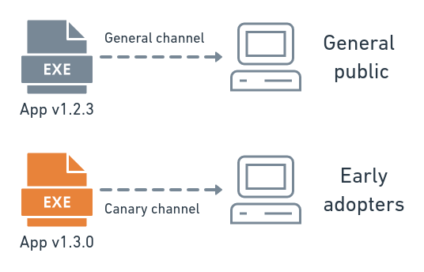
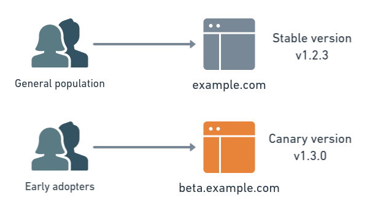
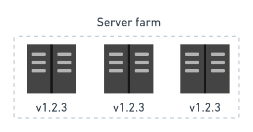
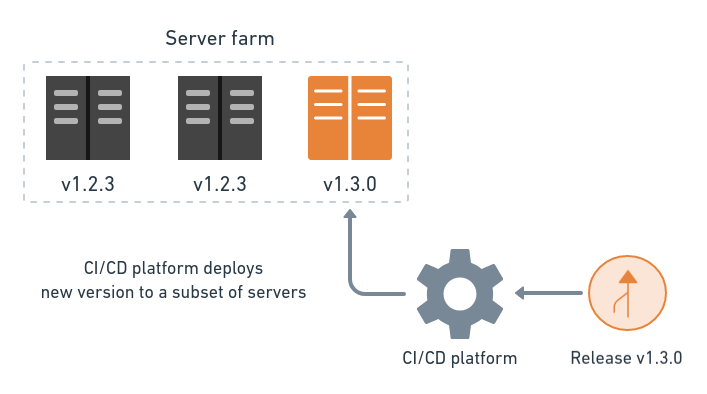
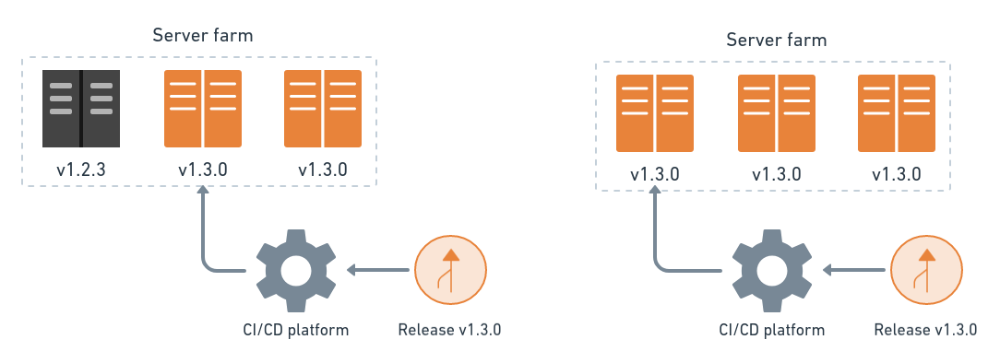
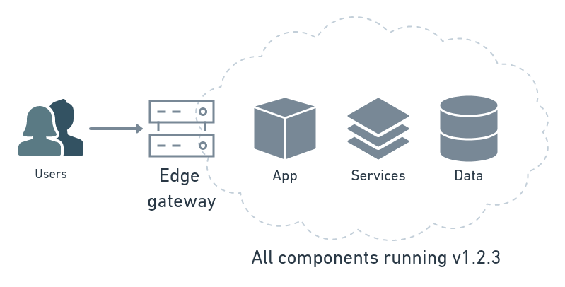
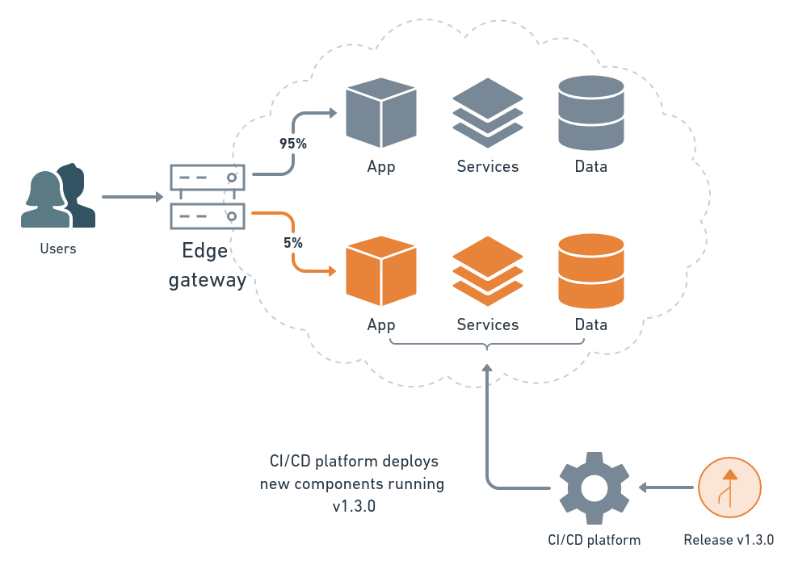
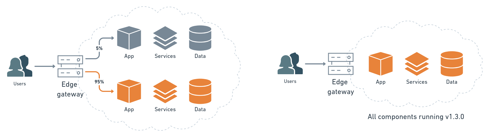
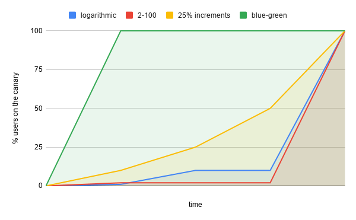

---
title: What is a Canary Deployment?
author-meta: Tomas Fernandez
subtitle: semaphoreci.com
rights:  Creative Commmons Attribution-NonCommercialNoDerivatives 4.0 International
language: en-US
...

[Continuous integration](https://semaphoreci.com/continuous-integration) has changed the way we develop software. But a CI environment is different from production, and synthetic tests are not always enough to reveal problems. Some issues only appear when they hit production, and by that time, the damage is already done. Canary deployments allow us to test the waters before jumping in.

### What Is Canary Deployment?

In software engineering, canary deployment is the practice of making staged releases. We roll out a software update to a small part of the users first, so they may test it and provide feedback. Once the change is accepted, the update is rolled out to the rest of the users.

Canary deployments show us how users interact with application changes in the real world. As in blue-green deployments, the canary strategy offers no-downtime upgrades and easy rollbacks. Unlike blue-green, canary deployments are smoother, and failures have limited impact.

### Releases vs. Deployments

A **canary release** is an early build of an application. Splitting stable and development branches is a widespread strategy in the open-source world. Many projects use an odd/even numbering scheme to separate stable from the non-stable version.

Often companies publish canary versions of their products, hoping that tech-savvy or *power users* want to download and try them out. Examples of companies canarying their applications are Mozilla and their nightly and beta versions of Firefox, and Google, with its canary release channel for Chrome.

{ width=80% }

In a **canary deployment**, on the other hand, we install the update in our systems and split the users into two groups. A small percentage of them will go to the canary while the rest stay on the old version, as a control.

{ width=80% }

Later, once we have taken the time to evaluate the canary version, we can decide to migrate the rest of the users to the canary or roll everyone back to the old version.

Read more: [What’s the difference between continuous delivery and continuous deployment?](https://semaphoreci.com/blog/2017/07/27/what-is-the-difference-between-continuous-integration-continuous-deployment-and-continuous-delivery.html)

## How Canary Deployments Work

As we’ve seen, canary deployments involve running two versions of the application simultaneously. We’ll call the old version “the stable” and the new “the canary.” We have two ways of deploying the update: **rolling deployments** and **side-by-side deployments**.

Let’s see how they work.

### Rolling Deployments

In a rolling deployment, we install the changes in waves or stages—a few machines at a time. The others continue running the stable version. This is the most straightforward way to do a canary deployment.

{ width=70% }

As soon as the canary is running on one server, a few users begin seeing the updates.

{ width=90% }

While this happens, we watch how the upgraded machines are doing. We check for errors and performance problems, and we listen for user feedback.

As we grow confident in the canary, we continue installing it on the rest of the machines, until they are all running the latest release.

{ width=90% }

If we detect a failure or get disappointing results, we can undo the change by rolling back the upgraded servers to their initial state.

### Side-by-Side Deployments

The side-by-side strategy has a lot in common with blue-green deployments. Instead of upgrading the machines in stages, we create a whole new duplicate environment and install the canary version there.

Suppose the application runs on multiple machines or containers, a few services, and a database.

{ width=90% }

To make the deployment, we clone the hardware resources and install the updates. Once the canary is running on the new environment, we show it to a portion of the user base. This typically happens using a router, a load balancer, a reverse proxy, or some other business logic in the application.

{ width=90% }

As in rolling deployments, we monitor the canary while we gradually migrate more and more users away from the control version. The process continues until we either detect a problem or all users are on the canary.

Once the deployment is complete, we remove the control environment to free up resources. The canary version is now the new stable.

{ width=90% }

## Benefits of Canary Deployments

Why go to the trouble of implementing a canary strategy? The benefits are many:

  - **A/B testing**: we can use the canary to do A/B testing. In other words, we present two alternatives to the users and see which gets better reception.
  - **Capacity test**: it’s impossible to test the capacity of a large production environment. With canary deployments, capacity tests are built-in. Any performance issues we have in our system will begin to crop up as we slowly migrate the users to the canary.
  - **Feedback**: we get invaluable input from real users.
  - **No cold-starts**: new systems can take a while to start up. Canary deployments slowly build up momentum to prevent cold-start slowness.
  - **No downtime**: like blue-green deployments, a canary deployment doesn’t generate downtime.
  - **Easy rollback**: if something goes wrong, we can easily roll back to the previous version.

## The First Canaries

The idea of using a canary as an early warning system has a long history. Long before Google or Netflix used them, coal miners carried real canaries along to find gas leaks. When these little birds—more susceptible than humans to the odorless fumes—checked out, it was time to get out of the mine.

Predictably, as technology progressed, things got better. Today, cloud technologies make things less wildlife-endangering and much more practical:

  - **Canary releases**: as long as we have some way of remotely updating software, we can do canary releases. App stores are a great example of this. Both Google Play and Apple’s App Store support staged rollouts. This feature lets us push updates in waves, to a set percent of users at a time.
  - **Rolling canaries**: we have numerous tools like AWS CodeDeploy, Chef, Puppet, or Docker to help us perform rolling updates.
  - **Side-by-side canaries**: cloud allows us to create and tear down hardware and services on demand. We have tools like Terraform, Ansible, or AWS CloudFormation to define infrastructure using code.
  - **CI/CD**: when we add [continuous delivery and deployment](https://semaphoreci.com/blog/cicd) into the mix, we get one of the most effective patterns for shipping out code.

### Kubernetes

Kubernetes deserves a separate section because it's specifically designed to deploy complex distributed systems. Kubernetes is a popular orchestration platform that has built-in tooling for rolling and side-by-side deployments. This platform is ideal for canary deployments as it allows us to deploy, update, and scale applications using only code.

If you want to learn about Kubernetes and see a step-by-step canary deployment in action, download our free [eBook CI/CD with Docker Kubernetes](https://semaphoreci.com/resources/cicd-docker-kubernetes).

## Planning the Canary

We have to take into account a few things when planning a canary deployment:

  - **Stages**: how many users do we send to the canary at first, and in how many stages.
  - **Duration**: how long do we plan to run the canary? Canary deployments usually run for minutes or hours. Canary releases are different, as we must wait for enough clients to be updated before we can assess the results. This can happen over several days or even weeks.
  - **Metrics**: what metrics we should record to analyze progress, including application performance and error reports. Well-chosen parameters are essential for a successful canary deployment.
  - **Evaluation**: what criteria we’ll use to determine the canary is a success.

To begin, we could try the logarithmic approach, which uses steps of 1-10-100. That is, start by sending 1% of the user base to the canary to make sure that there aren’t any serious problems. Then, we ramp up the canary to 10% to see how it behaves under load. Finally, we migrate 100% of the user base and complete the process.

We can have as many stages as we need. Maybe two stages of 2-100 are enough, while some may prefer gradual steps of 10-20-50-100.

### Strategies for Migrating Users

Once we have planned stages, we have to define how we’ll pick the users participating in the canary:

  - **Randomly**: we can send a percentage of users to the canary by random chance.
  - **By region**: deploy the canary one geographical area at a time. For example, we could choose a follow-the-night strategy and release during each region’s nighttime, when there are the least users online.
  - **Early adopter program**: giving users a chance to opt-in (or opt-out) the canary program might lead to the best results. Early adopters are more likely to offer quality feedback.
  - **Dogfooding**: this term relates to the saying “eating your own dog food” and involves releasing the canary to internal users and employees first.

The best selection criteria may combine different strategies. Facebook, for example, uses [multiple canaries](https://www.infoq.com/presentations/Facebook-Release-Process). The first one is deployed internally and goes to its employees. Then, a second wave goes to a small portion of the users. Later, they gradually ramp it up to the whole population.

## Downsides of Canary Deployments

Nothing is perfect. And a canary deployment is not the exception. Let’s see the flip side of canary deployments.

  - **Frustration**: the first group using the canary will find the worst bugs. What is more, some users may be put off to learn they were used as guinea pigs. If you’re worried about this, consider starting an opt-in program (call it something like “early adopter” or “insider program” for added coolness).
  - **Costs**: side-by-side deployments cost is higher because we need extra infrastructure. Use the cloud to your advantage; create and remove resources on demand to keep the costs down.
  - **Complexity**: canary deployments share the same complexities as blue-green deployments. Having many production machines, migrating users, and monitoring the new system; these are complicated tasks. Avoid at all costs doing them by hand. Always automate the deployment process using a CI/CD platform like [Semaphore](https://semaphoreci.com).
  - **Time**: setting up a healthy canary deployment [pipeline](https://semaphoreci.com/blog/cicd-pipeline) takes time and effort. On the plus side, once we get it right we can do more frequent and safer deployments.
  - **Databases**: [entire books](https://www.martinfowler.com/books/refactoringDatabases.html) have been written on how to make database schema changes. The problem is the database must simultaneously work with the canary and the control versions during the deployment. So, if we have breaking schema changes, we’re in trouble. We need to maintain backward compatibility as we make changes, which adds another layer of complexity.

### Canaries Are Not for Everyone

Unfortunately, not everyone will be able to use canary deployments. There are some cases in which we won’t be able to use the strategy:

  - When working in environments that won’t allow any type of continuous deployments, like in the medical or aerospace industries.
  - When we’re dealing with mission-critical or life-supporting systems, like applications for energy grids or nuclear reactors.
  - When a failure has disastrous economic consequences, like on financial systems.
  - When we need to do breaking schema changes in the database or the storage backend.
  - When we depend on the software installed on the user’s computers and have no way of updating it remotely.

### Canary vs. Blue-Green

We’ve discussed the benefits and drawbacks of blue-green deployments in [a previous post](https://semaphoreci.com/blog/blue-green-deployment). Now that we learned about canaries, the million-dollar question is: which is better?

There are many variables to take into account and never a single answer that works for everyone. But as a rule of thumb we should consider binary blue-green deployments if any of these is true:

  - We’re confident in the new version. We have tested the code thoroughly, and we estimate the chance of failure is pretty low.
  - We’re working in small safe iterations.
  - We need to switch all users at once.

Canary is probably a better choice when:

  - We’re not 100% confident in the new version, we think we have a low-to-decent chance of failure.
  - We’re concerned about performance or scaling issues.
  - We’re doing a major update, like adding a shiny new or experimental feature.
  - We’re OK with a slow rollout.
  - Our application depends on a legacy or third-party system that we can’t replicate in a testing environment. In this case, testing is only possible on live production systems.

## Conclusion

The real test comes when people start using our software. Canary deployments allow us to do controlled trials with real users. When we combine this strategy with a fast CI/CD workflow, we get a productive, feature-rich release cycle.

Check these resources to continue learning about deployments.

  - Download our free ebook: [CI/CD with Docker and Kubernetes](https://semaphoreci.com/resources/cicd-docker-kubernetes).
  - Read about [blue-green deployments](https://semaphoreci.com/blog/blue-green-deployment).
  - Read the [step-by-step guide to continuous deployment on Kubernetes](https://semaphoreci.com/blog/guide-continuous-deployment-kubernetes).

Thanks for reading\!

\newpage

© __BUILD_YEAR__ Semaphore Technologies doo. All rights reserved.

This work is licensed under Creative Commmons
Attribution-NonCommercial-NoDerivatives 4.0 International.
To view a copy of this license, visit
<https://creativecommons.org/licenses/by-nc-nd/4.0>

The source text is open source:
<https://github.com/semaphoreci/papers>

Originally published at:
https://semaphoreci.com/blog/what-is-canary-deployment

Original publication date: Apr 22, 2021

Authors: Tomas Fernandez

Editor: Marko Anastasov

Reviewed by: Marko Anastasov

Build date: __BUILD_MONTH__ __BUILD_YEAR__

Revision: __BUILD_REVISION__

\newpage
