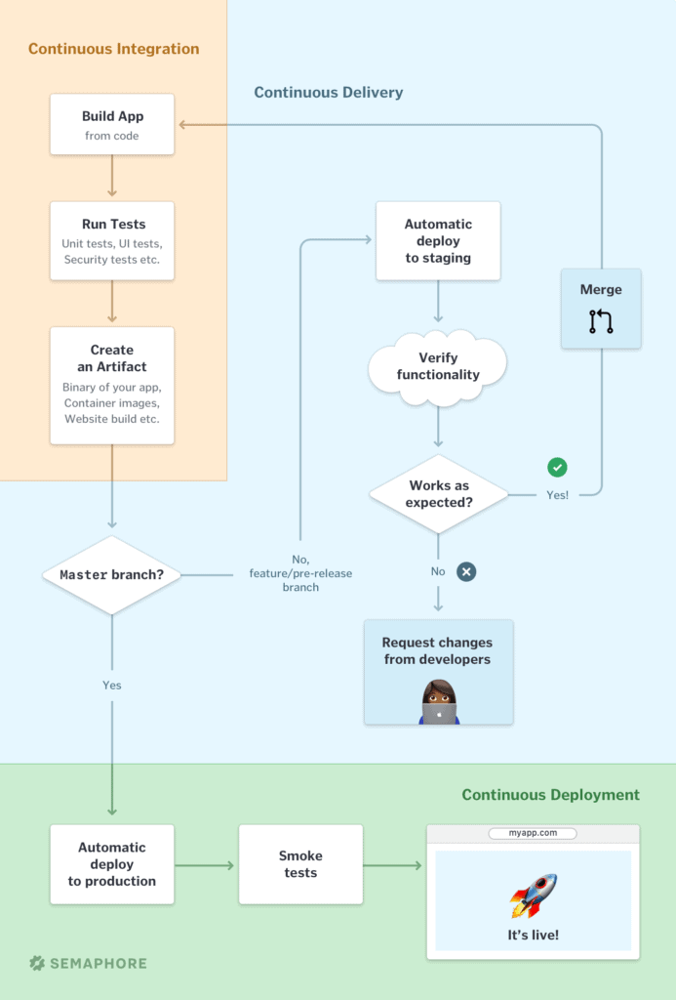
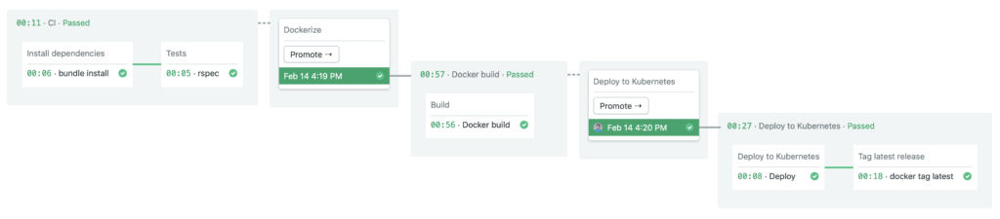

---
title: Continuous Integration and Delivery Explained
author-meta: Marko Anastasov
subtitle: semaphoreci.com
rights:  Creative Commmons Attribution-NonCommercialNoDerivatives 4.0 International
language: en-US
...

CI/CD is a way of developing software in which you’re able to release updates at any time in a sustainable way. When changing code is routine, development cycles are more frequent, meaningful and faster.

“CI/CD” stands for the combined practices of Continuous Integration (CI) and Continuous Delivery (CD).

[Continuous Integration](https://semaphoreci.com/continuous-integration) is a prerequisite for CI/CD, and requires:

- Developers to merge their changes to the main code branch many times per day.
- Each code merge to trigger an automated code build and test sequence. Developers ideally receive results in less than 10 minutes, so that they can stay focused on their work.

The job of Continuous Integration is to produce an artifact that can be deployed. The role of automated tests in CI is to verify that the artifact for the given version of code is safe to be deployed.

In the practice of **Continuous Delivery**, code changes are also continuously deployed, although the deployments are triggered manually. If the entire process of moving code from source repository to production is fully automated, [the process is called **Continuous Deployment**](https://semaphoreci.com/blog/2017/07/27/what-is-the-difference-between-continuous-integration-continuous-deployment-and-continuous-delivery.html).

### A litmus test for doing CI/CD

If any developer in your team can stop what they’re doing right now and ship the current development version of code to production in 20 minutes or less without anyone stressing about what could happen — congratulations, you’re doing CI/CD!

## CI/CD principles

Continuous Delivery practices take CI further by describing principles for successful production deployments:

- **Architect the system in a way that supports iterative releases**. Avoid tight coupling between components. Implement metrics that help detect issues in real-time.
- **Practice test-driven development to always keep the code in a deployable state**. Maintain a comprehensive and healthy automated test suite. Build in monitoring, logging, and fault-tolerance by design.
- **Work in small iterations**. For example, if you develop in feature branches, they should live no longer than a day. When you need more time to develop new features, use feature flags.
- Developers can **push the code into production-like staging environments**. This ensures that the new version of the software will work when it gets in the hands of users.
- **Anyone can deploy any version** of the software to any environment on demand, **at a push of a button**. If you need to consult a wiki on how to deploy, it’s game over.
- **If you build it, you run it**. Autonomous engineering teams should be responsible for the quality and stability of the software they build. This breaks down the silos between traditional developers and operations groups, as they work together to achieve high-level goals.

To make CI/CD a reality, you need to automate everything that you can in the software delivery process and run it in a [CI/CD pipeline](https://semaphoreci.com/blog/cicd-pipeline).

{ width=65% }

## Example CI/CD workflows

Here’s a simple example of fully automated CI/CD (Continuous Deployment) pipeline:

{ width=85% }

Each change on the master Git branch performs the following steps on Semaphore:

- Build code and web assets, while reusing dependency cache.
- Run an automated test suite. This is a JavaScript / Node.js application, so the tests are written with Jest.
- If the tests pass, a Deploy block updates the production code that runs in the cloud.

### CI/CD with manual steps

Here’s a CI/CD workflow for Kubernetes which includes more steps:

{ width=95% }

In this example, each change _automatically_ performs these steps:

- Build application from source code and dependencies.
- Run an automated test suite.
- If tests pass, automatically build a Docker container image and push it to a private registry.

At the end of the Docker build pipeline, we have a working artifact, a container image. The developer, or more formally, release manager, can decide to _manually_ trigger:

- Deployment to staging or production, which may include smoke tests to verify no major problems have been introduced.
- Tagging of the container image as an artifact that was introduced to production, to enable audits and rollbacks.

## What are the benefits of CI/CD?

CI/CD is much more than the automation of tasks to avoid human error. It lets us get new solutions into the hands of users as quickly, efficiently and cheaply as possible.

As [Dave Farley](http://www.davefarley.net/), co-author of _[Continuous Delivery](https://www.amazon.com/dp/0321601912)_ book and a software engineering expert points out in [a podcast hosted by Semaphore](https://semaphoreci.com/blog/continuous-delivery-dave-farley):

> The trillion-dollar mistake is miscategorizing software development as a production problem, in the sense of being able to scale it up in order to be able to produce things more reliably.
>
> Software development is always an exercise in learning, discovery and experimentation. \[…\] If you read the [Accelerate book](https://www.amazon.com/dp/1942788339), [State of DevOps report](https://puppet.com/resources/report/state-of-devops-report/), the numbers tell us that organizations that practice continuous delivery produce higher-quality software more quickly. The people working on it enjoy it more and the organizations that practice it make more money.
>
> [Dave Farley on Semaphore Uncut podcast](https://semaphoreci.com/blog/continuous-delivery-dave-farley)

If your company practices CI/CD, it will have a competitive advantage which enables you to:

**Deliver software with less risk**. CI/CD pipelines standardize release processes across projects. By testing every change in source code, we reduce the chances of introducing bugs.

**Release new features more frequently**. A CI/CD pipeline can visualize your entire path from commit to production in a single screen. You can navigate across stages, spot inefficiencies, and optimize your process. By removing the roadblocks to productivity, you enable your company to succeed.

**Deliver the product that users need**. Delivering updates often leads to more user feedback. You can take advantage of that by A/B testing features, or testing early versions of products with real customers. This way you avoid investing too much in features that your customers don’t need, and focus on those that matter.

**Improve developer productivity**. Engineering teams that don’t practice CI/CD often work under stress. There are constant fires for bad deploys and hard-to-fix outages. Developers write a lot of code that never gets used. Long-lived feature branches are too big to get proper peer review, so code degrades in quality. On the other hand, CI/CD guides product management to optimize for user impact. Developers deploy code while it’s fresh in their minds. The result is a happy engineering team.

The benefits of CI/CD compound: fast deploy cycles lead to less risky and more frequent updates, which lead to [faster learning and more user feedback](https://semaphoreci.com/blog/2018/02/14/7-ways-continuous-delivery-helps-build-culture-of-learning.html), which leads to happy developers building better products.

## When is CI/CD not feasible?

“_Continuous Delivery is great but won’t work with my project_.” There are indeed some cases when CD may not be suitable:

- Your customers don’t want continuous updates to their systems.
- Regulations restrict how software can be updated. For example, continuously updating software used in aerospace, telecom, and medical industries is not an option.

Even in a CD-averse environment, teams can enjoy the benefits of easy deployment and keeping the system in a deployable state. They can also practice and reap the benefits of CI to the full extent.

_For a more in-depth look into CI and its best practices, read_ [_Semaphore’s guide to Continuous Integration_](https://semaphoreci.com/continuous-integration)_._

## A typical journey to CI/CD

If you’re used to long development cycles, you will need to change your mindset.

But if you are considering to adopt CI/CD, you’ve made an important first step!

Think of anything that gets in the way of practicing CI/CD as technical debt, and treat it as such. Estimate work that needs to be done. Set clear expectations with all stakeholders, and schedule a time to work on it.

There are two major milestones on your journey to CI/CD success. The first is to implement CI: fast, reliable and frequent integrations. The second is to implement CD: automate deployment, make it a push-button operation, and make it easy to test new code in production-like environments.

### Getting to more frequent integrations

1/ The first thing is to **start treating master as if you would deploy it at any time**. Since you haven’t done this before, it will be hard. But it’s a start of doing something painful often until it stops being painful.

2/ **Treat every test failure as a bug**. This includes [flaky tests](https://semaphoreci.com/community/tutorials/how-to-deal-with-and-eliminate-flaky-tests). Extract the log, investigate and fix it. Regardless of what the test was for, you can’t close the issue until it’s fixed.

3/ **Improve your test suite**. You may need to rewrite some code to make tests more reliable. Have all developers commit to writing tests as carefully as they write production code. After a while, you’ll reach a point where a failed test means there’s a real bug. Eventually, you’ll hit 100% green CI builds. That’s your first mountain. Celebrate it!

4/ **Stop using long-lived feature branches** and start branching by abstraction using feature flags. This way everyone’s pushing to master and it’s easy to test features in development with the rest of the system. So you can detect issues right away instead of after merging months later.

5/ **Optimize the feedback loop**. Investigate slow tests and improve or rewrite them to be faster. Invest in a CI/CD tool that can separate your CI pipeline in stages and run tests in parallel. Semaphore customers often report [drastic improvements](https://semaphoreci.com/customers) such as reduced build time from an hour or even two to around ten minutes. This way you fully test every pull request before it’s merged.

Developing a fast and comprehensive automated test suite is a big upfront investment. However, the benefits are huge. Testers and QA can hunt for bugs and do much more useful checking. Developers are confident that they can push a change and CI will catch unforeseen issues. This confidence drives development velocity.

### Getting to more frequent releases

6/ The final step is to **automate the deployment**.

If your deployment process is manual, start by documenting it as a series of tasks. One by one, automate each task with a script (Bash, Makefile), or a configuration management tool such as Ansible, Chef or Puppet. Once you’re done, put all the tasks together in a CI/CD pipeline. You can start by setting up the transition in each stage to be triggered manually.

The details of release automation will depend a lot on your technology stack. The implementation when using Python on Docker will be different from using VMs to run Java application servers.

7/ If you’re deploying in the cloud, you can **automate the creation of infrastructure** by using “infrastructure as code” tools such as AWS Cloudformation and Terraform. If you’re deploying on-premises, you will likely not be able to create and destroy production-like environments on-demand. But you can still allocate them to be always available.

The final result is that after all this effort your team will start releasing monthly, then weekly, then daily. You can be Agile [in the original sense of the term](https://agilemanifesto.org/) and deliver value incrementally, even for Enterprise customers.

_Learn more here:_ [_Understanding the CI/CD Pipeline_](https://semaphoreci.com/blog/cicd-pipeline)_._

## Get started with CI/CD

When you’re ready to set up a CI/CD process for your project, [sign up for a free Semaphore account](https://semaphoreci.com/). Semaphore provides autoscaling, enterprise-grade CI/CD pipelines as a service.

- You can read more about Semaphore’s features [on this website](https://semaphoreci.com/product).
- Find a CI/CD tutorial for your language and technology stack [in the documentation](https://docs.semaphoreci.com/examples/tutorials-and-example-projects/).

\newpage

© __BUILD_YEAR__ Rendered Text. All rights reserved.

This work is licensed under Creative Commmons
Attribution-NonCommercial-NoDerivatives 4.0 International.
To view a copy of this license, visit
<https://creativecommons.org/licenses/by-nc-nd/4.0>

The source text is open source:
<https://github.com/semaphoreci/papers>

Originally published at:
<https://semaphoreci.com/cicd>

Authors: Marko Anastasov

Build date: __BUILD_MONTH__ __BUILD_YEAR__

Revision: __BUILD_REVISION__

\newpage
