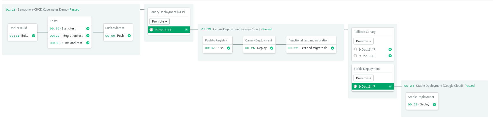
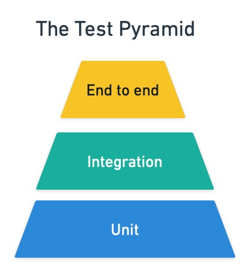
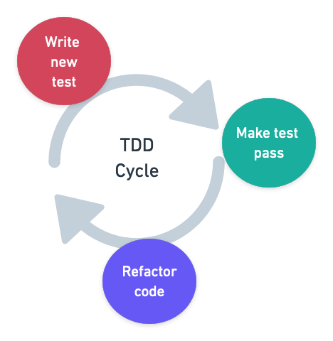

---
title: 30 Common CI/CD Interview Questions (with Answers)
author-meta: Tomas Fernandez
subtitle: semaphoreci.com
rights:  Creative Commmons Attribution-NonCommercialNoDerivatives 4.0 International
language: en-US
...

Acing a software engineering interview is all about preparation. Preparation starts with collecting as much information as you can about the prospective company, and their history, product, and [interviewing process](https://semaphoreci.com/blog/interviewing-engineers-at-semaphore).

Next in the list is to brush up your technical skills because knowing your technical stuff will make you stand out. Questions (like the ones in this article) are a great way of testing your knowledge. To help you, we’ve collected and answered 30 common CI/CD-related questions. How many can you answer?

## Version control

### 1. What is version control?

Version control is a set of practices and tools for managing codebases. Developers use version control to keep track of every line of code, and share, review, and synchronize changes among a team.

### 2. What is Git?

Created by Linus Torvalds to support the open-source development of Linux, Git is the most popular version control tool. It uses a distributed repository model that can efficiently handle projects of any size.

### 3. What is a Git repository?

A Git repository keeps track of every file in a software project. The repository serves as an index for all files and changes in the project, allowing developers to navigate to any point in the project’s history.

### 4. Which other version control tools do you know of?

-   Mercurial
-   Subversion (SVN)
-   Concurrent Version Systems (CVS)
-   Perforce
-   Bazaar
-   Bitkeeper
-   Fossil

### 5. What is a Git branch?

A Git branch is an independent line of development, usually created for working on a feature. Branches let developers code without affecting the work of other team members.

### 6. What is merging?

Merging consists of joining branches. For example, when developers incorporate their peer-reviewed changes from a feature branch into the main branch.

### 7. What is trunk-based development?

[Trunk-based development](https://trunkbaseddevelopment.com/) is a branching model where most of the work takes place in a single trunk, usually called `trunk`, `master`, or `main`. The trunk receives daily merges from all developers in the team.

Trunk-based development is a popular development model because it simplifies version control. Since the trunk is a single source of truth, this model minimizes the chances of merge conflict.

### 8. What is Gitflow, and how does it compare to trunk-based development?

Gitflow is a workflow for Git that makes heavy use of branches. In Gitflow, all the code is merged into the `develop` branch instead of the `main` branch, which serves as an abridged version of the project’s history.

Features are worked on specific “feature branches” (typically prefixed with `feature/`). In the same fashion, releases also create a dedicated `release/` branch.

Compared with trunk-based development, Gitflow is more complex and has a higher chance of inducing merge conflicts, which is why it has fallen out of favor among the development community.

### 9. How long should a branch live?

In the context of continuous integration, branches should follow trunk-based development practices and thus be short-lived. Ideally, a branch should last for a few hours or, at most, a day.

## CI/CD

### 10. What is continuous integration?

[Continuous Integration](https://semaphoreci.com/continuous-integration) (CI) is a software development methodology where developers — following the trunk-based model — merge their changes to the main branch many times per day.

CI is supported by automated tests and a build server that runs them on every change. As a result, failures are made visible as soon as they are introduced and can be fixed within minutes.

### 11. How do CI and version control relate to one another?

Every change in the code must trigger a continuous integration process. This means that a CI system must be connected with a Git repository to detect when changes are pushed, so tests can be run on the latest revision.

### 12. What’s the difference between continuous integration, continuous delivery, and continuous deployment?

**Continuous integration** (CI) executes the sequence of steps required to build and test the project. CI runs automatically on every change committed to a shared repository, offering developers quick feedback about the project’s state.

[Continuous delivery](https://semaphoreci.com/blog/2017/07/27/what-is-the-difference-between-continuous-integration-continuous-deployment-and-continuous-delivery.html) is an extension of CI. Its goal is to automate every step required to package and release a piece of software. The output of a continuous delivery pipeline takes the form of a deployable binary, package, or container.

**Continuous deployment** is an optional step-up from continuous delivery. It is a process that takes the output from the delivery pipeline and deploys it to the production system in a safe and automated way.

### 13. Name some benefits of CI/CD

-   **Less risk**: automated tests reduce the chance of introducing bugs, creating a safety net that increases the developer’s confidence in their code.
-   **More frequent releases**: the automation provided by continuous delivery and continuous deployment allows developers to release and deploy software safely many times per day.
-   **Improved productivity**: freed from the manual labor of building and testing the code, developers can focus on the creative aspects of coding.
-   **Elevated quality**: CI acts as a quality gate, preventing code that is not up to standards from getting released.
-   **Better design**: the iterative nature of continuous integration lets developers work in small increments, allowing a higher degree of experimentation, which leads to more innovative ideas.

### 14. What are the most important characteristics in a CI/CD platform?

- **Reliability**: the team depends on the CI server for testing and deployment, so it must be reliable. An unreliable CI/CD platform can block all development work.
- **Speed**: the platform should be fast and scalable to obtain results in a few minutes.
- **Reproducibility**: the same code should always yield the same results.

- **Ease of use**: easy to configure, operate, and troubleshoot.

### 15. What is the build stage?

The [build stage](https://semaphoreci.com/blog/build-stage) is responsible for building the binary, container, or executable program for the project. This stage validates that the application is buildable and provides a testable artifact.

### 16. What’s the difference between a hosted and a cloud-based CI/CD platform?

A hosted CI server must be managed like any other server. It must be first installed, configured, and maintained. Upgrades and patches must be applied to keep the server secure. Finally, failures in the CI server can block development and stop deployments.

On the other hand, a cloud-based CI platform does not need maintenance. There’s nothing to install or configure, so organizations can immediately start using them. The cloud provides all the machine power needed, so scalability is not a problem. Finally, the reliability of the platform is guaranteed by SLA.

### 17. How long should a build take?

Developers should get results from their CI pipeline in [less than 10 minutes](https://semaphoreci.com/blog/2017/03/02/what-is-proper-continuous-integration.html). That’s the longest time that’s practical to wait for results.

### 18. Is security important in CI/CD? What mechanisms are there to secure it?

Yes. CI/CD platforms have access to all kinds of sensitive data such as API keys, private repositories, databases, and server passwords. An improperly secured CI/CD system [is a prime target for attacks](https://research.nccgroup.com/2022/01/13/10-real-world-stories-of-how-weve-compromised-ci-cd-pipelines/) and can be exploited to release compromised software or to get unauthorized access. A CI/CD platform must support mechanisms to securely manage secrets, and control access to logs and private repositories.

### 19. Can you name some deployment strategies?

- **Regular release/deployment**: releases software to everyone at once, making it available to the general public.
- [**Canary releases**](https://semaphoreci.com/blog/what-is-canary-deployment): this is a method that reduces the chance of failure by exposing a small portion of the userbase (around 1%) to the release. With a canary release, developers gradually switch users to the latest release in a controlled way.
- [**Blue-green releases**](https://semaphoreci.com/blog/blue-green-deployment): consists of running two simultaneous instances of an application; one is the stable version currently serving users and the other the latest release. Users are switched from the former to the latter all at once. This method is safer than the regular or big bang releases because users can instantly be routed back to the previous version if there is a problem.

- **Dark launches**: are deployments where new features are released without being announced. Features can be enabled in a very fine-grained way with [feature flags](https://semaphoreci.com/blog/feature-flags).

## Testing

### 20. How does testing fit into CI?

Testing is integral to and inseparable from CI. The main benefit teams get from CI is continuous feedback. Developers set up tests in the CI to check that their code behaves according to expectations. There would be no feedback loop to determine if the application is in a releasable state without testing.

### 21. Should testing always be automated?

Yes, CI requires that [all tests are automated](https://semaphoreci.com/blog/test-automation). They must work without human intervention.

That is not to say that manual or exploratory testing don’t have their places. They are very useful for discovering potential features and finding further test cases to automate.

### 22. Name a few types of tests used in software development

There are more [types of tests](https://semaphoreci.com/blog/20-types-of-testing-developers-should-know) than we can count with both hands, but the most common ones are:

- **Unit tests**: validate that functions or classes behave as expected.
- **Integration tests**: are used to verify that the different components of an application work well together.
- **End-to-end tests**: check an application by simulating user interaction.
- **Static tests**: finds defects in code without actually executing it.
- **Security tests**: scans the application’s dependencies for known security issues.

- [**Smoke tests**](https://semaphoreci.com/community/tutorials/smoke-testing): fast tests that check if the application can start and that the infrastructure is ready to accept deployments.

### 23. How many tests should a project have?

There is no single answer as it depends on the size and nature of the project. That being said, for various reasons, test suites tend to follow in distribution the [testing pyramid](https://semaphoreci.com/blog/testing-pyramid).

{ width=40% }

### 24. What is a flaky test?

A test that intermittently fails for no apparent reason is called a [flaky test](https://semaphoreci.com/community/tutorials/how-to-deal-with-and-eliminate-flaky-tests). Flaky tests usually work correctly on the developer’s machine but fail on the CI server. Flaky tests are difficult to debug and are a major source of frustration.

Common sources of flakiness are:

- Improperly handled concurrency.
- Dependency on test order within the test suite.
- Side effects in tests.
- Use of non-deterministic code.
- Non-identical test environments.

### 25. What is TDD?

[Test-Driven Development](https://semaphoreci.com/blog/test-driven-development) (TDD) is a software design practice in which a developer writes tests before code. By inverting the usual order in which software is written, a developer can think of a problem in terms of inputs and outputs and write more testable (and thus more modular) code.

The TDD cycle consists of three steps:

1.  **Red**: write a test that fails.
2.  **Green**: write the minimal code that passes the test.
3.  **Refactor**: improve the code, and make it more abstract, readable, and optimized.

{ width=40% }

### 26. What is the main difference between BDD and TDD?

If TDD is about designing a thing right, [Behavior-Driven Development](https://semaphoreci.com/community/tutorials/behavior-driven-development) (BDD) is about designing the right thing. Like TDD, BDD starts with a test, but the key difference is that tests in BDD are scenarios describing how a system responds to user interaction.

While writing a BDD test, developers and testers are not interested in the technical details (how a feature works), rather in behavior (what the feature does). BDD tests are used to test and discover the features that bring the most value to users.

### 27. What is test coverage?

Test coverage is a metric that measures how much of the codebase is covered by tests. A 100% coverage means that every line of the code is tested at least by one test case.

### 28. Does test coverage need to be 100%?

No. There’s a myth that 100% coverage means that the code is bug-free. This is false; no amount of testing can guarantee that. Attempting to reach full test coverage is considered bad practice because it leads to a false sense of security and extra work when code needs to be refactored.

### 29. How can you optimize tests in CI?

First, we need to [identify which tests are the slowest](https://semaphoreci.com/blog/slow-tests-strategy) and prioritize accordingly. Once we have a plan, there are several [methods for making tests faster](https://semaphoreci.com/blog/make-slow-tests-faster). Some of them are:

- Breaking large tests into smaller units.
- Removing obsolete tests.
- Refactoring tests to have fewer dependencies.

- [Parallelizing tests](https://semaphoreci.com/blog/revving-up-continuous-integration-with-parallel-testing).

### 30. What’s the difference between end-to-end testing and acceptance testing?

End-to-end usually involves testing the application by using the UI to simulate user interaction. Since this requires the application to run in a complete production-like environment, end-to-end testing provides the most confidence to developers that the system is working correctly.

[Acceptance testing](https://semaphoreci.com/blog/the-benefits-of-acceptance-testing) is the practice of verifying acceptance criteria. Acceptance criteria is a document with the rules and behaviors that the application must follow to fulfill the users' needs. An application that fulfills all acceptance criteria meets the users’ business needs by definition.

The confusion stems from the fact that acceptance testing implements the acceptance criteria verification with end-to-end testing. That is, an acceptance test consists of a series of end-to-end testing scenarios that replicate the conditions and behaviors expressed in the acceptance criteria.

## Conclusion

There is no doubt that interviews are stressful. But doing your research and [knowing what to expect](https://semaphoreci.com/blog/interviewing-engineers-at-semaphore) will dramatically increase your chances of getting the job of your dreams.

Knowledge is no replacement for experience, however. As part of your preparation, you should try a few CI/CD platforms out to see how they work. For example, you can get started with Semaphore CI/CD in a few minutes; just check out the [getting started tour](https://docs.semaphoreci.com/guided-tour/getting-started/), where you'll find ready-to-use demo projects covering the most popular languages and tech stacks.

**Did you know we’re hiring engineers of all levels! For more details, check out our [jobs page](https://apply.workable.com/semaphore)**

\newpage

© __BUILD_YEAR__ Rendered Text. All rights reserved.

This work is licensed under Creative Commmons
Attribution-NonCommercial-NoDerivatives 4.0 International.
To view a copy of this license, visit
<https://creativecommons.org/licenses/by-nc-nd/4.0>

The source text is open source:
<https://github.com/semaphoreci/papers>

Originally published at:
<https://semaphoreci.com/blog/common-cicd-interview-questions>

Original publication date: 15 Jul 2022

Authors: Tomas Fernandez

Editor: Marko Anastasov

Reviewed by: Dan Ackerson

Build date: __BUILD_MONTH__ __BUILD_YEAR__

Revision: __BUILD_REVISION__

\newpage
