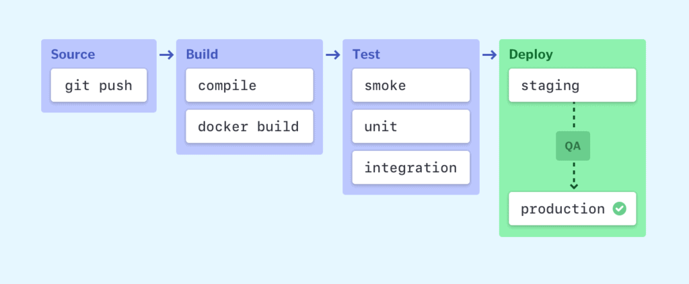
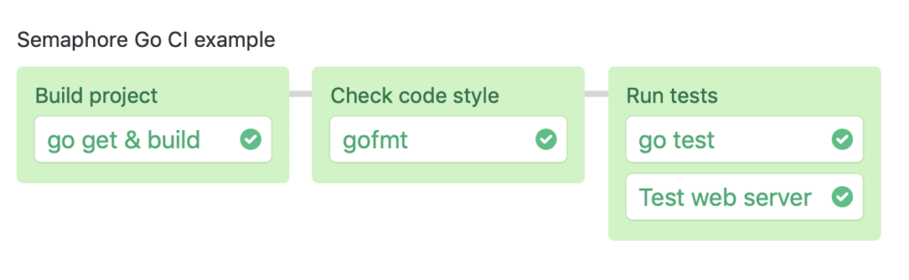
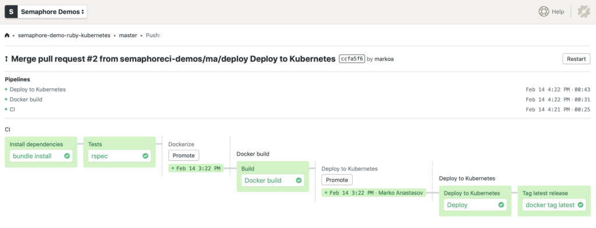

---
title: CI/CD Pipeline - A Gentle Introduction
author-meta: Marko Anastasov
subtitle: semaphoreci.com
rights:  Creative Commmons Attribution-NonCommercialNoDerivatives 4.0 International
language: en-US
...

Do you want your engineering team to deliver bug-free code at high velocity? A fast and reliable [CI/CD](https://semaphoreci.com/cicd) pipeline is crucial for doing that sustainably over time.

## What is a CI/CD pipeline?

A CI/CD pipeline automates your software delivery process. The pipeline builds code, runs tests (CI), and safely deploys a new version of the application (CD).

Automated pipelines remove manual errors, provide standardized feedback loops to developers, and enable fast product iterations.

## What do CI and CD mean?

CI, short for _[Continuous Integration](https://semaphoreci.com/continuous-integration)_[,](https://semaphoreci.com/continuous-integration) is a software development practice in which all developers merge code changes in a central repository multiple times a day. CD stands for _Continuous Delivery_, which on top of Continuous Integration adds the practice of automating the entire software release process.

With CI, each change in code triggers an automated build-and-test sequence for the given project, providing feedback to the developer(s) who made the change. The entire CI feedback loop should run in [less than 10 minutes](https://semaphoreci.com/blog/2017/03/02/what-is-proper-continuous-integration.html).

Continuous Delivery includes infrastructure provisioning and deployment, which may be manual and consist of multiple stages. What’s important is that all these processes are fully automated, with each run fully logged and visible to the entire team.

_Learn more here:_ [_CI/CD: Continuous Integration & Delivery Explained_](https://semaphoreci.com/cicd)

## Elements of a CI/CD pipeline

A CI/CD pipeline may sound like overhead, but it isn’t. It’s essentially a runnable specification of the steps that any developer needs to perform to deliver a new version of a software product. In the absence of an automated pipeline, engineers would still need to perform these steps manually, and hence far less productively.

Most software releases go through a couple of typical stages:

{ width=80% }

Failure in each stage typically triggers a notification—via email, Slack, etc.—to let the responsible developers know about the cause. Otherwise, the whole team receives a notification after each successful deployment to production.

### Source stage

In most cases, a pipeline run is triggered by a source code repository. A change in code triggers a notification to the CI/CD tool, which runs the corresponding pipeline. Other common triggers include automatically scheduled or user-initiated workflows, as well as results of other pipelines.

### Build stage

We combine the source code and its dependencies to build a runnable instance of our product that we can potentially ship to our end users. Programs written in languages such as Java, C/C++, or Go need to be compiled, whereas Ruby, Python and JavaScript programs work without this step.

Regardless of the language, cloud-native software is typically deployed with Docker, in which case this stage of the CI/CD pipeline builds the Docker containers.

Failure to pass the build stage is an indicator of a fundamental problem in our project’s configuration, and it’s best to address it immediately.

### Test stage

In this phase, we run automated tests to validate our code’s correctness and the behavior of our product. The test stage acts as a safety net that prevents easily reproducible bugs from reaching the end-users.

The responsibility of writing tests falls on the developers. The best way to write automated tests is to do so as we write new code in [test- or behavior-driven development](https://semaphoreci.com/community/tutorials/behavior-driven-development).

Depending on the size and complexity of the project, this phase can last from seconds to hours. Many large-scale projects run tests in multiple stages, starting with [smoke tests](https://semaphoreci.com/community/tutorials/smoke-testing) that perform quick sanity checks to end-to-end integration tests that test the entire system from the user’s point of view. An extensive test suite is typically parallelized to reduce run time.

Failure during the test stage exposes problems in code that developers didn’t foresee when writing the code. It’s essential for this stage to produce feedback to developers quickly, while the problem space is still fresh in their minds and they can [maintain the state of flow](https://semaphoreci.com/blog/2016/11/03/how-bdd-and-continuous-delivery-help-developers-maintain-flow.html).

### Deploy stages

Once we have a built a runnable instance of our code that has passed all predefined tests, we’re ready to deploy it. There are usually multiple deploy environments, for example, a “beta” or “staging” environment which is used internally by the product team, and a “production” environment for end-users.

Teams that have embraced the Agile model of development—guided by tests and real-time monitoring—usually deploy work-in-progress manually to a staging environment for additional manual testing and review, and automatically deploy approved changes from the master branch to production.

## Examples of CI/CD pipelines

A pipeline can start very simple. Here’s [an example of a Go project pipeline](https://github.com/semaphoreci-demos/semaphore-demo-go) that compiles the code, checks code style and runs automated tests in two parallel jobs:

{ width=80% }

Here’s a more complex example of a pipeline that [builds, tests and deploys a microservice to a Kubernetes cluster](https://semaphoreci.com/blog/cicd-microservices-digitalocean-kubernetes):

{ width=95% }

A CI/CD pipeline with Docker and Kubernetes

You can find more [examples of CI/CD pipelines](https://docs.semaphoreci.com/examples/tutorials-and-example-projects/) in Semaphore documentation.

## Additional benefits of pipelines

Having a CI/CD pipeline has more positive effects than only making an existing process a little more efficient:

- Developers can stay focused on writing code and monitoring the behavior of the system in production.
- QA and product stakeholders have easy access to the latest, or any, version of the system.
- Product updates are not stressful.
- Logs of all code changes, tests and deployments are available for inspection at any time.
- Rolling back to a previous version in the event of a problem is a routine push-button action.
- A fast feedback loop helps build an organizational culture of learning and responsibility.

Learn more here: [7 ways in which continuous delivery helps build a culture of learning](https://semaphoreci.com/blog/2018/02/14/7-ways-continuous-delivery-helps-build-culture-of-learning.html)

## What makes a good pipeline?

A good CI/CD pipeline is fast, reliable, and accurate.

### Speed

**Speed** manifests itself in several ways:

- **How quickly do we get feedback on the correctness of our work?** If it’s longer than the time it takes to get a coffee, pushing code to CI is equivalent to asking a developer to join a meeting in the middle of solving a problem. Developers will work less effectively due to inevitable context switching.
- **How long does it take us to build, test, and deploy a simple code commit?** For example, a total time of one hour for CI and deployment means that the entire engineering team has a hard limit of up to seven deploys for the whole day. This causes developers to opt for less frequent and more risky deployments, instead of the rapid change that businesses today need.
- **Do our CI/CD pipelines scale to meet development demands in real time?** Traditionally CI/CD pipelines have limited capacity, meaning that only a certain number of pipelines can run at a given time. As a result, resources sit idle most of the time, while developers wait in a queue for CI/CD to become available at busy periods of the day. One of the biggest changes in the recently released Semaphore 2.0 is [auto-scaling and a pay-as-you-go pricing model](https://semaphoreci.com/pricing), a “serverless” operating principle that supports developer productivity.
- **How quickly can we set up a new pipeline?** Difficulty with scaling CI/CD infrastructure or reusing existing configuration creates friction, which stifles development. Today’s cloud infrastructure is best utilized by writing software as a composition of microservices, which calls for frequent initiation of new CI/CD pipelines. This is solved by having a programmable CI/CD tool that fits in the existing development workflows and storing all CI/CD configuration as code that can be reviewed, versioned, and restored.

More info here: [Why cloud-native success depends on high velocity CI/CD](https://semaphoreci.com/blog/2018/11/22/high-velocity-cicd.html).

### Reliability

**A reliable pipeline** always produces the same output for a given input, and with no oscillations in runtime. Intermittent failures cause intense frustration among developers.

Operating and scaling CI/CD infrastructure that provides on-demand, clean, identical and isolated resources for a growing team is a complex job. What seems to work well for one project or a few developers usually breaks down when the team and the number of projects grow, or the technology stack changes. When we hear from new users, unreliable CI/CD is one of the top reasons why they move to [Semaphore](https://semaphoreci.com/), often from a self-hosted solution.

### Accuracy

Any degree of automation is a positive change. However, the job is not fully complete until the CI/CD pipeline **accurately runs and visualizes the entire software delivery process**. This requires using a CI/CD tool that can model both simple and if needed, complex workflows, so that manual error in repetitive tasks is all but impossible.

For example, it’s not uncommon to have the CI phase fully automated but to leave out deployment as a manual operation to be performed by often a single person on the team. If a CI/CD tool can model the deployment workflow needed, for example with use of [secrets](https://docs.semaphoreci.com/guided-tour/environment-variables-and-secrets/) and [multi-stage promotions](https://docs.semaphoreci.com/guided-tour/deploying-with-promotions/), this bottleneck can be removed.

## Good things to do

**When the master is broken, drop what you’re doing and fix it**. Maintain a “no broken windows” policy on the pipeline.

**Run fast and fundamental tests first**. If you have a large test suite, it’s common practice to parallelize it to reduce the amount of time it takes to run it. However, it doesn’t make sense to run all the time-consuming UI tests if some essential unit or code quality tests have failed. Instead, it’s best to set up a pipeline with multiple stages in which fast and fundamental tests—such as security scanning and unit tests—run first, and only once they pass does the pipeline move on to integration or API tests, and finally UI tests.

**Always use exactly the same environment**. A CI/CD pipeline can’t be reliable if a pipeline run modifies the next pipeline’s environment. Each workflow should start from the same, clean, and isolated environment.

**Build-in quality checking**. For example, there are open source tools that provide static code analysis for every major programming language, covering everything from code style to security scanning. Run these tools within your CI/CD pipeline and free up brainpower for creative problem-solving.

**Include pull requests**. There’s no reason why a CI/CD pipeline should be limited to one or a few branches. By running the standard set of tests against every branch and corresponding pull request, contributors can identify issues before engaging in peer review, or worse, before the point of integration with the master branch. The outcome of this practice is that merging any pull request becomes a non-event.

**Peer-review each pull request**. No CI/CD pipeline can fully replace the need to review new code. There may be times when the change is indeed so trivial that peer review is a waste of time; however, it’s best to set the norm that every pull request needs another pair of eyes and make exceptions only when it makes sense, rather than vice versa. Peer code review is a key element in building a robust and egoless engineering culture of collaborative problem-solving.

## Ready to implement a CI/CD pipeline?

[Semaphore](https://semaphoreci.com/) is the fastest cloud-based CI/CD service that natively supports Docker and major programming languages, with autoscaling and a pay-as-you-go pricing model. Creating a new pipeline involves just a few simple steps:

1. [Create a free Semaphore account](https://docs.semaphoreci.com/examples/tutorials-and-example-projects/).
2. Select a Git repository that you have access to.
3. Commit and push an example pipeline.
4. Take the [guided tour](https://docs.semaphoreci.com/guided-tour/getting-started/) and learn from many [tutorials and example projects in Semaphore documentation](https://docs.semaphoreci.com/examples/tutorials-and-example-projects/).

Happy building!

\newpage

© __BUILD_YEAR__ Rendered Text. All rights reserved.

This work is licensed under Creative Commmons
Attribution-NonCommercial-NoDerivatives 4.0 International.
To view a copy of this license, visit
<https://creativecommons.org/licenses/by-nc-nd/4.0>

The source text is open source:
<https://github.com/semaphoreci/papers>

Originally published at:
<https://semaphoreci.com/blog/cicd-pipeline>

Original publication date: 14 Mar 2019

Authors: Marko Anastasov

Build date: __BUILD_MONTH__ __BUILD_YEAR__

Revision: __BUILD_REVISION__

\newpage
