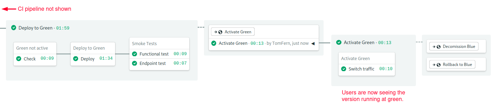
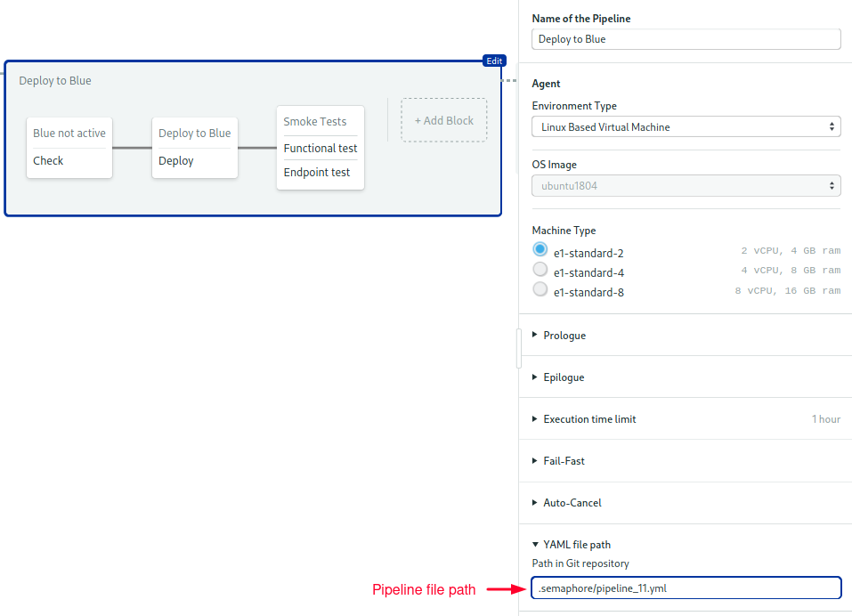

apiVersion: networking.istio.io/v1alpha3
kind: DestinationRule
metadata:
  name: myapp-blue-green
spec:
  host: myapp
  subsets:
  - name: $COLOR_ACTIVE
    labels:
      color: $COLOR_ACTIVE
```

**Test Routes**

During deployment things are different. We’ll need to split traffic in two. We want regular users to maintain their access to the old version, running in `$COLOR_ACTIVE`. At the same time, we’d like to have a special route for us to run some tests on the new version, running in `$COLOR_TEST`, before making the switch. Istio has several [routing options](https://istio.io/latest/docs/reference/config/networking/virtual-service/) to achieve this. For HTTP traffic, I find that the easiest one is to use a cookie.

The next manifest describes a VirtualService and DestinationRule that routes requests with a cookie having `test=true` to `$COLOR_TEST`. The rest of the traffic, that is, requests without the cookie, goes to `$COLOR_ACTIVE`. We’ll call this manifest `manifests/route-test.yml`.

```yaml
# manifests/route-test.yml

apiVersion: networking.istio.io/v1alpha3
kind: VirtualService
metadata:
  name: myapp-blue-green
spec:
  hosts:
  - "*"
  gateways:
  - myapp-gateway
  http:
  - name: myapp-test
    match:
    - headers:
        cookie:
          regex: "^(.*?;)?(test=true)(;.*)?$"
    route:
    - destination:
        host: myapp
        subset: $COLOR_TEST

  - name: myapp-default
    route:
    - destination:
        host: myapp
        subset: $COLOR_ACTIVE


---

apiVersion: networking.istio.io/v1alpha3
kind: DestinationRule
metadata:
  name: myapp-blue-green
spec:
  host: myapp
  subsets:
  - name: blue
    labels:
      color: blue
  - name: green
    labels:
      color: green
```

### Kubernetes Manifests

The remaining manifests describe native Kubernetes resources. They do not depend on Istio. These are the last manifests that complete the Kubernetes setup.

**Deployments & Service**

First, we’ll define a [deployment](https://semaphoreci.com/blog/kubernetes-deployment), which creates the application’s pods. It includes a [readiness probe](https://kubernetes.io/docs/tasks/configure-pod-container/configure-liveness-readiness-startup-probes/#define-a-liveness-http-request) and some database connection variables.

```yaml
# manifests/deployment.yml

apiVersion: apps/v1
kind: Deployment
metadata:
  name: myapp-$COLOR_TEST
  labels:
    app: myapp
    color: $COLOR_TEST
spec:
  replicas: 1
  selector:
    matchLabels:
      app: myapp
      color: $COLOR_TEST
  strategy:
    type: Recreate
  template:
    metadata:
      labels:
        app: myapp
        color: $COLOR_TEST
    spec:
      containers:
      - name: myapp
        image: $DOCKER_USERNAME/myapp:$SEMAPHORE_WORKFLOW_ID
        ports:
        - containerPort: 3000
        readinessProbe:
          httpGet:
            path: /ready
            port: 3000
        env:
          - name: NODE_ENV
            value: "production"
          - name: DB_HOST
            value: "$DB_HOST"
          - name: DB_PORT
            value: "$DB_PORT"
          - name: DB_SCHEMA
            value: "$DB_SCHEMA"
          - name: DB_USER
            value: "$DB_USER"
          - name: DB_PASSWORD
            value: "$DB_PASSWORD"
```

Second, we’ll use a service to get a stable IP and hostname for the application. This [service](https://kubernetes.io/docs/concepts/services-networking/service/) targets the application pods labeled as `app = myapp`.

```yaml
# manifests/service.yml

apiVersion: v1
kind: Service
metadata:
  name: myapp
  labels:
    app: myapp
spec:
  selector:
    app: myapp
  ports:
  - port: 3000
    name: http
```

## Setting Up Your Continuous Integration Pipelines

I will assume that you already have working continuous integration and delivery pipelines configured in Semaphore, which should build and test your Docker images. The only requirement is that, at some point, it pushes the image into the registry of your choice.

If you need help setting up your pipelines, you can find detailed step-by-step instructions in our free eBook [CI/CD with Docker and Kubernetes](https://semaphoreci.com/resources/cicd-docker-kubernetes). We also have detailed tutorials on dockerizing applications:

- [Dockerizing a Ruby on Rails Application](https://semaphoreci.com/community/tutorials/dockerizing-a-ruby-on-rails-application)
- [Dockerizing a Node.js Web Application](https://semaphoreci.com/community/tutorials/dockerizing-a-node-js-web-application)
- [Dockerizing a Python Django Web Application](https://semaphoreci.com/community/tutorials/dockerizing-a-python-django-web-application)
- [Dockerizing a PHP Application](https://semaphoreci.com/community/tutorials/dockerizing-a-php-application)
- [Continuous Integration with Deno](https://semaphoreci.com/blog/continuous-integration-with-deno)

## How to Organize Releases

There are probably as many ways of making releases as there are developers, after all, that’s our thing. But I think it’s a pretty safe bet that [Git tags](https://git-scm.com/book/en/v2/Git-Basics-Tagging) will be somehow involved. So, let’s mark releases using color-coded Git tags.

### Step 1: Decide Which Pipeline Should Start

Suppose we want to deploy a new version of the application into green. The old version is currently running on blue. The deployment starts once the continuous integration pipeline is done building the docker image.

The first step is to decide which deployment pipeline to start: the green or the blue. As I said, we’ll make the decision based on how the release was tagged. We’ll use a regular expression to find if the tag contains either blue or green, and activate the appropriate pipeline. If there are no tags, or they don’t match a color, nothing happens.

Imagine that we tagged our release as `v2.0-green`. Since it matches “green”, the green deployment pipeline is activated.

### Step 2: Deploy

The second step is to make the deployment. Here, we create the green pods with the new version of the Docker image. Additionally, we create a test route in the VirtualService.

### Step 3: Test the Deployment

The main benefit of blue-green deployments is that we can test the application in a real production setting. The third step is to run tests on the new deployment.

To run the tests, we make HTTP requests using a cookie. The test route sends them to the green deployment.

### Step 4: Go Live

If all tests pass, the fourth step is to change the default route, so all users access the new version. We do this by updating the VirtualService default route.

Once we changed the default route to green, all users access the new deployment. Meanwhile, the old version is still running, nothing has changed on blue, other than it is no longer receiving any traffic.

### Step 5: Cleanup or Rollback

At this point, the deployment is mostly complete. The only thing left is to do a cleanup. We can either delete the old environment or rollback. This will be the only manual step in the workflow. If for any reason, we are not satisfied with the new version, doing a rollback is easy, we just need to change the VirtualService route back to the blue.

On the other hand, if the new version works perfectly, we can start the cleanup pipeline that deletes the blue deployment. This step releases the computing resources back to the cluster.

### Deployment Flowchart

We can represent the sequence more visually using a flowchart.

{ width=95% }

Deployment flowchart

## Connecting Semaphore with Kubernetes

Semaphore needs access to the Kubernetes cluster to make the deployment. To do this, follow these steps to create a [secret](https://docs.semaphoreci.com/essentials/using-secrets/):

- Click on the account badge on the top-right corner and enter the **Settings** section.

{ width=70% }

- Click on **Secrets**, then **New Secret**.

{ width=70% }

- Create a secret called “kubeconfig”.
- Upload your kubeconfig or any other files needed to connect.

{ width=50% }

The details depend on where the cluster is hosted; some cloud providers let you download the kubeconfig directly. Others require additional steps like installing and running dedicated CLIs. If you have any trouble setting this up, check out the links at the end of this post, you’ll find examples with various providers.

Next, create two sets of environment variables for your application:

- Create a new secret called “env-blue”.
- Add all the environment variables the application needs, for instance, the database connection parameters.
- Click on **Save Changes**.

{ width=50% }

Repeat the steps to create the green secret.

{ width=50% }

## Blue Pipelines

It looks like we’re finally ready to start a deployment. We’ll do blue first.

To begin, open the Workflow Editor.

{ width=95% }

- Select the branch.
- Press **Add First Promotion**.

{ width=75% }

- Change the name to “Deploy to Blue”.
- Check the **Enable automatic promotion** option.

{ width=95% }

Deploy to blue promotion

- Type the following conditions to follow releases tagged like `v1.2.3-blue`:

```
result = 'passed' AND tag =~ '^v.*-blue$'
```

### Adding a Sanity Check

We’ll use the first block to do a sanity check. We have to make sure that we’re not deploying the new version into a live environment, which would be disastrous. This could happen if we Git-tagged the wrong color by mistake. The sanity check consists of retrieving the VirtualService default route and verifying that IS NOT blue.

- Open the **prologue** section. Place here any commands that you need to connect with your cluster.
- Open the **environment variables** section and create a variable named `COLOR_TEST = blue`.
- Import the `kubeconfig` secret.
- Type the following command (sorry, it’s rather long):

```bash
if kubectl get virtualservice myapp-blue-green; then \
   VSERVICE_DEFAULT=$(\
      kubectl get virtualservice myapp-blue-green -o json | \
         jq -r '.spec.http[-1].route[0].destination.subset'); \
         echo "Default route goes to $VSERVICE_DEFAULT"; \
         test "$VSERVICE_DEFAULT" != "$COLOR_TEST"; \
fi
```

{ width=95% }

Sanity check block

### Adding a Deployment Block

Beyond this point, we can assume blue is not active and that it’s safe to deploy.

- Create a second block called “Deploy”.
- Import the `kubeconfig`, `dockerhub` and `env-blue` secrets.
- Configure the same **prologue** and **environment variables** as before.
- Type the following commands in the job, which creates the gateway, routes, service, deployment:

```bash
checkout

# service & deployment
kubectl apply -f manifests/service.yml
envsubst < manifests/deployment.yml | tee _deployment.yml
kubectl apply -f _deployment.yml
kubectl rollout status -f _deployment.yml --timeout=120s

# routes & gateway
kubectl apply -f manifests/gateway.yml
envsubst < manifests/route-test.yml | tee _route.yml
kubectl apply -f _route.yml

# place any other setup/initialization commands, for instance...
kubectl exec -it -c myapp \
   $(kubectl get pod -l app=myapp,color=$COLOR_TEST -o name | head -n 1) \
   -- npm run migrate
```

{ width=95% }

Deploy block

### Adding Smoke Tests

- Create a third block called “Smoke Tests”.
- Repeat the **prologue** and **environment variables** from the last block.
- Import the **kubeconfig** secret.
- Add your test scripts. You can run them inside a running pod with `kubectl exec`:

```bash
kubectl exec -it -c myapp \
   $(kubectl get pod -l app=myapp,color=$COLOR_TEST -o name | head -n 1) \
   -- npm run ping
```

- You may add more test jobs. As an example, the following command uses curl and a cookie to access blue directly:

```bash
export INGRESS_HOST=$(\
   kubectl -n istio-system get service istio-ingressgateway \
   -o jsonpath='{.status.loadBalancer.ingress[0].ip}' \
   )
export INGRESS_PORT=$(\
   kubectl -n istio-system get service istio-ingressgateway \
   -o jsonpath='{.spec.ports[?(@.name=="http2")].port}' \
   )
export URL="http://${INGRESS_HOST}:${INGRESS_PORT}"
echo "Ingress gateway is $URL"
export TEST_VALUE=$(curl --cookie 'test=true' $URL/ready | jq -r '.ready')
test "$TEST_VALUE" = "true"
```

{ width=95% }

Smoke tests block

### Activating the Blue Route

The only thing left is to change the route.

- Create a new **promotion** called “Activate Blue”

{ width=95% }

Activate blue promotion

- Set the `COLOR_ACTIVE` variable to `blue`.
- Configure the **prologue** commands exactly as you did earlier.
- Import the **kubeconfig** secret.
- Type the following commands in the job:

```bash
checkout
envsubst < manifests/route.yml | tee _route.yml
kubectl apply -f _route.yml
```

{ width=95% }

Activate blue route block

## Cleanup Pipelines

At this point in the workflow, either the upgrade was a success and everything went smoothly, or we’re not satisfied and wish to go back.

### Decommission Pipeline

The decommission pipeline deletes the green deployment to free cluster resources:

- Create a new promotion: “Decommission Green”
- Add the **prologue** and kubectl **secret**.
- Set the **environment variable** `COLOR_DECOMISSION = green`.
- Type the following commands in the job:

```bash
if kubectl get deployment/myapp-$COLOR_DECOMISSION 2>/dev/null; then \
   kubectl delete deployment/myapp-$COLOR_DECOMISSION; \
fi
```

{ width=95% }

Decomission promotion

{ width=95% }

Decomission block

### Rollback Pipeline

Activating the rollback pipeline is like pressing CTRL+Z; it routes all traffic back to green, effectively undoing the upgrade.

- Create a new promotion: “Rollback to Green”
- Add the **prologue** and kubectl **secret**.
- Set the **environment variable** `COLOR_ACTIVE = green`.
- Type the following commands in the job:

```bash
checkout
envsubst < manifests/route.yml | tee _route.yml
kubectl apply -f _route.yml
```

{ width=75% }

Rollback promotion

{ width=95% }

Rollback block

Congratulations! Your blue pipelines are ready.

## Green Pipelines

We’re halfway done. Now we have to do everything again for green, but in reverse–that’s “Deploy to Green”, “Activate Green”, “Decommission Blue” and “Rollback to Blue”.

Go back to the first pipeline in the workflow and create a second promotion for the green branch. Keep in mind the following:

- Green pipelines are the mirror image of blue.
- The automatic promotion condition is:

```
result = 'passed' AND tag =~ '^v.*-green$'
```

- Import `env-green` instead of `env-blue` in secrets.
- Reverse the values of `$COLOR_TEST`, `$COLOR_ACTIVE`, and `$COLOR_DECOMISSION`: replace blue with green, and green with blue.

{ width=95% }

Create the green deploy pipelines

{ width=95% }

Create the green activate & cleanup pipelines

When you’re done, save your work with **Run the Workflow** > **Start**.

## Deploying to Green

Let’s do this. Imagine we want to release `v1.0` of our awesome application. It’s green’s turn to be in production. Run these commands to start the green release:

1. Get the latest revision from GitHub.

```bash
$ git pull origin setup-semaphore
$ git checkout setup-semaphore
```

2. Create a release according to the naming convention.

```bash
$ git tag -a v1.0-green -m "release v1.0 to green"
$ git commit -m "releasing v1.0"
$ git push origin v1.0-green
```

3. Semaphore picks up the commit and begins working. When the deploy pipeline stops, click on **promote** to switch traffic to green:

{ width=95% }

Switch users to green

{ width=95% }

Green route active

4. If everything goes as planned, the happy path is to decommission blue:

{ width=95% }

Green deployment complete

You can check the status of your deployment with the following commands:

```bash
$ kubectl get deployments
NAME          READY   UP-TO-DATE   AVAILABLE   AGE
myapp-green   1/1     1            1           72m


$ kubectl get pods
NAME                           READY   STATUS    RESTARTS   AGE
myapp-green-664d56548d-5rm24   1/1     Running   0          72m

$ kubectl get virtualservice,destinationrules
NAME                                                  GATEWAYS          HOSTS
virtualservice.networking.istio.io/myapp-blue-green   [myapp-gateway]   [*]

NAME                                                   HOST    AGE
destinationrule.networking.istio.io/myapp-blue-green   myapp   70m

$ kubectl get gateway
NAME            AGE
myapp-gateway   75m
```

To view the active route run: `kubectl describe virtualservice/myapp-blue-green`

{ width=80% }

Active route

## Handling Simultaneous Deployments

There is a possible edge case in our process: if we make two simultaneous releases, we could find ourselves deploying a different version than the one we intended.

To prevent concurrency side-effects, we can set up [pipeline queues](https://docs.semaphoreci.com/essentials/pipeline-queues/). Pipeline queues let us force pipelines to run sequentially.

You’ll have to edit the pipeline YAML directly to change this setting as the workflow editor doesn’t yet have the option. The pipeline files are located on the `.semaphore` folder, at the root of the project.

{ width=95% }

First, do a `git pull` to ensure you’re working on the latest revision:

```bash
$ git pull origin setup-semaphore
```

Next, add the following lines to the deployment pipeline files. You should change eight files in total: “Deploy to Blue/Green”, “Activate Blue/Green”, and the decommission and the rollback pipelines.

```yaml
queue:
  name: shared kubernetes deployment
  scope: organization
```

This option puts the pipelines an organization-wide queue called “shared kubernetes deployment”, ensuring that pipelines belonging to that queue always run sequentially. You can also set up conditions for placing pipelines in different queues. For further details, read about the [queue](https://docs.semaphoreci.com/reference/pipeline-yaml-reference/#queue) property.

Push the changes to update the pipelines:

```bash
$ git add .semaphore/*
$ git commit -m "setup shared deployment queue"
$ git push origin setup-semaphore
```

## Adding More Sanity Checks

Can you imagine what would happen if someone presses the promote button in a stale workflow by mistake? It’s difficult to say for sure, but the consequences aren’t likely to be good.

To minimize the impact of human errors, you can add checks before every command that affects the cluster. We’ve already done some of that when we created the “Blue/Green not active” block in the deployment pipeline.

The trick is to add labels to the Kubernetes resources and use `kubectl get` to validate their value before changing things. For example, you may add the Semaphore workflow id into the deployment manifest:

```yaml
apiVersion: apps/v1
kind: Deployment
metadata:
  name: myapp-$COLOR_TEST
  labels:
    app: myapp
    color: $COLOR_TEST
    workflow: $SEMAPHORE_WORKFLOW_ID

# ... rest of the manifest ...
```

And test that the workflow label on the cluster is valid before changing the route:

```bash
test "$(\
  kubectl get deployments \
  -l app=myapp,color=$COLOR_DEPLOY,workflow=$SEMAPHORE_WORKFLOW_ID \
  -o=jsonpath={.items..metadata.name}\
  )" = "myapp-${COLOR_DEPLOY}"
```

Because any command that exits non-zero status stops the pipeline, this effectively prevents anyone from activating an invalid route. You may also add failsafe checks to verify that the pods are on the correct version and to validate the deployment. The more sanity tests you add, the more robust the process becomes.

## Trying the Blue Pipeline

Let’s be thorough and try blue by simulating a second release.

1. Start the process by tagging as blue.

```bash
$ git tag -a v2.0-blue -m "release v2.0 to blue"
$ git commit -m "releasing v2.0"
$ git push origin v2.0-blue
```

2. This time, the blue pipelines are activated.
3. Wait for it to stop, press **promote**.

{ width=95% }

Switch users to blue

4. You can now remove green or try a rollback.

{ width=95% }

Blue route is now active. You just finished your first blue-green cycle, way to go!

## Conclusion

Upgrading is always a risky business. No matter how much testing we do, there’s still a chance for something to go wrong. But with a few carefully placed tests and a robust CI/CD workflow, we can avoid a lot of headaches.

With a few modifications, you can adapt these pipelines to any application and cloud. By all means, play with them, swap parts as required, or experiment with different routing strategies. You can even use a setup like this to do [canary releases](https://semaphoreci.com/blog/what-is-canary-deployment).

We have a lot of great resources to help you with your Docker and Kubernetes learning:

- [What is Blue-Green Deployment?](https://semaphoreci.com/blog/blue-green-deployment)
- [CI/CD with Docker and Kubernetes](https://semaphoreci.com/resources/cicd-docker-kubernetes): Learn Docker, Kubernetes, and CI/CD principles with this free eBook.
- [How to Release Faster with Continuous Delivery for Google Kubernetes](https://semaphoreci.com/blog/continuous-delivery-google-kubernetes): Shows deployment for Google Kubernetes Engine.
- [CI/CD for Microservices on DigitalOcean Kubernetes](https://semaphoreci.com/blog/cicd-microservices-digitalocean-kubernetes): Deploy to DigitalOcean Kubernetes.
- [Continuous Integration and Delivery to AWS Kubernetes](https://semaphoreci.com/blog/continuous-integration-delivery-aws-eks-kubernetes): Learn how to use AWS Elastic Kubernetes Service.

Thanks for reading!

\newpage

© __BUILD_YEAR__ Rendered Text. All rights reserved.

This work is licensed under Creative Commmons
Attribution-NonCommercial-NoDerivatives 4.0 International.
To view a copy of this license, visit
<https://creativecommons.org/licenses/by-nc-nd/4.0>

The source text is open source:
<https://github.com/semaphoreci/papers>

Originally published at:
<https://semaphoreci.com/blog/continuous-blue-green-deployments-with-kubernetes>

Original publication date: 8 Sep 2020

Authors: Tomas Fernandez

Build date: __BUILD_MONTH__ __BUILD_YEAR__

Revision: __BUILD_REVISION__

\newpage
