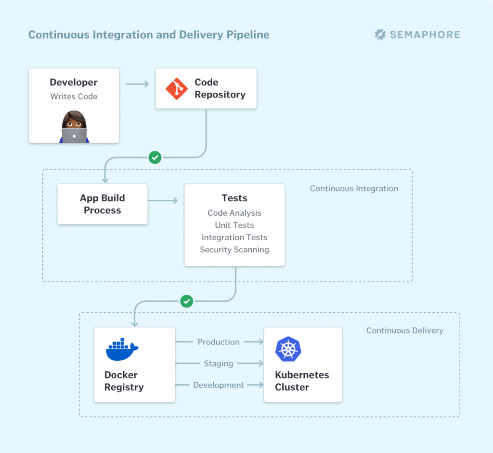

---
title: What is Continuous Integration?
author-meta: Marko Anastasov
subtitle: semaphoreci.com
rights:  Creative Commmons Attribution-NonCommercialNoDerivatives 4.0 International
language: en-US
...

Continuous integration (CI) is a software development practice in which developers merge their changes to the main branch many times per day. Each merge triggers an automated code build and test sequence, which ideally runs in less than 10 minutes. A successful CI build may lead to further stages of continuous delivery.

If a build fails, the CI system blocks it from progressing to further stages. The team receives a report and repairs the build quickly, typically within minutes.

All competitive technology companies today practice continuous integration. By working in small iterations, the software development process becomes predictable and reliable. Developers can iteratively build new features. Product managers can bring the right products to market, faster. Developers can fix bugs quickly and usually discover them before they even reach users.

Continuous integration requires all developers who work on a project to commit to it. Results need to be transparently available to all team members and build status reported to developers when they are changing the code. In case the main code branch fails to build or pass tests, an alert usually goes out to the entire development team who should take immediate action to get it back to a “green” state.

## Why do we need Continuous Integration?

In business, especially in new product development, we often don’t have time or ability to figure everything upfront. Taking smaller steps helps us estimate more accurately and validate more frequently. A shorter feedback loop means having more iterations. And it’s the number of iterations, not the number of hours invested, that drives learning.

For software development teams, working in long feedback loops is risky, as it increases the likelihood of errors and the amount of work needed to integrate changes into a working version software.

Small, controlled changes are safe to happen often. And by automating all integration steps, developers avoid repetitive work and human error. Instead of having people decide when and how to run tests, a CI tool monitors the central code repository and runs all automated tests on every commit. Based on the total result of tests, it either accepts or rejects the code commit.

Read more: [on software integration problems](https://semaphoreci.com/community/tutorials/continuous-integration).

## Extension with Continuous Delivery

Once we automatically build and test our software, it gets easier to release it. Thus Continuous Integration is often extended with Continuous Delivery, a process in which code changes are also automatically prepared for a release (CI/CD).

[In a fine-tuned CI/CD process](https://semaphoreci.com/cicd), all code changes are being deployed to a staging environment, a production environment, or both after the CI stage has been completed.

Continuous delivery can be a fully automated workflow. In that case, it’s usually referred to as Continuous Deployment. Or, it can be partially automated with manual steps at critical points. What’s common in both scenarios is that developers always have a release artifact from the CI stage that has gone through a standardized test process and is ready to be deployed.

Read more: [On the difference between continuous integration, continuous delivery, and continuous deployment](https://semaphoreci.com/blog/2017/07/27/what-is-the-difference-between-continuous-integration-continuous-deployment-and-continuous-delivery.html).

## CI and CD pipeline

CI and CD are often represented as a pipeline, where new code enters on one end, flows through a series of stages (build, test, staging, production), and published as a new production release to end users on the other end.

Each stage of the CI/CD pipeline is a logical unit in the delivery process. Developers usually divide each unit into a series of subunits that run sequentially or in parallel.

{ width=80% }

For example, we can split testing into low-level unit tests, integration tests of system components working together, and high-level tests of the user interface.

Additionally, each stage in the pipeline acts as a gate that evaluates a certain aspect of the code. Problems detected in an early stage stop the code from progressing further through the pipeline. It doesn’t make sense to run the entire pipeline if we have fundamental bugs in code to fix first. Detailed results and logs about the failure are immediately sent to the team to fix.

Because CI/CD pipelines are so integral to the development process, high performance and high availability are paramount for developer productivity.

Read more: [on CI/CD pipelines](https://semaphoreci.com/blog/cicd-pipeline).

## Prerequisites for doing Continuous Integration

The basic prerequisites for implementing continuous integration include:

- Automating builds;
- Automating testing;
- More frequent commits to a single source code repository, and
- Providing visibility of the process and real-time access to CI status to the team.

Teams that don’t practice CI yet should take small steps, continuously improve, and iterate on code and process in a way that helps the organization grow.

On every step in the journey to full CI/CD, the development team’s productivity will rise, as well as the velocity of the entire business.

## A typical development workflow

You can apply continuous integration in most software projects, including web applications, cloud-native microservices, mobile apps, system software, IoT / embedded systems and more.

[Semaphore](https://semaphoreci.com/) integrates with GitHub, bringing CI/CD into the standard pull request-based development process.

Here’s a typical continuous integration workflow that Semaphore users practice on a daily basis:

- A developer creates a new branch of code in GitHub, makes changes in the code, and commits them.
- When the developer pushes her work to GitHub, Semaphore builds the code and then runs the automated test suite.
- If Semaphore detects any errors in the CI pipeline (status: red), the developer gets a Slack notification or sees a message on her personal dashboard on Semaphore.
    - If the developer has opened a pull request, Semaphore also reports the CI status on the pull request page on GitHub.
- Otherwise, the user gets a notification that CI has passed (status green). Semaphore automatically initiates the next pipeline which deploys a new version of the application to a staging server. This allows QA or anyone else on the team to test the changes in a production-like environment.
- Once another developer has verified the changes in a peer review, the author can merge the new branch of code into the master branch.
- Semaphore runs one more build and test pipeline on the master branch, and when it passes it deploys a new version of the code to production. The team gets a notification about a new release via Slack.

## Benefits of continuous integration

CI provides numerous benefits for your software development team including improving developer productivity, automating the development process, improving code quality and software reliability.

### Improved developer productivity

The biggest benefit of practicing continuous integration is increased developer productivity. Continuous integration frees developers from manual tasks and the pains of integrating their code with other parts of the system. Instead, they can focus on programming the logic that delivers the features the business needs. Or they can use the time CI has saved them to invest in professional growth.

Teams that work in a fast CI feedback loop can deliver more value to customers than teams that struggle to integrate each other’s work or suffer from a slow pipeline that doesn’t scale.

### Deliver working software more often

Continuous integration is a way for your team to automatically build and test every single change in the source code. This is the foundation that enables your broader software delivery process to be efficient, resilient, fast, and secure.

### Find bugs earlier, fix them faster

The automated testing process can include many different types of checks:

- Verify code correctness;
- Validate application behavior from a customer’s perspective;
- Compare coding style with industry-standard conventions;
- Test code for common security holes;
- Detect security updates in third-party dependencies;
- Measure test coverage: how much of your application’s features are covered by automated tests.

Building these tests into your CI pipeline, measuring and improving the score in each is a guaranteed way to maintain a high quality of your software.

A CI tool provides instant feedback to developers on whether the new code they wrote works, or introduces bugs or regression in quality. Mistakes caught early on are the easiest to fix.

## Continuous integration tools

Continuous integration is, first and foremost, a process derived from your organization’s culture. No tool can make developers collaborate in small iterations, maintain an automated build process and write tests. However, having a reliable CI tool to run the process is crucial for success.

[Semaphore](https://semaphoreci.com/) is designed to enable your organization to build a high-performing, highly available CI process with almost unlimited scale. Semaphore provides support for popular languages on Linux and iOS, with the ability to run any Docker container that you specify.

With the advantages of tight integration with GitHub and ability to model custom pipelines that can communicate with any cloud endpoint, Semaphore is highly flexible. Embracing the serverless computing model, your CI process scales automatically with no time spent on queues. Your organization has nothing to maintain and pays based on time spent on execution.

Whatever CI tool you choose, we recommend that you pick the one which maximizes your organization’s productivity. Feature-wise, your CI provider should be a few steps ahead of your current needs, so that you’re certain that it can support you as you grow.

### Build and testing tools

You can consider all tools used within your build and test steps as your CI value chain. This includes tools like code style and complexity analyzer, build and task automation tool, unit and acceptance testing frameworks, browser testing engine, security and performance testing tools, etc.

Choose tools which are widely adopted, are well documented and are actively maintained.

**Wide adoption** is reflected by a large number of package downloads (often in millions) and open source contributors. Googling common use cases returns a solid number of examples from credible sources.

**Well documented tools** are easy to get started with. A searchable documentation website provides information on accomplishing more complex tasks. You will often find books covering their use in depth.

**Actively maintained tools** have had their latest release recently, at least within the last 6 months. The last commit in source code happened less than a month ago. The best tools evolve with the ecosystem and provide timely bug fixes and security updates.

## Continuous Integration best practices

The following is a brief summary of CI best practices.

**Treat master build as if you’re going to make a release at any time**. Which implies some team-wide don’ts:

- Don’t comment out failing tests. File an issue and fix them instead.
- Don’t check-in on a broken build and never go home on a broken build.

**Keep the build fast: up to 10 minutes**. Going slower is good but [doesn’t enable a fast-enough feedback loop](https://semaphoreci.com/blog/2017/03/02/what-is-proper-continuous-integration.html).

**Parallelize tests**. Start by splitting by type (eg. unit and integration), then adopt tools that can parallelize each.

**Have all developers commit code to master at least 10 times per day**. Avoid long-running feature branches which result in large merges. Build new features iteratively and use feature flags to hide work-in-progress from end users.

**Wait for tests to pass before opening a pull request**. Keep in mind that a pull request is by definition a call for another developer to review your code. Be mindful of their time.

**Test in a clone of the production environment**. You can [define your CI environment with a Docker image](https://semaphoreci.com/product/docker), and make the CI environment fully match production. An alternative is to customize the CI environment so that bugs due to difference with production almost never happen.

**Use CI to maintain your code**. For example, run scheduled workflows to detect newer versions of your libraries and upgrade them.

**Keep track of key metrics**: total CI build time (including queue time, which your CI tool should maintain at zero) and how often your master is red.

\newpage

© __BUILD_YEAR__ Rendered Text. All rights reserved.

This work is licensed under Creative Commmons
Attribution-NonCommercial-NoDerivatives 4.0 International.
To view a copy of this license, visit
<https://creativecommons.org/licenses/by-nc-nd/4.0>

The source text is open source:
<https://github.com/semaphoreci/papers>

Originally published at:
<https://semaphoreci.com/continuous-integration>

Authors: Marko Anastasov

Build date: __BUILD_MONTH__ __BUILD_YEAR__

Revision: __BUILD_REVISION__

\newpage
