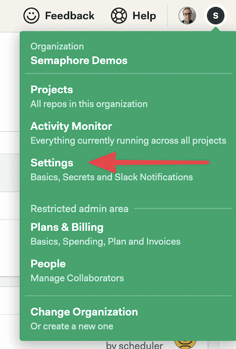
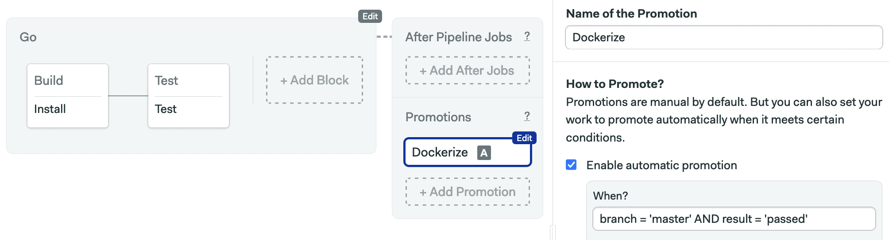

---
title: How To Deploy a Go Web Application with Docker
author-meta: Kulshekhar Kabra
subtitle: semaphoreci.com
rights:  Creative Commmons Attribution-NonCommercialNoDerivatives 4.0 International
language: en-US
...


While most Go applications compile to a single binary, web  applications also ship with templates, assets and configuration files;  these can get out of sync and cause faulty deployments. 

Docker lets us create a self-contained image with everything our  application needs to work. In this tutorial, you will learn how to  deploy a Go web application with Docker, and how Docker can help improve your development workflow and deployment process. 

### Goals

By the end of this article, you will:

-   Have a basic understanding of Docker,
-   Find out how Docker can help you while developing a Go application,
-   Learn how to create a Docker container for a Go application for production, and
-   Know how to use [Continuous Integration and Delivery](https://semaphoreci.com/cicd) (CI/CD) to automatically [build](https://semaphoreci.com/blog/build-stage) a Docker image.

### Prerequisites

For this tutorial, you will need:

-   Docker installed on your machine.
-   A free [Docker Hub](https://hub.docker.com) account.
-   A [Semaphore](https://semaphoreci.com) account.

You can find all the code for this tutorial in the [golang-mathapp](https://github.com/TomFern/golang-mathapp) repository.


[TomFern](https://github.com/TomFern) / [golang-mathapp](https://github.com/TomFern/golang-mathapp)

## Understanding Docker

Docker helps you create a single deployable unit for your  application. This unit, also known as a container, has everything the  application needs to work. This includes the code (or binary), the  runtime, the system tools and libraries.

Packing all the requirements into a single unit ensures an identical  environment for the application, wherever it is deployed. It also helps  to maintain identical development and production setups.

Containers also eliminate a whole class of issues caused by files  being out of sync or due to subtle differences in the production  environments. 

### Advantages over Virtual Machines

Containers offer similar resource allocation and isolation benefits as virtual machines. However, the similarity ends there.

A virtual machine needs its own guest operating system while a  container shares the kernel of the host operating system. This means  that containers are much lighter and need fewer resources. A virtual  machine is, in essence, an operating system within an operating system.  Containers, on the other hand, are just like any other application in  the system. Basically, containers need fewer resources (memory, disk  space, etc.) than virtual machines, and have much faster start-up times  than virtual machines.

### Benefits of Docker During Development

Some of the benefits of using Docker in development include:

-   A standard development environment used by all team members,
-   Updating dependencies centrally and using the same container everywhere,
-   An identical environment in development to that of production, and
-   Fixing potential problems that might appear only in production.

### Why Use Docker with a Go Web Application?

Most Go applications are simple binaries. This begs the question—why  use Docker with a Go application? Some of the reasons to use Docker with Go include:

-   Web applications typically have templates and configuration files. Docker helps keep these files in sync with the binary.
-   Docker ensures identical setups in development and production. There are times when an application works in development, but not in production. Using  Docker frees you from having to worry about problems like these.
-   Machines, operating systems, and installed software can vary significantly across a large team. Docker provides a mechanism to ensure a consistent  development setup. This makes teams more productive and reduces friction and avoidable issues during development.

## Creating a Simple Go Web Application

We’ll create a simple web application in Go for demonstration in this article. This application, which we’ll call *MathApp*, will:

-   Expose routes for different mathematical operations,
-   Use HTML templates for views,
-   Use a configuration file to customize the application, and
-   [Include tests for selected functions](https://semaphoreci.com/blog/unit-testing).

Visiting `/sum/3/6` will show a page with the result of adding `3` and `6`. Likewise, visiting `/product/3/6` will show a page with the product of `3` and `6`.

In this article, we used the [Beego](https://beego.vip) framework. Note that you can use any framework (or none at all) for your application.

### Final Directory Structure

Upon completion, the directory structure of MathApp will look like:

```bash
MathApp
    ├── Dockerfile
    ├── Dockerfile.production
    └── src
        ├── conf
        │   └── app.conf    
        ├── go.mod    
        ├── go.src
        ├── main.go
        ├── main_test.go    
        ├── vendor
        └── views
            ├── invalid-route.html
            └── result.html
```

The main application file is `main.go`, located at the `src` directory. This file contains all the functionality of the app. Some of the functionality from `main.go` is tested using `main_test.go`.

The `views` folder contains the view files `invalid-route.html` and `result.html`. The configuration file `app.conf` is placed in the `conf` folder. Beego uses this file to customize the application.

### Create the GitHub Repository

We’ll use [Go mod](https://blog.golang.org/using-go-modules), the official module manager, to handle Go modules in a portable way without having to worry about GOPATH.

We’ll start by creating a GitHub repository and cloning it to your machine.


Use the repository name to initialize the project:

```bash
$ mkdir src
$ cd src
$ export GOFLAGS=-mod=vendor
$ export GO111MODULE=on
$ go mod init github.com/YOUR_GITHUB_USER/YOUR_REPOSITORY_NAME 
# (example: go mod init github.com/tomfern/go-web-docker)
```

From now on, we can use these commands:

```bash
$ go mod download
$ go mod vendor
$ go mod verify
```

To download the required dependencies in the `vendor/` folder (instead of downloading them in the `GOROOT`, this will come in handy later).

### Application File Contents

Before continuing, let’s create the file structure:

```bash
$ mkdir conf views
```

The main application file (`main.go`) contains all the application logic. The contents of this file are as follows:

```go
// main.go

package main

import (
    "strconv"
    
    "github.com/astaxie/beego"
)


func main() {
    /* This would match routes like the following:
       /sum/3/5
       /product/6/23
       ...
    */
    beego.Router("/:operation/:num1:int/:num2:int", &mainController{})
    beego.Run()
}

type mainController struct {
    beego.Controller
}


func (c *mainController) Get() {

    //Obtain the values of the route parameters defined in the route above    
    operation := c.Ctx.Input.Param(":operation")
    num1, _ := strconv.Atoi(c.Ctx.Input.Param(":num1"))
    num2, _ := strconv.Atoi(c.Ctx.Input.Param(":num2"))

    //Set the values for use in the template
    c.Data["operation"] = operation
    c.Data["num1"] = num1
    c.Data["num2"] = num2
    c.TplName = "result.html"

    // Perform the calculation depending on the 'operation' route parameter
    switch operation {
    case "sum":
        c.Data["result"] = add(num1, num2)
    case "product":
        c.Data["result"] = multiply(num1, num2)
    default:
        c.TplName = "invalid-route.html"
    }
}

func add(n1, n2 int) int {
    return n1 + n2
}

func multiply(n1, n2 int) int {
    return n1 * n2
}
```

In your application, this might be split across several files.  However, for the purpose of this tutorial, I like to have everything in  one place.

### Test File Contents

The `main.go` file has some functions which need to be tested. The tests for these functions can be found in `main_test.go`. The contents of this file are as follows:

```go
// main_test.go

package main

import "testing"

func TestSum(t *testing.T) {
    if add(2, 5) != 7 {
        t.Fail()
    }
    if add(2, 100) != 102 {
        t.Fail()
    }
    if add(222, 100) != 322 {
        t.Fail()
    }
}

func TestProduct(t *testing.T) {
    if multiply(2, 5) != 10 {
        t.Fail()
    }
    if multiply(2, 100) != 200 {
        t.Fail()
    }
    if multiply(222, 3) != 666 {
        t.Fail()
    }
}
```

Testing your application is particularly useful if you want to do [Continuous Deployment](https://semaphoreci.com/cicd). If you have [adequate testing in place](https://semaphoreci.com/blog/automated-testing-cicd), then you can make stress-free deployments anytime, any day of the week.

### View Files Contents

The view files are HTML templates;  these are used by the application to display the response to a request. The content of `views/result.html` is as follows:

```markup
<!-- views/result.html -->
<!doctype html>
<html>
    <head>
        <title>MathApp - {{.operation}}</title>
    </head>
    <body>
        The {{.operation}} of {{.num1}} and {{.num2}} is {{.result}}
    </body>
</html>
```

The content of `views/invalid-route.html` is as follows:

```markup
<!-- invalid-route.html -->
<!doctype html>
<html>
    <head>
        <title>MathApp</title>
        <meta name="viewport" content="width=device-width, initial-scale=1">
        <meta charset="UTF-8">
    </head>

    <body>
        Invalid operation
    </body>
</html>
```

### Configuration File Contents

The `conf/app.conf` file is read by Beego to configure the application. Its content is as follows:

```
appname = mathapp
runmode = "dev"
httpport = 8010
```

In this file:

-   **appname**: is the name of the process that the application will run as,
-   **httpport**: is the port on which the application will be served, and
-   **runmode**: specifies which mode the application should run in. Valid values include `dev` for development and `prod` for production.

Finally, if you haven’t yet done so, install the Go modules with:

```bash
$ go mod download
$ go mod vendor
$ go mod verify
```

## Using Docker During Development

This section will explain the benefits of using Docker during  development, and walk you through the steps required to use Docker in  development.

### Configuring Docker for Development

We’ll use a `Dockerfile` to configure Docker for development. The setup should satisfy the following requirements for the development environment:

-   We will use the application mentioned in the previous section,
-   The files should be accessible both from inside and outside of the container,
-   We will use the `bee` tool, this will be used to live-reload the app (inside the Docker container) during development,
-   Docker will expose the application on port `8010`,
-   In the Docker container, the application is located at `/home/app`,
-   The name of the Docker image we’ll create for development will be `mathapp.`

**Step 1 – Creating the Dockerfile**

Go back to the top level of your project:

```bash
$ cd ..
```

The following Dockerfile should satisfy the above requirements.

```docker
FROM golang:1.18-bullseye

RUN go install github.com/beego/bee/v2@latest

ENV GO111MODULE=on
ENV GOFLAGS=-mod=vendor

ENV APP_HOME /go/src/mathapp
RUN mkdir -p "$APP_HOME"

WORKDIR "$APP_HOME"
EXPOSE 8010
CMD ["bee", "run"]
```

The first line:

```docker
FROM golang:1.18-bullseye
```

References the official image for Go as the base image. This image comes with Go 1.18 pre-installed. 

The second line:

```docker
RUN go install github.com/beego/bee/v2@latest
```

Installs the `bee` tool globally (Docker commands run as root by default), which will be used to live-reload our code during development.

Next, we configure the environment variables for Go modules:

```docker
ENV GO111MODULE=on
ENV GOFLAGS=-mod=vendor
```

The next lines:

```docker
ENV APP_HOME /go/src/mathapp
RUN mkdir -p "$APP_HOME"
WORKDIR "$APP_HOME"
```

Creates a folder for the code and makes it active.

The next to last line tells Docker that port `8010` is of interest.

```docker
EXPOSE 8010
```

 The final line:

```docker
CMD ["bee", "run"]
```

Uses the `bee` command to start our application.

**Step 2 – Building the Image**

Once the Docker file is created, run the following command to create the image:

```bash
$ docker build -t mathapp-development .
```

Executing the above command will create an image named `mathapp`:

-   **-t mathapp**: sets the tag name for the new image, we can reference the image later as `mathapp:latest`
-   Don’t forget to type the last dot (.) in the command, otherwise you’ll get an error.

This command can be used by everyone working on this application.  This will ensure that an identical development environment is used  across the team.

To see the list of images on your system, run the following command:

```bash
$ docker images
```

Note that the exact names and number of images might vary. However, you should see at least the `golang` and `mathapp` images in the list:

```bash
REPOSITORY               TAG            IMAGE ID            CREATED                 SIZE
golang                   1.18           25c4671a1478        2 weeks ago             809MB
mathapp-development      latest         8ae092824585        60 seconds ago          838MB
```

**Step 3 – Running the Container**

Once you have `mathapp`, you can start a container with:

```bash
$ docker run -it --rm -p 8010:8010 -v $PWD/src:/go/src/mathapp mathapp-development
```

Let’s break down the above command to see what it does.

-   The `docker run` command is used to run a container from an image,
-   The `-it` flag starts the container in an interactive mode (tie it to the current shell),
-   The `--rm` flag cleans out the container after it shuts down,
-   The `--name mathapp-instance` names the container `mathapp-instance`,
-   The `-p 8010:8010` flag allows the container to be accessed at port `8010`,
-   The `-v $PWD/src:/go/src/mathapp` is more involved. It maps the `src/` directory from the machine to `/go/src/mathapp` in the container. This makes the development files available inside and outside the container, and
-   The `mathapp` part specifies the image name to use in the container.

Executing the above command starts the Docker container. This container exposes your application on port `8010`. It also rebuilds your application automatically whenever you make a  change. You should see the following output in your console:

```
______
| ___ \
| |_/ /  ___   ___
| ___ \ / _ \ / _ \
| |_/ /|  __/|  __/
\____/  \___| \___| v2.0.2
2022/05/10 13:39:29 INFO     ▶ 0003 Using 'mathapp' as 'appname'
2022/05/10 13:39:29 INFO     ▶ 0004 Initializing watcher...
2020/03/17 14:43:24.912 [I] [asm_amd64.s:1373]  http server Running on http://:8010
```

To check the setup, visit `http://localhost:8010/sum/4/5` in your browser. You should see something similar to the following:


**Note:** This assumes that you’re working on your local machine.

To try the live-reload feature, make a modification in any of the source files. For instance, edit `src/main.go`, replace this line:

```go
c.Data["operation"] = operation
```

To something like this:

```go
c.Data["operation"] = "real " + operation
```

Bee should pick up the change, even inside the container, and reload the application seamlessly:

```bash
______
| ___ \
| |_/ /  ___   ___
| ___ \ / _ \ / _ \
| |_/ /|  __/|  __/
\____/  \___| \___| v2.0.2
2022/05/10 13:39:29 INFO     ▶ 0003 Using 'mathapp' as 'appname'
2022/05/10 13:39:29 INFO     ▶ 0004 Initializing watcher...
2022/05/10 13:39:29 INFO.   [asm_amd64.s:1373]  http server Running on http://:8010
```

Now reload the page on the browser to see the modified message:


## Using Docker in Production

This section will explain how to deploy a Go application in a Docker container. We will use Semaphore to do the following:

-   [Automatically build](https://semaphoreci.com/blog/build-stage) after changes are pushed to the git repository,
-   [Automatically run tests](https://semaphoreci.com/blog/20-types-of-testing-developers-should-know),
-   Create a Docker image if the build is successful and if the tests pass, and
-   Push the Docker image to Docker Hub.

### Creating a Dockerfile for Production

We’ll write a new Dockerfile to create a complete, self-contained image; without external dependencies. 

Enter the following contents in a new file called `Dockerfile.production`:

```docker
# Dockerfile.production

FROM registry.semaphoreci.com/golang:1.18 as builder

ENV APP_HOME /go/src/mathapp

WORKDIR "$APP_HOME"
COPY src/ .

RUN go mod download
RUN go mod verify
RUN go build -o mathapp

FROM registry.semaphoreci.com/golang:1.18

ENV APP_HOME /go/src/mathapp
RUN mkdir -p "$APP_HOME"
WORKDIR "$APP_HOME"

COPY src/conf/ conf/
COPY src/views/ views/
COPY --from=builder "$APP_HOME"/mathapp $APP_HOME

EXPOSE 8010
CMD ["./mathapp"]
```

Let’s take a detailed look at what each of these commands does. The first command:

```docker
FROM registry.semaphoreci.com/golang:1.18 as builder
```

Tells us this is a [multi-stage build](https://docs.docker.com/develop/develop-images/multistage-build/); it defines an intermediate image that will only have one job: compile the Go binary. 

You might have noticed that we’re not pulling the image from Docker  Hub, the default image registry. Instead, we’re using the Semaphore  Docker Registry, which is more convenient, faster, and pulls don’t count against your Docker Hub [rate limits](https://docs.docker.com/docker-hub/download-rate-limit/).

The following commands:

```docker
ENV APP_HOME /go/src/mathapp

WORKDIR "$APP_HOME"
COPY src/ .
```

Creates the application folder for the app and copies the source code.

The last commands in the intermediate image download the modules and build the executable:

```docker
RUN go mod download
RUN go mod verify
RUN go build -o mathapp
```

Next comes the final and definitive container, where we will run the services.

```docker
FROM registry.semaphoreci.com/golang:1.18
```

We use the `COPY` command to copy files into the image, the `--from` argument let us copy the generated binary from the `builder` stage.

```docker
COPY src/conf/ conf/
COPY src/views/ views/
COPY --from=builder $APP_HOME/mathapp $APP_HOME
```

We finalize by exposing the port and starting the binary:

```docker
EXPOSE 8010
CMD ["./mathapp"]
```

To build the deployment image:

```bash
$ docker build -t mathapp-production -f Dockerfile.production .
```

You can run it with:

```bash
$ docker run -it -p 8010:8010 mathapp-production
```

Notice that we don’t need to map any directories, as all the source files are included in the container.

### Continuous Integration with Semaphore

Docker is a great solution to package and deploy Go applications. The only downside is the additional steps required to build and test the  image. This hurdle is easily is best dealt with [Continuous Integration and Continuous Delivery](https://semaphoreci.com/cicd) (CI/CD).

A [Continuous Integration](https://semaphoreci.com/continuous-integration) (CI) platform can test our code on every iteration, on every push and  every merge. Developers adopting CI no longer have to fear of merging  branches, nor be anxious about release day. In fact, CI lets developers  merge all the time and make safe releases any day of the week. A good CI setup will run a series of comprehensive tests, like the ones we  prepared so far, to weed out any bugs.

Once the code is ready, we can extend our CI setup with [Continuous Delivery](https://semaphoreci.com/cicd) (CD). CD can prepare and build the Docker images, leaving them ready to deploy at any time. 

## Push the Code to GitHub

Let’s push our modifications to GitHub:

-   Open `.gitignore` and uncomment the `vendor/` line, so vendored modules are not committed:

```
# Dependency directories (remove the comment below to include it)
vendor/

# Build artifact
src/mathapp
```

-   Push all the code with git:

```bash
$ git add Dockerfile*
$ git add src
$ git add .gitignore
$ git commit -m "initial commit"
$ git push origin master
```

### Adding the Repository to Semaphore

We can add CI to our project for free in just a few minutes:

-   Go to Semaphore and sign up using the **Sign up with GitHub** button. This will link up both accounts.
-   Click on the **+ Create New** to create a new project:

{ width=50% }

-   Find your GitHub repository and click on **Choose**:

{ width=70% }

-   Select the **Go** starter workflow. Click on **Customize it first**:

{ width=70% }

You’ll get the **Workflow Editor**. Here’s an overview of how it works:


-   **Pipeline**: A [pipeline](https://semaphoreci.com/blog/cicd-pipeline) has a specific objective, e.g. building or testing. Pipelines are made  of blocks that are executed from left to right in an agent.
-   **Agent**: The agent is the virtual machine that powers the pipeline. We have three [machine types](https://docs.semaphoreci.com/ci-cd-environment/machine-types/) to choose from. The machine runs an optimized [Ubuntu 20.04](https://docs.semaphoreci.com/ci-cd-environment/ubuntu-20.04-image/) image with build tools for many languages.
-   **Block**:  blocks group jobs that can be executed in [parallel](https://semaphoreci.com/blog/revving-up-continuous-integration-with-parallel-testing). Jobs in a block usually have similar commands and configurations. Once all jobs in a  block complete, the next block begins.
-   **Job**: jobs define the commands that do the work. They inherit their configuration from their parent block.

Coming back to our setup. The started workflow expects the code at the project’s root, but our code is inside the `src` directory so we need to make a small modification:

-   Click on the **Test** block. 
-   On the right side, you’ll find the job’s commands, change them so they look like this:

```bash
sem-version go 1.18
export GO111MODULE=on
export GOPATH=~/go
export PATH=/home/semaphore/go/bin:$PATH
checkout
cd src
go get ./...
go test ./...
go build -v .
```


-   Click on the **Run the Workflow** and then on **Start** to get the pipeline running:


If all goes well, after a few seconds the job should be completed without errors.

## Enhancing the CI Pipeline

In this section, we’ll modify the pipeline so that:

-   Go dependencies are cached to having to avoid re-download on each run.
-   Tests get their own block so we can [scale out testing more easily](https://semaphoreci.com/blog/revving-up-continuous-integration-with-parallel-testing).

To get started, click on the **Edit Workflow button**, then:

1.  Click on the block. We’ll completely replace its contents.
2.  Change the name of the block and the job to “Install”.
3.  Type the following content in the Job command box:

```bash
sem-version go 1.18
export GO111MODULE=on
export GOPATH=~/go
export PATH=/home/semaphore/go/bin:$PATH
checkout
cd src
cache restore vendor-$SEMAPHORE_GIT_BRANCH-$(checksum go.mod),vendor-$SEMAPHORE_GIT_BRANCH,vendor-master
go mod vendor
cache store vendor-$SEMAPHORE_GIT_BRANCH-$(checksum go.mod),vendor-$SEMAPHORE_GIT_BRANCH,vendor-master vendor
```


I think this is a good opportunity to learn about the Semaphore [toolbox](https://docs.semaphoreci.com/reference/toolbox-reference/) of built-in commands:

-   **checkout**: the checkout commands clones the  correct revision of the GitHub repository and changes the directory.   It’s usually the first command in a job.
-   **sem-version**: with sem-version, we can switch the active version of a language. Semaphore fully supports many languages, including [Go](https://docs.semaphoreci.com/programming-languages/go/). 
-   **cache**: the cache is a project file storage. We’ll use the cache to persist the `vendor/` directory.

Let’s go back to our pipeline:

1.  Use the **+ Add Block** dotted line button to create a new block.
2.  Call the block and the job “Test”.
3.  Open the **Environment Variables** section and create the `GO111MODULE` and `GOFLAGS` variables like we did on the previous block. 
4.  Open the **Prologue** section, which executed before each job in the block, and type the following commands:

```
sem-version go 1.18
export GO111MODULE=on
export GOPATH=~/go
export PATH=/home/semaphore/go/bin:$PATH
checkout
cd src
cache restore vendor-$SEMAPHORE_GIT_BRANCH-$(checksum go.mod),vendor-$SEMAPHORE_GIT_BRANCH,vendor-master
```

1.  Type the following command in the job:

```
go test ./...
```


1.  Click on **Run the Workflow** and **Start** to try the updated pipeline.

## Building the Docker Image

So far all we did enters in the Continuous Integration category, the  natural next stage is to pack the application in a Docker container.

We’ll create a new delivery pipeline to:

-   Build a Docker Image with our Go binary and HTML templates.
-   Upload the image to Docker Hub so it’s ready for deployment.

First, we have to tell Semaphore how to connect to Docker Hub:

1.  On the account menu, click on **Settings**:

{ width=40% }

1.  Click on **Secrets** and then **Create New Secret**.

2.  Create two variables for your Docker Hub username and password:

    -   `DOCKER_USENAME` = YOUR DOCKER USERNAME

    -   `DOCKER_PASSWORD` = YOU DOCKER PASSWORD

{ width=50% }

1.  Click on **Save**.

Going back to the pipeline:

1.  Click on **Edit Workflow**.
2.  Use the **+Add First Promotion** button to create a new linked pipeline:


1.  Change the name of the pipeline to “Dockerize”
2.  Check **Enable automatic promotion**. You can set conditions to trigger the pipeline here:



1.  Click **+Add Block**. We’ll call the new block “Build”
2.  Open the **Secrets** section and check the **dockerhub** box. This will import the variables we created earlier into the jobs in the block:


1.  Type the following commands in the job:

```bash
checkout
echo "$DOCKER_PASSWORD" | docker login  --username "$DOCKER_USERNAME" --password-stdin
docker pull $DOCKER_USERNAME/mathapp-production:latest
docker build -f Dockerfile.production --cache-from $DOCKER_USERNAME/mathapp-production:latest -t $DOCKER_USERNAME/mathapp-production:latest .
docker push $DOCKER_USERNAME/mathapp-production:latest
```


1.  Click on **Run the Workflow** and **Start**.
2.  Once the first two blocks are done, click on the **Promote** button:


Wait a few seconds until the Dockerize pipeline is done:


Check your Docker Hub repositories, you should find the new image, ready to use:


Finally, pull and test the new image in your machine:

```bash
$ docker pull YOUR_DOCKERHUB_USERNAME/mathapp-production
$ docker run -it -p 8010:8010 YOUR_DOCKERHUB_USERNAME/mathapp-production
```

## What’s Next

Docker opens up the possibilities for deployments:

-   **Self-hosted**: run the image directly on a VM. With some scripting, we can integrate automatic deployment to your CI/CD setup.
-   **PaaS**: many Platforms-as-a-Service offerings such as [Heroku](https://www.heroku.com/) can directly run Docker containers. For more details, check the links below.
-   **Kubernetes**: with Kubernetes, we can run the application at scale. Kubernetes brings a lot of features and is supported by almost every cloud provider.  Checks the links below for related tutorials.

**Heroku**:

-   [Continuous Deployment of a Python Flask Application with Docker and Semaphore](https://semaphoreci.com/community/tutorials/continuous-deployment-of-a-python-flask-application-with-docker-and-semaphore) 
-   [Dockerizing a PHP Application](https://semaphoreci.com/community/tutorials/continuous-deployment-of-a-python-flask-application-with-docker-and-semaphore)

**Kubernetes**:

-   Download our ebook for free: [CI/CD with Docker and Kubernetes](https://semaphoreci.com/resources/cicd-docker-kubernetes)
-   [CI/CD for Microservices on DigitalOcean Kubernetes](https://semaphoreci.com/blog/cicd-microservices-digitalocean-kubernetes)
-   [A Step-by-Step Guide to Continuous Deployment on Kubernetes](https://semaphoreci.com/blog/guide-continuous-deployment-kubernetes)
-   [Continuous Integration and Delivery to AWS Kubernetes](https://semaphoreci.com/blog/continuous-integration-delivery-aws-eks-kubernetes)

## Conclusion

In this tutorial, we learned how to create a Docker container for a  Go application and prepare a Docker container using Semaphore.

You should now be ready to use Docker to simplify the deployment of  your next Go application. If you have any questions, feel free to post  them in the comments below.

*P.S. Want to continuously deliver your applications made with Docker? Check out [Semaphore’s Docker support](https://semaphoreci.com/product/docker).*

**Read next:**

-   [Dockerizing a Python Django Web Application](https://semaphoreci.com/community/tutorials/building-and-testing-a-rest-api-in-go-with-gorilla-mux-and-postgresql)
-   [Building Go Web Applications and Microservices Using Gin](https://semaphoreci.com/community/tutorials/building-go-web-applications-and-microservices-using-gin)
-   [Lightweight Docker Images in 5 Steps](https://semaphoreci.com/blog/2016/12/13/lightweight-docker-images-in-5-steps.html)


\newpage

© __BUILD_YEAR__ Semaphore Technologies doo. All rights reserved.

This work is licensed under Creative Commmons
Attribution-NonCommercial-NoDerivatives 4.0 International.
To view a copy of this license, visit
<https://creativecommons.org/licenses/by-nc-nd/4.0>

The source text is open source:
<https://github.com/semaphoreci/papers>

Originally published at:
<https://semaphoreci.com/community/tutorials/how-to-deploy-a-go-web-application-with-docker>

Original publication date: 11 Jul 2022

Authors: Kulshekhar Kabra

Editor: Marko Anastasov

Reviewed by: Tomas Fernandez

Build date: __BUILD_MONTH__ __BUILD_YEAR__

Revision: __BUILD_REVISION__

\newpage
