---
title: Dockerizing a Python Django Web Application
author-meta: David Sale
subtitle: semaphoreci.com
rights:  Creative Commmons Attribution-NonCommercialNoDerivatives 4.0 International
language: en-US
...

This article will cover building a markdown editor application  written in Django and running it in the much talked about and discussed [Docker](https://www.docker.com). Docker takes all the great aspects of a traditional virtual machine,  e.g. a self-contained system isolated from your development machine and  removes many of the drawbacks such as system resource drain, setup time, and maintenance.

When building web applications, you have probably reached a point  where you want to run your application in a fashion that is closer to  your production environment. Docker allows you to set up your  application runtime in such a way that it runs in exactly the same  manner as it will in production, on the same operating system, with the  same environment variables, and any other configuration and setup you  require.

By the end of the article you’ll be able to:

-   Understand what Docker is and how it is used,
-   Build a simple Python Django application, and
-   Create a simple `Dockerfile` to build a container running a Django web application server.
-   Setup a [Continuous Integration and Delivery](https://semaphoreci.com/cicd) (CI/CD) pipelines to [build](https://semaphoreci.com/blog/build-stage) and test the Docker image automatically

## What is Docker, Anyway?

Docker’s homepage describes Docker as follows:

>   “Docker is an open platform for  building, shipping and running distributed applications. It gives  programmers, development teams, and operations engineers the common  toolbox they need to take advantage of the distributed and networked  nature of modern applications.”

Put simply, Docker gives you the ability to run your applications  within a controlled environment, known as a container, built according  to the instructions you define. A container leverages your machine’s  resources much like a traditional virtual machine (VM). However,  containers differ greatly from traditional virtual machines in terms of  system resources. Traditional virtual machines operate using  Hypervisors, which manage the virtualization of the underlying hardware  to the VM. This means they are large in terms of system requirements.

-   Docker doesn’t require the often time-consuming process of  installing an entire OS to a virtual machine such as VirtualBox or  VMWare.
-   You create a container with a few commands and then execute your applications on it via the Dockerfile.
-   Docker manages the majority of the operating system virtualization for you, so you can get on with writing applications and shipping them as you  require in the container you have built.
-   Dockerfiles can be  shared for others to build containers and extend the instructions within them by basing their container image on top of an existing one.
-   The containers are also highly portable and will run in the same manner  regardless of the host OS they are executed on. Portability is a massive plus side of Docker.

## Prerequisites

Before you begin this tutorial, ensure the following is installed to your system:

-   [Python](https://www.python.org) 3.9 or greater,
-   Python [Pip](https://pypi.org/project/pip/), the package manager,
-   [Docker](https://www.docker.com),
-   [Git](https://git-scm.com) and a [GitHub](https://github.com) account.

## Setting Up a Django web application

Let’s jump directly to the application that we’ll dockerize. We’ll  start from the Martor project, which implements a live markdown editor  for Django:

-   Go to the [django-martor-editor](https://github.com/agusmakmun/django-markdown-editor) repository. And **Fork it**.


[agusmakmun](https://github.com/agusmakmun) / [django-markdown-editor](https://github.com/agusmakmun/django-markdown-editor)

-   Clone the repository to your local machine.

Let’s take a look at the project structure, I’ve omitted some files and folders we won’t be visiting today:

```
.
├── requirements.txt    # < Python module list
└── martor_demo         # < Django Project root
    ├── app             # < App code
    │   ├── admin.py
    │   ├── apps.py
    │   ├── forms.py
    │   ├── migrations
    │   ├── models.py
    │   ├── templates
    │   ├── urls.py
    │   └── views.py
    ├── manage.py      # < Django management tool
    └── martor_demo    # < Django main settings
        ├── settings.py
        ├── urls.py
        └── wsgi.py
```

You can read more about the structure of Django on the [official website](https://www.djangoproject.com). You control the application for development purposes using the `manage.py` script.

Before we can run it though, we’ll need to download and all the dependencies.

First, create a Python [virtual environment](https://docs.python.org/3/library/venv.html):

```bash
$ python -m venv venv
$ echo venv/ >> .gitignore
$ source venv/bin/activate
```

Next, add some of the Python modules we’ll need:

-   **Gunicorn**: [gunicorn](https://gunicorn.org/index.html) is an HTTP server. We’ll use it to serve the application inside the Docker container.
-   **Martor**: [Martor](https://pypi.org/project/martor/) is Markdown plugin for Django

```bash
$ echo martor >> requirements.txt
$ echo gunicorn >> requirements.txt
```

Install all the modules using:

```bash
$ pip install -r requirements.txt
```

Push the change to GitHub:

```autoit
$ git add .gitignore requirements.txt
$ git commit -m "added martor and gunicorn"
$ git push origin master
```

And start the development server, you can visit your application at http://127.0.0.1:8000:

```bash
$ cd martor_demo
$ python manage.py runserver
```

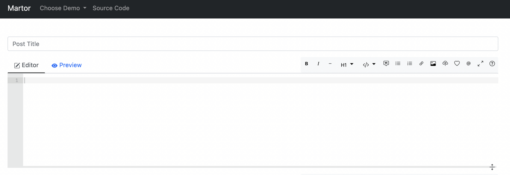

If you check the output of the previous command, you’ll see this message:

```
You have 18 unapplied migration(s). Your project may not work 
properly until you apply the migrations for app(s): admin, 
auth, contenttypes, sessions.
Run 'python manage.py migrate' to apply them.
```

Django prints this warning because it has detected that the database has not been initialized.

To initialize a local test database and get rid of the message run:

```bash
$ python manage.py makemigrations
$ python manage.py migrate
```

### Testing in Django

In this section, let’s add some tests to the application. Tests are our first line of defense against bugs.

Django uses the standard [Unittest](https://docs.python.org/3/library/unittest.html) library, so we can get on writing tests right away.

Create a file called `app/testPosts.py`:

```python
# app/testPosts.py

from django.test import TestCase
from app.models import Post


class PostTestCase(TestCase):
    def testPost(self):
        post = Post(title="My Title", description="Blurb", wiki="Post Body")
        self.assertEqual(post.title, "My Title")
        self.assertEqual(post.description, "Blurb")
        self.assertEqual(post.wiki, "Post Body")
```

The code is illustrative of a normal unit test:

-   Import the `Post` model from the application.
-   Create a `post` object with some initial values.
-   Check that the values match expectations.

To run the test case:

```bash
$ python manage.py test
Creating test database for alias 'default'...
System check identified no issues (0 silenced).
.
----------------------------------------------------------------------
Ran 1 test in 0.001s

OK
Destroying test database for alias 'default'...
```

Another tests that Django supplies are the [deployment checklists](https://docs.djangoproject.com/en/3.0/howto/deployment/checklist/). These are scripts that check for potentially dangerous security settings.

To run the checklist:

```bash
$ python manage.py check --deploy
```

You’ll likely see some warnings. For demo-ing, we can live with the  warnings. Once you go to production, you might want to take a closer  look at the messages and what they mean.

### Static vs Dynamic Files

We just need to make one modification before we can continue. Django has the concept of [static files](https://docs.djangoproject.com/en/3.0/howto/static-files/). These are files without any Python code, they are usually images, CSS stylesheets, or JavaScript.

The distinction between static and dynamic is important once we  release to production. Dynamic files have code that must be evaluated on each request, so they are expensive to run. Static files don’t need any execution, they don’t need a lot of resources to be served and can be  cached with proxies and CDNs.

To configure the static file location:

-   Edit the file `martor_demo/settings.py`
-   Locate the `STATIC_ROOT` and `MEDIA_ROOT` variables and **replace** the lines with these:

```python
# martor_demo/settings.py

. . .

STATIC_ROOT = os.path.join(BASE_DIR, "static")
MEDIA_ROOT = os.path.join(BASE_DIR, "media")
```

Django collects all static files in one directory:

```bash
$ python manage.py collectstatic
```

## Style checker

The final test we’ll do is a style check. Python has strict forms that can be validated using [Flake8](https://flake8.pycqa.org/en/latest/), a static analysis tool.

Install and run the tool to check there are no style errors in the project:

```
$ pip install flake8
$ flake8 . --max-line-length=127
```

### Continuous Integration

Before proceeding, push all modifications to GitHub:

```bash
$ git add martor_demo/settings.py app/testPosts.py
$ git add static
$ git commit -m "add unit test and static files"
$ git push origin master
```

With an initial application and [some tests in place](https://semaphoreci.com/blog/20-types-of-testing-developers-should-know), it’s time to focus on using [Continuous Integration](https://semaphoreci.com/continuous-integration) (CI) to build and test the code in a clean, reproducible environment.

Setting up a CI/CD [pipeline](https://semaphoreci.com/blog/cicd-pipeline) in Semaphore takes only a few minutes, once it’s in place it, Semaphore will run the tests for you on every update and, if there are no bugs,  build the Docker image automatically.

-   Visit [Semaphore](https://semaphoreci.com) and sign up for a free account using the **Sign up with GitHub** button.
-   Click on **Create new** to add your project from the Git repository.
-   Click on **Choose** next to your repository:

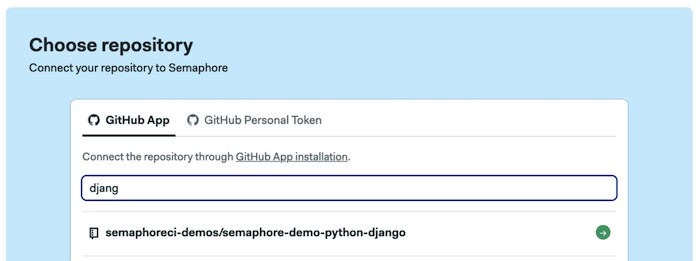


-   Click on **Continue to workflow setup**.
-   Select the single job templante and click on **Customize it first**

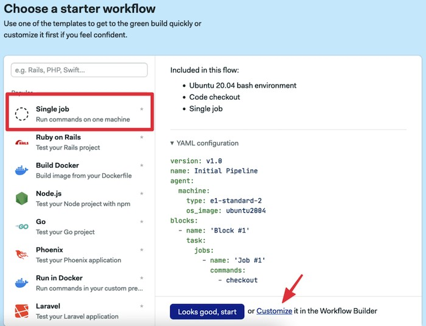

This will open the **Workflow Builder**:

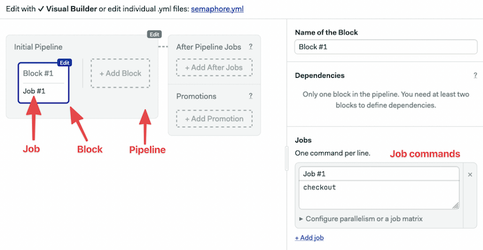

The main elements of the builder are:

-   **Pipeline**: a pipeline is made of blocks that are executed from left to right. Pipelines usually have a specific goal such as [building](https://semaphoreci.com/blog/build-stage) and testing code.
-   **Block**: blocks group jobs that can be executed in [parallel](https://semaphoreci.com/blog/revving-up-continuous-integration-with-parallel-testing). Jobs in a block usually have similar commands and configurations. Once all job in a block complete, the next block begins.
-   **Job**: jobs define the commands that do the work. They inherit their configuration from the parent block.
-   **Promotions**: We can define multiple pipelines and connect them with promotions to get complex multi-stage workflows.

The first block has to download the Python modules and build the project:

-   Click on the first block and set its name to “Build”
-   On the job commands block type the following:

```bash
sem-version python 3.9
checkout
mkdir .pip_cache
cache restore
pip install --cache-dir .pip_cache -r requirements.txt
cache store
```

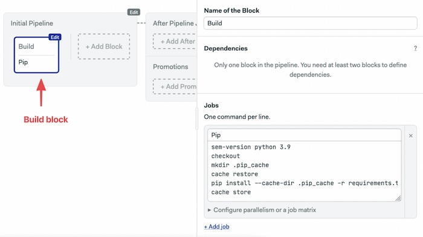

-   Click on **Run the Workflow**.
-   Set the branch to **master**.
-   Click on **Start**.

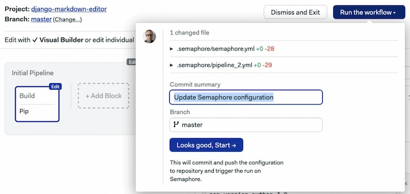

We have three commands in Semaphore’s built-in [toolbox](https://docs.semaphoreci.com/reference/toolbox-reference/):

-   **sem-version** activates a specific version of one of the [supported languages](https://docs.semaphoreci.com/programming-languages/python/). In the case of Python, it also setups a virtual environment.
-   **checkout** uses git to clone correct code revision.
-   **cache** stores and restores files in the project-wide cache. Cache can figure  out which files and directories it needs to keep. We can use it to avoid having to download Python packages each time.

The initial CI pipeline will start immediately, a few seconds later it should complete without error:

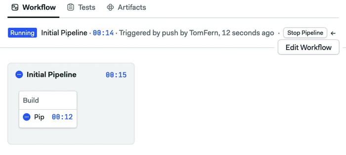Build stage job

Add a second block to run the tests:

1.  Click on **Edit Workflow**.
2.  Click on **+ Add Block.**
3.  Set the name of the block to “Test”.
4.  Open the **Prologue** section, type the following commands. The prologue is executed before each job in the block:

```bash
sem-version python 3.9
checkout
cache restore
pip install --cache-dir .pip_cache -r requirements.txt
cd martor_demo
python manage.py makemigrations
python manage.py migrate
python manage.py test
```

1.  Add a second job called “Checklist” and add the following commands:

```bash
cd martor_demo
python manage.py check --deploy
```

1.  This is a good place to add some style checking. Add a third job called “Style check” with the following commands. We’re using [flake8](http://flake8.pycqa.org/en/latest/) to check the style of the code:

```bash
pip install flake8
flake8 martor_demo/ --max-line-length=127
```


1.  Click on **Run the Workflow** and **Start:**

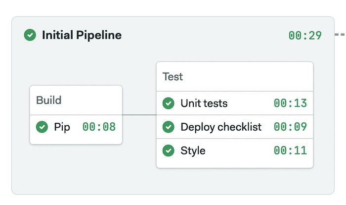{ width=60% }

## Dockerizing the Application

You now have a simple web application that is ready to be deployed.  So far, you have been using the built-in development web server that  Django ships with.

It’s time to set up the project to run the application in Docker  using a more robust web server that is built to handle production levels of traffic:

-   **Gunicorn**: [Gunicorn](http://gunicorn.org) is an HTTP server for Python. This web server is robust and built to  handle production levels of traffic, whereas the included development  server of Django is more for testing purposes on your local machine  only. It will handle all dynamic files.
-   **Ngnix**: is a general-purpose HTTP server, we’ll use it as a reverse proxy to serve static files.

On a regular server, setting the application would be hard work; we  would need to install and configure Python and Ngnix, then open the  appropriate ports in the firewall. Docker saves us all this work by  creating a single image with all the files and services configured and  ready to use. The image we’ll create can run on any system running  Docker.

## Installing Docker

One of the key goals of Docker is portability, and as such is able to be installed on a wide variety of operating systems.

On **Windows** and **OSX** install [Docker Desktop](https://www.docker.com/products/docker-desktop).

For Linux, Docker is almost universally found in all [major distributions](https://docs.docker.com/install/linux/docker-ce/ubuntu/).

## Writing the Dockerfile

The next stage is to add a `Dockerfile` to your project. This will allow Docker to build the image it will execute on the Docker Machine you just created. Writing a `Dockerfile` is rather straightforward and has many elements that can be reused  and/or found on the web. Docker provides a lot of the functions that you will require to build your image. If you need to do something more  custom on your project, Dockerfiles are flexible enough for you to do  so.

The structure of a `Dockerfile` can be considered a series of instructions on how to build your container/image. For example, the  vast majority of Dockerfiles will begin by referencing a base image  provided by Docker. Typically, this will be a plain vanilla image of the latest Ubuntu release or other Linux OS of choice. From there, you can  set up directory structures, environment variables, download  dependencies, and many other standard system tasks before finally  executing the process which will run your web application.

Start the `Dockerfile` by creating an empty file named `Dockerfile` in the root of your project. Then, add the first line to the `Dockerfile` that instructs which base image to build upon. You can create your own  base image and use that for your containers, which can be beneficial in a department with many teams wanting to deploy their applications in the  same way.

We’ll create the Dockerfile in the root of our project, go one directory up:

```bash
$ cd ..
```

Create a new file called `nginx.default`. This will be our configuration for nginx. We’ll listen on port `8020`, serve the static files from the `/opt/app/martor_demo/static` directory and forward the rest of connections to port `8010`, where Gunicorn will be listening:

```
# nginx.default

server {
    listen 8020;
    server_name example.org;

    location / {
        proxy_pass http://127.0.0.1:8010;
        proxy_set_header Host $host;
        proxy_set_header X-Forwarded-For $proxy_add_x_forwarded_for;
    }
    location /static {
        root /opt/app/martor_demo;
    }
}
```

Create a server startup script called `start-server.sh`. This is a Bash script that starts Gunicorn and Ngnix:

```bash
#!/usr/bin/env bash
# start-server.sh
if [ -n "$DJANGO_SUPERUSER_USERNAME" ] \
   && [ -n "$DJANGO_SUPERUSER_PASSWORD" ] ; then
    (cd martor_demo; python manage.py createsuperuser --no-input)
fi
( cd martor_demo; \
  gunicorn martor_demo.wsgi \
       --user www-data \
       --bind 0.0.0.0:8010 \
       --workers 3 \
) &
nginx -g "daemon off;"
```

You then pass the `gunicorn` command with the first argument of `martor_demo.wsgi`. This is a reference to the `wsgi` file Django generated for us and is a Web Server Gateway Interface file which is the Python standard for web applications and servers. Without  delving too much into WSGI, the file simply defines the application  variable, and Gunicorn knows how to interact with the object to start  the webserver.

You then pass two flags to the command, `bind` to attach the running server to port `8020`, which you will use to communicate with the running web server via HTTP. Finally, you specify `workers` which are the number of threads that will handle the requests coming  into your application. Gunicorn recommends this value to be set at `(2 x $num_cores) + 1`. You can read more on configuration of Gunicorn in their [documentation](http://docs.gunicorn.org/en/stable/design.html).

Make the script executable:

```bash
$ chmod 755 start-server.sh
```

Create the Dockerfile:

```docker
FROM python:3.9-buster

. . .
```

It’s worth noting that we are using a base image that has been  created specifically to handle Python 3.9 applications and a set of  instructions that will run automatically before the rest of your `Dockerfile`.

Next, add the Nginx installation commands and `COPY` the configuration file inside the container:

```docker
. . .

RUN apt-get update && apt-get install nginx vim -y --no-install-recommends
COPY nginx.default /etc/nginx/sites-available/default
RUN ln -sf /dev/stdout /var/log/nginx/access.log \
    && ln -sf /dev/stderr /var/log/nginx/error.log

. . .
```

It’s time to copy the source files and scripts inside the container. We can use the `COPY` command to copy files and the `RUN` command to execute programs on build time.

We’ll also copy the Python packages and install them. Finally, we ensure all the files have the correct owner:

```docker
. . .

RUN mkdir -p /opt/app
RUN mkdir -p /opt/app/pip_cache
RUN mkdir -p /opt/app/martor_demo
COPY requirements.txt start-server.sh /opt/app/
COPY .pip_cache /opt/app/pip_cache/
COPY martor_demo /opt/app/martor_demo/
WORKDIR /opt/app
RUN pip install -r requirements.txt --cache-dir /opt/app/pip_cache
RUN chown -R www-data:www-data /opt/app

. . .
```

The server will run on port `8020`. Therefore, your  container must be set up to allow access to this port so that you can  communicate to your running server over HTTP. To do this, use the `EXPOSE` directive to make the port available:

```docker
. . .
EXPOSE 8020
STOPSIGNAL SIGTERM
CMD ["/opt/app/start-server.sh"]
```

The final part of your `Dockerfile` is to execute the start script added earlier, which will leave your web server running on port `8020` waiting to take requests over HTTP. You can execute this script using the `CMD` directive.

With all this in place, your final `Dockerfile` should look something like this:

```docker
# Dockerfile

FROM python:3.9-buster

# install nginx
RUN apt-get update && apt-get install nginx vim -y --no-install-recommends
COPY nginx.default /etc/nginx/sites-available/default
RUN ln -sf /dev/stdout /var/log/nginx/access.log \
    && ln -sf /dev/stderr /var/log/nginx/error.log

# copy source and install dependencies
RUN mkdir -p /opt/app
RUN mkdir -p /opt/app/pip_cache
RUN mkdir -p /opt/app/martor_demo
COPY requirements.txt start-server.sh /opt/app/
COPY .pip_cache /opt/app/pip_cache/
COPY martor_demo /opt/app/martor_demo/
WORKDIR /opt/app
RUN pip install -r requirements.txt --cache-dir /opt/app/pip_cache
RUN chown -R www-data:www-data /opt/app

# start server
EXPOSE 8020
STOPSIGNAL SIGTERM
CMD ["/opt/app/start-server.sh"]
```

You are now ready to build the container image, and then run it to see it all working together.

## Building and Running the Container

Building the container is very straight forward once you have Docker  on your system. The following command will look for your Dockerfile and  download all the necessary layers required to get your container image  running. Afterward, it will run the instructions in the `Dockerfile` and leave you with a container that is ready to start.

To build your container, you will use the `docker build`  command and provide a tag or a name for the container, so you can  reference it later when you want to run it. The final part of the  command tells Docker which directory to build from.

```bash
$ mkdir -p .pip_cache
$ docker build -t django-markdown-editor .
```

In the output, you can see Docker processing each one of your  commands before outputting that the build of the container is complete.  It will give you a unique ID for the container, which can also be used  in commands alongside the tag.

The final step is to run the container you have just built using Docker:

```bash
$ docker run -it -p 8020:8020 \
     -e DJANGO_SUPERUSER_USERNAME=admin \
     -e DJANGO_SUPERUSER_PASSWORD=sekret1 \
     -e DJANGO_SUPERUSER_EMAIL=admin@example.com \
     django-markdown-editor

Superuser created successfully.
[2022-05-04 17:49:43 +0000] [11] [INFO] Starting gunicorn 20.1.0
[2022-05-04 17:49:43 +0000] [11] [INFO] Listening at: http://0.0.0.0:8010 (11)
[2022-05-04 17:49:43 +0000] [11] [INFO] Using worker: sync
[2022-05-04 17:49:43 +0000] [16] [INFO] Booting worker with pid: 16
[2022-05-04 17:49:43 +0000] [17] [INFO] Booting worker with pid: 17
[2022-05-04 17:49:43 +0000] [18] [INFO] Booting worker with pid: 18
```

The command tells Docker to run the container and forward the exposed port 8020 to port 8020 on your local machine. With `-e` we set environment variables that automatically create an admin user.

After you run this command, you should be able to visit  http://localhost:8020 and http://localhost:8020/admin in your browser to access the application.

## Continuous Deployment

After manually verifying that the application is behaving as expected in Docker, the next step is the deployment.

We’ll extend our CI Pipeline with a new one that runs the build commands and uploads the image to Docker Hub.

You’ll need a Docker Hub login to continue:

1.  Head to [Docker Hub](https://hub.docker.com).
2.  Use the **Get Started** button to register.
3.  Go back to your **Semaphore** account.
4.  On the left navigation menu, click on **Settings** under your organization's menu.

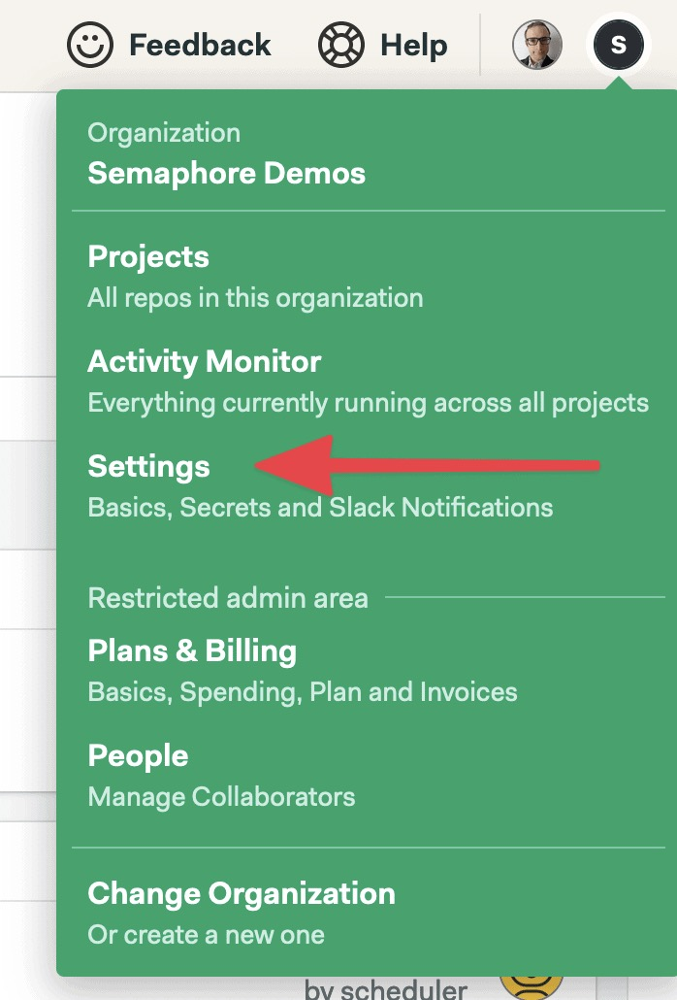{ width=35% }

1.  Click on **Create** **New Secret**.
2.  Create a secret called “dockerhub” with the username and password of your Docker Hub account:

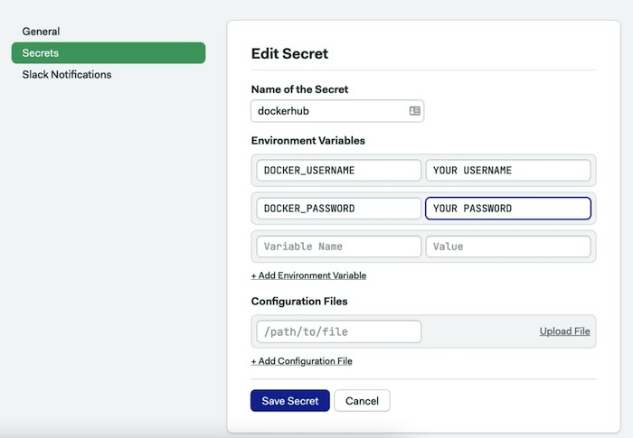{ width=75% }

1.  Click on **Save** **Secret**.

Semaphore [secrets](https://docs.semaphoreci.com/guided-tour/environment-variables-and-secrets/) store your credentials and other sensitive data outside your GitHub  repository and makes them available as environment variables in your  jobs when activated.

### Dockerize Pipeline

1.  Open the CI pipeline on Semaphore and click on **Edit Workflow** again.
2.  Use the **+ Add First Promotion** dotted button to create a new pipeline connected to the main one.
3.  Call the new pipeline: “Dockerize”
4.  Ensure the option **Enable automatic promotion** is checked so the new pipeline can start automatically.
5.  Click on the first block on the new pipeline. Set its name to “Docker build”.
6.  Open the **Prologue** and type the following commands. The prologue restores the packages from the cache and prepares the database:

```bash
sem-version python 3.9
checkout
cache restore
mkdir -p .pip_cache
pip install --cache-dir .pip_cache -r requirements.txt
cd martor_demo
python manage.py makemigrations
python manage.py migrate
cd ..
```

1.  In the job command box type the following commands.  The job pulls the latest image (if exists), builds a newer version, and  pushes it to Docker Hub. The` --cache-from` option tells Docker to try to reuse an older image to [speed up the process](https://semaphoreci.com/blog/make-slow-tests-faster):

```
echo "${DOCKER_PASSWORD}" | docker login -u "${DOCKER_USERNAME}" --password-stdin
docker pull $DOCKER_USERNAME/django-markdown-editor:latest || true
docker build --cache-from=$DOCKER_USERNAME/django-markdown-editor:latest -t $DOCKER_USERNAME/django-markdown-editor:latest .
docker push $DOCKER_USERNAME/django-markdown-editor:latest
```

1.  In the **Secrets** section, check the **dockerhub** secret
2.  Click on **Run the workflow** and **Start**.

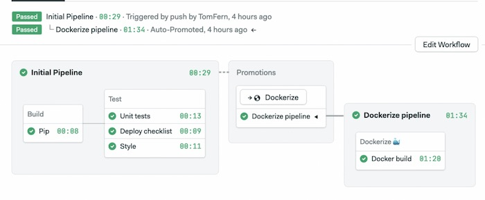

The CI/CD pipelines start automatically. Once all tests pass, the  Dockerize pipeline will create a new Docker image and push it to Docker  Hub.

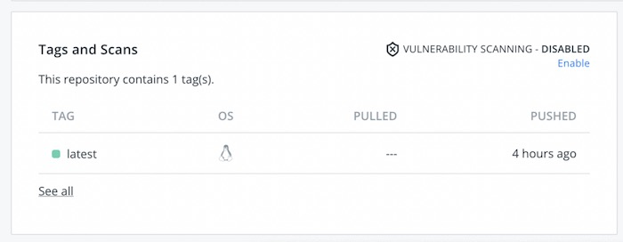

You can pull the image to your machine and run it as usual:

```bash
$ docker pull YOUR_DOCKER_USERNAME/django-markdown-editor
```

## Next Steps

We’ve prepared a Docker image with everything needed to try out the  application. You can run this image on any machine or cloud service that offers Docker workloads (they all do).

The next step is to choose a persistent database. Our Docker image  uses a local SQLite file, as a result, each time the container is  restarted all data is lost.

The are many options:

-   Use a managed database service from a cloud provider.
-   Run the database inside a VM.
-   Create a second container with the database and use volumes to persist the data.

Regardless of the option you choose, you will have to:

-   Configure Django to connect to the database.
-   Create a new secret on Semaphore with the database connection password.
-   Pass the database connection parameters as environment variables when starting the Docker container.

## Conclusion

In this tutorial, you have learned how to build a simple Python  Django web application, wrap it in a production-grade web server, and  created a Docker container to execute your webserver process.

If you enjoyed working through this article, feel free to share it  and if you have any questions or comments leave them in the section  below. We will do our best to answer them, or point you in the right  direction.

Having your application running is the first step in the way of  Kubernetes. With Kubernetes, you can run your applications at scale and  provide no-downtime updates:

-   Download the ebook: [CI/CD for Docker & Kubernetes](https://semaphoreci.com/resources/cicd-docker-kubernetes)
-   [A Step-by-Step Guide to Continuous Deployment on Kubernetes](https://semaphoreci.com/blog/guide-continuous-deployment-kubernetes)
-   [Learn how Docker & Kubernetes works in Semaphore](https://semaphoreci.com/product/docker)
-   [Continuous Deployment with Google Container Engine and Kubernetes](https://semaphoreci.com/community/tutorials/continuous-deployment-with-google-container-engine-and-kubernetes)

**Next reads**:

-   [Python Continuous Integration and Deployment From Scratch](https://semaphoreci.com/blog/python-continuous-integration-continuous-delivery)
-   [Continuous Deployment of a Python Flask Application with Docker and Semaphore](https://semaphoreci.com/community/tutorials/continuous-deployment-of-a-python-flask-application-with-docker-and-semaphore)
-   [Lightweight Docker Images in 5 Steps](https://semaphoreci.com/blog/2016/12/13/lightweight-docker-images-in-5-steps.html)
-   [Creating a Heroku-like Deployment Solution with Docker](https://semaphoreci.com/community/tutorials/creating-a-heroku-like-deployment-solution-with-docker)

\newpage

© __BUILD_YEAR__ Semaphore Technologies doo. All rights reserved.

This work is licensed under Creative Commmons
Attribution-NonCommercial-NoDerivatives 4.0 International.
To view a copy of this license, visit
<https://creativecommons.org/licenses/by-nc-nd/4.0>

The source text is open source:
<https://github.com/semaphoreci/papers>

Originally published at:
<https://semaphoreci.com/community/tutorials/dockerizing-a-python-django-web-application>

Original publication date: 15 Jul 2022

Authors: David Sale

Editor: Marko Anastasov

Reviewed by: Tomas Fernandez

Build date: __BUILD_MONTH__ __BUILD_YEAR__

Revision: __BUILD_REVISION__

\newpage
