---
title: Dockerizing a Node.js Web Application
author-meta: Mark Thomas
subtitle: semaphoreci.com
rights:  Creative Commmons Attribution-NonCommercialNoDerivatives 4.0 International
language: en-US
...


If you’ve ever developed anything that needs to ‘live’ somewhere  besides your local machine, you know that getting an application up and  running on a different machine is no simple task. There are countless  considerations to be had, from the very basics of “how do I get my  environment variables set” to which runtimes you’ll need and which  dependencies those will rely on, not to mention the need to automate the process. It’s simply not feasible for software teams to rely on a  manual deploy process anymore.

A number of technologies have sought to solve this problem of  differing environments, automation, and deployment configuration, but  the most well-known and perhaps most notable attempt in recent years is [Docker](https://www.docker.com/).

By the end of this tutorial you should be able to:

-   understand what Docker is and what it does
-   create a simple Dockerfile
-   run a Node.js application using Docker
-   use [Continuous Integration](https://semaphoreci.com/continuous-integration) to automatically build and test Docker containers

## What is Docker, Anyway?

Docker’s homepage describes Docker as follows:

>   “Docker is an open platform for  building, shipping and running distributed applications. It gives  programmers, development teams and operations engineers the common  toolbox they need to take advantage of the distributed and networked  nature of modern applications.”

Put differently, Docker is an abstraction on top of low-level  operating system tools that allows you to run one or more containerized  processes or applications within one or more virtualized Linux  instances.

## Advantages of Using Docker

Before we dive in, it’s important to stress the potential usefulness  of Docker in your software development workflow. It’s not a “silver  bullet”, but it can be hugely helpful in certain cases. Note the many  potential benefits it can bring, including:

-   Rapid application deployment
-   Portability across machines
-   Version control and component reuse
-   Sharing of images/dockerfiles
-   Lightweight footprint and minimal overhead
-   Simplified maintenance

## Prerequisites

Before you begin this tutorial, ensure the following is installed to your system:

-   Node.js (available [here](https://nodejs.org/) or via [nvm](https://github.com/creationix/nvm))
-   [Docker](https://docker.com/)
-   [A git repository of your own](https://help.github.com/articles/create-a-repo/), to track changes

You can find all the example code in this post in the [dockerizing-nodejs](https://github.com/TomFern/dockerizing-nodejs) repository.


[TomFern](https://github.com/TomFern) / [dockerizing-nodejs](https://github.com/TomFern/dockerizing-nodejs)

## Create Repository

Create an empty repository to host your code:

1.  Go to [GitHub](https://github.com) and sign up.
2.  Use the **New** button under **Repositories** to create a new repository.
3.  In **Add .gitignore**, select **Node**.
4.  Create the repository. 
5.  Clone the repository to your work machine.

## Directory Structure

We’ll be using a basic [Express](http://expressjs.com/) application as our example Node.js application to run in our Docker  container. To keep things moving, we’ll use Express’s scaffolding tool  to generate our directory structure and basic files. 

```bash
$ npx express-generator --no-view addressbook
$ cd addressbook
$ npm install
```

This should have created a number of files in your directory, including `bin` and `routes` directories. Make sure to run `npm install` so that npm can get all of your Node.js modules set up and ready to use.

We’ll write an addressbook API that stores people’s names in a database.

### Add a Route

Routes are how we handle each HTTP request. The express starter  project has a few example routes and we’ll add one more to handle our  API calls.

-   Create a new file called `routes/persons.js` with the following content:

```javascript
// persons.js

var express = require('express');
var router = express.Router();
var db = require('../database');

router.get("/all", function(req, res) {
    db.Person.findAll()
        .then( persons => {
            res.status(200).send(JSON.stringify(persons));
        })
        .catch( err => {
            res.status(500).send(JSON.stringify(err));
        });
});

router.get("/:id", function(req, res) {
    db.Person.findByPk(req.params.id)
        .then( person => {
            res.status(200).send(JSON.stringify(person));
        })
        .catch( err => {
            res.status(500).send(JSON.stringify(err));
        });
});

router.put("/", function(req, res) {
    db.Person.create({
        firstName: req.body.firstName,
        lastName: req.body.lastName,
        id: req.body.id
        })
        .then( person => {
            res.status(200).send(JSON.stringify(person));
        })
        .catch( err => {
            res.status(500).send(JSON.stringify(err));
        });
});

router.delete("/:id", function(req, res) {
    db.Person.destroy({
        where: {
            id: req.params.id
        }
        })
        .then( () => {
            res.status(200).send();
        })
        .catch( err => {
            res.status(500).send(JSON.stringify(err));
        });
});

module.exports = router;
```

This file implements all the API methods our application will support, we can:

-   Get all persons
-   Create a person
-   Get a single person by id
-   Delete a person

All the routes return the person information encoded in JSON.

## Configuring the Database

All person routes require a database to store the data. We’ll use a PostgreSQL database to keep our contact details.

1.  Install the PostgreSQL node [driver](https://www.npmjs.com/package/pg) and [sequelize ORM](https://sequelize.org/):

```
$ npm install --save pg sequelize
```

Sequelize handles all our SQL code for us, it will also create the initial tables on the database.

1.  Create a file called `database.js`

```javascript
// database.js

const Sequelize = require('sequelize');
const sequelize = new Sequelize(process.env.DB_SCHEMA || 'postgres',
                                process.env.DB_USER || 'postgres',
                                process.env.DB_PASSWORD || '',
                                {
                                    host: process.env.DB_HOST || 'localhost',
                                    port: process.env.DB_PORT || 5432,
                                    dialect: 'postgres',
                                    dialectOptions: {
                                        ssl: process.env.DB_SSL == "true"
                                    }
                                });
const Person = sequelize.define('Person', {
    firstName: {
        type: Sequelize.STRING,
        allowNull: false
    },
    lastName: {
        type: Sequelize.STRING,
        allowNull: true
    },
});
module.exports = {
    sequelize: sequelize,
    Person: Person
};
```

The database file defines the connection parameters to PostgreSQL and the person model. The model has only two fields: `firstName` and `lastName`, you can add more fields if you feel like experimenting. Check the [sequelize model](https://sequelize.org/master/class/lib/model.js~Model.html) doc for more details.

1.  Create a new file for database migration at `bin/migrate.js`:

```javascript
// bin/migrate.js

var db = require('../database.js');
db.sequelize.sync();
```

Let’s add a test for the database. We’ll use [Jest](https://jestjs.io/), a JavaScript testing library.

1.   Install Jest:

```bash
$ npm install --save-dev jest
```

1.  Create a new file called `database.test.js`:

```javascript
const db = require('./database');

beforeAll(async () => {
    await db.sequelize.sync({ force: true });
});

test('create person', async () => {
    expect.assertions(1);
    const person = await db.Person.create({
        id: 1,
        firstName: 'Bobbie',
        lastName: 'Draper'
    });
    expect(person.id).toEqual(1);
});

test('get person', async () => {
    expect.assertions(2);
    const person = await db.Person.findByPk(1);
    expect(person.firstName).toEqual('Bobbie');
    expect(person.lastName).toEqual('Draper');
});

test('delete person', async () => {
    expect.assertions(1);
    await db.Person.destroy({
        where: {
            id: 1
        }
    });
    const person = await db.Person.findByPk(1);
    expect(person).toBeNull();
});

afterAll(async () => {
    await db.sequelize.close();
});
```

1.  Edit `package.json` and add the following lines in the scripts section:

```json
 "scripts": {
    "start": "node ./bin/www",
    "test": "jest",
    "migrate": "node ./bin/migrate.js"
  },
```

The test code goes through all the basic database operations:

-   Create an initial table with `sync()`
-   Create a person.
-   Get the person.
-   Delete the person.

## Start the Application

We’re almost ready to start the application for the first time. We only need to add the new routes to the main file: `app.js`

1.  Create a persons router object near to the index router:

```javascript
// app.js

. . .

var indexRouter = require('./routes/index');

// add the following line near the indexRouter
var personsRouter = require('./routes/persons');

. . .
```

1.  Add the persons router object to the application near to the other `app.use()` lines:

```javascript
// app.js

. . .

app.use('/', indexRouter);

// add the following line near app.use indexRouter
app.use('/persons', personsRouter);

. . .
```

1.  To start the application:

```bash
$ npm start
```

Check the new application on http://localhost:3000


If you go to http://localhost:3000/persons/all you’ll see a connection error message.

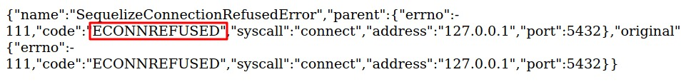

That’s to be expected as we didn’t provide the application any database to work with.

We’ll use Docker to run our database in the following sections.

## Setting Up PM2

While running our Node.js application with `node bin/www`  is fine for most cases, we want a more robust solution to keep  everything running smoothly in production. It’s recommended to use [pm2](https://pm2.keymetrics.io/), since you get **a lot** of tunable features. 

We can’t go too deep into how pm2 works or how to use it, but we will create a basic `processes.json` file that pm2 can use to run our application in production. 

```bash
$ npm install --save pm2
```

To make it easier to run our Node.js application and understand what  parameters we are giving to PM2, we can use an arbitrarily-named JSON  file, `processes.json`, to set up our production configuration: 

```json
{
    "apps": [
        {
            "name": "api",
            "script": "./bin/www",
            "merge_logs": true,
            "max_restarts": 20,
            "instances": 4,
            "max_memory_restart": "200M",
            "env": {
                "PORT": 3000,
                "NODE_ENV": "production"
            }
        }
    ]
}
```

In the `processes.json` we have:

-   Named our application, 
-   Defined the file to run,
-   Sets Node.js arguments, 
-   Set the environment variables.  

Finally, edit `package.json` to add a pm2 action, the scripts section should look like this:

```json
  "scripts": {
    "pm2": "pm2 start processes.json --no-daemon",
    "start": "node ./bin/www",
    "test": "jest",
    "migrate": "node ./bin/migrate.js"
  },
```

To start the application with pm2:

```bash
$ npm run pm2
```

## Installing Docker

With one of the core tenets of Docker being platform freedom and  portability, you’d expect it to run on a wide variety of platforms. You  would be correct, Docker is everywhere.

-   In Windows and Mac: Install [Docker Desktop](https://www.docker.com/products/docker-desktop). Find platform-specific steps on the [Mac page](https://docs.docker.com/docker-for-mac/install/) and the [Windows page](https://docs.docker.com/docker-for-windows/install/).
-   In Linux: most distributions include modern versions of Docker in its repositories. For more details, consult the [installation page](https://docs.docker.com/install/linux/docker-ce/debian/).

## Running Postgres With Docker

With Docker, we can run any pre-packaged application in seconds. Look how easy it is to run a PostgreSQL database:

```bash
$ docker run -it -e "POSTGRES_HOST_AUTH_METHOD=trust" -p 5432:5432 postgres
```

Docker will download a PostgreSQL image and start it on your machine with the 5432 port mapped to your local network.

Now, with the database running, open a new terminal and execute the migrations to create the table:

```bash
$ npm run migrate
```

The application should be fully working now:

```bash
$ npm run pm2
```

Try again the http://localhost:3000/persons/all route, the error message should be gone now.

Also, the database tests should be passing now:

```bash
$ npm run test

> addressbook@0.0.0 test /home/tom/r/dockerizing-test/addressbook
> jest

PASS  ./database.test.js
✓ create person (18ms)
✓ get person (6ms)
✓ delete person (7ms)

Test Suites: 1 passed, 1 total
Tests:       3 passed, 3 total
Snapshots:   0 total
Time:        1.119s
Ran all test suites.
```

## Creating a Dockerfile

We’ve used Docker to run our database without having to install it.  But Docker can do much more; it can create portable images so others can run our software.

There are many ways to use Docker, but one of the most useful is  through the creation of Dockerfiles. These are files that essentially  give build instructions to Docker when you build a container image. This is where the magic happens.

Let’s create a Dockerfile in the root of our project directory: 

```bash
$ cd ..
```

To get started, we need to choose which base image to pull from. We  are essentially telling Docker “Start with this.” This can be hugely  useful if you want to create a customized base image and later create  other, more-specific containers that ‘inherit’ from a base container.  We’ll be using the official Node image since it gives us what we need to run our application and has a small footprint.

Create a file called `Dockerfile`:

```docker
# Dockerfile

FROM node:16.15-alpine3.14
RUN mkdir -p /opt/app
WORKDIR /opt/app
RUN adduser -S app
COPY addressbook/ .
RUN npm install
RUN npm install --save pm2
RUN chown -R app /opt/app
USER app
EXPOSE 3000
CMD [ "npm", "run", "pm2" ]
```

The Dockerfile consists of the following commands:

-   **FROM**: tells Docker what base image to use as a starting point.
-   **RUN**: executes commands inside the container.
-   **WORKDIR**: changes the active directory.
-   **USER**: changes the active user for the rest of the commands.
-   **EXPOSE**: tells Docker which ports should be mapped outside the container.
-   **CMD**: defines the command to run when the container starts.

Every time a command is executed, it acts as a sort of `git commit`-like action in that it takes the current image, executes commands on top of  it, and then returns a new image with the committed changes. This  creates a [build process](https://semaphoreci.com/blog/build-stage) that has high granularity—any point in the build phases should be a  valid image—and lets us think of the build more atomically (where each  step is self-contained).

This part is crucial for understanding how to speed up our container  builds. Since Docker will intelligently cache files between incremental  builds, the further down the pipeline we can move build steps, the  better. That is, Docker won’t re-run commits when those build steps have not changed.

Create a file called `.dockerignore`:

```
.git
.gitignore
node_modules/
```

The `.dockerignore` is similar to a `.gitignore` file and lets us safely ignore files or directories that shouldn’t be included in the final Docker build.

## Bundling and Running the Docker Container

We’re almost there. To run our container locally, we need to do two things:

-   Build the container:

```bash
$ docker build -t addressbook .
```

-   Run the container:

```bash
$ docker run -it -p 3000:3000 addressbook
```

If you now go to http://localhost:3000/persons/all you’ll find the  same connection error as before. This will happen even if the PostgreSQL container is running. 

This shows an interesting property of containers: they get their own  network stack. The application, by default, tries to find the database  in localhost, but technically, the database is in a different host. Even though all containers are running on the same machine, each container  is its own localhost, so the application fails to connect.

We could use Docker [network](https://docs.docker.com/engine/reference/commandline/network_connect/) commands to manage the container’s network details. Instead, we’ll rely on Docker Compose to manage the containers for us.

## Docker Compose

Docker Compose is a tool for managing multi-container applications.  Docker Compose is bundled with Docker Desktop for Windows and Mac. On  Linux, it has to be installed separately, check the [installation page](https://docs.docker.com/compose/install/) for details

Docker Compose can:

-   Start and stop multiple containers in sequence.
-   Connect containers using a virtual network.
-   Handle persistence of data using Docker Volumes.
-   Set environment variables.
-   Build or download container images as required.

Docker Compose uses a YAML definition file to describe the whole application.

-   Create a file called `docker-compose.yml`:

```yaml
# docker-compose.yml

version: "3.9"
services:
  postgres:
    image: postgres
    environment:
      POSTGRES_USER: postgres
      POSTGRES_PASSWORD: postgres
    ports: 
      - '5432:5432'
    volumes:
      - addressbook-db:/var/lib/postgresql/data

  addressbook:
    build:
      context: .
    environment:
      DB_SCHEMA: postgres
      DB_USER: postgres
      DB_PASSWORD: postgres
      DB_HOST: postgres
    depends_on:
      - postgres
    ports:
      - '3000:3000'
        
volumes:
  addressbook-db:
```

Stop the PostgreSQL container if it’s still running by pressing `CTRL-C` on its terminal. You can check for running containers with:

```bash
$ docker ps
```

Start Docker Compose and run the tests. Compose will build the image as needed and map the data volumes:

```bash
$ docker compose run addressbook npm test

Creating dockerizing-nodejs_postgres_1 … done
 Creating dockerizing-nodejs_addressbook_run … done
   addressbook@0.0.0 test /opt/app
   jest 
 PASS  ./database.test.js
   ✓ create person (21ms)
   ✓ get person (10ms)
   ✓ delete person (10ms)
 
 Test Suites: 1 passed, 1 total
 Tests:       3 passed, 3 total
 Snapshots:   0 total
 Time:        2.475s
 Ran all test suites.
```

We can start the app and use curl to test the endpoint:

```bash
$ docker compose up -d
$ curl -w "\n" \
       -X PUT \
       -d "firstName=Bobbie&lastName=Draper" \
       localhost:3000/persons
```

Bobbie’s contact should have been created:

```bash
$ curl -w "\n" localhost:3000/persons/all

[
    {
        "id": 1,
        "firstName": "Bobbie",
        "lastName": "Draper",
        "createdAt": "2020-02-07T23:52:00.448Z",
        "updatedAt": "2020-02-07T23:52:00.448Z"
    }
]
```

Perfect, now that everything works, push all the new code to GitHub:

```bash
$ git add -A
$ git commit -m "initial commit"
$ git push origin master
```

## Dockerize the Node application with CI/CD 

We can use Semaphore [Continuous Integration and Delivery](https://semaphoreci.com/cicd) (CI/CD) to automate the [build process](https://semaphoreci.com/blog/build-stage). That way, we don’t have to worry about keeping the images current, Semaphore will do it for us.

In addition to Semaphore, we’ll also need a Docker Hub account. The  Hub is a free service provided by Docker to store images on the cloud:

1.  Go to [Docker Hub](https://hub.docker.com) and get a free account.
2.  Go to [Semaphore](https://semaphoreci.com) and sign up.
3.  On the upper right menu, click on **Settings**

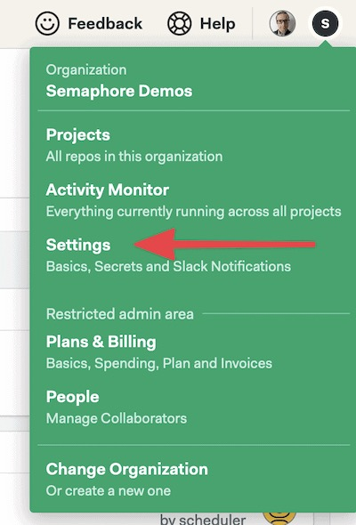{ width=30% }

1.  Click on **Secrets**
2.  Click on **New Secret**.
3.  Save your Docker Hub username and password, the secret should be called “dockerhub”:

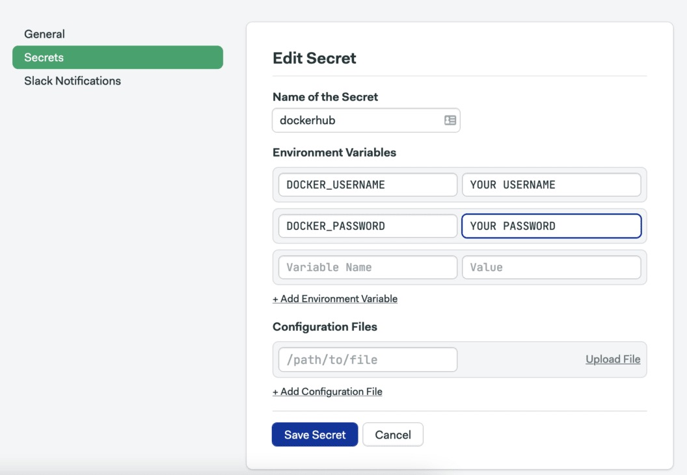{ width=50% }

Docker Hub and Semaphore are connected. Semaphore will be able to push the images to the registry on your behalf.

We can create a [Continuous Integration](https://semaphoreci.com/continuous-integration) (CI) pipeline in a matter of seconds:

-   Click on the **+ Create new**:

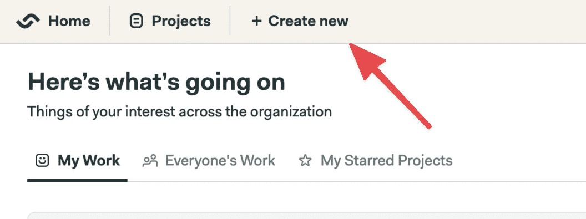{ width=50% }

-   Select **Choose repository** and find your repo from the list:

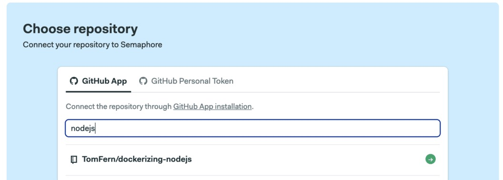{ width=50% }

-   Select **Continue to Workflow setup** and, if prompted, choose **I want to configure this project from scratch**.
-   Select the Build Docker starter workflow and click on **Customize it first**:

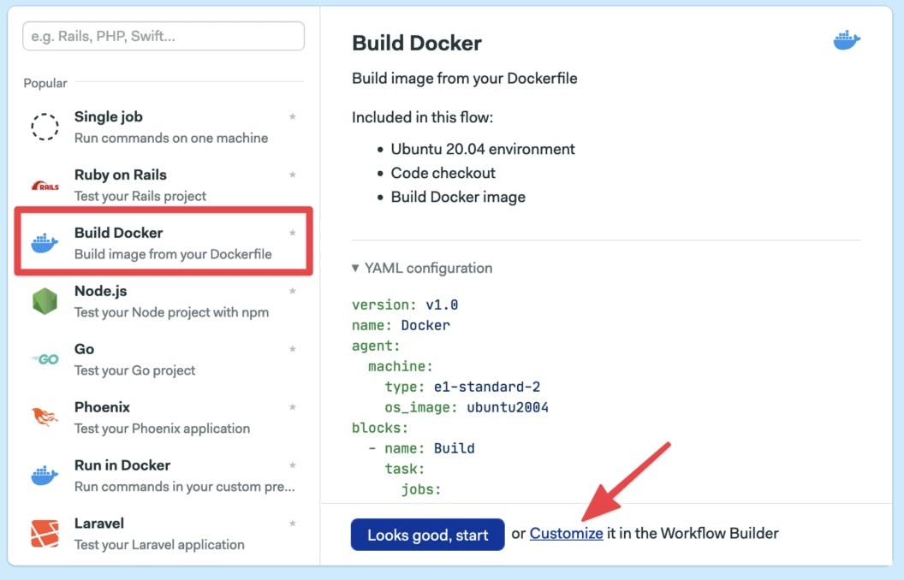{ width=50% }

The **Workflow Builder** main elements are:

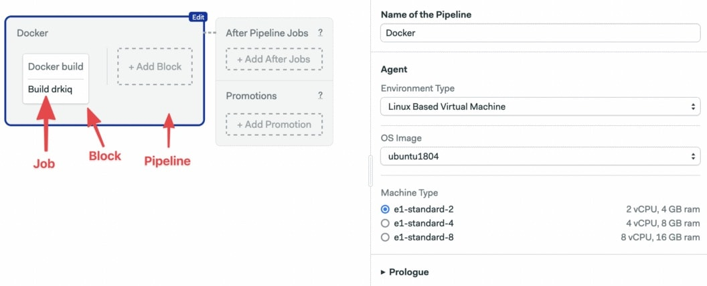

-   **Pipeline**: A pipeline has a specific objective, e.g. build. Pipelines are made of blocks that are executed from left to right.
-   **Agent**: The agent is the virtual machine that powers the pipeline. We have three [machine types](https://docs.semaphoreci.com/ci-cd-environment/machine-types/) to choose from. The machine runs an optimized [Ubuntu 20.04](https://docs.semaphoreci.com/ci-cd-environment/ubuntu-20.04-image/) image with build tools for many languages.
-   **Block**: blocks group jobs with a similar purpose. Jobs in a block are executed  in parallel and have similar commands and configurations. Once all jobs  in a block complete, the next block begins.
-   **Job**: jobs define the commands that do the work. They inherit their configuration from their parent block.

Before continuing, we can do a trial run:

-   Click on **Run the Workflow** on the top-right corner.
-   Select the **master** branch.
-   Click on **Start.** 

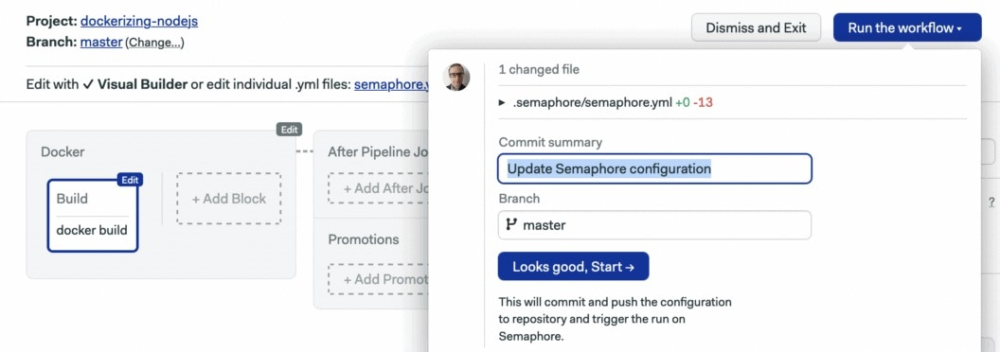

The starter [CI pipeline](https://semaphoreci.com/blog/cicd-pipeline) builds the image for us. But before we can use it, we have to modify the pipeline:

-   Click on **Edit Workflow** on the top-right corner.
-   Click on the **Build** block.

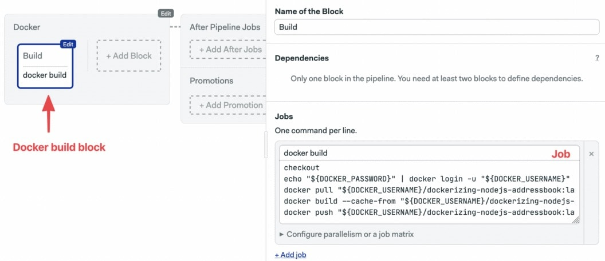

-   Replace the commands in the box with these:

```bash
checkout
echo "${DOCKER_PASSWORD}" | docker login -u "${DOCKER_USERNAME}" --password-stdin
docker pull "${DOCKER_USERNAME}/dockerizing-nodejs-addressbook:latest" || true
docker build \
  --cache-from "${DOCKER_USERNAME}/dockerizing-nodejs-addressbook:latest" \
  -t "${DOCKER_USERNAME}/dockerizing-nodejs-addressbook:latest" .
docker push "${DOCKER_USERNAME}/dockerizing-nodejs-addressbook:latest"
```

-   Open the **Secrets** section and check the **dockerhub** secret:

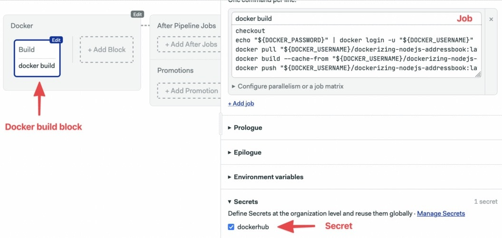

-   Click on **Run the Workflow** and **Start**.

Let’s examine what we just did:

-   **checkout**: this is a Semaphore built-in command that clones the GitHub repository into the CI environment.
-   **docker pull**: downloads the image from Docker Hub, if available.
-   **docker build**: builds the image. If a previous image was pulled, Docker can speed up the build process with layer caching.
-   **docker push**: pushes the new image to Docker Hub.

We’re tagging our new images as **latest**. As a result, each new image overwrites the previous one. As an alternative, you can  choose to use a different value for a tag: the release version, the git  hash, or a unique variable like [$SEMAPHORE_WORKFLOW_ID](https://docs.semaphoreci.com/ci-cd-environment/environment-variables/) to keep track of different versions.

Once the build process is complete, you should find the image on Docker Hub:

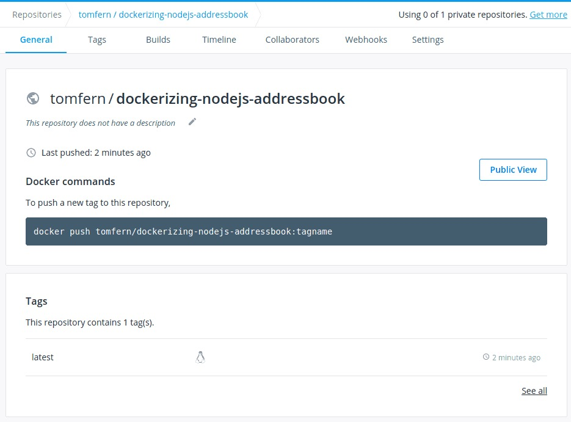{ width=50% }

## Testing the Dockerized Node Application Image

An effective CI pipeline will not only build the image but [test it](https://semaphoreci.com/blog/automated-testing-cicd). In this section, we’ll add a test block to our pipeline:

Pull the code to your machine:

```bash
$ git pull origin master
```

Add a file called `docker-compose.ci.yml`:

```yaml
# docker-compose.ci.yml

version: "3.9"
services:
  postgres:
    image: postgres
    environment:
      POSTGRES_USER: postgres
      POSTGRES_PASSWORD: postgres
    ports: 
      - '5432:5432'

  addressbook:
    image: $DOCKER_USERNAME/dockerizing-nodejs-addressbook:latest
    command: "npm run migrate && npm run pm2"
    environment:
      DB_SCHEMA: postgres
      DB_USER: postgres
      DB_PASSWORD: postgres
      DB_HOST: postgres
    depends_on:
      - postgres
    ports:
      - '3000:3000'
```

The new `docker-compose` file is meant to run only in the CI environment, instead of building the image on the spot, it pulls it from Docker Hub.

There’s one more thing we can do to speed up the build process in the CI environment. Semaphore maintains a [Docker registry](https://docs.semaphoreci.com/ci-cd-environment/semaphore-registry-images/) with popular base images. Pulling the base images from this registry is a lot faster and doesn’t count against Docker Hub [pull quotas](https://docs.docker.com/docker-hub/download-rate-limit/). To use the Semaphore registry, replace the contents of the Dockerfile with:

```docker
FROM registry.semaphoreci.com/node:16
RUN mkdir -p /opt/app
WORKDIR /opt/app
RUN adduser app
COPY addressbook/ .
RUN npm install
RUN npm install --save pm2
RUN chown -R app /opt/app
USER app
EXPOSE 3000
CMD [ "npm", "run", "pm2" ]
```

We changed the `FROM` line to pull from Semaphore servers instead of Docker’s. We also removed the `-S` parameter since this isn’t supported on the base image.

Push the files to GitHub:

```bash
$ git pull origin master
$ git add docker-compose.ci.yml Dockerfile
$ git commit -m "add docker compose and Semaphore registry"
$ git push origin master
```

Next, let’s modify the pipeline to run the tests:

-   Go back to your Semaphore project, the push you just did should have triggered a new workflow, open it.
-   Click on **Edit Workflow**.
-   Click on the dotted box: **+ Add Block** to create a new block.
-   Name the block: “Test”
-   Name the job: “Integration Test”
-   Type the following code in the box:

```bash
docker-compose run addressbook npm test
```

-   Open the **Prologue** section and type the following commands. The prologue is executed before each job in the block:

```bash
checkout
echo "${DOCKER_PASSWORD}" | docker login -u "${DOCKER_USERNAME}" --password-stdin
cat docker-compose.ci.yml | envsubst | tee docker-compose.yml
```

-   Open the **Secrets** section and check the **dockerhub** item:

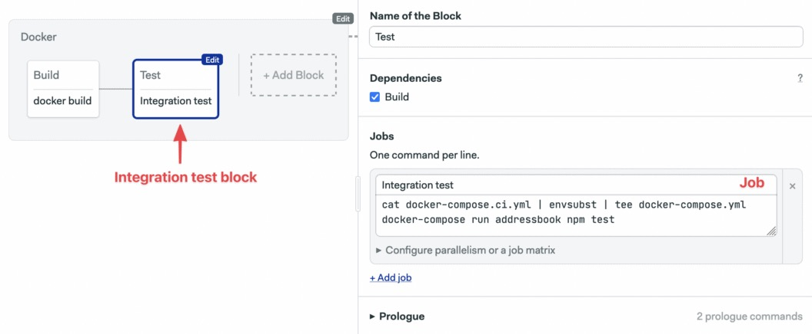

-   Click on **Run the Workflow** and **Start**:

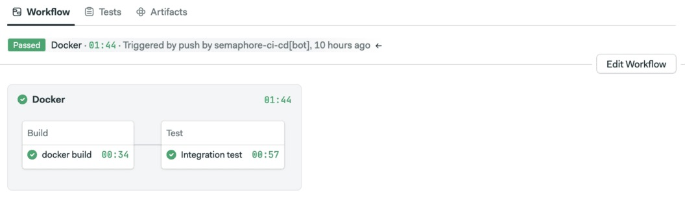

Perfect! Semaphore is building and testing the image on each update.

To download the image from Docker Hub:

```bash
$ docker pull YOUR_DOCKER_USERNAME/dockerizing-nodejs-addressbook:latest
```

## Next Steps

Here’re some things you can play with to learn more about Docker:

-   **Add a third container to your setup**: the [pm2 docs](https://pm2.keymetrics.io/docs/tutorials/pm2-nginx-production-setup) recommend putting a reverse proxy in front of your application. You can add a container with an NGINX image to gain SSL and protect your  service. For an example of using a reverse proxy, check our [Ruby on Rails tutorial](https://semaphoreci.com/community/tutorials/dockerizing-a-ruby-on-rails-application).
-   **Add more tests**: you can put all kinds of tests into the CI pipeline for better quality control.
-   **Add a deployment pipeline**: once you decide you want to release your application, you can add more  pipelines to your workflow so it automatically deploys to your platform  of choice.

Dockerizing the application is the first step towards portable  deployments. The next thing is to decide where we want to run it. There  are many alternatives:

-   **Self-hosted**: run the containers in your server.
-   **PaaS**: run the containers directly on a Platform as a Service provider such as Heroku.
-   **Orchestration**: run the application with an orchestrator such as Docker Swarm or Kubernetes.

Check these tutorials to learn how you can deploy your application:

-   More about deploying to Kubernetes:
    -   [How To Build and Deploy a Node.js Application To DigitalOcean Kubernetes Using CI/CD](https://semaphoreci.com/blog/nodejs-digitalocean-kubernetes)
    -   [A Step-by-Step Guide to Continuous Deployment on Kubernetes](https://semaphoreci.com/blog/guide-continuous-deployment-kubernetes)
-   Learn more about Docker:
    -   [Learn all about Docker & Kubernetes on Semaphore](https://semaphoreci.com/product/docker)
    -   Get our free ebook: [CI/CD for Docker and Kubernetes](https://semaphoreci.com/resources/cicd-docker-kubernetes)
-   Learn how to deploy to Heroku:
    -   [Continuous Deployment of a Python Flask Application with Docker and Semaphore](https://semaphoreci.com/community/tutorials/continuous-deployment-of-a-python-flask-application-with-docker-and-semaphore)

## Conclusion

We have looked at Docker — what is, how it works, how we can use it — and how we might run a simple Node.js application in a container.  Hopefully, you feel able and ready to create your own Dockerfile and  take advantage of the many powerful features it brings to your  development life.


\newpage

© __BUILD_YEAR__ Semaphore Technologies doo. All rights reserved.

This work is licensed under Creative Commmons
Attribution-NonCommercial-NoDerivatives 4.0 International.
To view a copy of this license, visit
<https://creativecommons.org/licenses/by-nc-nd/4.0>

The source text is open source:
<https://github.com/semaphoreci/papers>

Originally published at:
<https://semaphoreci.com/community/tutorials/dockerizing-a-node-js-web-application>

Original publication date: 15 Jul 2022

Authors: Mark Thomas

Editor: Marko Anastasov

Reviewed by: Tomas Fernandez

Build date: __BUILD_MONTH__ __BUILD_YEAR__

Revision: __BUILD_REVISION__

\newpage
