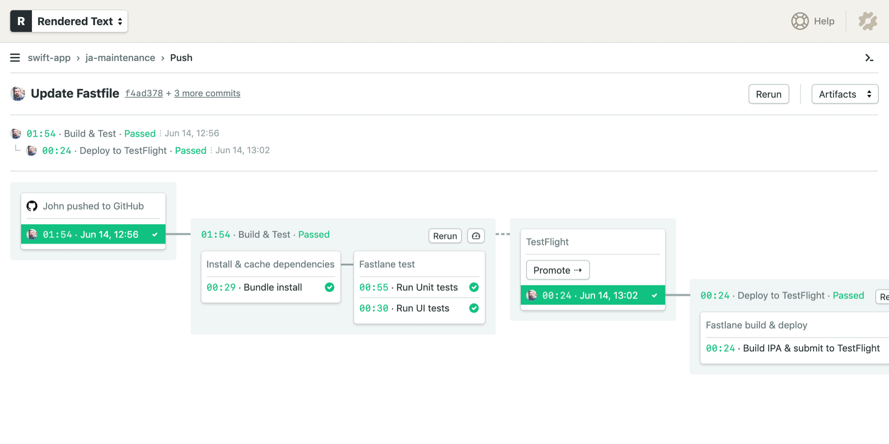

---
title: iOS CI/CD Continuous Integration and Continuous Delivery Explained
author-meta: Amarildo Lucas
subtitle: semaphoreci.com
rights:  Creative Commmons Attribution-NonCommercialNoDerivatives 4.0 International
language: en-US
...

Continuous integration and continuous delivery ([CI/CD](https://semaphoreci.com/cicd)) is widely used by development teams, even in open-source communities. It offers a sustainable way to test and deploy code many times a day without the hurdle of doing it manually.

In this guide, you’ll learn the foundations of getting started with CI/CD for iOS. We’ll learn about:

1.  The importance of CI/CD for iOS developers
2.  Principles of iOS CI/CD
3.  The top benefits of CI/CD for iOS
4.  Best practices to remember for iOS CI/CD
5.  An iOS CI/CD workflow example
6.  Getting started with CI/CD for iOS
7.  Choosing the right iOS CI/CD platform

By the end of this article, you’ll be able to evaluate your current workflow, adopt the best CI/CD practices, and ship your iOS applications faster. 

## The importance of CI/CD for iOS developers

CI/CD for iOS **will save you days** of preparing app submissions, fixing critical bugs, and uploading screenshots to the App Store. Automating these processes means that any member of the team will be able to release bug fixes or updates. 

The CI/CD can check in and check out the source code so all members on your team will be on the same page. Leading to better communication, increased app development quality, and more frequent releases. 

### The DevOps Role

DevOps is a cultural change in the organization where the operations and development teams join forces to [continuously deliver](https://semaphoreci.com/blog/2017/07/27/what-is-the-difference-between-continuous-integration-continuous-deployment-and-continuous-delivery.html) high-quality software.

Because teams employing DevOps ideals are focused on delivering value to users as quickly and efficiently as possible, [continuous integration](https://semaphoreci.com/continuous-integration) and delivery is a natural extension of their operations.

The end goal is to help iOS developers build and release apps at high velocity by defining a process for effective app delivery.

## Principles of iOS CI/CD

One of the most important aspects of implementing CI/CD for iOS is learning about the principles that can increase the value of your current workflow:

### Use Static Code Analysis

So that the build can fail early (in the event of serious coding errors), static code analysis should be the absolute **first step in the build process**. This way, you can fix the issues as soon as they are found by the server.

### Keep the Code Deployable

Once the [linter](https://medium.com/dailyjs/why-you-should-always-use-a-linter-and-or-pretty-formatter-bb5471115a76) step is passed, we can move on to the building and compiling of the source code. The last step in the app [build process](https://semaphoreci.com/blog/build-stage) should be to generate the archive to be submitted to [iTunes Connect](https://itunesconnect.apple.com/login). In the case of iOS, it should be an IPA file.

### Notify your Team

Any developer can deploy any version of the app to any environment at a push of a button. Once the build is finished, it’s important to send a notification to other developers with the status of the build. This can be an email, Slack message, or similar notification service. The [iOS CI/CD pipeline](https://semaphoreci.com/blog/cicd-pipeline) should trigger this notification at the end of every build.

### Design for Iterative Releases

Have a well-defined pipeline that focuses on automated delivery. Implement static analytics on your source code to detect issues or crashes (even in production).

## The top benefits of CI/CD for iOS

Aside from making your previous iOS development process more efficient, implementing a CI/CD pipeline helps your team:

### 1. Build faster

A continuous and automated development cycle helps mobile development teams make high-value releases faster. 

### 2. Detect problems early

A continuous integration pipeline can run test suites on every code change. Thus, problems can be spotted before they can reach production.

### 3. Provide effective feedback 

In a continuous integration workflow, the entire team can view and monitor source code activity. When new problems appear, the team members that introduced the failure are automatically notified. 

### 4. Automate the testing process 

Manually testing iOS apps on a simulator or multiple devices is a time-consuming process. In a CI/CD workflow, the process is automatic and straightforward. Simply configure the devices and simulators into the server workflow and let your pipeline do the work for you.

### 5. Build deployment logs

In a CI/CD pipeline, all build deployments are logged. This means that at any given time, you can identify the exact point where your app failed.

## Best practices to remember for iOS CI/CD 

When implementing a CI/CD workflow for iOS development, it’s vital you adhere to standard best practices. Why? The guidelines below are designed to help you push high-quality code with every release.

### 1. Keep your Pipeline Fast

Always improve the quality of your pipeline by inspecting its configuration, improving build times, removing any unnecessary code or assets, configuring the right environments, and removing any bottlenecks causing issues on the deploy process.

### 2. Run Code Analysis Early

Fail fast: Include unit tests and linters early in the pipeline.

### 3. Separate Build Configurations

Use profiles to separate build configurations. Internal and testing builds are different from the builds for your users. By default, an iOS app includes Debug and Release build configurations. It makes sense to add Test, Staging and Production builds.

### 4. Automate Your Builds

Compiling and building an iOS app takes a great deal of time. Using CI/CD workflow you can automate the process and save time.

### 5. Deploy Only Through the Pipeline

The pipeline is configured to help and enforce best practices of CI/CD for your development cycle. Avoid at all cost manual deploys. 

Making your code run through your pipeline requires each change to conform with your code standards and styles. This mechanism safeguards your codebase from untrusted code.

### 6. Maintain Similar Environments

If possible, try to maintain similar pipelines in all your environments. Changes that pass the requirements of one environment should pass in another. This also includes feature branches.

### 7. Monitor the Pipeline

Apps are unpredictable. No matter how cool you think your code is, the app can fail for a lot of reasons. Therefore, you’ll need to proactively monitor your deploys throughout the pipeline so you can catch problems before they reach the App Store.

## An iOS CI/CD workflow example 

After understanding and adopting essential CI/CD principles, the next step is to set up your pipeline. One of the more painful parts of iOS development is iterative releases. It’s tedious and time-consuming. The role of CI/CD here is to automate all of these steps.

Before implementing CI/CD, a typical release to the App Store looks like this:

1.  Check out source code from some remote repository (GitHub, Bitbucket, GitLab, etc.).
2.  Do some static analysis of the code using SwiftLint, for example.
3.  [Compile and build](https://semaphoreci.com/blog/build-stage) your iOS app in a simulator or device to check that everything is running as expected.
4.  Run unit, UI or other kinds of tests.
5.  Code signing and archive your app.
6.  Submit your app to iTunes Connect.
7.  Notify users about your release.

This process can be error-prone; you may experience merge conflicts and poor management of versions (as this is done manually by each developer). 

Fortunately, we can improve it with automation. When we use an iOS CI/CD pipeline, our workflow looks more like this: 

1.  Code the application changes with Xcode. 
2.  When the code is ready for integration, it automatically pushes to a Git repository. 
3.  Next, CI triggers the execution of test cases that will confirm the code is ready for release. 
4.  Finally, the release pipeline triggers to deploy the archive produced in the CI stage, and a build is released with TestFlight.

See how the iOS developer has far less to do with CI/CD? That’s the beauty of automation.

## Getting Started with iOS CI/CD 

To integrate CI/CD into your iOS development process, start by exploring what things can make your team’s job easier. You need to understand and collect information about your current workflow and provide feedback to the team until you have defined a process for your pipeline. 

Using this information, your team can evaluate and define how to automate the current workflow to lead to a better development lifecycle. Optimizing and automating the current process should be the priority.

Ultimately, this approach **increases transparency through all your team**. When your iOS CI/CD pipeline is set up, your entire team will know what’s going on with the builds and will receive the latest results of tests, which means they can move on to resolving new issues. 

This process allows developers to stay focused on writing code and observing the app’s behavior. Meanwhile, product stakeholders have access to updated metrics. Code changes and tests are available for review at any time.

The lesson here is that, as a faster feedback loop emerges, each member of the team can learn from each other and take responsibility for the code that is shipped.

## Choosing the Right iOS CI/CD Platform

**Self-hosted CI/CD solutions** require owning hardware and setting up infrastructure. Maintenance becomes a big endeavor.

Software-as-a-service (SaaS) solutions, on the other hand, offer cross-platform capabilities with zero maintenance

These **cloud-based CI/CD tools** are easy to set up and all the hardware and software maintenance is managed by the service provider. Developers can skip a lot of tedious or repetitive tasks, such as code signing and publishing.

Cloud-based CI/CD also comes with a big advantage: **it unifies your team around a single platform**, mobilizing your iOS, Android and web developers within a consistent tool.

## Summing Up

A well-defined process and the right CI/CD tools will make your iOS development cycle faster and more efficient.

If you want to explore CI/CD for iOS in a more hands-on way, check out our tutorial on [building, testing, & deploying an iOS App with CI/CD](https://semaphoreci.com/blog/tutorial-ios-cicd).

Have any questions about this guide? Don’t hesitate to reach out to us on Twitter [@semaphoreci](https://twitter.com/semaphoreci).

\newpage

© __BUILD_YEAR__ Semaphore Technologies doo. All rights reserved.

This work is licensed under Creative Commmons
Attribution-NonCommercial-NoDerivatives 4.0 International.
To view a copy of this license, visit
<https://creativecommons.org/licenses/by-nc-nd/4.0>

The source text is open source:
<https://github.com/semaphoreci/papers>

Originally published at:
<https://semaphoreci.com/ios-continuous-integration>

Original publication date: 30 Mar 2021

Authors: Amarildo Lucas

Editor: Tomas Fernandez

Build date: __BUILD_MONTH__ __BUILD_YEAR__

Revision: __BUILD_REVISION__

\newpage
