---
title: Stubbing and Mocking in Java with the Spock Testing Framework
author-meta: Kostis Kapelonis
subtitle: semaphoreci.com
rights:  Creative Commmons Attribution-NonCommercialNoDerivatives 4.0 International
language: en-US
...


When it comes to true unit tests, having a mocking framework such as  Spock for Java is essential. Using a mocking framework ensures that your unit tests are fast, self-contained and deterministic. A mocking  framework can help you fake external systems, pre-program your classes  with expected responses, and test hard-to-replicate error conditions.

There are several mocking frameworks in the Java world, but the most popular one is [Mockito](http://site.mockito.org/). Our previous [mocking tutorial](https://semaphoreci.com/community/tutorials/stubbing-and-mocking-with-mockito-2-and-junit) is a great introduction to Mockito if you would like a detailed tutorial on using it.

In this tutorial, we will cover the [Spock testing framework](http://spockframework.org/), an emerging framework that can be used to test both Java and Groovy code. Unlike Mockito, Spock is a complete [testing framework](https://semaphoreci.com/blog/automated-testing-cicd) that can function on its own (Mockito works in addition to JUnit).

For the code examples, we will use the same situations that were  presented in the Mockito tutorial. This will allow for easy comparison  between the two frameworks. If you ever wanted to see how Spock competes against the Junit/Mockito combo, you will find this tutorial  particularly interesting.

We will cover:

1.  Downloading and setting up Spock—the “batteries included” testing framework for both Java and Groovy
2.  Some very brief theory on the goals of Spock,
3.  Stubbing return data from methods,
4.  Verifying interactions,
5.  Capturing arguments, and,
6.  Returning custom mocked responses.

Notice that the tutorial will focus exclusively on testing Java code. Even though Spock can also work with Groovy code, in this tutorial we  will focus on Java unit tests. Spock can test both Java and Groovy, but  in the case of Groovy,  it has some additional capabilities that we will not cover here.

## Prerequisites

It is assumed that you already have a Java project and you want to write unit tests for it. We will need:

-   A sample Java project constructed in a well-disciplined manner, i.e. using [Dependency Injection](https://en.wikipedia.org/wiki/Dependency_injection),
-   A valid `pom.xml` file that builds the project,
-   Maven installed—the command `mvn` should be available in your command line, and
-   Internet access to download Maven dependencies.

The Java project may or may not have existing JUnit tests. Spock  tests can be added to the project without any negative impact on the  existing JUnit tests. Both kinds of tests will run when the [Maven test goal](https://maven.apache.org/guides/introduction/introduction-to-the-lifecycle.html) is executed.

Groovy knowledge is **NOT** required, as the Spock tests will be written in a Groovy style that is very close to Java. However,  for some advanced examples, it would be beneficial to know [Java 8 lambda expressions](https://docs.oracle.com/javase/tutorial/java/javaOO/lambdaexpressions.html) as they will be similar to the [Groovy closures](http://groovy-lang.org/closures.html) in this tutorial.

It is also assumed that we already know our way around basic Maven builds. If not, feel free to consult its [official documentation](http://www.sonatype.org/nexus/resources/resources-book-links-and-downloads/) first.

Mockito knowledge is not strictly required. We will cover some  differences between Mockito and Spock that will be useful if you are  already a Mockito veteran.

## Setting Up Spock

Spock is already distributed via Maven central, so using it in a Java forward is a painless process. We just need to modify the `pom.xml` and add the following dependencies:

```java
<dependency>
  <groupId>org.spockframework</groupId>
  <artifactId>spock-core</artifactId>
  <version>1.1-groovy-2.4</version>
  <scope>test</scope>
</dependency>
<dependency> 
  <groupId>net.bytebuddy</groupId>
  <artifactId>byte-buddy</artifactId>
  <version>1.6.5</version>
  <scope>test</scope>
</dependency>
<dependency> 
  <groupId>org.objenesis</groupId>
  <artifactId>objenesis</artifactId>
  <version>2.5.1</version>
  <scope>test</scope>
</dependency>
```

The reason why we need three dependencies instead of just one is that the extra libraries are needed to “replicate” some of the needed  built-in Groovy functionality, in case if we wanted to write unit tests  for a Groovy application.

In order to integrate Spock into the Maven lifecycle, we also need the following additions in the same pom file:

```java
<build>
  <plugins>
    <plugin>
      <groupId>org.codehaus.gmavenplus</groupId>
      <artifactId>gmavenplus-plugin</artifactId>
      <version>1.5</version>
      <executions>
        <execution>
          <goals>
            <goal>compile</goal>
            <goal>testCompile</goal>
          </goals>
        </execution>
      </executions>
    </plugin>
    <plugin>
      <artifactId>maven-surefire-plugin</artifactId>
      <version>2.18.1</version>
      <configuration>
        <useFile>false</useFile>
        <includes>
          <include>**/*Spec.java</include>
          <include>**/*Test.java</include>
        </includes>
      </configuration>
    </plugin>
  </plugins>
</build>
```

The [Surefire plugin configuration](http://maven.apache.org/surefire/maven-surefire-plugin/) ensures that both JUnit and Spock unit tests are honored by Maven.

This concludes the setup. Now, whenever we run `mvn test`, both kinds of tests will run and be presented in reports (even  including code coverage if you have it enabled in your pom file).

Spock unit tests will need to be placed in the `src/test/groovy/` folder, while JUnit tests (if any) are still in `src/test/java/` as per [Maven guidelines](https://maven.apache.org/guides/introduction/introduction-to-the-standard-directory-layout.html).

## Spock and the Java Ecosystem

If you are already a veteran of JUnit and assorted testing tools, you might wonder why Spock was created in the first place. Aren’t the  existing testing frameworks capable of dealing with all of our testing  needs?

The answer is that Spock was created to cover the full testing  lifecycle of a Java Enterprise application. The existing tools have a  long history and come with several legacy features that cannot always  keep up with newer testing practices. The most evident example of this  is the fact that JUnit covers only plain unit testing and nothing else.  If you need to mock some services or wish to employ [Behavior-driven development](https://semaphoreci.com/community/tutorials/behavior-driven-development), JUnit is simply not enough. You are forced to add more testing  frameworks into the mix, each one with its own idiosyncrasies and  issues.

Spock takes a step back and offers you all the testing facilities you might need during the full testing lifecycle. It comes with built-in  mocking and stubbing and several [extra testing annotations](http://spockframework.org/spock/docs/1.1/extensions.html) created exclusively for integration tests.

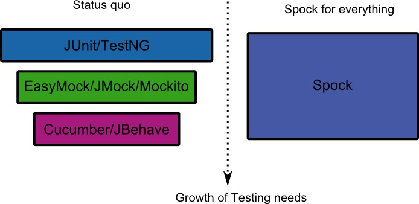

At the same time, because Spock is a newer testing framework, it had  the time to observe common pitfalls of the existing frameworks and  either fix them or offer a more elegant workaround. Explaining all the  advantages of Spock over existing solutions is out of the scope of this  article. A more detailed comparison between Spock and the JUnit/Mockito  combo can be found in the [Spock vs JUnit article](http://blog.codepipes.com/testing/spock-vs-junit.html).

In the context of mocking, Spock offers four major advantages:

-   Spock doesn’t need special constructs for [capturing arguments](https://static.javadoc.io/org.mockito/mockito-core/2.2.9/org/mockito/ArgumentCaptor.html) and creating [mocked answers](https://static.javadoc.io/org.mockito/mockito-core/2.8.9/org/mockito/stubbing/Answer.html). It uses Groovy closures, which are similar to Java 8 lambda expressions.
-   Mockito has a limitation with [argument matchers](https://static.javadoc.io/org.mockito/mockito-core/2.8.9/org/mockito/ArgumentMatchers.html). If you use matchers in a method, then **all** arguments need to have matchers. Spock does not suffer from this  limitation, and you can mix and match real arguments with argument  matcher.
-   Spock makes a distinction between stubs and mocks, making unit tests slightly more readable.
-   Spock presents much more detailed error messages when expected mock invocations are not found.

## A Word on Mocking and Stubbing

The theory behind mocking and stubbing was already explained in the [previous article](https://semaphoreci.com/community/tutorials/stubbing-and-mocking-with-mockito-2-and-junit) under the section “The Need for Mocks and Stubs”. We are not going to  repeat it here. In summary, we use mocks to isolate the class under test and examine it in a completely controlled environment. Common targets  for mocking are:

-   Database connections,
-   Web services,
-   Classes that are slow,
-   Classes with side effects, and
-   Classes with non-deterministic behavior.

We will cover two kinds of mock objects. *Stubs* are fake classes that come with preprogrammed return values. *Mocks* are fake classes that we can examine after a test has finished and see which methods were run or not.

Spock makes a clear distinction between the two as `mocks` and `stubs`, as we will see in the sections to follow.

[Semaphore](https://semaphoreci.com/) also provides tutorials for mocking in other languages if your interests go beyond Java:

-   [Mocking in Python](https://semaphoreci.com/community/tutorials/getting-started-with-mocking-in-python)
-   [Mocking in Ruby](https://semaphoreci.com/community/tutorials/mocking-with-rspec-doubles-and-expectations)
-   [Mocking in Javascript](https://semaphoreci.com/community/tutorials/best-practices-for-spies-stubs-and-mocks-in-sinon-js)

## Basic Stubbing with Spock

In our example application, we have a class that reads a customer from the database and forms their full name.

Here is the code for the customer:

```java
@Entity
public class Customer {

  @Id
  @GeneratedValue(strategy = GenerationType.AUTO)
  private long id;

  private String firstName;
  
  private String lastName;
  
  //...getters and setters redacted for brevity...

}
```

and here is our business class:

```java
public class CustomerReader {
  
  @PersistenceContext
  private EntityManager entityManager;
  
  public String findFullName(Long customerID){
    Customer customer = entityManager.find(Customer.class, customerID);
    return customer.getFirstName() +" "+customer.getLastName();
  }

}
```

This class reads customers from the database via the [EntityManager](http://docs.oracle.com/javaee/7/api/javax/persistence/EntityManager.html). We will test it by stubbing the EntityManager so that we can decide what gets returned without having a real database.

Here is the Spock unit test:

```groovy
public class CustomerReaderSpec extends spock.lang.Specification{

  public void "customer full name is formed ok"() {
    given: "a customer with example name values"
    Customer sampleCustomer = new Customer()
    sampleCustomer.setFirstName("Susan")
    sampleCustomer.setLastName("Ivanova")
    
    and: "an entity manager that always returns this customer"
    EntityManager entityManager = Stub(EntityManager.class)
    entityManager.find(Customer.class,1L) >> sampleCustomer
    
    and: "a customer reader which is the class under test"
    CustomerReader customerReader = new CustomerReader()
    customerReader.setEntityManager(entityManager)
    
    when: "we ask for the full name of the customer"
    String fullName = customerReader.findFullName(1L)
  
    then: "we get both the first and the last name"
    fullName == "Susan Ivanova"
  }

}
```

This file is called `CustomerReaderSpec.groovy`, and it should be placed in the folder **src/test/groovy** under the same Java package as the class under test. We have instructed Spock to run unit tests that end in `*Spec` in the Maven pom file, as described in the previous section.

Even if you have never seen Groovy/Spock before, the syntax of the  unit test should be familiar, as the code is deliberately written to be  Java-like.

First of all, we have named our unit test using a full sentence that  explains its purpose (customer full name is first name plus last name).  With Spock, you are free to use proper English explanations for your  unit tests. These sentences also appear in unit test reports, so they  are very valuable for other people in your organization (e.g. Project  Managers), as they can understand what a unit test does with zero  Java/Groovy knowledge.

More importantly, the test content itself is marked with `given, and, when, then` labels that showcase the [BDD](https://semaphoreci.com/community/tutorials/behavior-driven-development) spirit of Spock. These labels are called *blocks* in Spock parlance, and they logically divide the unit test to create a  well-defined structure. The strings next to each label serve as a  human-readable explanation of the associated code block.

The idea is that somebody can focus only on these labels and  understand what the unit tests dos without actually looking at the code. In this particular example, the following blocks are contained:

1.  **given**: “a customer with example name values”
2.  **and**: “an entity manager that always returns this customer”
3.  **and**: “a customer reader which is the class under test”
4.  **when**: “we ask for the full name of the customer”
5.  **then**: “we get both the first and the last name”

Reading the block descriptions creates an English sentence that  serves as a mini-specification of what the test does. The labels can be  normal strings, so you should strive to name them according to your  business domain and abstraction depth that suits you. Ideally, you  should use full sentences to explain what each block does in a  high-level manner.

The `given:` block contains just some Java code that creates a sample customer. The first `and:` block is where we actually create a fake object. In this particular case, we create a stub using the static method `Stub()` that Spock offers. We essentially tell Spock that it will need to create a fake object for the *EntityManager* class.

The most important line of the whole test is the next one. The line `entityManager.find(Customer.class,1L) >> sampleCustomer` instructs Spock what to do when the `find()` method of the stub is called.

The caret character means “return” in Spock parlance. The whole  statement says: “when the entityManager find() method is called with  arguments Customer class and 1, return our sample customer”.

If you know how Mockito works, the equivalent line would be: `when(entityManager.find(Customer.class,1L)).thenReturn(sampleCustomer);`

We’ve now both created a Stub object with Spock, and also instructed it with a dummy return result. Next, we create our *CustomerReader* reader object and pass as a dependency the fake object. From now on,  the CustomerReader class will function without understanding that the  EntityManager is not a real one.

In the `when:` block, we call our test method in the usual Java manner. The final block is the `then:` block. This is the block that decides if the test will fail or not.  Unlike Junit, Spock does not use assert statements. Instead, it expects  normal boolean statements. Statements in the `then:` block  will be evaluated by Spock as boolean, and if all of them are true, the  test will pass. If any of them fail, the test will fail.

Notice also that no statement has a semicolon at the end of the line. Unlike Java, Groovy does not require semicolons.

With the test code in place, we can run this Spock unit test either from the command line (using the `mvn test` command), or via our favorite IDE. Here is an example with Eclipse.

As far as Eclipse is concerned, the Spock test is handled in exactly the same way as a JUnit test would be.

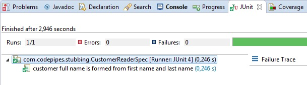

The test result shows the title correctly as a full English sentence.

### Grouping Multiple Unit Tests for the Same Class Under Test

In the previous section, we had a single unit test in a single file.  In a real project, we will probably have multiple unit tests for the  same class under test in order to evaluate multiple scenarios and  conditions.

In those cases, it makes sense to move the stub creation process to a reusable method, removing code duplication. Similar to the `@Before` annotation in JUnit, Spock also allows the extraction of common setup code into a method that will run before each unit test.

You might have already noticed that our `CustomerReader` class is not correct, as it does not handle the null case, i.e. the given database ID does not exist as an object in the DB.

Let’s create a unit test that covers this scenario as well.

```groovy
public class CustomerReader2Spec extends spock.lang.Specification{

  //Class to be tested
  private CustomerReader customerReader;

  //Dependencies
  private EntityManager entityManager;
  
  /**
   * Runs before each test method, like the JUnit Before
   * annotation
   */
  public void setup(){
    customerReader = new CustomerReader();
    
    entityManager = Stub(EntityManager.class);
    customerReader.setEntityManager(entityManager);
  }
  
  
  public void "customer full name is formed ok"() {
    given: "a customer with example name values"
    Customer sampleCustomer = new Customer()
    sampleCustomer.setFirstName("Susan")
    sampleCustomer.setLastName("Ivanova")
    
    and: "an entity manager that always returns this customer"
    entityManager.find(Customer.class,1L) >> sampleCustomer
    
    when: "we ask for the full name of the customer"
    String fullName = customerReader.findFullName(1L)
    
    then: "we get both first and last name"
    fullName == "Susan Ivanova"
  }
  
  public void "customer is not in the database"(){
    given: "the database has no record for the customer"
    entityManager.find(Customer.class,1L) >> null
    
    when: "we ask for the full name of the customer"
    String fullName = customerReader.findFullName(1L)
    
    then: "the empty string should be returned"
    fullName == ""
  } 
}
```

The method named `setup()` will be executed by Spock  before each individual name. This functionality is detected by the name  of the method itself (there is no Spock annotation for this).

Apart from extracting the common code for creating our test class and its mocked dependencies, we have also added a second scenario for the  case when the customer is not in the database.

For this scenario, the stubbing line is changed to `entityManager.find(Customer.class,1L) >> null`. This line means: “when the find() method is called with these arguments, then return null”.

In true [TDD](https://semaphoreci.com/blog/test-driven-development) fashion, we have created the unit tests before the actual  implementation. If you run our unit test, the second test method will  fail. Eclipse should still show the names of the tests as full  sentences.

As an exercise, feel free to correct the `CustomerReader` implementation and also add extra unit tests when the first and/or last name are null themselves.

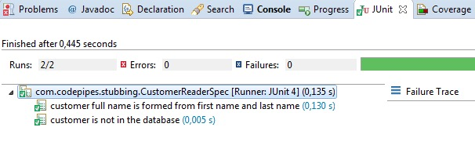

To gain full advantage of the individual Spock blocks, you can also use the external project of [Spock reports](https://github.com/renatoathaydes/spock-reports).

Here is a sample report:

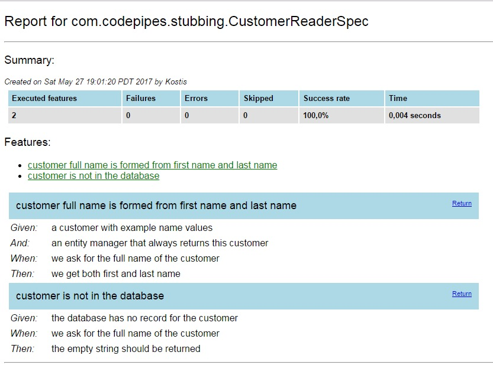

You can find information on how to use the reports in the [README file](https://github.com/renatoathaydes/spock-reports#if-you-are-using-maven).

## Basic Mocking with Spock

In all the examples so far, we have only seen Spock stubs (i.e.  classes that hardcoded return values). For a mocking example, let’s  assume that we have the following class in our application:

```java
public class LateInvoiceNotifier {

  private final EmailSender emailSender;
  private final InvoiceStorage invoiceStorage;
  
  public LateInvoiceNotifier(final EmailSender emailSender, 
                              final InvoiceStorage invoiceStorage){
    this.emailSender = emailSender;
    this.invoiceStorage = invoiceStorage;
  }
  
  public void notifyIfLate(Customer customer)
  {
    if(invoiceStorage.hasOutstandingInvoice(customer)){
      emailSender.sendEmail(customer);
    }
  }
}
```

This class has two external dependencies, a class that sends emails  and an invoice database. It checks for late customer invoices and sends  customers an email if an invoice is late.

We want to test the method `notifyIfLate()` and ensure  that emails are sent to a customer only if they have outstanding  invoices. Since the method does not have a return value, the only way to verify if it runs or not is to use a mock.

We will mock both `InvoiceStorage` and `EmailSender`, run the unit test and examine what interactions took place after the test has finished.

We need to test two scenarios. In the first one, the customer has an  outstanding invoice (and thus an email should be sent). In the second  one, the customer has no pending invoices. Here is the Spock code:

```groovy
public class LateInvoiceNotifierSpec 
                  extends spock.lang.Specification{
  //Class to be tested
  private LateInvoiceNotifier lateInvoiceNotifier

  //Dependencies (will be mocked)
  private EmailSender emailSender
  private InvoiceStorage invoiceStorage

  //Test data
  private Customer sampleCustomer

  /**
   * Runs before each test method, like the JUnit Before
   * annotation
   */
  public void setup(){
    invoiceStorage = Stub(InvoiceStorage.class)
    emailSender = Mock(EmailSender.class)

    lateInvoiceNotifier = new LateInvoiceNotifier(emailSender,
                                                  invoiceStorage);

    sampleCustomer = new Customer()
    sampleCustomer.setFirstName("Susan")
    sampleCustomer.setLastName("Ivanova")
  }

  public void "a late invoice should trigger an email"() {
    given: "a customer with a late invoice"
    invoiceStorage.hasOutstandingInvoice(sampleCustomer) >> true

    when: "we check if an email should be sent"
    lateInvoiceNotifier.notifyIfLate(sampleCustomer)

    then: "the customer is indeed emailed"
    1 * emailSender.sendEmail(sampleCustomer)
  } 
  
  public void "no late invoices"() {
    given: "a customer with good standing"
    invoiceStorage.hasOutstandingInvoice(sampleCustomer) >> false

    when: "we check if an email should be sent"
    lateInvoiceNotifier.notifyIfLate(sampleCustomer)

    then: "an email is never sent out"
    0 * emailSender.sendEmail(sampleCustomer) 
  }


}
```

The first dependency, `InvoiceStorage`, is used as a stub. This is why we use the caret syntax as shown in the previous section.  For the first test, we assume the customer has an outstanding invoice  (line `invoiceStorage.hasOutstandingInvoice(sampleCustomer) >> true`). For the second test, no late invoice is present (line `invoiceStorage.hasOutstandingInvoice(sampleCustomer) >> false`.)

The second dependency – `EmailSender` is a bit different.  At the end of the test, we need to know if an email was sent or not. The only way to do this is to check how many times the method `sendEmail()` was called using a mock.

Spock supports the creation of mocks using the static `Mock()` method. Here is the respective line:

```groovy
  emailSender = Mock(EmailSender.class);
```

When running a unit test, Spock keeps track of all the invocations  that happen with mocked objects. At the end of the test, we can query  these invocations with the following Spock syntax:

```groovy
  N * mockedObject.method(arguments)
```

This line means: “after this test is finished, this `method` of `mockedObject` should have been called N times with these `arguments`“. If this has happened, the test will pass. Otherwise, Spock will fail the test.

The verification lines are placed inside the `then:` block of each test, right at the end of the test method.

In our case, the line `1 * emailSender.sendEmail(sampleCustomer)` means: “once this test has finished, the `sendEmail()` method should have been called 1 time with the `sampleCustomer` class as an argument. This is the scenario when an email should be  sent. In the second scenario, the number of times is zero because no  email should be sent.

If you already know Mockito, these two Spock lines map to `verify(emailSender, times(1)).sendEmail(sampleCustomer);` and `verify(emailSender, times(0)).sendEmail(sampleCustomer);` respectively.

Spock is smart enough to monitor the expected invocations, and give a clear error message when things go wrong. For example, let’s assume  that we have a bug in the code that does not send reminders to customers when they have outstanding invoices. The test will fail, and Spock will present the following error message:

```bash
  Tests run: 2, Failures: 1, Errors: 0, Skipped: 0, Time elapsed: 0.015 sec 
    <<< FAILURE! 
     - in com.codepipes.mocking.LateInvoiceNotifierSpec
     a late invoice should trigger an email
  Time elapsed: 0 sec  <<< FAILURE!
  org.spockframework.mock.TooFewInvocationsError: Too few invocations for:

  1 * emailSender.sendEmail(sampleCustomer)   (0 invocations)
```

In the error message, Spock explains how we requested 1 call for the method `sendEmail()`, but that method was never called – 0 invocations.

## Verifying Mocked Object Arguments

The previous example was relatively simple, we just verified whether a single method was called or not. Sometimes we need more detail, and  instead of looking only at the method call itself, we are also  interested in the arguments.

As an example, let’s assume that the analytics department wants more  extensive metrics, and has asked you to implement an extra mechanism,  where several important events for a customer are recorded and later  analyzed.

Here is the source code of the Event that the metrics solution supports:

```java
public class Event {

  public enum Type  {REMINDER_SENT, REGISTRATION, 
                      INVOICE_ISSUED, PAYMENT, SETTLEMENT};
  
  private Type type;
  private String customerName;
  private LocalDate timestamp;
  
  //..getters and setters redacted for brevity...
  
}
```

The `LateInvoiceNotifier` class is then augmented with an `EventRecorder` dependency and we want to write a unit test that verifies that the event recorded:

1.  is of type `REMINDER_SENT`,
2.  has the correct customer name, and
3.  contains a timestamp.

Spock supports examining method arguments using [Groovy closures](http://groovy-lang.org/closures.html). Groovy closures are very similar to [Java 8 lambda expressions](https://docs.oracle.com/javase/tutorial/java/javaOO/lambdaexpressions.html), so you don’t need any special knowledge to understand them if you have already worked with Java 8. They both use the `->` to mark a closure, so Java and Groovy code are mostly very close to each other.

Here is the Spock test that not only verifies that the email event was recorded, but also checks its values:

```groovy
public class EventCheckSpec extends spock.lang.Specification{
  //Class to be tested
  private LateInvoiceNotifier lateInvoiceNotifier;

  //Dependencies (will be mocked)
  private EmailSender emailSender;
  private InvoiceStorage invoiceStorage;
  private EventRecorder eventRecorder;

  //Test data
  private Customer sampleCustomer;

  /**
   * Runs before each test method, like the JUnit Before
   * annotation
   */
  public void setup(){
    invoiceStorage = Stub(InvoiceStorage.class)
    emailSender = Mock(EmailSender.class)
    eventRecorder = Mock(EventRecorder.class)

    lateInvoiceNotifier = new LateInvoiceNotifier(emailSender, 
                                    invoiceStorage,eventRecorder);
    sampleCustomer = new Customer();
    sampleCustomer.setFirstName("Susan")
    sampleCustomer.setLastName("Ivanova")
  }

  public void "email about late invoice should be ok"() {
    given: "a customer with a late invoice"
    invoiceStorage.hasOutstandingInvoice(sampleCustomer) >> true

    when: "we check if an email should be sent"
    lateInvoiceNotifier.notifyIfLate(sampleCustomer)

    then: "the customer is indeed emailed"
    1 * emailSender.sendEmail(sampleCustomer)
    
    and: "the event is recorded with the respective details"
    1 * eventRecorder.recordEvent({
      event -> 
      event.getTimestamp() != null &&
      event.getType() == Event.Type.REMINDER_SENT &&
      event.getCustomerName() == "Susan Ivanova"
      })
  }

}
```

Our class under test `LateInvoiceNotifier` now has 3 dependencies:

1.  `InvoiceStorage` is just used as a helper, so we stub it,
2.  `EmailSender` will be used to verify that an email was sent. We create a Mock for it, and,
3.  `EventRecorder` will also be used to verify the event that was emitted. We also create a mock for it.

The creation of these 3 mocks happens in the `setup()`  method. Our class under test now has 3 fake dependencies, and we have  full control of all input and output that happens during the unit test.

The unit test itself has a slightly different structure from the ones we have seen before. This time, we have the following blocks: `given, when, then, and`.

The second `and:` block after the `then:` block is used because the unit test actually tests two related actions. First of all, it verifies that the email was indeed sent as in the previous  section. This is the line `1 * emailSender.sendEmail(sampleCustomer);`. This line is the same as with the previous section.

We also need to verify that an event has been created (along with the contents of the event). We employ an `and:` block at the end of the test to do this. The `->` character denotes a Groovy closure. The last line of the test means:

1.  “Verify that the `recordEvent()` method of the `eventRecorder` class was called 1 time,
2.  and use a closure to capture the argument that was used,
3.  and name the argument `event`,
4.  and verify that the argument had a non-null `timestamp` property,
5.  and a `TYPE.REMINDER_SENT` type property,
6.  and a customerName property equal to “Susan Ivanova”.

If *all* the above are true, the test will succeed. If *any* of these statements is false, the whole test will fail. Spock is so  smart that it can detect the difference between an invocation that has  arguments that are similar, but not exactly the same.

Let’s assume that we have a bug in our application, and that the  timestamp property is not correctly set. Spock will present the  following test error:

```bash
  email about late invoice should be ok
  Time elapsed: 0.126 sec  <<< FAILURE!

  org.spockframework.mock.TooFewInvocationsError: Too few invocations for:

  1 * eventRecorder.recordEvent({
                        event ->
                        event.getTimestamp() != null &&
                        event.getType() == Event.Type.REMINDER_SENT &&
                        event.getCustomerName() == "Susan Ivanova"
                        })   (0 invocations)

  Unmatched invocations (ordered by similarity):

  1 * eventRecorder.recordEvent(com.codepipes.mocking.Event@31198ceb)
```

Here, Spock tells us that, while our method was indeed called once, it was *not* called with the arguments we requested.

## Forming Dynamic Responses for Mocks

The previous examples of Spock unit tests will cover most of your  testing needs. We will now cover some advanced Spock examples that deal  with dynamic manipulations of arguments and responses from mocks.

Again, Spock is based on Groovy closures for both of these features.  If you know your way around Java 8 lambda expressions, then it should be very easy to follow.

However, keep in mind that dynamic manipulation of arguments and  responses is an advanced technique that will be needed only for some  very specific corner cases in your unit tests. If you have a choice, it  is best to return predefined results in your mocks/stubs, so that the  test is more readable. Use dynamic responses only as a last resort in  your unit tests.

## Dynamic Manipulation of Arguments with Spock

Let’s see an example where we just want to modify the argument itself. We’ll assume that you want to test the following class:

```java
public class CustomerDao {

  @PersistenceContext
  private EntityManager entityManager;

  private Logger logger;

  public void saveCustomer(String firstName, String lastName) {
    if(firstName == null || lastName==null) {
      logger.error("Missing customer information");
      throw new IllegalArgumentException();
    }
    Customer customer = new Customer(firstName,lastName);
    entityManager.persist(customer);
    entityManager.flush();
    logger.info("Saved customer with id {}", customer.getId());
  }

}
```

You should instantly see why writing a unit test for this class is a bit tricky. Even though the [DAO](https://en.wikipedia.org/wiki/Data_access_object) logic itself is very basic, the fact that once the customer is saved using the `persist` method, its database ID is sent to the logger presents a problem. For  this contrived example, the code will work just fine in the real system, as the database will indeed assign an ID to the object as soon as it is saved.

How can we replicate this processing in our unit test? The `persist` method does not return an argument, so we cannot mock it using Spock’s `>>` syntax.

Spock can still create a unit test for this scenario with the following test:

```groovy
public class CustomerDaoSpec extends spock.lang.Specification{
  // Class to be tested
  private CustomerDao customerDao;

  // Dependencies (will be mocked)
  private EntityManager entityManager
  private Logger logger

  //Test data
  private Customer sampleCustomer

  /**
   * Runs before each test method, like the JUnit Before
   * annotation
  */
  public void setup(){
    customerDao = new CustomerDao();

    entityManager = Stub(EntityManager.class)
    customerDao.setEntityManager(entityManager)

    logger = Mock(Logger.class)
    customerDao.setLogger(logger)
  }

  public void "customer IDs are logged in the DB"() {
    given: "a customer dao that assigns an ID to customer"
    entityManager.persist( _ as Customer) >> { Customer customer ->  customer.setId(123L)} 
    
    when: "that customer is saved in the DB"
    customerDao.saveCustomer("Suzan", "Ivanova")

    then: "the ID is correctly logged"
    1 * logger.info("Saved customer with id {}", 123L)

  }
}
```

As with the previous unit tests, we create two fake objects in the `setup()` method:

1.  The `EntityManager` class is stubbed, and,
2.  The `Logger` class is mocked because we need to verify its `info()` method.

The most important line of the whole unit test is the following:

```groovy
entityManager.persist( _ as Customer) >> { Customer customer ->  customer.setId(123L)}
```

Let’s break this line into two parts, the one before the `>>` operator, and the one after. The first part uses the underscore  character as an argument. The underscore character is a special  character in Spock, and it means “any”. It is used as an argument  matcher that can match any value of the argument. The syntax `as Customer` is another special Spock construct that makes the test a bit more  strict by ensuring that the argument is indeed a Customer class.

Therefore, the first part of the statement matches the call of the `persist()` method with any kind of argument that is a Customer. The equivalent matcher in Mockito would be `when(entityManager).persist(any(Customer.class)`.

In all the Spock examples we have seen so far, the `>>` operator means “then return”. In this particular example, the `persist()` method doesn’t return anything. Therefore, we can think the `>>` character as “then do”. The second part of the statement is a Groovy closure (denoted by the `->` character), and it means “take the customer argument, and execute its `setId()` method with an argument of 123L”.

This is all that is needed to create dynamic responses in Spock. Mockito would need a special `Answer` [construct](https://static.javadoc.io/org.mockito/mockito-core/2.8.9/org/mockito/Mockito.html#12) here.

The last part of the test (the `then:` block) is the same as we have seen in previous examples. It just verifies that the `info()` method was executed once with the correct arguments and more specifically with the ID equal to 123 which was stubbed in the `when:` block.

## Dynamic Responses Based on Arguments with Spock

As a grand finale, we will see an extreme unit test where the answer  of a mock depends on the argument. Let’s assume that you want to test  the following class:

```java
public class MassUserRegistration {

  private final EventRecorder eventRecorder;
  private final UserRepository userRepository;

  public MassUserRegistration(final EventRecorder eventRecorder,
        final UserRepository userRepository) {
    this.eventRecorder = eventRecorder;
    this.userRepository = userRepository;
  }

  private void register(String firstName, String lastName) {
    Customer newCustomer = userRepository.saveCustomer(firstName, lastName);

    Event event = new Event();
    event.setTimestamp(newCustomer.getSince());
    event.setCustomerName(newCustomer.getFullName());
    event.setType(Type.REGISTRATION);
    eventRecorder.recordEvent(event);
  }

  public void massRegister(List rawCustomerNames) {
    for (Customer customer:rawCustomerNames) {
      register(customer.getFirstName(),customer.getLastName());
    }
  }
}
```

This is a class that takes a list of customers and saves them on the `UserRepository`. For each customer, an event of type `REGISTRATION` is also emitted.

We want to test the method called `massRegister()`, as the `register()` one is private. In theory, we could pass a list of just one customer in our unit test, but in practice, it is best to try with a long list of  customers. The code here is very simple, and it does no error checking  at all, but in a production system, there might be several consistency  checks before a customer is registered. A realistic unit test would pass a huge list of customers with various problems so that all checks can  be evaluated during unit testing.

Let’s say we want to test using a list of 20 customers. This time, the `saveRepository` method does return an argument, so in theory, we could stub that method with the `>>` operator 20 times to instruct it exactly what output it should send.

A more concise way is the following:

```groovy
public class MassUserRegistrationSpec 
            extends spock.lang.Specification{
  //Class under test
  private MassUserRegistration massUserRegistration;

  //Dependencies (will be mocked)
  private UserRepository userRepository;
  private EventRecorder eventRecorder;

  //Test data
  private List sampleCustomers;

  /**
   * Runs before each test method, like the JUnit Before
   * annotation
   */
  public void setup(){
    sampleCustomers = new ArrayList<>()

    eventRecorder = Mock(EventRecorder.class)
    userRepository = Stub(UserRepository.class)

    userRepository.saveCustomer( _ as String, _ as String) 
            >> { String firstName, String lastName ->
      Customer newCustomer = new Customer(firstName, lastName)
      newCustomer.setFullName(firstName + " " + lastName)
      newCustomer.setSince(LocalDate.now())
      return newCustomer
    }

    massUserRegistration = new MassUserRegistration(eventRecorder,
                                                    userRepository);
  }

  public void "mass registration of users"() {
    given: "a list of sample Customers"
    sampleCustomers.add(new Customer("Susan", "Ivanova"));
    sampleCustomers.add(new Customer("Lyta", "Alexander"));
    sampleCustomers.add(new Customer("Vir", "Cotto"));
    sampleCustomers.add(new Customer("Stephen", "Frankling"));
    //[...20 customers redacted for brevity...]

    when: "we register all customers at once"
    massUserRegistration.massRegister(sampleCustomers);

    then: "each registration event is ok"
    sampleCustomers.each { sampleCustomer ->
      1 * eventRecorder.recordEvent({ event ->
        event.getTimestamp() != null &&
        event.getType() == Event.Type.REGISTRATION &&
        event.getCustomerName() == sampleCustomer.getFirstName() 
                                + " "+ sampleCustomer.getLastName()
      })
    }
  }
}
```

This Spock unit test essentially gathers all the techniques we have  seen so far in one masterpiece. It combines simple stubbing, simple  mocking, dynamic arguments and argument verification in the same file!

Let’s analyze everything in turn. Our class under test is `MassUserRegistration` and has two dependencies:

1.  Class `UserRepository`. We will create a stub for it as we use it as a helper class
2.  Class `EventRecorder`. We will mock it because we want to verify the emission of events for each user registration.

In our `setup()` method we stub `UserRepository` using dynamic arguments:

```java
userRepository.saveCustomer( _ as String, _ as String) 
                    >> { String firstName, String lastName ->
        Customer newCustomer = new Customer(firstName, lastName)
        newCustomer.setFullName(firstName + " " + lastName)
        newCustomer.setSince(LocalDate.now())
        return newCustomer
      }
```

The first part before the `>>` operator matches the `saveCustomer()` method when any two arguments are passed by employing the underscore  character. To make the test a bit more strict we make sure that the  arguments are Strings (the `as  String`) syntax. If non-string arguments are passed, the unit test will fail.

The second part after the `>>` operator instructs  the stub to create a dynamic response for the two matched arguments. It  uses a closure with two argument where the first one is named `firstName`, and the second one is named `lastName`. These values are used for the creation of a new `Customer` object.

The combination of these two parts translates to:

1.  Whenever the `saveCustomer` of the `userRepository` object is called with *any* Strings as arguments,
2.  name those arguments `firstName` and `lastName`,
3.  create a new `Customer` object on the fly using those two strings in the constructor,
4.  concatenate these two strings with space and assign the result to the `fullName` property of the customer,
5.  set the `since` property to the current date, and,
6.  return the `Customer` created to the method caller.

All these actions will be performed by Spock during the course of the unit test. Regardless of the size of our testing data, the `UserRepository` mock will always return the correct response to the class under test.

In the `then:` block we perform verification of the events for each customer. First of all, we use the Groovy [each](http://docs.groovy-lang.org/latest/html/groovy-jdk/java/lang/Iterable.html#each(groovy.lang.Closure)) iteration that allows us to use a closure for each Customer. This is equivalent to the [Java 8 forEach statement](https://docs.oracle.com/javase/8/docs/api/java/lang/Iterable.html#forEach-java.util.function.Consumer-).

Then, we employ the same argument verification we have seen in the  previous section inside the closure. For each customer passed in the `recordEvent` method, we verify that the event emitted is of type `Type.REGISTRATION`, that the timestamp property is not null, and that the correct first name and last name were stored.

Notice that the unit test is written in such a way that the size of  the input data is actually irrelevant. We can expand the test data from  20 customers to 100 customers, to 1000 customers, and the mocking and  verification code will remain unchanged. This would not be the case if  we had manually stubbed a different response for each specific customer.

## Continuous Integration for Spock on Semaphore

Now that we have our tests, we can start doing [continuous integration (CI)](https://semaphoreci.com/continuous-integration). The first step is to integrate our project’s repository with [Semaphore](https://semaphoreci.com), which will wait for any pushes to our repository and will then run our tests for us.

Semaphore comes with an included [stack of Java tools](https://docs.semaphoreci.com/programming-languages/java/), including Maven and Gradle, allowing us to set up our project with minimal effort.

### Run the Spock Example Project on Semaphore

To end the post on a practical note, let’s try the official Spock Example Project on Semaphore.

In this section, we’ll configure a CI [Pipeline](https://semaphoreci.com/blog/cicd-pipeline) to build and test an application with Maven and Spock.

-   Head to the Spock [example repository](https://github.com/spockframework/spock-example) and use the **Fork** button to get your own copy of the code.

[spockframework](https://github.com/spockframework) / [spock-example](https://github.com/spockframework/spock-example)

-   Clone the repository to your machine: use the **Clone or download** button to get the repository URL and then:

```
$ git clone https://github.com/...your repository url...
```

-   Sign up for a [Semaphore](https://semaphoreci.com) account using the **Sign up with GitHub** button on the top-right corner.
-   Click on the **+ (plus sign)** next to **Projects**:
-   **Choose** the spock-example repository:

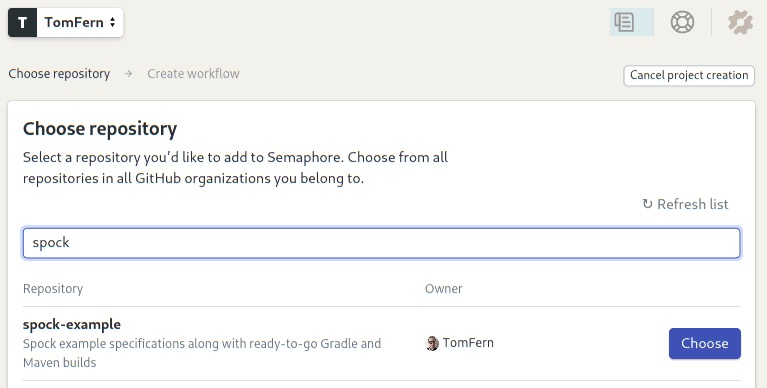

-   Semaphore will show you some starter workflows. Spock works with Ant, Gradle and Maven. Let’s try Maven:

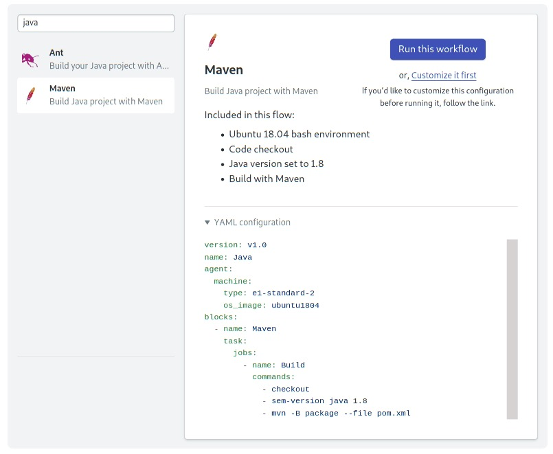

-   Click on **Run this Workflow** to get started.

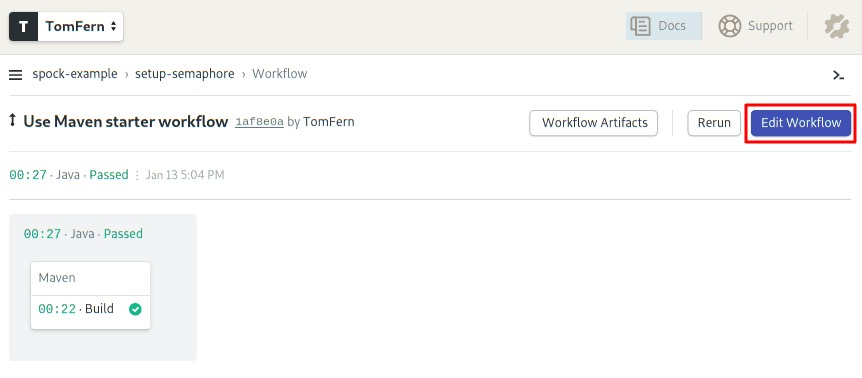

-   To edit the pipeline, click on the **Edit Workflow** button near the top-right corner. This will open the **Workflow Builder**:

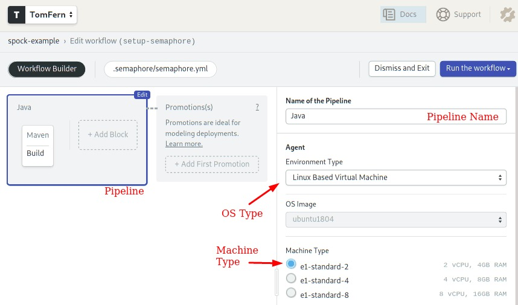

The main components of the builder are:

-   **Pipeline**: a pipeline fulfills a particular  objective, for instance: testing. A pipeline organizes the flow of the  CI/CD process, we can design a complex workflow out of multiple  pipelines connected together.
-   **Agent**: the agent  is the virtual machine that executes the pipeline. It consists of a  Machine Type and an OS Image. The Machine Type defines the amount of  CPUs, RAM, and storage that is available. There are many [types](https://docs.semaphoreci.com/ci-cd-environment/machine-types/) to choose from.
-   **Blocks**: blocks run one at a time, from left to right. A block groups jobs with a similar purpose and configuration. 
-   **Jobs**: jobs contain commands that do the work. We can define multiple jobs in a block. Jobs in a block **run in parallel**. Once all jobs in a block complete, the next block can begin.

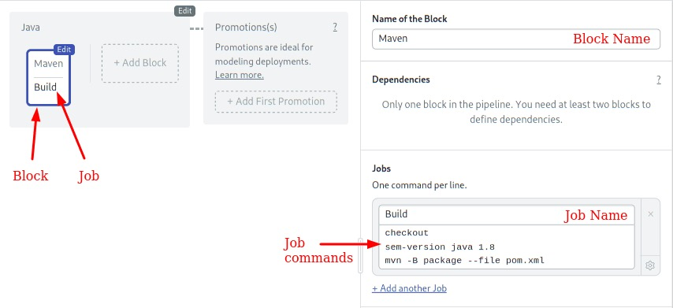

The job uses some convenient commands provided by Semaphore:

-   **checkout**: clones the GitHub repository to the Semaphore environment and changes the working directory. Most of our jobs will start with `checkout`.
-   **sem-version**: switches the active language version. In this case, we are using Java 8 (Java SDK 1.8). Sem-version supports [multiple languages](https://docs.semaphoreci.com/ci-cd-environment/sem-version-managing-language-versions-on-linux/).

#### Using the Cache

Our initial CI pipeline does its job, but we can improve it. We have to tweak it a bit to:

-   Use the Maven Wrapper (**mvnw**) script as recommended by the official [Spock reference](http://spockframework.org/spock/docs/1.3/all_in_one.html#_spock_example_project).
-   Use a project-wide cache to speed up build time.
-   Separate building from testing so it’s easy to add more tests later.

Let’s customize the pipeline:

-   Click on the **Maven** block.
-   Change the contents of the command box so they look like this:

```bash
checkout
cache restore
sem-version java 1.8
./mvnw package -Dmaven.test.skip=true
cache store
```

-   Open the **Environment Variables** section.

-   Add the following variable by clicking on +Add env_var:
    -   `MAVEN_OPTS` = `-Dmaven.repo.local=.m2`

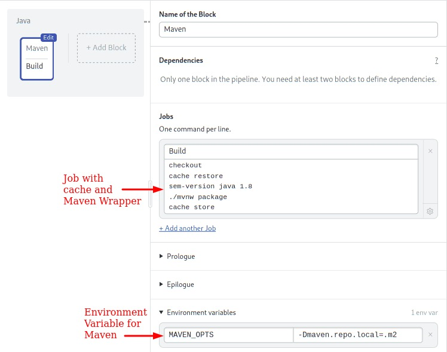

We have introduced some new concepts in this block:

-   **cache**: the cache is project-wide storage supplied by Semaphore. The [cache script ](https://docs.semaphoreci.com/reference/toolbox-reference/)scans the current directory and detects the project type, language, and the files and directories to `store` and `restore`. Using the cache, we can avoid re-downloading the Maven dependencies each time.
-   **Environment Variables**: variables defined in the block are set for all its jobs. In this  instance, we tell Maven to find downloaded dependencies in the current `.m2` directory (instead of in the user’s `$HOME`). This is required for the cache to work.

To try the workflow:

-   Click on **Run the Workflow.**
-   Click on **Start**.

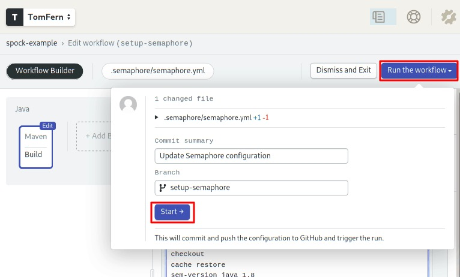

#### Add the Tests

Add a second block to run the tests:

-   Click on **Edit Workflow**.
-   Add a new block by clicking on the **+ Add Block** dotted grey box.
-   Name the block: “Tests”
-   Change the name of the job to: “Spock Tests”
-   Type the following commands:

```bash
./mvnw test
```

-   Open the **prologue** section. Commands we type in the prologue are executed *before* each job in the block. Type the following set-up commands:

```
checkout
cache restore
```

-   Open the **Environment Variables** section and define the `MAVEN_OPTS` variable just as before.

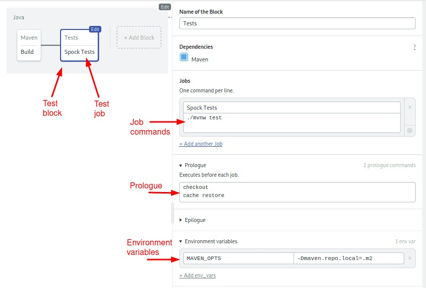

-   Click on **Run the Workflow** and then **Start** to run the tests.

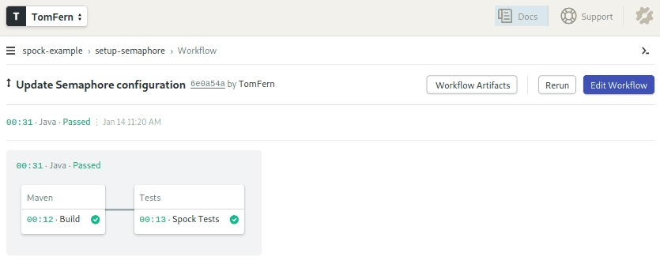

-   Click on the **Spock Tests** job to see its output. If any of the tests would have failed, the job would have ended in  error. Fortunately, there were no errors.

```bash
[INFO] Tests run: 39, Failures: 0, Errors: 0, Skipped: 0
[INFO] 
[INFO] ------------------------------------------------------------------------
[INFO] BUILD SUCCESS
[INFO] ------------------------------------------------------------------------
[INFO] Total time:  3.539 s
[INFO] Finished at: 2020-01-14T14:20:55Z
[INFO] ------------------------------------------------------------------------
```

Good job! You now have an optimized CI pipeline for your Java  project. You can write your application with the confidence that the  code is being tested on each step of the way. Also, Semaphore comes with a neat [Test Reports](https://semaphoreci.com/blog/test-reports) feature that gives you a full overview of your test suite.

You can add more tests or even combine multiple tests framework by adding more jobs into the Tests block.

Once you’ve mastered Continuous Integration, you can go a step further and use Semaphore to [Continously Deploy](https://semaphoreci.com/cicd) your application.

## Summary

In this tutorial, we’ve written several unit tests using Spock for both stubbing and mocking.

We’ve covered:

1.  How to download and set up Spock via Maven,
2.  The advantages Spock brings when it comes to testing Java code
3.  Basic stubbing with the `>>` operator,
4.  Basic verification with the `N * mockedObject.method(arguments)` syntax,
5.  Advanced verification of arguments using Groovy closure and the underscore character,
6.  Advanced dynamic manipulation of arguments, and,
7.  Advanced dynamic responses based on arguments.
8.  How to run your Spock tests continuously with Semaphore CI/CD.

## Where to Go from Here

We’ve seen Spock’s most important mocking features, but there are several more to explore:

1.  There are more ways to restrict argument matchers,
2.  The number of verifications can also be described [using Groovy ranges](http://spockframework.org/spock/docs/1.1-rc-3/interaction_based_testing.html#_cardinality),
3.  Stubs can be instructed to [throw exceptions](http://spockframework.org/spock/docs/1.1-rc-3/interaction_based_testing.html#_performing_side_effects) (for negative testing scenarios),
4.  You can also verify the event order as they happen in a unit test using multiple `then:` blocks,
5.  You can stub [multiple calls](http://spockframework.org/spock/docs/1.1-rc-3/interaction_based_testing.html#_chaining_method_responses) to the same method to return different results for each subsequent time, and,
6.  Spock also supports [Spies](http://spockframework.org/spock/docs/1.1-rc-3/interaction_based_testing.html#Spies), which is another advanced type of fake objects.

If you have any questions and comments, feel free to leave them in  the section below. Also, feel free to share this tutorial with anyone  you think might benefit from it.

### Read also:

-   [Revving up Continuous Integration with Parallel Testing](https://semaphoreci.com/blog/revving-up-continuous-integration-with-parallel-testing)
-   [Testing a Java Spring Boot REST API with Karate](https://semaphoreci.com/community/tutorials/testing-a-java-spring-boot-rest-api-with-karate)
-   [Stubbing and Mocking with Mockito and JUnit](https://semaphoreci.com/community/tutorials/stubbing-and-mocking-with-mockito-2-and-junit)
\newpage

© __BUILD_YEAR__ Semaphore Technologies doo. All rights reserved.

This work is licensed under Creative Commmons
Attribution-NonCommercial-NoDerivatives 4.0 International.
To view a copy of this license, visit
<https://creativecommons.org/licenses/by-nc-nd/4.0>

The source text is open source:
<https://github.com/semaphoreci/papers>

Originally published at:
<https://semaphoreci.com/community/tutorials/stubbing-and-mocking-in-java-with-the-spock-testing-framework>

Original publication date: 15 Jul 2022

Authors: Kostis Kapelonis

Editor: Marko Anastasov

Reviewed by: Tomas Fernandez

Build date: __BUILD_MONTH__ __BUILD_YEAR__

Revision: __BUILD_REVISION__

\newpage
