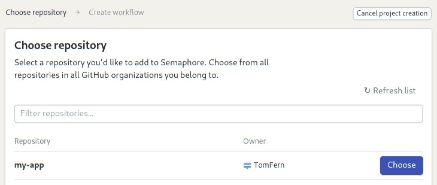
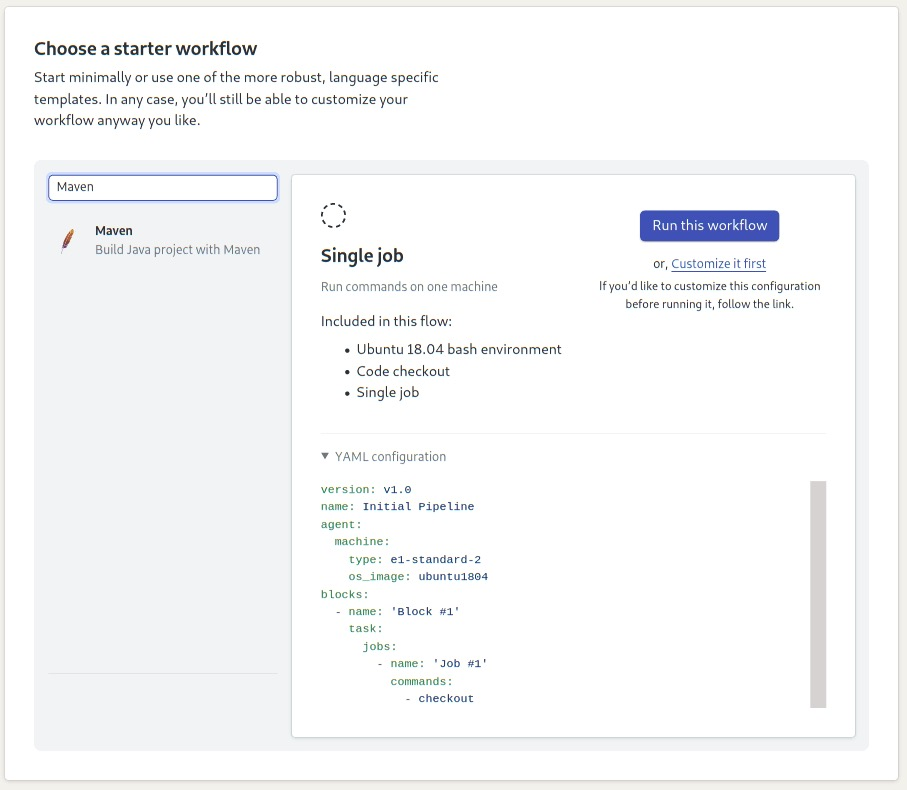
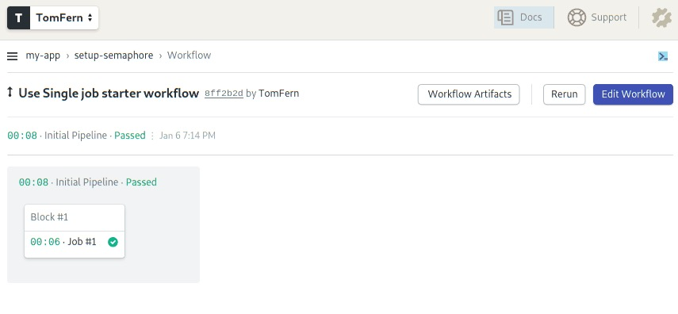
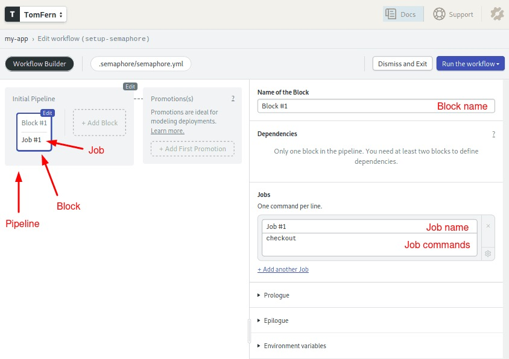
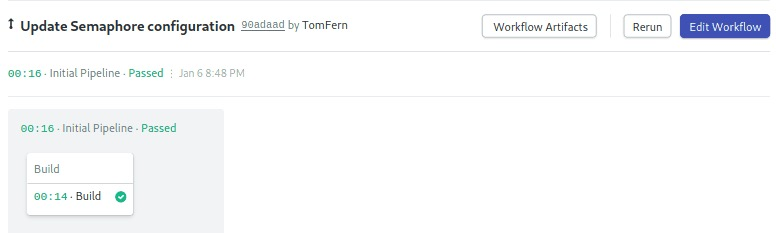
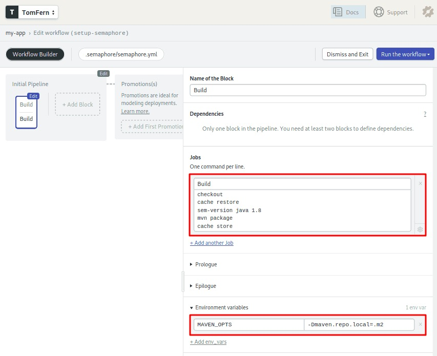
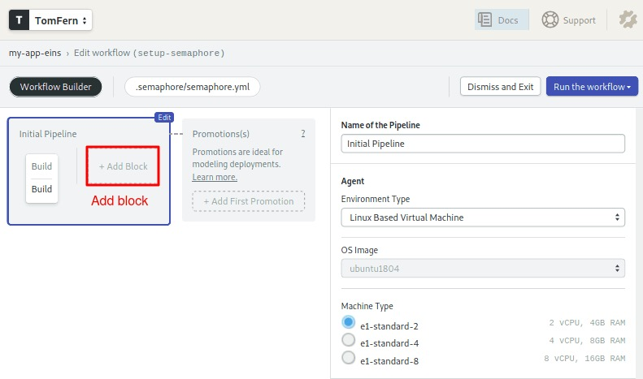
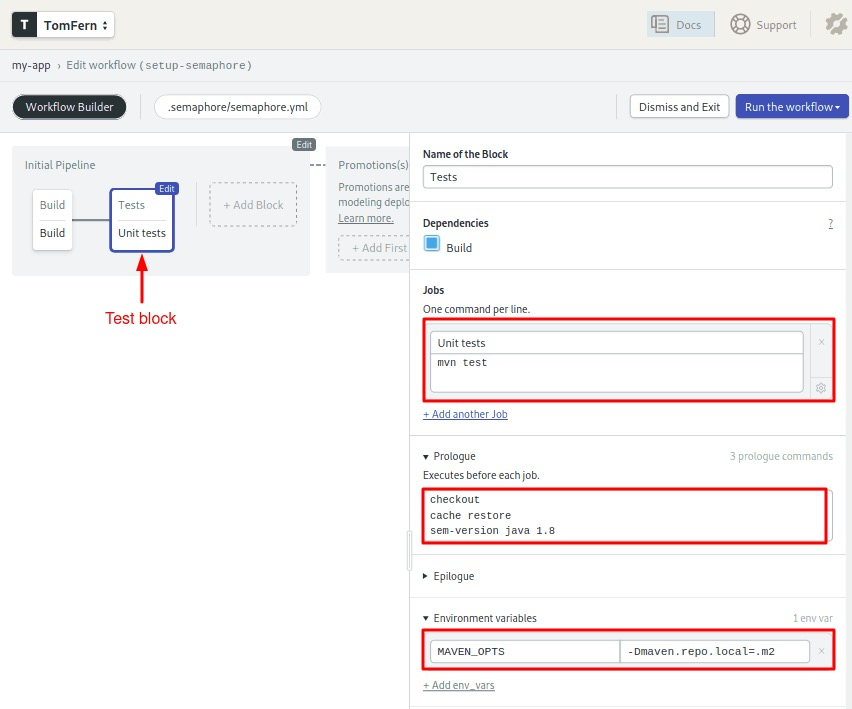
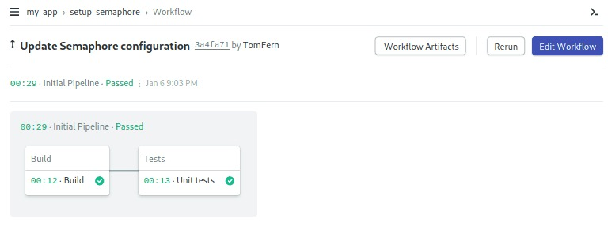

---
title: Stubbing and Mocking with Mockito and JUnit
author-meta: Kostis Kapelonis
subtitle: semaphoreci.com
rights:  Creative Commmons Attribution-NonCommercialNoDerivatives 4.0 International
language: en-US
...

Mocking and stubbing are the cornerstones of having quick and simple unit tests. Mocks are useful if you have a dependency on an external system, file reading takes too long, the database connection is unreliable, or if you don’t want to send an email after every test.

Unlike with integration or functional tests, [where the real system is being tested as a whole](https://semaphoreci.com/blog/automated-testing-cicd), unit tests should focus on a single class. Everything else should be either a simple class or a mock. [Mockito](http://site.mockito.org/) now seems to be the dominant Mocking framework in Java, and is now in its second version. [Spock](http://spockframework.org/) is also a great solution that we will explore in a future article.

We will cover:

1.  Downloading and setting up of Mockito — the most popular Java framework for mocking/stubbing,
2.  Some brief theory on when and why you want to use [Mockito](http://site.mockito.org/),
3.  Stubbing return data from methods,
4.  Verifying interactions,
5.  Using argument captors, and
6.  Returning custom mocked responses.

Despite the version number, Mockito is mostly the same as Mockito 1, as far as the external API is concerned. If you have any existing Mockito tests, you may need to change some imports. However, other than that, upgrading to Mockito should be easy regardless of your code size.

## Prerequisites

It is assumed that you already have a Java project and you want to write unit tests for it. We will need:

-   A sample Java project constructed in a well-disciplined manner, i.e. using [Dependency Injection](https://en.wikipedia.org/wiki/Dependency_injection),
-   A valid `pom.xml` file that builds the project,
-   Maven installed—the command `mvn` should be available in your command line, and
-   Internet access to download Maven dependencies.

Mockito is commonly used with [JUnit](http://junit.org/junit4/0). Therefore, familiarity with JUnit is essential. It is also assumed that we already know our way around basic Maven builds. If not, then feel free to consult its [official documentation](http://www.sonatype.org/nexus/resources/resources-book-links-and-downloads/) first.

## Setting Up Mockito

Mockito is already distributed via Maven central, so using it in a Java forward is a painless process. We need to modify the `pom.xml`:

```xml
<dependencies>
    <dependency>
        <groupId>junit</groupId>
        <artifactId>junit</artifactId>
        <version>4.12</version>
        <scope>test</scope>
    </dependency>
    <dependency>
        <groupId>org.mockito</groupId>
        <artifactId>mockito-core</artifactId>
        <version>3.2.4</version>
        <scope>test</scope>
    </dependency>
</dependencies>
```

Mockito offers two equivalent ways of mocking:

1.  Using static methods and
2.  Using @Mock annotations.

All the examples in this article use static methods. Feel free to use annotations instead, but make sure that you agree on a single solution with the rest of your team, so that unit tests are written in a common format.

## Quick Crash Course on Mocking and Stubbing

The theory behind mocking and stubbing is so vast that it would need an entire book on its own. This tutorial will summarize the basics of it.

[Semaphore](https://semaphoreci.com/) also provides tutorials for mocking in other languages if your interests go beyond Java:

-   [Mocking in Python](https://semaphoreci.com/community/tutorials/getting-started-with-mocking-in-python)
-   [Mocking in Ruby](https://semaphoreci.com/community/tutorials/mocking-with-rspec-doubles-and-expectations)
-   [Mocking in Javascript](https://semaphoreci.com/community/tutorials/best-practices-for-spies-stubs-and-mocks-in-sinon-js)

## The Position of Unit Tests in the Testing Pyramid

Even after all these years, we still don’t have common terminology for unit tests. Just to make things clear, we’ll define *unit tests* as the tests that sit at the bottom of the [testing pyramid](https://martinfowler.com/bliki/TestPyramid.html).

These tests:

-   examine a single class,
-   require just the source code of the application, instead of a running instance,
-   are fast,
-   are not affected by external systems, e.g. web services or databases, and
-   perform little or no I/O, e.g. no real database connections.

These tests are the mainstay of your whole test suite and should comprise the bulk number of all your tests. In this article, we talk about these tests exclusively. Some developers confuse unit tests with the second layer of the testing pyramid which is called integration tests, or service tests, or system tests, or functional tests.

This distinction is important. A test that writes to a database or reads JSON from a web service is **NOT** a unit test. It can become a unit test if you mock that external web service. Unit tests and integration tests should also be handled differently, as we have already seen in the [previous tutorial](https://semaphoreci.com/community/tutorials/how-to-split-junit-tests-in-a-continuous-integration-environment).

## The Need for Mocks and Stubs

Mocking is the act of removing external dependencies from a unit test in order to create a controlled environment around it. Typically, we mock all other classes that interact with the class that we want to test. Common targets for mocking are:

-   Database connections,
-   Web services,
-   Classes that are slow,
-   Classes with side effects, and
-   Classes with non-deterministic behavior.

For example, think of a Java class that communicates with an external payment provider, e.g. Paypal. There is no need to actually connect to the payment provider each time the unit test runs. It would be dangerous to test code that charges credit cards using a live payment environment. It would also make the unit test non-deterministic, e.g. if the payment provider is down for some reason.

Mocks and stubs are fake Java classes that replace these external dependencies. These fake classes are then instructed before the test starts to behave as you expect. More specifically:

-   A stub is a fake class that comes with preprogrammed return values. It’s injected into the class under test to give you absolute control over what’s being tested as input. A typical stub is a database connection that allows you to mimic any scenario without having a real database.
-   A mock is a fake class that can be examined after the test is finished for its interactions with the class under test. For example, you can ask it whether a method was called or how many times it was called. Typical mocks are classes with side effects that need to be examined, e.g. a class that sends emails or sends data to another external service.

Notice that, even though stubbing and mocking are two different things, Mockito uses “mocks” for everything so we will follow the same terminology in the sample source code.

## Basic Stubbing with Mockito

In our example application, we have a class that reads a customer from the database and forms their full name.

Here is the code for the customer:

```java
@Entity
public class Customer {

    @Id
    @GeneratedValue(strategy = GenerationType.AUTO)
    private long id;

    private String firstName;

    private String lastName;

    //...getters and setters redacted for brevity...

}
```

and here is our business class:

```java
public class CustomerReader {

    @PersistenceContext
    private EntityManager entityManager;

    public String findFullName(Long customerID){
        Customer customer = entityManager.find(Customer.class, customerID);
        return customer.getFirstName() +" "+customer.getLastName();
    }

}
```

This class reads customers from the database via the EntityManager. So, how do we test this class?

A naive solution would be to pre-fill a real database with customers and run this test against it. This is problematic for a lot of reasons. It creates a hard dependency on a running database, and also requires an extra step to create the test data. For this example, you could make it work, but in a real-world application, this would not be practical at all.

A better solution would be to use an in-memory database. This would solve the speed problem, but it would suffer from the extra step of pre-filling the database with custom test data. Again, in a real-world application, this can get quickly out of hand, especially when multiple tests also change the initial state of the database.

The best solution for a true unit test is to completely remove the database dependency. We will stub the database connection instead, and “fool” our class to think that it is talking to a real EntityManager, while in reality, the EntityManager is a Mockito stub. This way, we have complete control over what is returned by the database connection without having to deal with an actual database.

Here is the respective unit test:

```java
public class CustomerReaderTest {

    @Test
    public void happyPathScenario(){
        Customer sampleCustomer = new Customer();
        sampleCustomer.setFirstName("Susan");
        sampleCustomer.setLastName("Ivanova");

        EntityManager entityManager = mock(EntityManager.class);
        when(entityManager.find(Customer.class,1L)).thenReturn(sampleCustomer);

        CustomerReader customerReader = new CustomerReader();
        customerReader.setEntityManager(entityManager);

        String fullName = customerReader.findFullName(1L);
        assertEquals("Susan Ivanova",fullName);
    }
}
```

First, we create a sample customer. We use the real class as this is very simple and fast, a [POJO](https://en.wikipedia.org/wiki/Plain_old_Java_object) actually, so no need to mock it.

Then, we mock the Entity Manager. This happens with the `mock()` static call. Using an annotation would also work.

The most important line of the whole test is the next one. This defines what will happen when somebody calls the `find()` method of the entityManager. We set it up so that our sample customer is returned, i.e. if 1 is passed as a database ID.

Finally, we create our class under test `CustomerReader` and pass it our own mocked Entity Manager as a dependency. For this particular example, we have added a new setter method to follow setter injection, but this would work with [constructor injection](https://spring.io/blog/2007/07/11/setter-injection-versus-constructor-injection-and-the-use-of-required/) as well.

From that point on, our class under test does not really know that the Entity Manager is fake. It will just call its method and get the sample Customer unaware that Mockito is behind everything.

This test satisfies all requirements outlined in the previous section. It has no external dependencies, it only needs the Java source code, it is very fast and it is completely deterministic. We did not need a database at all.

### The When-Then Mantra

Using simple stubbing directives *when(something).thenReturn(somethingElse)* will get you a long way in your unit tests. Depending on your application, this might be the only Mockito feature you will ever need.

If you have multiple test methods, it makes sense to move the mock creation process to a single place and only differentiate its behavior for each individual test.

You might have already noticed that our `CustomerReader` class is not correct, as it does not handle the null case, i.e. the given database ID does not exist as an object in the DB. While we could copy-paste the existing unit test, it is best if we organize the code with a common test method.

```java
public class CustomerReaderTest {

    //Class to be tested
    private CustomerReader customerReader;

    //Dependencies
    private EntityManager entityManager;


    @Before
    public void setup(){
        customerReader = new CustomerReader();

        entityManager = mock(EntityManager.class);
        customerReader.setEntityManager(entityManager);
    }

    @Test
    public void happyPathScenario(){
        Customer sampleCustomer = new Customer();
        sampleCustomer.setFirstName("Susan");
        sampleCustomer.setLastName("Ivanova");

        when(entityManager.find(Customer.class,1L)).thenReturn(sampleCustomer);

        String fullName = customerReader.findFullName(1L);
        assertEquals("Susan Ivanova",fullName);
    }

    @Test
    public void customerNotPresentInDb(){
        when(entityManager.find(Customer.class,1L)).thenReturn(null);

        String fullName = customerReader.findFullName(1L);
        assertEquals("",fullName);
    }
}
```

Here, we have extracted the common code of creating our test class and its mocked dependencies into the `setup` method. The [Before annotation](http://junit.sourceforge.net/javadoc/org/junit/Before.html) will make this initialization code run for each test method.

The only thing that differs between each test method is the `when` directive. In the second case, we make the fake database return null to emulate a customer that does not exist in the Database.

In true [TDD](https://semaphoreci.com/blog/test-driven-development), fashion we have created the unit tests before the actual implementation. If you run our unit test, the second test method will fail.

As an exercise, feel free to correct the `CustomerReader` implementation and also add extra unit tests when the first and/or last name are null themselves.

As you are adding more tests, it will be obvious that not having to deal with a real database allows you to iterate faster on each subsequent implementation feature.

## Basic Mocking with Mockito

Let’s see a case where a mock is needed instead of a stub, assuming that we want to test the following class in the same application:

```java
public class LateInvoiceNotifier {

    private final EmailSender emailSender;
    private final InvoiceStorage invoiceStorage;

    public LateInvoiceNotifier(final EmailSender emailSender,
                               final InvoiceStorage invoiceStorage){
        this.emailSender = emailSender;
        this.invoiceStorage = invoiceStorage;
    }

    public void notifyIfLate(Customer customer)
    {
        if(invoiceStorage.hasOutstandingInvoice(customer)){
            emailSender.sendEmail(customer);
        }
    }
}
```

This class has two external dependencies, and we use constructor injection this time around. It checks for late invoices of customers and sends them an email if an invoice is late.

In a real system, the `InvoiceStorage` class is actually a web service that connects with an external legacy CRM system which is slow. A unit test could never make use of such a web service.

The `EmailSender` class is also an external system from a third-party mass email provider. So, we will mock it as well.

However, as soon as you try to write a unit test for this class, you will notice that nothing can really be asserted. The method that we want to test – `notifyIfLate` – is a void method that cannot return anything. So how do we test it?

In this case, we need to focus on the side effects of the code. The side effect here is sending an email. This email is sent only if an outstanding invoice is present. Mockito provides the `verify` family of directives for testing side-effects. Here is the whole unit test:

```java
public class LateInvoiceNotifierTest {

    //Class to be tested
    private LateInvoiceNotifier lateInvoiceNotifier;

    //Dependencies (will be mocked)
    private EmailSender emailSender;
    private InvoiceStorage invoiceStorage;

    //Test data
    private Customer sampleCustomer;


    @Before
    public void setup(){
        invoiceStorage = mock(InvoiceStorage.class);
        emailSender = mock(EmailSender.class);

        lateInvoiceNotifier = new LateInvoiceNotifier(emailSender,invoiceStorage);

        sampleCustomer = new Customer();
        sampleCustomer.setFirstName("Susan");
        sampleCustomer.setLastName("Ivanova");
    }

    @Test
    public void lateInvoice(){
        when(invoiceStorage.hasOutstandingInvoice(sampleCustomer))
                                                    .thenReturn(true);

        lateInvoiceNotifier.notifyIfLate(sampleCustomer);

        verify(emailSender).sendEmail(sampleCustomer);
    }

    @Test
    public void noLateInvoicePresent(){
        when(invoiceStorage.hasOutstandingInvoice(sampleCustomer))
                                                    .thenReturn(false);

        lateInvoiceNotifier.notifyIfLate(sampleCustomer);

        verify(emailSender, times(0)).sendEmail(sampleCustomer);
    }

}
```

As before, we stub the `InvoiceStorage` class using the `when/then` syntax. For the first test, we assume the customer has an outstanding invoice. For the second test, no late invoice is present.

Both tests do not contain the normal JUnit assert statements. Instead, we use the `verify` directive which examines the mocks after each run and passes the test if a method was called with the specified argument. For the second test, we want to make sure that the email method is **NOT** called. Therefore, we also add the `times`argument to restrict the number of times this method was (not) called. If `times` is omitted it is assumed to be 1, which is what we do in the first test.

Notice that mocks can still be stubbed if needed. You can think of mocks as a superset of stubs and this is why Mockito calls both of them “mocks”.

## Verifying Arguments with Argument Captors

The previous example was relatively simple, we just verified whether a single method was called or not. Sometimes we need more detail, and instead of looking only at the method call itself, we are also interested in the arguments.

As an example, let’s assume that the analytics department wants more extensive metrics and asked you to implement an extra mechanism, where several important events for a customer are recorded and later analyzed.

Here is the source code of the Event that the metrics solution supports:

```java
public class Event {

    public enum Type {REMINDER_SENT, REGISTRATION,
                     INVOICE_ISSUED,PAYMENT, SETTLEMENT};

    private Type type;
    private String customerName;
    private LocalDate timestamp;

    //..getters and setters redacted for brevity...

}
```

The `LateInvoiceNotifier` class is then augmented with an `EventRecorder`dependency, and you want to write a unit tests that verify that the event recorded:

1.  is of type `REMINDER_SENT`,
2.  has the correct customer name, and
3.  contains a timestamp.

Mockito supports the examination of method arguments via the *ArgumentCaptor*construct. Here is the source code of the unit test:

```java
public class LateInvoiceNotifierTest {

    //Class to be tested
    private LateInvoiceNotifier lateInvoiceNotifier;

    //Dependencies (will be mocked)
    private EmailSender emailSender;
    private InvoiceStorage invoiceStorage;
    private EventRecorder eventRecorder;

    //Test data
    private Customer sampleCustomer;


    @Before
    public void setup(){
        invoiceStorage = mock(InvoiceStorage.class);
        emailSender = mock(EmailSender.class);

        eventRecorder = mock(EventRecorder.class);

        lateInvoiceNotifier = new LateInvoiceNotifier(emailSender,
                                                      invoiceStorage,
                                                      eventRecorder);

        sampleCustomer = new Customer();
        sampleCustomer.setFirstName("Susan");
        sampleCustomer.setLastName("Ivanova");
    }

    @Test
    public void lateInvoiceEvent(){
        when(invoiceStorage.hasOutstandingInvoice(sampleCustomer))
                                                    .thenReturn(true);

        lateInvoiceNotifier.notifyIfLate(sampleCustomer);

        verify(emailSender).sendEmail(sampleCustomer);

        ArgumentCaptor<Event> myCaptor = ArgumentCaptor.forClass(Event.class);
        verify(eventRecorder).recordEvent(myCaptor.capture());

        Event eventThatWasSent = myCaptor.getValue();
        assertNotNull(eventThatWasSent.getTimestamp());
        assertEquals(Event.Type.REMINDER_SENT, eventThatWasSent.getType());
        assertEquals("Susan Ivanova",eventThatWasSent.getCustomerName());

    }
}
```

The unit test here examines two related actions. First of all, it verifies that the email was indeed sent as in the previous section. For the event, we could also use a second `verify` directive to check it as well, but instead, we use an `ArgumentCaptor` to examine the event in more detail. First, we construct an `ArgumentCaptor` and define it as a holder for an `Event` class. Then, in the `verify` directive we use our captor by calling its `capture()` method.

At this point, when the unit test is complete, the captor contains the exact argument that was sent to the mocked `EventRecorder` class when the `notifyIfLate`method was called.

We can extract the actual argument instance by calling the `getValue()` method of the captor. The result is a normal Java object that can be used for further assertions using the usual JUnit statements. In the example above, we check the event type, the fact that the full name is formed correctly, and whether there is a timestamp.

Note that the argument can be any complex Java object. In our example, it is a class with scalar values, but you could have nested classes or a whole data structure/list. Mockito could capture it without any problem, and you could run any number of assert statements in the final result, or any fields of the argument class.

## Forming Dynamic Responses for Mocks

As a final example of the power of Mockito we will see how you can create custom responses from mocks that depend on the arguments of the call. This is an advanced technique that will be needed only for some very specific corner cases in your unit tests. If you have a choice, it is best to return predefined results in your mocks/stubs so that the test is more readable. Use dynamic responses only as a last resort in your unit tests.

## Dynamic Manipulation of Arguments

Let’s see an example where we just want to modify the argument itself. Let’s assume that you want to test the following class:

```java
public class CustomerDao {

    @PersistenceContext
    private EntityManager entityManager;

    private Logger logger;

    public void saveCustomer(String firstName, String lastName) {
        if(firstName == null || lastName==null)
        {
            logger.error("Missing customer information");
            throw new IllegalArgumentException();
        }
        Customer customer = new Customer(firstName,lastName);
        entityManager.persist(customer);
        entityManager.flush();
        logger.info("Saved customer with id {}", customer.getId());
    }

}
```

You should instantly see why writing a unit test for this class is a bit tricky. Even though the [DAO](https://en.wikipedia.org/wiki/Data_access_object) logic itself is very basic, the big problem is the fact that once the customer is saved using the `persist` method, its database ID is sent to the logger. For this contrived example, the code will work just fine in the real system, as the database will indeed assign an ID to the object as soon as it is saved.

But how can we replicate this processing in our unit test? The `persist` method does not return an argument so we cannot mock it with the usual `when/then`directives. However, even for this corner case, Mockito still has a solution:

```java
public class CustomerDaoTest {

    // Class to be tested
    private CustomerDao customerDao;

    // Dependencies (will be mocked)
    private EntityManager entityManager;
    private Logger logger;

    @Before
    public void setup() {
        customerDao = new CustomerDao();

        entityManager = mock(EntityManager.class);
        customerDao.setEntityManager(entityManager);

        logger = mock(Logger.class);
        customerDao.setLogger(logger);
    }

    @Test
    public void happyPath() {
        doAnswer(new Answer<Void>() {
            public Void answer(InvocationOnMock invocation) {
                Customer customer = invocation.getArgument(0);
                customer.setId(123L);
                return null;
            }
        }).when(entityManager).persist(any(Customer.class));

        customerDao.saveCustomer("Suzan", "Ivanova");

        verify(logger).info("Saved customer with id {}", 123L);
    }

    @Test(expected = IllegalArgumentException.class)
    public void missingInformation() {
        customerDao.saveCustomer("Suzan", null);
    }

}
```

This unit test is based on the `doAnswer/when` directives. Mockito allows us to override the answer to any method by implementing the [Answer](https://static.javadoc.io/org.mockito/mockito-core/2.7.9/org/mockito/stubbing/Answer.html) interface. This interface has a single method that gives us access to the arguments passed by our unit test.

In this particular case, we know that the argument is a customer. We fetch the customer and set its database ID to 123L, or any other value you like. We also instruct Mockito to bind this answer to `any` argument of type customer. The `any`keyword is part of the huge list of [matchers](https://static.javadoc.io/org.mockito/mockito-core/2.7.17/org/mockito/Matchers.html) offered in Mockito. You can think of them as wildcards. Normally, you do not need to use them, because in your unit tests you should know all the arguments beforehand.

In this particular example, the argument to the persist method is not created by us, but by the class under test, so we cannot create an instance as test data that will match it. However, with Mockito `doAnswer` directive we don’t need to know anything beforehand, as we modify the argument during runtime.

The test is completed with the `verify` directive that checks whether our database ID is indeed sent to the logger. The problematic scenario, e.g. throwing an exception, is so trivial that we don’t even need Mockito for the respective test method. JUnit has built-in support for checking the presence of an exception. You can see the implementation in the `missingInformation` test method above.

## Dynamic Responses Based on Arguments

For a more realistic example, where the answer of a mock depends on the argument, let’s assume that you want to test the following class:

```java
public class MassUserRegistration {

    private final EventRecorder eventRecorder;
    private final UserRepository userRepository;

    public MassUserRegistration(final EventRecorder eventRecorder,
            final UserRepository userRepository) {
        this.eventRecorder = eventRecorder;
        this.userRepository = userRepository;
    }

    private void register(String firstName, String lastName) {
        Customer newCustomer = userRepository.saveCustomer(firstName, lastName);

        Event event = new Event();
        event.setTimestamp(newCustomer.getSince());
        event.setCustomerName(newCustomer.getFullName());
        event.setType(Type.REGISTRATION);
        eventRecorder.recordEvent(event);
    }

    public void massRegister(List<Customer> rawCustomerNames) {
        for (Customer customer:rawCustomerNames) {
            register(customer.getFirstName(),customer.getLastName());
        }
    }
}
```

This is a class that takes a list of customers and saves them on the `UserRepository`. For each customer an event of type `REGISTRATION` is also emitted.

We want to test the method called `massRegister`, as the `register` one is private. In theory, we could pass a list of just one customer in our unit test, but in practice, it is best to try with a big list of customers. The code here is very simple and does no error checking at all, but in a production system, there might be several consistency checks before a customer is registered. A realistic unit test would pass a huge list of customers with various problems so that all checks can be evaluated during unit testing.

Let’s say we want to test using a list of 20 customers. This time the `saveRepository` method does return an argument, so in theory, we could use the `when/then` directive 20 times to instruct it exactly what output it should send.

A more concise way is the following:

```java
public class MassUserRegistrationTest {

    //Class to be tested
    private MassUserRegistration massUserRegistration;

    //Dependencies (will be mocked)
    private UserRepository userRepository;
    private EventRecorder eventRecorder;

    //Test data
    private List<Customer> sampleCustomers;


    @Before
    public void setup(){
        sampleCustomers = new ArrayList<>();

        eventRecorder = mock(EventRecorder.class);
        userRepository = mock(UserRepository.class);

        when(userRepository.saveCustomer(anyString(),
                        anyString())).thenAnswer(new Answer<Customer>() {
            public Customer answer(InvocationOnMock invocation)
                                                        throws Throwable {
                String firstName = invocation.getArgument(0);
                String lastName = invocation.getArgument(1);
                Customer newCustomer = new Customer(firstName, lastName);
                newCustomer.setFullName(firstName+" "+lastName);
                newCustomer.setSince(LocalDate.now());
                return newCustomer;
            }
        });

        massUserRegistration = new MassUserRegistration(eventRecorder,
                                                        userRepository);
    }

    @Test
    public void registerTwentyAccounts(){
        sampleCustomers.add(new Customer("Susan", "Ivanova"));
        sampleCustomers.add(new Customer("Lyta", "Alexander"));
        sampleCustomers.add(new Customer("Vir", "Cotto"));
        sampleCustomers.add(new Customer("Stephen", "Frankling"));
        //[...20 customers redacted for brevity...]

        massUserRegistration.massRegister(sampleCustomers);

        ArgumentCaptor<Event> myCaptor = ArgumentCaptor.forClass(Event.class);
        verify(eventRecorder, times(sampleCustomers.size()))
                                        .recordEvent(myCaptor.capture());

        List<Event> eventsThatWereSent = myCaptor.getAllValues();
        assertEquals(sampleCustomers.size(),eventsThatWereSent.size());
        for(int i=0;i< eventsThatWereSent.size();i++){
            Event event= eventsThatWereSent.get(i);
            assertNotNull(event.getTimestamp());
            assertEquals(Event.Type.REGISTRATION, event.getType());
            assertEquals(sampleCustomers.get(i).getFirstName()
            +" "
            +sampleCustomers.get(i).getLastName(),event.getCustomerName());
        }

    }
}
```

As before, we override the `saveCustomer` method in our `UserRepository` class by implementing our custom `Answer`. We fetch the two arguments using the `anyString` matchers, create a Customer instance on the fly and fill the required information.

Now, regardless of the size of our testing data, the `UserRepository` mock will always return the correct response to the class under test.

Notice that the unit test is written in such a way that the size of the input data is actually irrelevant. We can expand the test data from 20 customers to 100 customers, to 1000 customers, and the mocking and verification code will remain unchanged. This would not be the case if we had manually stubbed a different response for each specific customer.

## Testing with Semaphore CI/CD

Once you’ve mastered writing unit tests with JUnit and Mockito, the next step is to set up [Continuous Integration](https://semaphoreci.com/continuous-integration) (CI) to automate testing.

With CI, we get immediate feedback on every code change. So, when things get broken, we know the exact time and place where the failure was introduced. We can track the last good revision and fix the problem.

In this section, we’ll learn how to use [Semaphore CI/CD](https://semaphoreci.com/cicd) to test our Java App.

#### Create a Github Repository

*If you already have a Java project on GitHub, you can skip this section and jump right to the [next one](https://semaphoreci.com/community/tutorials/stubbing-and-mocking-with-mockito-2-and-junit#write-unit-tests).*

You can create a brand new “Hello, World” project in 10 minutes:

-   Install the Java SDK and [Apache Maven](https://maven.apache.org/install.html).
-   Create a new project using Maven:

```bash
$ mvn -B archetype:generate \
      -DarchetypeGroupId=org.apache.maven.archetypes \
      -DarchetypeVersion=1.4 \
      -DgroupId=com.mycompany.app \
      -DartifactId=my-app
```

-   Create a new repository on GitHub. In the **gitignore** selection at the end, pick Java.
-   Make an initial push of the code:

```bash
$ git init
$ git remote add origin YOUR_GITHUB_REPOSITORY_ADDRESS
$ git pull origin master
$ git add -A
$ git commit -m "initial commit"
$ git push -u origin master
```

### Write the Unit Tests

It’s time all to put in practice all that you’ve learned:

-   Edit the `pom.xml` file to add the JUnit and Mockito dependencies:

```xml
<dependencies>
    <dependency>
        <groupId>junit</groupId>
        <artifactId>junit</artifactId>
        <version>4.12</version>
        <scope>test</scope>
    </dependency>
    <dependency>
        <groupId>org.mockito</groupId>
        <artifactId>mockito-core</artifactId>
        <version>3.2.4</version>
        <scope>test</scope>
    </dependency>
</dependencies>
```

-   Write your tests in the `src/tests/java/...` directory. JUnit will scan it recursively and run all the test cases.
-   Check that your tests are running:

```bash
$ mvn test
```

### Semaphore CI/CD for Your Project

Sign up with [Semaphore](https://id.semaphoreci.com/) using your GitHub account. The free account will give you 1300 free minutes each month, that’s $10/month worth of service for free.

In this section, we’ll create an initial [pipeline](https://semaphoreci.com/blog/cicd-pipeline) for the project.

-   Go to your Semaphore account. Click on the **Add Project** to add your repositoryChoose your repository from the list:



-   As a Starter Workflow, select **Maven** and click on the **Run this Workflow** button:



-   The initial pipeline starts immediately:



#### Build Job

We need to customize the starter workflow to [build the application in the CI environment](https://semaphoreci.com/blog/build-stage).

-   Click on the **Edit Workflow** button on the top-right corner toopen the **Workflow Editor**:



Semaphore CI/CD combines the following elements:

-   **Job**: a job is a list of commands to execute.
-   **Block**: a block group jobs with the same purpose and configuration. Jobs in a block run concurrently.
-   **Pipeline**: a pipeline is a series of blocks. The execution flow goes from left to right; each one begins when all the jobs in the previous block are done. Pipelines usually fulfill a specific objective, such as testing, deployment, etc.
-   **Workflow**: a workflow is a series of pipelines working together.

To customize the initial pipeline:

-   Click on the block called “Block #1” and rename it to “Build”.
-   Below, you’ll find one job called “Job #1”. Change its name to “Build” and type the following commands:

```bash
checkout
sem-version java 1.8
mvn package
```

[Checkout](https://docs.semaphoreci.com/reference/toolbox-reference/) is a built-in command that clones the code from GitHub.

The [sem-version](https://docs.semaphoreci.com/ci-cd-environment/sem-version-managing-language-versions-on-linux/) built-in script activates a particular version of a programming language. In this case, we’re choosing Java 1.8.

-   To run the modified pipeline, click on **Run the Workflow** and the **Start** button.

-   Semaphore begins building the application:



#### Speeding up the build

The build job works, but we can make it better. Right now, the job re-downloads all the dependencies each time it runs. This happens because each job runs in a brand-new, clean environment.

To make the job more efficient, we can store the dependencies in the cache:

-   Click on **Edit the Workflow**.
-   Click on the “Build” block.
-   Modify the commands on the job, so they look like this:

```bash
checkout
cache restore
sem-version java 1.8
mvn package
cache store
```

[Cache](https://docs.semaphoreci.com/reference/toolbox-reference/) is a built-in command that stores and retrieves files from a project-wide cache. Cache is smart and can figure out what files and directories it needs to store.

-   Open the Environment Variables section and add the following variable using **+Add env_vars**:
    -   `MAVEN_OPTS` : `-Dmaven.repo.local=.m2`

[Environment Variables](https://docs.semaphoreci.com/guided-tour/environment-variables-and-secrets/) can be defined at the block level and are active for all its jobs. The value `maven.repo.local=.m2` tells Maven to download dependencies in the local directory instead of in the user’s `$HOME`, so they can be cached more easily.

-   Click on **Run the Workflow** and **Start**:



Now, the downloaded packages are preserved in the cache. As a result, the build job a lot less time.

#### Automating Tests in Semaphore

Now that we are happy with the build job, let’s add a test block:

-   Click on **Edit the Workflow**.
-   Click the **+Add Block** dotted box:



-   Name the second block “Tests” and the job “Unit tests”.
-   Type the Maven test in the command box: `mvn test`
-   Open the **Prologue** section and type the following commands:

```bash
checkout
cache restore
sem-version java 1.8
```

Commands in the [prologue](https://docs.semaphoreci.com/reference/pipeline-yaml-reference/#prologue) are executed *before* each job in the block.

-   Once more, open the **Environment Variables** section and add the same `MAVEN_OPTS` variable as last time.



-   **Run the Workflow** to test the pipeline:



With this simple CI pipeline, from now on, your code is tested on each push.

You can add many more jobs to the test block, for example integration tests, code analysis, and benchmarks. Semaphore also has [Test Reports](https://semaphoreci.com/blog/test-reports) where you can see which tests are skipped, find the slowest and failing tests in your test suite.

## Summary

In this tutorial, we have written several unit tests using Mockito for both stubbing and mocking.

We have seen:

1.  How to download and set up Mockito via Maven,
2.  The reasons that mocks and stubs are needed,
3.  Basic stubbing with the `when/then` directives,
4.  Basic verification with `verify` and `times()` directives,
5.  Advanced verification of arguments using Mockito Argument Captors,
6.  Advanced dynamic manipulation of arguments, and
7.  Advanced dynamic responses based on arguments.
8.  You can continuously test your code by adding your project to Semaphore and setting up a CI pipeline.

## Where To Go from Here

We have seen the most important features of Mockito, but there are several more to explore.

1.  There are more argument matchers than those we demonstrated
2.  Number of verifications can also be described in an atLeast/atMost manner
3.  Verifications support a timeout argument
4.  Stubs can be instructed to throw exceptions (for negative testing scenarios)
5.  You can also verify the order to events as they happen in a unit test
6.  You can stub multiple calls to the same method to return different results for each subsequent time
7.  Mockito also supports [Spies](https://static.javadoc.io/org.mockito/mockito-core/2.7.17/org/mockito/Spy.html) which is another advanced type of fake objects

In our next tutorial, we will see how we can use Spock to do similar useful tricks. Until then, the [official documentation](https://static.javadoc.io/org.mockito/mockito-core/2.7.16/org/mockito/Mockito.html) is your best source regarding Mockito techniques.

Also, don’t miss these CI/CD tutorials and docs:

-   [CI/CD for Spring Boot Microservices](https://semaphoreci.com/blog/spring-boot-microservices-cicd)
-   [Working with Java Guide](https://docs.semaphoreci.com/programming-languages/java/)
-   [Java Spring Continuous Integration](https://docs.semaphoreci.com/examples/java-spring-continuous-integration/)
-   [Revving up Continuous Integration with Parallel Testing](https://semaphoreci.com/blog/revving-up-continuous-integration-with-parallel-testing)

If you have any questions and comments, feel free to leave them in the section below. Also, feel free to share this tutorial with anyone you think might benefit from it.
\newpage

© __BUILD_YEAR__ Semaphore Technologies doo. All rights reserved.

This work is licensed under Creative Commmons
Attribution-NonCommercial-NoDerivatives 4.0 International.
To view a copy of this license, visit
<https://creativecommons.org/licenses/by-nc-nd/4.0>

The source text is open source:
<https://github.com/semaphoreci/papers>

Originally published at:
<https://semaphoreci.com/community/tutorials/stubbing-and-mocking-with-mockito-2-and-junit>

Original publication date: 15 Jul 2022

Authors: Kostis Kapelonis

Editor: Marko Anastasov

Reviewed by: Tomas Fernandez

Build date: __BUILD_MONTH__ __BUILD_YEAR__

Revision: __BUILD_REVISION__

\newpage
