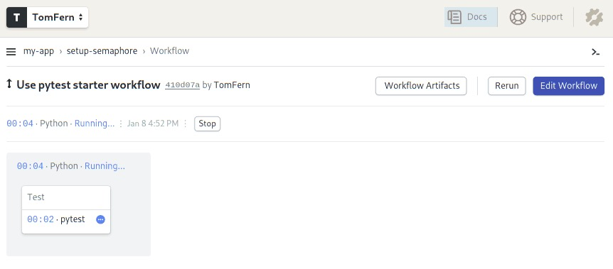

---
title: Testing Python Applications with Pytest
author-meta: Kevin Ndung'u Gathuku
subtitle: semaphoreci.com
rights:  Creative Commmons Attribution-NonCommercialNoDerivatives 4.0 International
language: en-US
...

Testing applications has become a standard skill set required for any competent developer today. The Python community embraces[ testing](https://semaphoreci.com/blog/automated-testing-cicd), and even the Python standard library has good [inbuilt tools](https://docs.python.org/3/library/unittest.html) to support testing. In the larger Python ecosystem, there are a lot of testing tools. [Pytest](http://doc.pytest.org/en/latest/) stands out among them due to its ease of use and its ability to handle increasingly complex testing needs.

This tutorial will demonstrate how to write tests for Python code with pytest, and how to utilize it to cater for a wide range of testing scenarios.

## Prerequisites

This tutorial uses [Python 3](https://www.python.org/), and we will be working inside a `virtualenv`.

Fortunately for us, Python 3 has [inbuilt support](https://docs.python.org/3/library/venv.html) for creating virtual environments. To create and activate a virtual environment for this project, let’s run the following commands:

```bash
$ mkdir pytest_project
$ cd pytest_project
$ python3 -m venv pytest-env
```

This creates a virtual environment called `pytest-env` in our working directory.

To begin using the `virtualenv`, we need to activate it as follows:

```bash
$ source pytest-env/bin/activate
```

As long as the `virtualenv` is active, any packages we install will be installed in our virtual environment, rather than in the global Python installation.

To get started, let’s install pytest in our `virtualenv`.

```bash
$ pip install pytest
```

## Basic Pytest Usage

We will start with a simple test. Pytest expects our tests to be located in files whose names begin with `test_` or end with `_test.py`.

Let’s create a file called `test_capitalize.py`, and inside it we will write a function called `capital_case` which should take a string as its argument and should return a capitalized version of the string.

We will also write a test, `test_capital_case` to ensure that the function does what it says. We’ll prefix our test function names with `test_`, since this is what pytest expects our test functions to be named.

```python
# test_capitalize.py

def capital_case(x):
    return x.capitalize()

def test_capital_case():
    assert capital_case('semaphore') == 'Semaphore'
```

The immediately noticeable thing is that pytest uses a plain assert statement, which is much easier to remember and use compared to the numerous `assertSomething` functions found in `unittest`.

To run the test, execute the `pytest` command:

```bash
$ pytest
```

We should see that our first test passes.

A keen reader will notice that our function could lead to a bug. It does not check the type of the argument to ensure that it is a string. Therefore, if we passed in a number as the argument to the function, it would raise an exception.

We would like to handle this case in our function by raising a custom exception with a friendly error message to the user.

Let’s try to capture this in our test:

```python
# test_capitalize.py

import pytest

def test_capital_case():
    assert capital_case('semaphore') == 'Semaphore'

def test_raises_exception_on_non_string_arguments():
    with pytest.raises(TypeError):
        capital_case(9)
```

The major addition here is the `pytest.raises` helper, which asserts that our function should raise a `TypeError` in case the argument passed is not a string.

Running the tests at this point should fail with the following error:

```python
def capital_case(x):
>       return x.capitalize()
E       AttributeError: 'int' object has no attribute 'capitalize'
```

Since we’ve verified that we have not handled such a case, we can go ahead and fix it.

In our `capital_case` function, we should check that the argument passed is a string or a string subclass before calling the `capitalize` function. If it is not, we should raise a `TypeError` with a custom error message.

```python
# test_capitalize.py

def capital_case(x):
    if not isinstance(x, str):
        raise TypeError('Please provide a string argument')
      return x.capitalize()
```

When we rerun our tests, they should be passing once again.

## Using Pytest Fixtures

In the following sections, we will explore some more advanced pytest features. To do this, we will need a small project to work with.

We will be writing a `wallet` application that enables its users to add or spend money in the wallet. It will be modeled as a class with two instance methods: `spend_cash` and `add_cash`.

We’ll get started by writing our tests first. Create a file called `test_wallet.py` in the working directory, and add the following contents:

```python
# test_wallet.py

import pytest
from wallet import Wallet, InsufficientAmount


def test_default_initial_amount():
    wallet = Wallet()
    assert wallet.balance == 0

def test_setting_initial_amount():
    wallet = Wallet(100)
    assert wallet.balance == 100

def test_wallet_add_cash():
    wallet = Wallet(10)
    wallet.add_cash(90)
    assert wallet.balance == 100

def test_wallet_spend_cash():
    wallet = Wallet(20)
    wallet.spend_cash(10)
    assert wallet.balance == 10

def test_wallet_spend_cash_raises_exception_on_insufficient_amount():
    wallet = Wallet()
    with pytest.raises(InsufficientAmount):
        wallet.spend_cash(100)
```

First things first, we import the `Wallet` class and the `InsufficientAmount`exception that we expect to raise when the user tries to spend more cash than they have in their wallet.

When we initialize the `Wallet` class, we expect it to have a default balance of `0`. However, when we initialize the class with a value, that value should be set as the wallet’s initial balance.

Moving on to the methods we plan to implement, we test that the `add_cash` method correctly increments the balance with the added amount. On the other hand, we are also ensuring that the `spend_cash` method reduces the balance by the spent amount and that we can’t spend more cash than we have in the wallet. If we try to do so, an `InsufficientAmount` exception should be raised.

Running the tests at this point should fail since we have not created our `Wallet`class yet. We’ll proceed with creating it. Create a file called `wallet.py`, and we will add our `Wallet` implementation in it. The file should look as follows:

```python
# wallet.py

class InsufficientAmount(Exception):
    pass


class Wallet(object):

    def __init__(self, initial_amount=0):
        self.balance = initial_amount

    def spend_cash(self, amount):
        if self.balance < amount:
            raise InsufficientAmount('Not enough {}'.format(amount))
        self.balance -= amount

    def add_cash(self, amount):
        self.balance += amount
```

First of all, we define our custom exception, `InsufficientAmount`, which will be raised when we try to spend more money than we have in the wallet. The `Wallet`class then follows. The constructor accepts an initial amount, which defaults to `0` if not provided. The initial amount is then set as the balance.

In the `spend_cash` method, we first check that we have a sufficient balance. If the balance is lower than the amount we intend to spend, we raise the `InsufficientAmount` exception with a friendly error message.

The implementation of `add_cash` then follows, which simply adds the provided amount to the current wallet balance.

Once we have this in place, we can rerun our tests, and they should be passing.

```bash
$ pytest -q test_wallet.py

.....
5 passed in 0.01 seconds
```

## Refactoring our Tests with Fixtures

You may have noticed some repetition in the way we initialized the class in each test. This is where [pytest fixtures](http://doc.pytest.org/en/latest/fixture.html) come in. They help us set up some helper code that should run before any tests are executed, and are perfect for setting-up resources that are needed by the tests.

Fixture functions are created by marking them with the `@pytest.fixture`decorator. Test functions that require fixtures should accept them as arguments. For example, for a test to receive a fixture called `wallet`, it should have an argument with the fixture name, i.e. `wallet`.

Let’s see how this works in practice. We will refactor our previous tests to use test fixtures where appropriate.

```python
# test_wallet.py

import pytest
from wallet import Wallet, InsufficientAmount

@pytest.fixture
def empty_wallet():
    '''Returns a Wallet instance with a zero balance'''
    return Wallet()

@pytest.fixture
def wallet():
    '''Returns a Wallet instance with a balance of 20'''
    return Wallet(20)

def test_default_initial_amount(empty_wallet):
    assert empty_wallet.balance == 0

def test_setting_initial_amount(wallet):
    assert wallet.balance == 20

def test_wallet_add_cash(wallet):
    wallet.add_cash(80)
    assert wallet.balance == 100

def test_wallet_spend_cash(wallet):
    wallet.spend_cash(10)
    assert wallet.balance == 10

def test_wallet_spend_cash_raises_exception_on_insufficient_amount(empty_wallet):
    with pytest.raises(InsufficientAmount):
        empty_wallet.spend_cash(100)
```

In our refactored tests, we can see that we have reduced the amount of boilerplate code by making use of fixtures.

We define two fixture functions,`wallet` and `empty_wallet`, which will be responsible for initializing the `Wallet` class in tests where it is needed, with different values.

For the first test function, we make use of the `empty_wallet` fixture, which provided a wallet instance with a balance of `0` to the test.

The next three tests receive a wallet instance initialized with a balance of `20`. Finally, the last test receives the `empty_wallet` fixture. The tests can then make use of the fixture as if it was created inside the test function, as in the tests we had before.

Rerun the tests to confirm that everything works.

Utilizing fixtures helps us de-duplicate our code. If you notice a case where a piece of code is used repeatedly in a number of tests, that might be a good candidate to use as a fixture.

## Some Pointers on Test Fixtures

Here are some pointers on using test fixtures:

-   Each test is provided with a newly-initialized `Wallet` instance, and not one that has been used in another test.
-   It is a good practice to add docstrings for your fixtures. To see all the available fixtures, run the following command:

```bash
$ pytest --fixtures
```

This lists out some inbuilt pytest fixtures, as well as our custom fixtures. The docstrings will appear as the descriptions of the fixtures.

```bash
wallet
    Returns a Wallet instance with a balance of 20
empty_wallet
    Returns a Wallet instance with a zero balance
```

## Parametrized Test Functions

Having tested the individual methods in the `Wallet` class, the next step we should take is to test various combinations of these methods. This is to answer questions such as “If I have an initial balance of 30, and spend 20, then add 100, and later on, spend `50`, how much should the balance be?”

As you can imagine, writing out those steps in the tests would be tedious, and pytest provides quite a delightful solution: [Parametrized test functions](http://doc.pytest.org/en/latest/parametrize.html#pytest-mark-parametrize-parametrizing-test-functions)

To capture a scenario like the one above, we can write a test:

```python
# test_wallet.py

@pytest.mark.parametrize("earned,spent,expected", [
    (30, 10, 20),
    (20, 2, 18),
])
def test_transactions(earned, spent, expected):
    my_wallet = Wallet()
    my_wallet.add_cash(earned)
    my_wallet.spend_cash(spent)
    assert my_wallet.balance == expected
```

This enables us to test different scenarios, all in one function. We make use of the `@pytest.mark.parametrize` decorator, where we can specify the names of the arguments that will be passed to the test function, and a list of arguments corresponding to the names.

The test function marked with the decorator will then be run once for each set of parameters.

For example, the test will be run the first time with the `earned` parameter set to 30, `spent` set to `10`, and `expected` set to `20`. The second time the test is run, the parameters will take the second set of arguments. We can then use these parameters in our test function.

This elegantly helps us capture the scenario:

-   My wallet initially has `0`,
-   I add `30` units of cash to the wallet,
-   I spend `10` units of cash, and
-   I should have `20` units of cash remaining after the two transactions.

This is quite a succinct way to test different combinations of values without writing a lot of repeated code.

## Combining Test Fixtures and Parametrized Test Functions

To make our tests less repetitive, we can go further and combine test fixtures and parametrize test functions. To demonstrate this, let’s replace the wallet initialization code with a test fixture as we did before.

The end result will be:

```python
# test_wallet.py

@pytest.fixture
def my_wallet():
    '''Returns a Wallet instance with a zero balance'''
    return Wallet()

@pytest.mark.parametrize("earned,spent,expected", [
    (30, 10, 20),
    (20, 2, 18),
])
def test_transactions(my_wallet, earned, spent, expected):
    my_wallet.add_cash(earned)
    my_wallet.spend_cash(spent)
    assert my_wallet.balance == expected
```

We will create a new fixture called `my_wallet` that is exactly the same as the `empty_wallet` fixture we used before. It returns a wallet instance with a balance of `0`. To use both the fixture and the parametrized functions in the test, we include the fixture as the first argument and the parameters as the rest of the arguments.

The transactions will then be performed on the wallet instance provided by the fixture.

You can try out this pattern further, e.g. with the wallet instance with a non-empty balance and with other different combinations of the `earned` and `spent` amounts.

## Continuous Testing on Semaphore CI/CD

Next, let’s add continuous testing to our application using Semaphore to ensure that we don’t break our code when we make new changes. You can add [Continuous Integration](https://semaphoreci.com/continuous-integration) (CI) to your project in less than 5 minutes.

Make sure you’ve committed everything on Git, and push your repository to GitHub, which will enable Semaphore to fetch your code.

Next, [sign up for a free Semaphore account](https://semaphoreci.com/), if you don’t have one already, by using the **Sign up with GitHub** button on the top-right margin. Use your GitHub credentials to log in.

Follow these steps to add the project to Semaphore:

-   Click on the **Add Project**.

-   Semaphore will show your repositories. Click **Choose** next to your Python project:


-   Choose a starter workflow:
    -   **Pytest**: for testing simple Python 3.x projects.
    -   **Python package**: for testing packages simultaneously on multiple 2.x and 3.x Python versions.


-   The [CI pipeline](https://semaphoreci.com/blog/cicd-pipeline) starts immediately:



In a few simple steps, we’ve set up continuous testing.

At any time, you can click on the job to see the error logs and messages. Semaphore also has [Test Reports](https://semaphoreci.com/blog/test-reports). This feature allows you to see which tests have failed, find the slowest tests in your test suite, and find skipped test on the convenient Tests dashboard.


### Summary

We hope that this article has given you a solid introduction to pytest, which is one of the most popular testing tools in the Python ecosystem. It’s extremely easy to get started with using it, and it can handle most of what you need from a testing tool.

You can check out the complete code on [GitHub](https://github.com/kevgathuku/pytest-intro).

Please reach out with any questions or feedback you may have in the comments section below.

### Read also:

-   [Revving up Continuous Integration with Parallel Testing](https://semaphoreci.com/blog/revving-up-continuous-integration-with-parallel-testing)
-   [20 Types of Tests Every Developer Should Know](https://semaphoreci.com/blog/20-types-of-testing-developers-should-know)
-   [How to Test Jupyter Notebooks with Pytest and Nbmake](https://semaphoreci.com/blog/test-jupyter-notebooks-with-pytest-and-nbmake)
\newpage

© __BUILD_YEAR__ Semaphore Technologies doo. All rights reserved.

This work is licensed under Creative Commmons
Attribution-NonCommercial-NoDerivatives 4.0 International.
To view a copy of this license, visit
<https://creativecommons.org/licenses/by-nc-nd/4.0>

The source text is open source:
<https://github.com/semaphoreci/papers>

Originally published at:
<https://semaphoreci.com/community/tutorials/testing-python-applications-with-pytest>

Original publication date: 15 Jul 2022

Authors: Kevin Ndung'u Gathuku

Editor: Marko Anastasov

Reviewed by: Tomas Fernandez

Build date: __BUILD_MONTH__ __BUILD_YEAR__

Revision: __BUILD_REVISION__

\newpage
