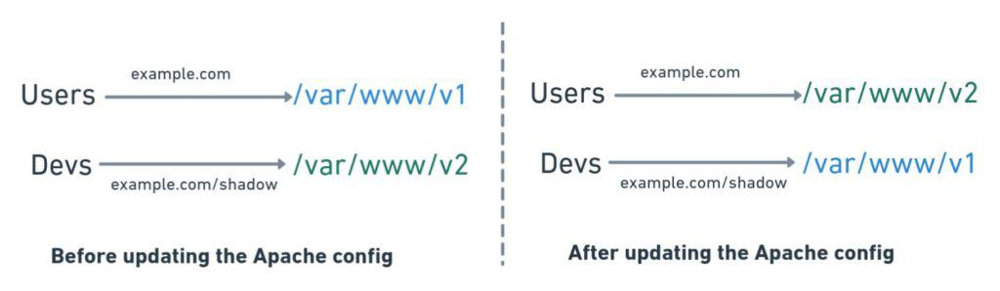
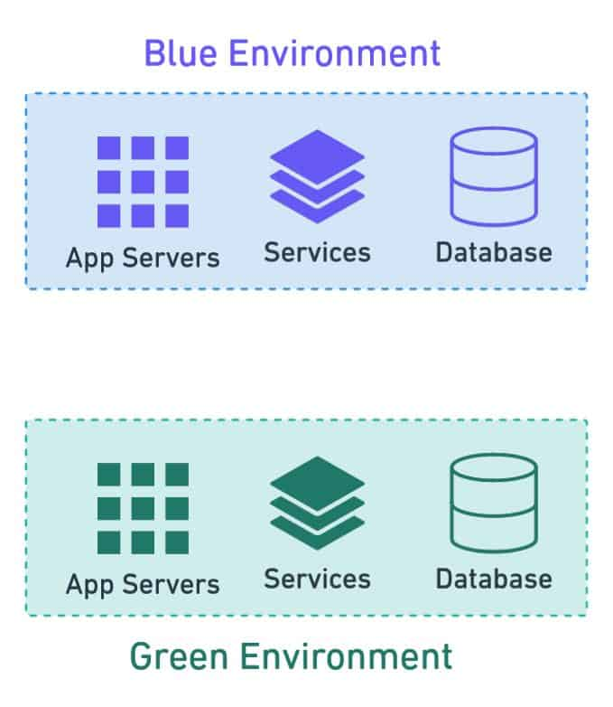
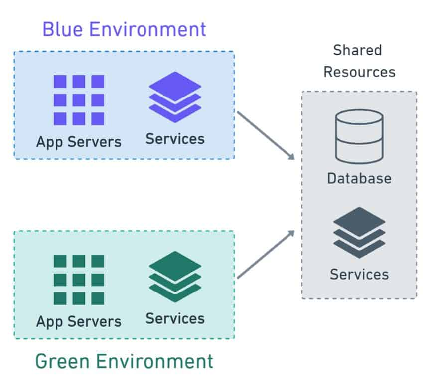
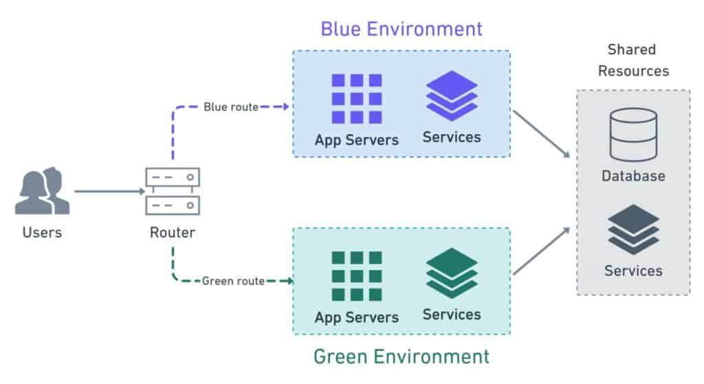
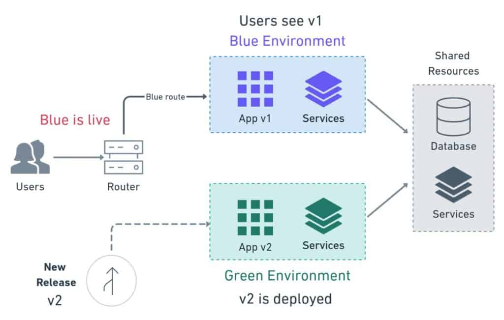
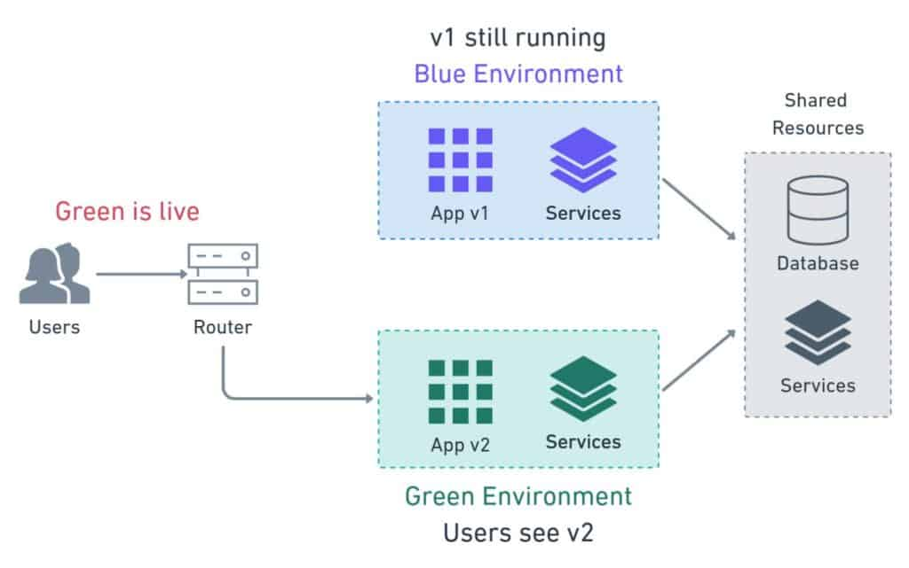
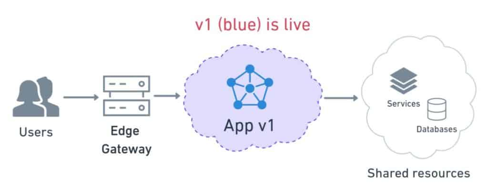
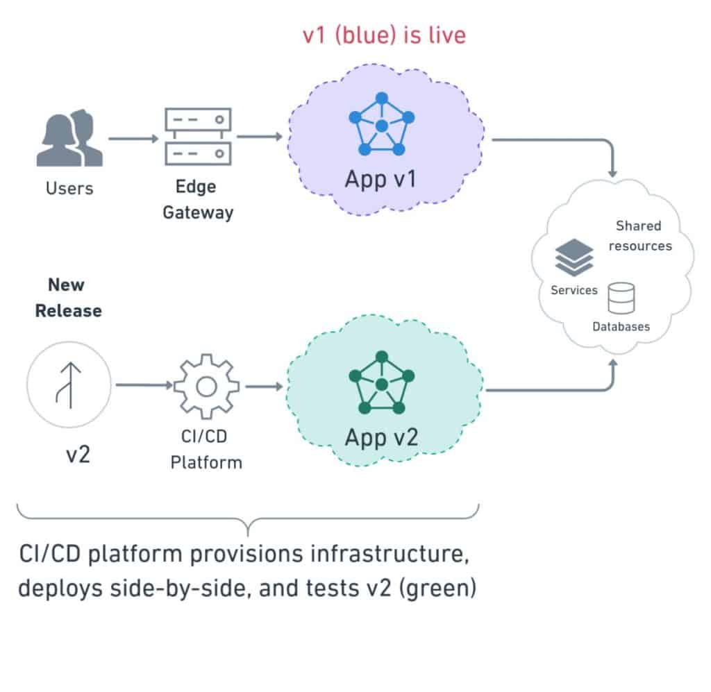
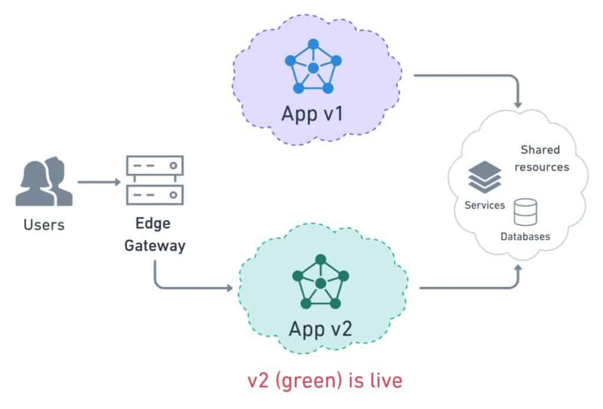
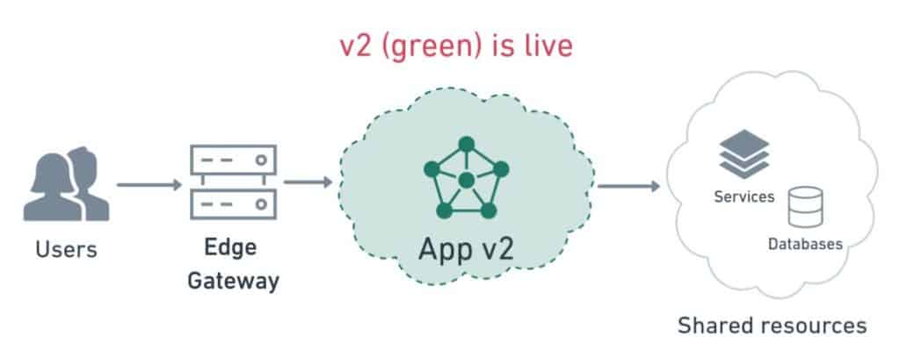

# What Is Blue-Green Deployment?

_Practiced by the likes of Amazon for more than a decade, blue-green is a proven and safe method for continuous software deployment._

Have your users ever experienced downtime caused by a buggy release? Have you ever been called on a weekend to roll back an upgrade? Do you usually have to wake up at insane hours because that is the only time you can take down a system? Do release days make you feel anxious?

If so, it’s all right—you’re not alone—but it doesn’t have to be that way. Many methods can help us make safe deployments without downtime or the need for maintenance windows. One of these methods is called _blue-green_ (or _blue/green_), and that’s what we’ll learn about today.

### What is Blue-Green Deployment?

Blue-green deployment is a release management technique that reduces risk and minimizes downtime. It uses two production environments, known as Blue and Green, to provide reliable testing, continuous no-outage upgrades, and instant rollbacks.

### The Origins of Blue-Green Deployments

The story begins around 2005, with two developers and a problem. The e-commerce site they were working on was showing many unexpected errors. These developers were meticulous and had a good test suite in place, but, for some reason, errors were flying under the radar and reaching production. The whole situation was causing a lot of trouble for their customers.

Upon a more in-depth examination, they found the cause. They noticed that there were too many differences between the production and test machines. Their tests were passing in the test environment, but the code was failing when deployed in production.

These developers, [Daniel North and Jez Humble](https://gitlab.com/snippets/1846041), then had an unconventional yet brilliant idea. They would deploy and test directly in production.

Now I know what you’re thinking. Isn’t testing in production a big no-no? Normally, yes. But you see, the key point here is that they weren’t _overwriting_ the old site. Instead, they were running the new one _side-by-side_, in the same physical box, so users were unaware of the ongoing deployment. The old site continued working as usual while Dan and Jez worked on the release.

The deployment worked like this. They copied the folder containing the latest version into the production machine. Then they started the website using a separate domain and smoke-tested it right there. Once they were happy, they would point the Apache web server to the new folder, call it a day, and presumably have a round of beers. If anything went south, they could point the web server back to the old folder, fix the errors, and try again. This strategy greatly improved error detection because test and production environments were now the same.

At this point, they had two environments on the same machine: one for the old version and another for the new. Initially, they wanted to call them by letters: _environment A_, _environment B_, and so on. But someone pointed out that people would tend to believe that A is somehow better than B (maybe it sounded too much like “plan B”). They finally settled on using colors instead, which didn’t have a natural order. Thus, they planned names like _blue_, _green_, or _orange_ (they avoided _red_ because it implied danger). In the end, it turned out they only needed two environments. And so the term blue-green was coined.

### How Do Blue-Green Deployments Work?

With a few caveats that we’ll explore later, blue-green pretty much checks all the boxes for an ideal deployment process:

- **Seamless**: users shouldn’t experience any downtime.
- **Safe**: low chance of failure.
- **Fully-reversible**: we can undo the change without adverse effects.

The basis of the blue-green method is side-by-side deployments. For that, we need two _separate but identical_ environments. And I mean _environment_ in the most general way, including servers, virtual machines, containers, configurations, databases, among other things. Sometimes we can use different boxes. Other times we can use separate virtual machines running on the same hardware. Or they can be different containers running in a single device.

In its purest form, blue-green asks us to duplicate every resource our application depends on.

Two independent production environments

In practice, however, it doesn’t always make sense to run a spare copy of everything. Keeping two databases in sync, for instance, is notably hard. For that reason, we frequently find blue-green deployments with shared components.

Two production environments with some shared components

We also need some way of switching incoming connections between the two environments. We’ll represent this with a router symbol. It can be an actual router, a load balancer, a reverse proxy, or, like in the original case, a web server.

The router switches traffic to one production environment at a time

Blue and green take turns to play the role of production. Only one of the environments is live at any given time. Say, for instance, that blue is active. In that case, it receives all the traffic—meanwhile, green acts as a staging area, where we can deploy and test the next version.

Users continue accessing v1 on blue while the new v2 release is deployed on green.

Once we make sure the version running in green is working well, we’ll switch the route. Then the cycle begins again.

Deployment is complete once users are switched to the new version running on green

### The Cloud Makes Blue-Green Deployments More Feasible

Keeping two sets of environments up all the time can get expensive. Fortunately, we have many tools that allow us to bring up and tear down infrastructure on-demand. We can start and stop servers with _infrastructure as code_ (IaC) platforms like Ansible or Terraform. We can simplify releases with containers, or orchestrate deployments using Kubernetes. Surprisingly, when we factor in the flexibility and cost reductions the cloud offers, blue-green deployments are within everyone’s reach.

The cloud abstracts most of the infrastructure away. We can picture deployments as a series of loosely coupled components.

Blue production environment in the cloud

When it’s time for a new release, we create new resources without touching the live environment. In practice, we’ll use a [CI/CD](https://semaphoreci.com/cicd) tool like [Semaphore](https://semaphoreci.com/) to create identical new components and make the deployment.

Green production environment is created on demand

We then re-route all user connections at once.

User traffic is cut-over to the green production environment

Once the deployment is complete and we’re satisfied, we can scrap the old environment.

Blue is removed to free up resources and reduce costs

One technology that makes blue-green very straightforward is Kubernetes. To learn more and see Kubernetes deployments in action, grab yourself a free copy of our eBook: [CI/CD with Docker and Kubernetes](https://semaphoreci.com/resources/cicd-docker-kubernetes).

### Who Can Benefit From Blue-Green Deployments?

Blue-green is a great solution when we need:

- **Uptime**: when we can’t afford to bring down a system to update it.
- **Accurate tests**: when need more reliable and accurate tests.
- **Reliability**: when we want to improve the reliability of our deployments.

To use blue-green deployments, we’ll need a few things:

- **Automation**: we need [continuous delivery pipelines](https://semaphoreci.com/blog/cicd-pipeline) to automate the provisioning, deployment, and testing process.
- **Testing**: we need exhaustive tests. We’ll rely on them to decide when releases are ready to deploy. We should use [continuous integration](https://semaphoreci.com/continuous-integration) to catch errors quickly and test new versions before going live.
- **Isolation**: we need two identical and separate environments. Otherwise, one environment may affect the other.

Can everyone do blue-green deployments? Not always, certain situations may prevent us from using the method:

- When, for whatever circumstance, we can’t make continuous updates.
- When regulations restrict how software must be updated. For example, in the aerospace, telecom, or medical industries.
- When we can’t have two identical environments.
- When we can’t isolate the environments.
- When due to infrastructure, we can’t use a router, a load balancer, or reverse proxy.
- When we have breaking database schema changes. Database changes need to be forward and backward compatible.

### The Pros of Blue-Green Deployments

So, is blue-green the right deployment strategy for you? To answer that, we’ll have to compare its pros and cons.

Let’s start with the pros:

- **Testing parity**: this is THE feature. Testing parity means that tests truly mirror the reality of production. This is what Dan and Jez were looking for when they devised blue-green. By running tests on the same hardware and software, they made them more useful and meaningful.
- **Deploy at any time**: no downtime means that we can make releases at any time. There is no need to wait for maintenance windows.
- **Instant cut-over**: users are switched to the new version instantaneously, or nearly so. Everyone sees the latest release at the same time.
- **Instant rollback**: the cut-over works both ways. If we decide to go back to the previous version, we can switch all users back in an instant.
- **Hot standby**: blue-green can save us from disaster scenarios. Suppose that one data center goes offline, bringing the live environment down. No biggie, we’ll switch to the other until the problem is fixed. This will work as long we have had the precaution of not putting blue and green on the same availability zone.
- **Postmortem**: debugging failed releases is hard with in-place deployments. When faced with downtime, the priority is always to return to normality. Collecting debugging data is secondary, so a lot of valuable information may be lost during the rollback. Blue-green doesn’t suffer from this problem—rollbacks always leave the failed deployment intact for analysis.

### The Downsides of Blue-Green Deployments

At this point, you might be thinking that blue-green must have a catch. Otherwise, everyone that could would be using it. So, let’s examine the drawbacks:

- **Cold starts**: users may experience slowness when they are suddenly switched to the new environment. Also, any undetected performance problems are likely to appear at this point. Warm-up jobs and stress tests mitigate these issues.
- **Costs**: compared to other methods, blue-green deployments are more expensive. Provisioning infrastructure on-demand helps. But when we’re making several scaled-out deployments per day, the costs can snowball.
- **Time**: setting up the blue-green deployment process takes time and effort. The process is complex and has a great deal of responsibility. We may need to do many iterations before we get it working right.
- **Databases**: database migrations are harder, even to the point of being a showstopper. Databases schema changes must be forward and backward compatible. We may need to move back and forth between the old and new versions. The problem is compounded when we have two databases, one for blue and one for green. Keeping data in sync is a pain. Common strategies to deal with this involve using replication or making one database read-only.
- **User transactions**: during the cut-over, some user transactions will be interrupted. We must carefully consider how to handle them. How should we deal with half-applied transactions? Do we present an error message and tell the user to try again? Or do we try to carry them over to the new environment? One possible solution is to feed all the transactions to both environments simultaneously, in parallel. In this scenario, we would need to deal with any duplicated data after the deployment finishes.
- **Shared services**: databases and other shared services can leak information between blue and green. We need to be cautious here, otherwise one environment may affect the other indirectly. This could break the isolation rule and interfere with the deployment.

As you can see, blue-green has many advantages over traditional in-place deployments, but it also has some downsides. Some people do not like the all-or-nothing approach and prefer to use the canary releases, which combine elements from blue-green and in-place deployments and offer more gradual transitions. You can read all about canary deployments in our free eBook [CI/CD with Docker and Kubernetes](https://semaphoreci.com/resources/cicd-docker-kubernetes).

### Where to Learn More

We have learned what blue-green deployments are, how they came to be, and the problems they solve. I hope this post helps you decide if blue-green is the right deployment strategy for you.

Learn about more ways of deploying software with these posts:

- We’re working on a blue-green on Kubernetes detailed step-by-step guide. Don’t miss it! Subscribe to our [newsletter](https://semaphoreci.com/newsletter), and we’ll let you know as soon as it’s published.
- [Kubernetes Deployments: The Ultimate Guide](https://semaphoreci.com/blog/kubernetes-deployment)
- [A Step-by-Step Guide to Continuous Deployment on Kubernetes](https://semaphoreci.com/blog/guide-continuous-deployment-kubernetes)
- [What’s the Difference Between Continuous Integration, Continuous Deployment, and Continuous Delivery?](https://semaphoreci.com/blog/2017/07/27/what-is-the-difference-between-continuous-integration-continuous-deployment-and-continuous-delivery.html)

Thanks for reading!

\newpage

© __BUILD_YEAR__ Rendered Text. All rights reserved.

This work is licensed under Creative Commmons
Attribution-NonCommercial-NoDerivatives 4.0 International.
To view a copy of this license, visit
<https://creativecommons.org/licenses/by-nc-nd/4.0>

The source text is open source:
<https://github.com/semaphoreci/papers>

Originally published at:
<https://semaphoreci.com/blog/blue-green-deployment>

Original publication date: 5 Aug 2020

Authors: Tomas Fernandez

Build date: __BUILD_MONTH__ __BUILD_YEAR__

Revision: __BUILD_REVISION__

\newpage